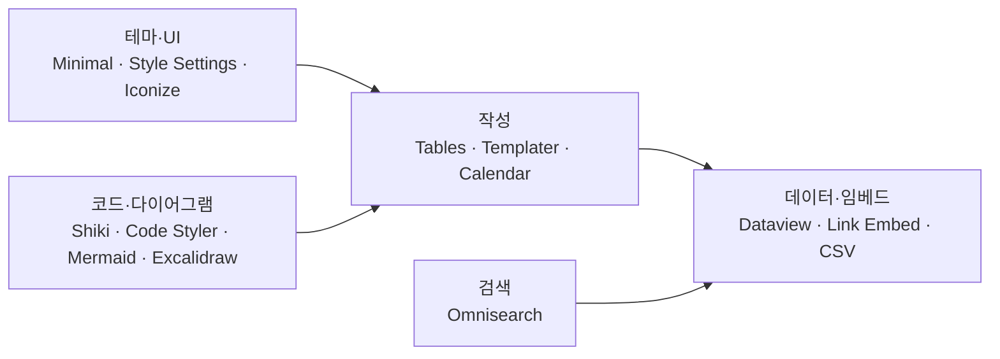

---
aliases:
  - Obsidian 플러그인 목록
tags:
  - Obsidian
related:
  - "[[00_Obsidian_HomePage]]"
  - "[[Obsidian_Vault_Settings]]"
---
# Obsidian_Plugins — 커뮤니티 플러그인 정리

> [!info]
> 아래 목록은 이 vault의 `.obsidian/community-plugins.json` 기준 (2026-06-27).  
> 플러그인 추가·삭제 후에는 이 노트도 같이 업데이트.

```txt
설정 경로: Obsidian → Settings → Community plugins
```

---

# 활성 커뮤니티 플러그인 — 17개

## 테마 · UI · 아이콘

| ID | 표시 이름 | 하는 일 | 비고 |
|---|---|---|---|
| `obsidian-minimal-settings` | Minimal Theme Settings | Minimal 테마 색·폰트·기능 조절 | 테마: **Minimal** ([[Obsidian_Vault_Settings]]) |
| `obsidian-style-settings` | Style Settings | 테마·플러그인·스니펫 CSS 변수 UI로 조절 | `global.css`와 함께 씀 |
| `obsidian-icon-folder` | Iconize | 파일·폴더·텍스트에 아이콘 붙이기 | |

## 검색 · 탐색

| ID | 표시 이름 | 하는 일 | 비고 |
|---|---|---|---|
| `omnisearch` | Omnisearch | 전체 vault 강력 검색 | 코어 Global search 보완 |

## 작성 · 편집 · 자동화

| ID | 표시 이름 | 하는 일 | 비고 |
|---|---|---|---|
| `table-editor-obsidian` | Advanced Tables | 표 네비게이션·포맷·수식 | Wiki 홈페이지 표 편집할 때 핵심 |
| `table-checkbox-renderer` | Table Checkbox Renderer | 읽기 모드에서 표 체크박스 토글 | |
| `templater-obsidian` | Templater | Handlebars 스타일 템플릿·자동화 | 템플릿 폴더: `30_Resources/Templates` |
| `calendar` | Calendar | 데일리 노트 달력 뷰 | 코어 Daily notes는 **OFF** |

## 코드 · 다이어그램 · 시각화

| ID | 표시 이름 | 하는 일 | 비고 |
|---|---|---|---|
| `code-styler` | Code Styler | 코드 블록·인라인 코드 스타일 (편집·읽기) | |
| `shiki-highlighter` | Shiki Highlighter | Shiki로 코드 하이라이트 | Code Styler와 역할 겹칠 수 있음 — 취향대로 |
| `execute-code` | Execute Code | 노트 안에서 C/C++/Python/R/JS 등 실행 | |
| `beautiful-mermaid-renderer` | Beautiful Mermaid Renderer | Mermaid → SVG, 테마 변수 지원 | JS/Nest 홈페이지의 mermaid 다이어그램 |
| `obsidian-excalidraw-plugin` | Excalidraw | 손그림·다이어그램 편집 | |

## 데이터 · 임베드 · Canvas

| ID | 표시 이름 | 하는 일 | 비고 |
|---|---|---|---|
| `dataview` | Dataview | 메타데이터·태그 기반 동적 목록/표 | 심화 문법은 별도 노트 추가 예정 |
| `obsidian-link-embed` | Link Embed | URL 메타데이터 → Notion 스타일 카드 | 자격증 홈페이지 embed와 유사 |
| `csv-allinone` | CSV All-in-One | CSV 보기·편집·변환 일괄 | |
| `advanced-canvas` | Advanced Canvas | Canvas 프레젠·플로우차트 강화 | 코어 Canvas **ON** |

---

# 설치돼 있으나 비활성 — 폴더만 존재

`plugins/`에 있지만 `community-plugins.json`에 **없음** (= 현재 꺼짐)

| ID | 표시 이름 | 하는 일 | 켤지 말지 |
|---|---|---|---|
| `code-files` | Code Files | Monaco 에디터로 코드 파일 편집 | VS Code 쓰면 중복 가능 |
| `highlightr-plugin` | Highlightr | 텍스트 색 하이라이트 메뉴 | |
| `obsidian-latex-suite` | Latex Suite | LaTeX 수식 스니펫·빠른 입력 | 수식 많이 쓸 때 |
| `editing-toolbar` | Editing Toolbar | 편집 툴바 (cmenu 계열) | |
| `csv-codeblock` | CSV Codeblock | (manifest 확인 필요) | csv-allinone과 겹칠 수 있음 |
| `obsidian-table-to-csv-exporter` | Table to CSV Exporter | 표 → CSV보내기 | |

---

# 카테고리 한눈에 — 역할 분담



---

# 플러그인 관리 기준

```txt
지금 노트 작성에 쓰는가?        → 활성 유지 + 이 표에 한 줄 메모
VS Code / 다른 도구와 겹치는가?  → 하나만 켜기 (예: code-files vs VS Code)
한 달 안 켰다?                  → 비활성 표로 옮기고 나중에 삭제
```

---

# 심화 노트 — 필요할 때 추가

| 주제 | 우선순위 |
|---|---|
| Dataview 기본 쿼리 (`TABLE`, `LIST`, `FROM`) | ⭐⭐⭐ |
| Templater 자주 쓰는 문법 | ⭐⭐ |
| Advanced Tables 단축키 | ⭐⭐ |
| Execute Code 언어별 설정 | ⭐ |
