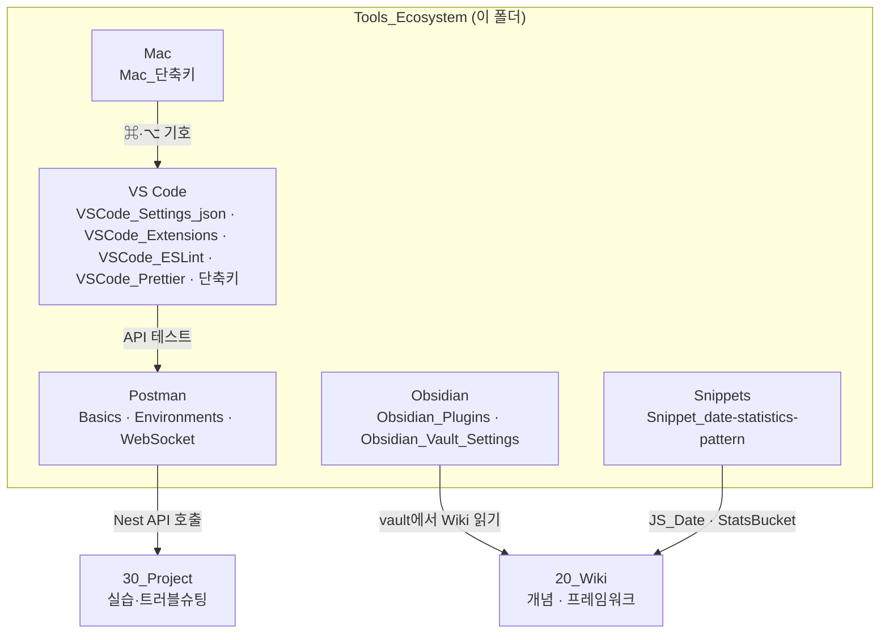

---
aliases:
  - Toolbox
  - Tools
  - VS Code
  - Postman
  - Obsidian
  - Mac
tags:
  - HomePage
related:
  - "[[00_JS_Ecosystem_HomePage]]"
  - "[[00_NestJS_Ecosystem_HomePage]]"
  - "[[00_DevOps_HomePage]]"
---
# 00_Toolbox_HomePage — 개발 도구 · 작업 환경

> [!info]
> `20_Wiki`는 **언어·프레임워크·인프라 개념**을, `10_Toolbox`는 **매일 쓰는 도구와 작업 환경**을 모아 둔 폴더다.
> VS Code 설정, Postman API 테스트, Obsidian vault 꾸미기, Mac 단축키처럼 "코드 밖"에서 손에 익히는 것들이 여기 해당한다.

```txt
폴더 위치: 10_Toolbox/Tools_Ecosystem/
파일명 prefix: Obsidian_ / VSCode_ / Postman_ / Mac_ / Snippet_

이 폴더에 없는 것:
  Git · Docker · Linux 개념     → [[00_DevOps_HomePage]]
  NestJS · Next.js 프레임워크   → [[00_NestJS_Ecosystem_HomePage]] · [[00_JS_Ecosystem_HomePage]]
  ESLint·Prettier "규칙이 코드에 주는 영향" → Wiki (여기는 VS Code 연동·설정)
```



---

# Obsidian ⭐️⭐️

```txt
이 vault(gong_study)를 어떻게 꾸미고 쓰는지 — 앱 설정·플러그인·CSS 스니펫
Callout 안에 쓰는 내용 자체는 Wiki, 스타일(global.css)은 여기
```

| 노트 | 핵심 내용 |
|---|---|
| [[Obsidian_Plugins]] ⭐ | 커뮤니티 플러그인 목록 · 역할 · 카테고리 · 비활성/정리 필요 항목 |
| [[Obsidian_Vault_Settings]] | 테마 · vault 설정 · 코어 플러그인 ON/OFF · CSS 스니펫 |
| [[Dataview_Basics]] | Dataview 쿼리 문법 (예정) |

---

# VS Code ⭐️⭐️⭐️⭐️

```txt
에디터 환경 · 확장 · 린트/포맷 · 단축키
Mac ⌘·⌥ 기호가 헷갈리면 [[Mac_단축키]] 먼저
```

## 환경 · 기본 설정

| 노트 | 핵심 내용 |
|---|---|
| [[VSCode_Settings_json]] ⭐ | settings.json · 저장 시 포맷·린트 · 언어별 설정 |
| [[VSCode_Extensions]] ⭐ | 공통 필수 / JS·TS·Nest / DB·Docker·Python / Obsidian 연동 |
| [[VSCode_단축키]] | 명령 팔레트 · 파일 검색 · 터미널 · 편집 단축키 (Mac) |

## 코드 품질 — 린트 · 포맷

| 노트           | 핵심 내용                                    |
| ------------ | ---------------------------------------- |
| [[VSCode_ESLint]] ⭐ | ESLint 설치 · 설정 · VS Code 연동 · 저장 시 자동 수정 |
| [[VSCode_Prettier]] ⭐ | Prettier · ESLint와 역할 분담 · formatOnSave |

```txt
eslint = 코드 품질·규칙 / prettier = 들여쓰기·따옴표 등 스타일
둘 다 [[VSCode_Settings_json]]의 codeActionsOnSave · formatOnSave와 연결
```

## 생산성 · 디버그 (예정)

| 노트 | 핵심 내용 |
|---|---|
| [[VSCode_User_Snippets]] | 스니펫 등록 · prefix · tabstop |
| [[VSCode_Debugger]] | 브레이크포인트 · call stack |
| [[VSCode_launch_json]] | 디버그 실행 설정 |

---

# Postman ⭐️⭐️⭐️

```txt
GUI로 HTTP/WebSocket 요청 → 응답 확인
NestJS API 로컬 테스트할 때 [[Postman_Environments]]의 토큰·환경변수 흐름이 핵심
```

| 순서 | 노트 | 핵심 내용 |
|:---:|---|---|
| 1 | [[Postman_Basics]] | Method / URL / Params / Headers / Body |
| 2 | [[Postman_Environments]] ⭐ | `{{host}}` · `{{accessToken}}` · 환경변수 |
| 3 | [[Postman_WebSocket]] ⭐ | Socket.IO · 이벤트 송수신 |
| ⬜ | [[Postman_Scripts]] | Tests · pre-request · `pm.environment` (예정) |
| ⬜ | [[Postman_Auth]] | Bearer · Inherit auth (예정) |

---

# Mac ⭐️⭐️

```txt
개발할 때 깔려 있는 OS — VS Code·터미널·Finder 단축키 읽을 때 ⌘·⌥·⌃ 먼저 익히기
```

| 노트 | 핵심 내용 |
|---|---|
| [[Mac_단축키]] ⭐ | ⌘·⌥·⌃·⇧ / Windows 대응 / Finder·시스템 / 터미널 / VS Code 연계 |

---

# Snippet_ — 프로젝트·Wiki 패턴 메모 ⭐️

```txt
프로젝트·Wiki를 가로지르는 패턴 메모 — 복붙용이 아니라 "왜 이렇게 했는지" 기록
```

| 노트 | 핵심 내용 |
|---|---|
| [[Snippet_date-statistics-pattern]] ⭐ | 날짜 통계 · UTC 함정 · 일 키 · [[JS_Date]] · [[NestJS_StatsBucket]] 연결 |

---

# 빠른 진입 — 상황별

| 하고 싶은 일 | 먼저 볼 노트 |
|---|---|
| API 요청·응답 확인 | [[Postman_Basics]] → [[Postman_Environments]] |
| Socket.IO / WebSocket 테스트 | [[Postman_WebSocket]] |
| VS Code 저장 시 자동 포맷·린트 | [[VSCode_Settings_json]] → [[VSCode_ESLint]] · [[VSCode_Prettier]] |
| 확장 프로그램 고민 | [[VSCode_Extensions]] |
| VS Code 단축키만 | [[VSCode_단축키]] |
| Mac ⌘·⌥ 기호 | [[Mac_단축키]] |
| Obsidian 플러그인 확인 | [[Obsidian_Plugins]] |
| Callout·테마 색 | [[Obsidian_Vault_Settings]] |
| 날짜 통계 UTC·일 키 함정 | [[Snippet_date-statistics-pattern]] |

---

# Wiki와의 경계

| 여기 (`10_Toolbox`) | Wiki (`20_Wiki`) |
|---|---|
| 도구 UI·설정·단축키 | 언어 문법·프레임워크 개념 |
| Postman으로 Nest API 호출 | NestJS Controller · Guard |
| VS Code ESLint **설정** | ESLint **규칙**이 코드에 주는 영향 |
| Git 명령어 | [[00_DevOps_HomePage]] Git 섹션 |
