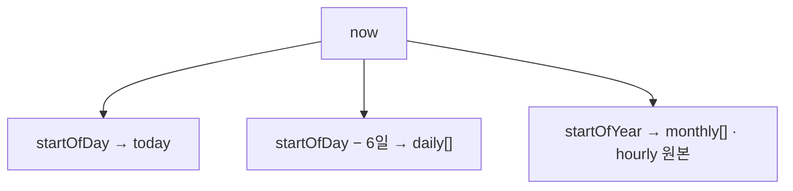

---
aliases:
  - Date
tags:
  - Snippet
related:
  - "[[00_Tools_Ecosystem_HomePage]]"
  - "[[JS_Date]]"
  - "[[NestJS_StatsBucket]]"
---

# Snippet_date-statistics-pattern — 날짜 통계 · UTC · 일 키

## 꼭 기억할 것

| 주제         | 채택 ✅                                                  | 피하기 ❌                                         |
| ---------- | ----------------------------------------------------- | --------------------------------------------- |
| **“오늘”**   | 서버 `setHours(0,0,0,0)` 후 `gte`                        | 브라우저만 따로 “오늘” 계산해 stats 맞추기                   |
| **일 키**    | `getFullYear` + `getMonth` + `getDate` → `YYYY-MM-DD` | `date.toISOString().slice(0,10)` (UTC로 하루 밀림) |
| **일 키 파싱** | `"2026-06-19".split('-')` 로 x축                        | `new Date("2026-06-19")` (UTC 자정 해석)          |
| **상대 일수**  | **달력 일** 차이 (`startOfDay` 끼리)                         | `Date.now() - ts` 만으로 “며칠 전”                  |
| **통계 창**   | 달력 연속 N일 / 올해 1월~이번 달                                 | “지금부터 168시간” (차트와 어긋남)                        |

---

## 범용 함수 — 경계 (startOf*)

> **모두 “서버(또는 실행 환경) 로컬 타임존”** 기준.  
> 원본 `Date`는 **변경하지 않고** 복사본을 반환하는 패턴 권장.

### `startOfDay` — 그날 00:00:00.000

```ts
function startOfDay(date: Date): Date {
  const d = new Date(date);
  d.setHours(0, 0, 0, 0);
  return d;
}
```

**쓰는 곳:** “오늘” 카운트 · 일 버킷 시작 · 상대 일수 계산

### `startOfMonth` — 그달 1일 00:00

```ts
function startOfMonth(date: Date): Date {
  const start = new Date(date);
  start.setHours(0, 0, 0, 0);
  start.setDate(1);
  return start;
}
```

**이 프로젝트:** `apps/api/src/admin/admin-stats.service.ts`

### `startOfYear` — 올해 1월 1일 00:00

```ts
function startOfYear(date: Date): Date {
  const start = startOfMonth(date);
  start.setMonth(0);
  return start;
}
```

**쓰는 곳:** `monthly[]` · `hourly[]` 쿼리 창 (`createdAt >= startOfYear`)

### `endOfDay` (필요할 때)

```ts
function endOfDay(date: Date): Date {
  const d = new Date(date);
  d.setHours(23, 59, 59, 999);
  return d;
}
```

Prisma는 보통 `gte startOfDay` + `lt startOfNextDay` 조합이 더 안전함.

---

## 범용 함수 — 로컬 키 (집계·API)

DB 행 → **차트/API용 문자열 키**. UTC ISO 자르기 대신 **로컬 필드**로 조립.

### `toLocalDateKey` → `YYYY-MM-DD`

```ts
function toLocalDateKey(date: Date): string {
  const y = date.getFullYear();
  const m = String(date.getMonth() + 1).padStart(2, '0');
  const d = String(date.getDate()).padStart(2, '0');
  return `${y}-${m}-${d}`;
}
```

### `toLocalMonthKey` → `YYYY-MM`

```ts
function toLocalMonthKey(date: Date): string {
  const y = date.getFullYear();
  const m = String(date.getMonth() + 1).padStart(2, '0');
  return `${y}-${m}`;
}
```

### `toLocalHour` → `0`~`23`

```ts
function toLocalHour(date: Date): number {
  return date.getHours();
}
```

| 키 | 형식 | 예 |
|----|------|-----|
| 일 | `YYYY-MM-DD` | `2026-06-19` |
| 월 | `YYYY-MM` | `2026-06` |
| 시 | 정수 | `14` |

---

## 범용 함수 — 달력 일수

### `differenceInCalendarDays` — “며칠 전” (달력 기준)

```ts
function differenceInCalendarDays(latter: Date, earlier: Date): number {
  const ms = startOfDay(latter).getTime() - startOfDay(earlier).getTime();
  return Math.round(ms / 86_400_000);
}
```

| `days` | UI 예 |
|--------|--------|
| `0` | 오늘 |
| `1` | 어제 |
| `2~6` | N일 전 |
| `≥7` | 절대 날짜만 (`2026.06.12`) |

**이 프로젝트:** `apps/web/lib/date.ts` — `formatFeedDate`

### `addCalendarDays` — N일 더하기/빼기

```ts
function addCalendarDays(date: Date, days: number): Date {
  const d = new Date(date);
  d.setDate(d.getDate() + days);
  return d;
}
```

**최근 7일 시작일:** `addCalendarDays(startOfDay(now), -(7 - 1))`

---

## 범용 패턴 — 기간 창 한눈에

| 의미 | 시작 시각 (로컬) | 버킷 |
|------|------------------|------|
| 오늘 | `startOfDay(now)` | 1일 |
| 최근 7일 (오늘 포함) | `startOfDay(now)` − 6일 | 7일 키 |
| 올해 월별 | `startOfYear(now)` | 1월~이번 달 `YYYY-MM` |
| 올해 시간대 | `startOfYear(now)` + `getHours()` | 24칸 |




---

## 범용 패턴 — 일 버킷 키 배열 만들기

```ts
function buildDailyDateKeys(days: number, reference = new Date()): string[] {
  const start = startOfDay(reference);
  start.setDate(start.getDate() - (days - 1));

  const keys: string[] = [];
  for (let i = 0; i < days; i++) {
    const day = new Date(start);
    day.setDate(start.getDate() + i);
    keys.push(toLocalDateKey(day));
  }
  return keys;
}
```

`Map`에 넣을 때:

```ts
const buckets = new Map(buildDailyDateKeys(7).map((k) => [k, 0]));
```

---

## 범용 패턴 — 올해 월 버킷

```ts
function buildMonthlyKeysThisYear(reference = new Date()): string[] {
  const year = reference.getFullYear();
  const endMonth = reference.getMonth();
  const keys: string[] = [];

  for (let month = 0; month <= endMonth; month++) {
    keys.push(toLocalMonthKey(new Date(year, month, 1)));
  }
  return keys;
}
```

작년 데이터는 `row.createdAt.getFullYear() !== year` 로 **집계에서 제외**.

---


