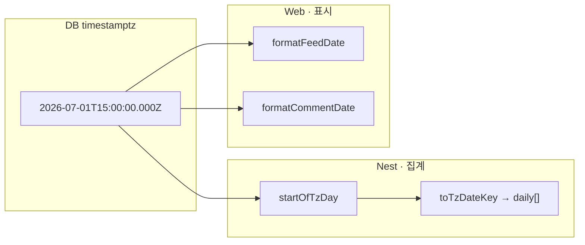

---
aliases:
  - Date
  - KST
  - formatFeedDate
  - formatCommentDate
tags:
  - Snippet
related:
  - "[[00_Tools_Ecosystem_HomePage]]"
  - "[[JS_Date]]"
  - "[[NestJS_StatsBucket]]"
---

# Snippet_date-statistics-pattern — 날짜 키 · KST · UI 표시

> **원본 (music-community):** `apps/web/lib/date.ts` · `apps/api/src/common/kst-date.ts`  
> 다른 프로젝트에 쓸 때는 **`TIMEZONE` · `UTC_OFFSET` 두 상수만** 바꾸면 됨.

> [!info]
> **DB** — `timestamptz`로 **UTC instant** 저장 (언제 일어났는지 하나로 고정)  
> **API (Nest)** — **집계·“오늘”** 은 서비스 타임존 **달력** (`startOfDay` + `gte`)  
> **Web** — **화면 문구**만 (`오늘` · `3일 전`) — stats 버킷 계산은 API에 맡김

> [!info]
> **일 키** = `YYYY-MM-DD` 문자열 하나.  
> `toISOString().slice(0,10)` ❌ — UTC로 **하루 밀림**.  
> `Intl` + `timeZone` ✅ — Railway(UTC)·브라우저(KST) 어디서 돌려도 **같은 달력**.

> [!warning]
> `setHours(0,0,0,0)` = **실행 환경 로컬** 자정.  
> Mac(KST)에선 맞아 보여도 **Railway UTC**에선 “오늘”이 **9시간 어긋남**.  
> → **`startOfTzDay`** 패턴으로 통일.

---

## 꼭 기억할 것

| 주제 | 채택 ✅ | 피하기 ❌ |
| --- | --- | --- |
| **“오늘” (API)** | `createdAt >= startOfTzDay(now)` | 서버 `setHours(0,0,0,0)` (UTC 배포) |
| **일 키** | `toTzDateKey(date)` → `YYYY-MM-DD` | `date.toISOString().slice(0,10)` |
| **일 키 → x축** | `"2026-07-01".split('-')` | `new Date("2026-07-01")` (UTC 자정) |
| **“며칠 전” (UI)** | **달력 일** 차이 (`startOfTzDay` 끼리) | `Date.now() - ts` 만 |
| **통계 창** | 달력 연속 N일 / 올해 1월~이번 달 | “168시간 슬라이딩” |
| **입력** | API ISO 문자열 `new Date(iso)` | 혼용 X |

---

## 0. 프로젝트마다 바꿀 상수

```ts
/** 한국 서비스 — music-community 기본값 */
const TIMEZONE = 'Asia/Seoul';
const UTC_OFFSET = '+09:00'; // TIMEZONE과 짝 맞출 것

/** 다른 예: 미국 동부 */
// const TIMEZONE = 'America/New_York';
// const UTC_OFFSET = '-05:00'; // DST 있으면 offset 고정 대신 라이브러리 검토
```

> [!info]
> `UTC_OFFSET`는 **`startOfTzDay`** 에만 씀 — `"${key}T00:00:00${UTC_OFFSET}"` 로  
> “그 타임존 달력의 00:00” instant를 만듦.

---

## 1. 코어 4함수 (Web · API 공통 복붙)

> 파일 하나(`date.ts` / `kst-date.ts`)에 두고 **Web·Nest 둘 다 import** 하거나,  
> monorepo면 `packages/shared/date.ts` 로 빼도 됨.

### `toTzDateKey` — 달력 일 키

```ts
/** instant → 서비스 타임존 기준 YYYY-MM-DD (집계·차트 버킷 키) */
function toTzDateKey(date: Date): string {
  return new Intl.DateTimeFormat('en-CA', {
    timeZone: TIMEZONE,
    year: 'numeric',
    month: '2-digit',
    day: '2-digit',
  }).format(date);
  // en-CA → "2026-07-02" 형태 (ISO와 같은 순서)
}
```

### `startOfTzDay` — 그날 00:00 (DB `gte` 비교용)

```ts
/**
 * 서비스 타임존 "그날" 00:00:00.000 의 UTC instant.
 * Prisma: where: { createdAt: { gte: startOfTzDay() } }
 */
function startOfTzDay(reference = new Date()): Date {
  const key = toTzDateKey(reference);
  return new Date(`${key}T00:00:00${UTC_OFFSET}`);
}
```

### `differenceInCalendarDays` — 달력 기준 며칠 차이

```ts
/** latter - earlier (달력 일). UI "오늘/어제/N일 전" 용 */
function differenceInCalendarDays(latter: Date, earlier: Date): number {
  const ms =
    startOfTzDay(latter).getTime() - startOfTzDay(earlier).getTime();
  return Math.round(ms / 86_400_000);
}
```

### `formatDisplayDate` — 절대 날짜만

```ts
/** ISO → "2026.07.02" (표시용 · split으로 파싱 안전) */
function formatDisplayDate(iso: string): string {
  const key = toTzDateKey(new Date(iso));
  const [y, m, d] = key.split('-');
  return `${y}.${m}.${d}`;
}
```

---

## 2. UI 포맷 — music-community `date.ts`

> API JSON은 `…Z` (UTC). **표시는 항상 helper 경유.**

### `formatFeedDate` — 피드 카드 헤더 (상대 + 절대)

```ts
/** 피드 @닉 옆 — 7일 미만이면 "오늘 · 2026.07.02" */
export function formatFeedDate(iso: string): string {
  const absolute = formatDisplayDate(iso);
  const days = differenceInCalendarDays(new Date(), new Date(iso));

  if (days >= 7) return absolute;
  if (days <= 0) return `오늘 · ${absolute}`;
  if (days === 1) return `어제 · ${absolute}`;
  return `${days}일 전 · ${absolute}`;
}
```

| `days` | 출력 |
| --- | --- |
| `0` | `오늘 · 2026.07.02` |
| `1` | `어제 · 2026.07.01` |
| `2~6` | `3일 전 · 2026.06.29` |
| `≥7` | `2026.06.25` (절대만) |

### `formatCommentDate` — 댓글·채팅 (짧게 · A안)

```ts
/** 닉네임 옆 — 7일+ 절대만 · 그 전은 상대만 (날짜 중복 X) */
export function formatCommentDate(iso: string): string {
  const days = differenceInCalendarDays(new Date(), new Date(iso));

  if (days >= 7) return formatDisplayDate(iso);
  if (days <= 0) return '오늘';
  if (days === 1) return '어제';
  return `${days}일 전`;
}
```

```text
피드 헤더:  formatFeedDate    →  "오늘 · 2026.07.02"
댓글 메타:  formatCommentDate →  "오늘"  (닉네임 · 오늘)
```

> JSX: `<time dateTime={iso}>{formatCommentDate(iso)}</time>` — ISO는 속성에, 짧은 문구는 children.

---

## 3. API 전용 — Nest `kst-date.ts` 확장

```ts
/** 0~23 — hourly[] 버킷 */
export function getTzHour(date: Date): number {
  return Number(
    new Intl.DateTimeFormat('en-US', {
      timeZone: TIMEZONE,
      hour: 'numeric',
      hour12: false,
    }).format(date),
  );
}

export function getTzMonthKey(date: Date): string {
  return toTzDateKey(date).slice(0, 7); // YYYY-MM
}

export function getTzYear(date: Date): number {
  return Number(toTzDateKey(date).slice(0, 4));
}
```

---

## 4. 역할 나누기 (헷갈릴 때)



| 레이어 | 하는 일 | 안 하는 일 |
| --- | --- | --- |
| **Nest** | `gte startOfTzDay` · Map 버킷 · `daily[]` | “3일 전” 한글 문구 |
| **Web** | `formatFeedDate` · `formatCommentDate` | stats “오늘” 창 계산 |
| **DB** | UTC instant 저장 | KST로 저장 X |

---

## 5. 통계 패턴 — 기간 창

| 의미 | 시작 (TZ 달력) | 버킷 |
| --- | --- | --- |
| 오늘 DAU | `lastActiveAt >= startOfTzDay(now)` | 1일 |
| 최근 7일 | `startOfTzDay(now) - 6 × 86400000ms` | 7 × `toTzDateKey` |
| 7일+ 미접속 | `null` OR `< startOfTzDay - 7일` | 카운트 |
| 올해 월별 | `getTzYear` · `getTzMonthKey` | `YYYY-MM` |

```ts
/** 최근 N일(오늘 포함) 일 키 배열 — Map 초기값 */
function buildDailyDateKeys(days: number, reference = new Date()): string[] {
  const startMs = startOfTzDay(reference).getTime() - (days - 1) * 86_400_000;
  const keys: string[] = [];

  for (let i = 0; i < days; i++) {
    keys.push(toTzDateKey(new Date(startMs + i * 86_400_000)));
  }
  return keys;
}

// 집계 Map: keys.map(k => [k, 0])
const buckets = new Map(buildDailyDateKeys(7).map((k) => [k, 0]));
```

```ts
/** 차트 x축 — date 키는 split만 (Date 파싱 금지) */
function formatAxisDate(dateKey: string): string {
  const [, month, day] = dateKey.split('-');
  return `${Number(month)}/${Number(day)}`;
}
```

---

## 6. 레거시 vs TZ-aware (마이그레이션 메모)

| | `setHours(0,0,0,0)` + `getDate()` | **이 스니펫 (Intl + offset)** |
| --- | --- | --- |
| 로컬 Mac | ✅ 보통 OK | ✅ |
| Railway / Vercel server UTC | ❌ “오늘” 틀림 | ✅ |
| 브라우저 Web UI | TZ = 사용자 기기 (대부분 OK) | ✅ **서비스 TZ 고정** |
| 다른 프로젝트 이식 | 환경마다 다름 | **상수 2개만 교체** |

---

## 7. 함정 체크리스트

| ❌ | ✅ |
| --- | --- |
| `new Date('2026-07-01')` | `key.split('-')` |
| `toISOString().slice(0,10)` | `toTzDateKey(date)` |
| Web에서 stats “오늘” 계산 | Nest `daily[]` · `today` 필드 |
| 댓글에 `formatFeedDate` | `formatCommentDate` (짧게) |
| `timestamp` without tz | `timestamptz` |

---

## 8. music-community 파일 맵

| 파일 | 역할 |
| --- | --- |
| `apps/web/lib/date.ts` | `formatFeedDate` · `formatCommentDate` |
| `apps/api/src/common/kst-date.ts` | `toKstDateKey` · `startOfKstDay` · hour/month/year |
| `apps/api/src/admin/admin-stats.service.ts` | daily · monthly · hourly 버킷 |
| `apps/docs/date.md` | 프로젝트 정본 문서 |

---

## 9. 전체 복붙 템플릿 (`lib/date.ts`)

```ts
/** Snippet_date-statistics-pattern — TIMEZONE/UTC_OFFSET만 프로젝트에 맞게 */
const TIMEZONE = 'Asia/Seoul';
const UTC_OFFSET = '+09:00';

function toTzDateKey(date: Date): string {
  return new Intl.DateTimeFormat('en-CA', {
    timeZone: TIMEZONE,
    year: 'numeric',
    month: '2-digit',
    day: '2-digit',
  }).format(date);
}

function startOfTzDay(reference = new Date()): Date {
  const key = toTzDateKey(reference);
  return new Date(`${key}T00:00:00${UTC_OFFSET}`);
}

function differenceInCalendarDays(latter: Date, earlier: Date): number {
  const ms =
    startOfTzDay(latter).getTime() - startOfTzDay(earlier).getTime();
  return Math.round(ms / 86_400_000);
}

export function formatDisplayDate(iso: string): string {
  const [y, m, d] = toTzDateKey(new Date(iso)).split('-');
  return `${y}.${m}.${d}`;
}

export function formatFeedDate(iso: string): string {
  const absolute = formatDisplayDate(iso);
  const days = differenceInCalendarDays(new Date(), new Date(iso));
  if (days >= 7) return absolute;
  if (days <= 0) return `오늘 · ${absolute}`;
  if (days === 1) return `어제 · ${absolute}`;
  return `${days}일 전 · ${absolute}`;
}

export function formatCommentDate(iso: string): string {
  const days = differenceInCalendarDays(new Date(), new Date(iso));
  if (days >= 7) return formatDisplayDate(iso);
  if (days <= 0) return '오늘';
  if (days === 1) return '어제';
  return `${days}일 전`;
}
```
