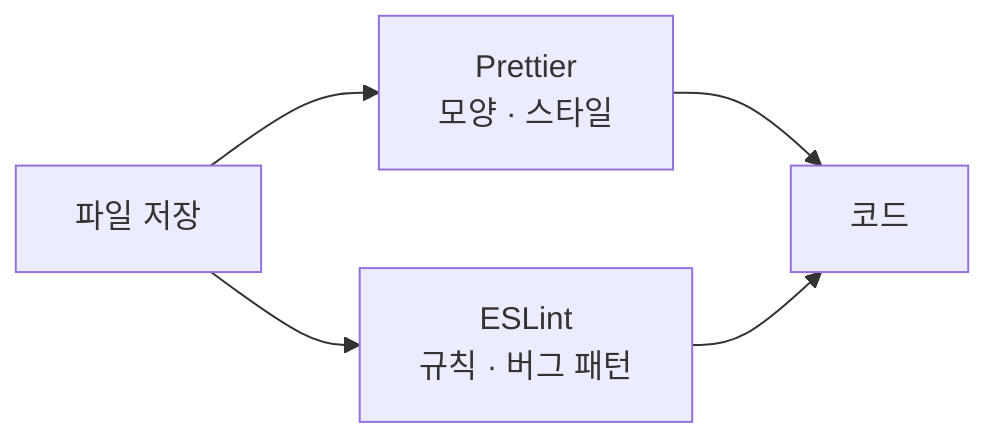

# ESLint · 린트

> **언제 보나:** 빨간 밑줄·`pnpm lint` 에러, 규칙 한 줄만 끄고 싶을 때  
> **관련:** [`prettier.md`](./prettier.md) (들여쓰기·따옴표), [`install.md`](./install.md) (pnpm)

---

## 한눈에 — Prettier vs ESLint



| 도구 | 하는 일 | 이 레포 설정 |
|------|---------|--------------|
| **Prettier** | 따옴표, 줄바꿈, `>` 위치 등 **포맷** | 루트 `.prettierrc` · [`prettier.md`](./prettier.md) |
| **ESLint** | `any` 남용, unused 변수, Next 규칙 등 **검사** | 앱별 `eslint.config.mjs` |

저장 시 Prettier가 먼저 모양을 맞추고, ESLint가 규칙 위반을 표시함. **역할이 겹치지 않음.**

---

## 앱별 설정

| 앱 | 설정 파일 | 실행 |
|----|-----------|------|
| **web** | `apps/web/eslint.config.mjs` | `cd apps/web && pnpm lint` |
| **api** | `apps/api/eslint.config.mjs` | `cd apps/api && pnpm lint` |

- **web:** `eslint-config-next` (core-web-vitals + typescript)
- **api:** `typescript-eslint` + **`eslint-plugin-prettier`** — Prettier와 어긋나면 lint 에러로도 잡힘

---

## ESLint 주석 — 규칙만 골라 끄기

코드 **위**에 적는 특수 주석. “이 줄은 이 규칙 검사 빼줘”라고 ESLint에 알림.

### 다음 한 줄만

```tsx
// eslint-disable-next-line 규칙이름
// eslint-disable-next-line 규칙이름 -- 왜 예외인지 (한국어 OK)
```

- **`규칙이름`** — 영어 그대로 (ESLint가 인식)
- **`--` 뒤** — 사람이 읽는 설명. ESLint는 무시해도 됨

### 프로젝트 예: 외부 프로필 이미지

Next.js는 보통 `<Image>`를 쓰라고 함 (`@next/next/no-img-element`). OAuth 프로필 URL은 ``가 단순해서 한 줄만 예외.

```tsx
// eslint-disable-next-line @next/next/no-img-element -- OAuth 등 외부 프로필 이미지 URL

```

위치: `apps/web/app/users/[id]/page.tsx`

### 여러 줄

```tsx
/* eslint-disable 규칙이름 */
// ...
/* eslint-enable 규칙이름 */
```

남용하지 말 것. **정말 필요할 때만** 한 줄 `disable-next-line` 선호.

---

## Prettier와 같이 쓸 때

| | web | api |
|---|-----|-----|
| Prettier | 저장 시 포맷 | `pnpm format` / prettier 플러그인 |
| ESLint | `pnpm lint` | `pnpm lint` (+ prettier 규칙 연동) |

Prettier는 **주석 문장은 바꾸지 않음.** `eslint-disable` 줄은 포맷해도 규칙 이름은 그대로 둠.

---

## 자주 막히는 것

| 증상 | 확인 |
|------|------|
| 저장은 되는데 빨간 줄 | ESLint — `pnpm lint` 로 메시지 확인 |
| 포맷은 되는데 lint 실패 | api는 Prettier와 동일해야 함. web은 규칙이 다를 수 있음 |
| 주석 넣었는데도 에러 | `eslint-disable-next-line`이 **바로 위 줄**인지, 규칙 이름 오타 |
