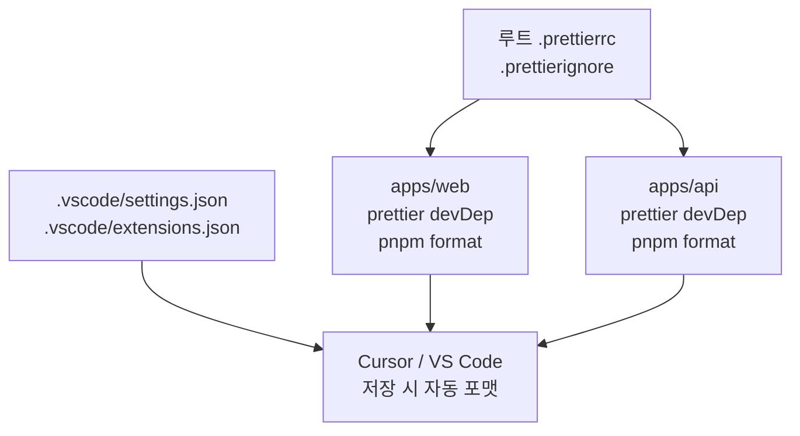

# Prettier · 코드 포맷

> **언제 보나:** 새 PC에서 Cursor/VS Code 세팅, 저장 시 포맷이 안 될 때, `>` 가 혼자 한 줄에 있는 스타일  
> **관련:** [`eslint.md`](./eslint.md) (린트·`eslint-disable` 주석), [`install.md`](./install.md), [`overview.md`](./overview.md)

---

## 한눈에 — 설정이 어디에 있는지



| 위치 | 역할 |
|------|------|
| **루트** `.prettierrc` | API·Web **공통** 규칙 (앱별 파일 없음) |
| **루트** `.prettierignore` | `node_modules`, `.next`, `dist` 등 제외 |
| **`.vscode/`** | 팀/본인 PC에서 동일한 에디터 동작 (저장 시 포맷) |
| **`apps/web`** | `prettier` + `pnpm format` |
| **`apps/api`** | `prettier` + `pnpm format` (기존 Nest 스크립트) |

---

## 새 컴퓨터에서 따라 하기

### 1. 저장소 클론 후 의존성

```bash
cd music-community
pnpm install
```

`prettier`는 각 앱 `devDependencies`에 들어 있음. 루트에 별도 `package.json`은 없음.

### 2. Cursor / VS Code 확장

1. 확장 마켓에서 **Prettier - Code formatter** (`esbenp.prettier-vscode`) 설치  
2. 저장소 루트의 `.vscode/settings.json`이 있으면 **워크스페이스 설정**으로 자동 적용  
3. 팝업이 뜨면 `.vscode/extensions.json` 권장 확장 설치

> 전역 `settings.json`을 건드릴 필요 없음. 이 레포만 열면 워크스페이스 설정이 우선.

### 3. 동작 확인

```bash
# web 전체 포맷
cd apps/web && pnpm format

# api (src · test만)
cd apps/api && pnpm format
```

파일 저장 시에도 같은 Prettier가 돌아가야 함 (`editor.formatOnSave: true`).

---

## 공통 규칙 (`.prettierrc`)

```json
{
  "singleQuote": true,
  "trailingComma": "all",
  "bracketSameLine": true
}
```

| 옵션 | 의미 |
|------|------|
| `singleQuote` | 문자열 `'...'` |
| `trailingComma` | 객체·배열 마지막에도 쉼표 |
| `bracketSameLine` | JSX/HTML 여러 줄일 때 `>` 를 **마지막 속성 줄 끝**에 둠 (혼자 한 줄 X) |

**`bracketSameLine` 예시**

```tsx
// ✅ 이 프로젝트 스타일
<div
  className="..."
  aria-hidden>
  ...
</div>

// ❌ Prettier 기본값 (bracketSameLine: false)
<div
  className="..."
  aria-hidden
>
  ...
</div>
```

---

## 제외 경로 (`.prettierignore`)

```
node_modules
.next
dist
build
coverage
apps/api/src/generated
```

---

## 에디터 설정 (`.vscode/settings.json`)

- `editor.formatOnSave`: `true`
- `editor.defaultFormatter`: `esbenp.prettier-vscode`
- `typescript`, `typescriptreact`, `javascript`, `json`, `jsonc` 도 Prettier 지정

다른 포맷터와 충돌하면 **defaultFormatter가 Prettier인지** 확인. 린트(빨간 밑줄)는 [`eslint.md`](./eslint.md).

---

## format 스크립트

| 앱 | 명령 | 대상 |
|----|------|------|
| **web** | `pnpm format` | `**/*.{ts,tsx,js,json,css,md}` |
| **api** | `pnpm format` | `src/**/*.ts`, `test/**/*.ts` |

커밋 전에 손으로 돌리고 싶을 때 위 명령 사용. CI용 format 체크는 아직 없음.

---

## 자주 막히는 것

| 증상 | 확인 |
|------|------|
| 저장해도 안 바뀜 | Prettier 확장 설치 여부, 다른 defaultFormatter 덮어쓰기 |
| API만 규칙이 다름 | `apps/api/.prettierrc` 를 다시 만들지 말 것 — **루트만** 사용 |
| `pnpm format` 명령 없음 | `pnpm install` 후 `apps/web/package.json` / `apps/api/package.json` 에 `format` 스크립트 있는지 |
| 포맷 vs 린트 헷갈림 | 포맷 = 이 문서 · 린트·주석 = [`eslint.md`](./eslint.md) |
