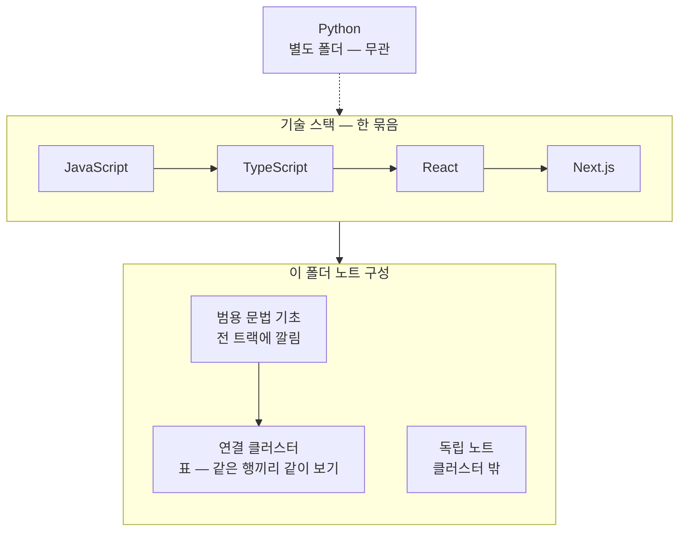

# 00_JS_Ecosystem_HomePage — JS · TS · React · Next.js

>[!info] 
>이 넷은 같은 런타임(JS)과 같은 타입 시스템(TS) 위에서 React가 컴포넌트 모델을, Next.js가 그 위의 프레임워크를 얹은 한 묶음이라 폴더를 합쳤다.

```txt
Python(Pandas/Airflow/Kafka)은 이 묶음과 실제로 얽힌 적이 없어서 별도 폴더 유지
```



```txt
큰 틀: Python은 별도 → JS·TS·React·Next는 위에서 아래로 쌓임 → 아래 표는 문법 기초 · 연결 묶음 · 독립 노트 세 층
```

---

# 빠른 찾기

```txt
인증/토큰      → 🔐 인증 · 토큰 흐름
브라우저/DOM   → 🌐 브라우저 · DOM · Canvas
스타일        → 🎨 스타일링 · CSS
React 훅      → ⚛️ React 훅
폼           → 📝 폼 처리
API 통신      → 📡 API 통신 · 타입 매핑
라우팅/메타   → 🗺️ 라우팅 · 메타데이터
날짜/문자열   → 📅 날짜 · 문자열 · 유틸
기초 문법     → 🔤 범용 문법 기초
보안          → 🛡️ 보안 기초
```

---

## 🔐 인증 · 토큰 흐름

| |노트|
|---|---|
|**JS**|[[JS_URL_Encoding]]|
|**React**|[[React_Context]]|
|**Next.js**|[[Auth_Concept]] · [[NextJS_TokenStorage]] · [[NextJS_AuthCache]] · [[NextJS_Routing]] · [[NextJS_API_Client]]|

---

## 🌐 브라우저 · DOM · Canvas

| |노트|
|---|---|
|**JS**|[[JS_BrowserAPI]] · [[JS_CustomEvent]] · [[JS_DOM]] · [[JS_Canvas]]|
|**TS**|[[TS_DOM_Events]]|
|**React**|[[React_useRef]]|
|**Next.js**|[[NextJS_ServerClient]]|

txt

```txt
JS_DOM      요소 조작 · Pointer Events · getBoundingClientRect · scrollIntoView
JS_Canvas   Canvas 2D · StrokeLayer 패턴 · 정규화 좌표(0~1)
```

---

## 🎨 스타일링 · CSS

| |노트|
|---|---|
|**JS**|[[JS_BrowserAPI]] (style 섹션) · [[JS_DOM]] (classList)|
|**React**|[[React_CSSProperties]] · [[React_Styling]]|

---

## ⚛️ React 훅

|훅|노트|
|---|---|
|기본 3대장|[[React_useMemo_useCallback_useEffect]]|
|Context|[[React_Context]]|
|Ref · DOM|[[React_useRef]]|
|고유 ID|[[React_useId]]|
|Portal|[[React_Portal]]|
|비동기 UI|[[React_AsyncUI]]|
|Suspense|[[React_Suspense]]|
|외부 스토어|[[React_useSyncExternalStore]]|

---

## 📝 폼 처리

| |노트|
|---|---|
|**JS**|[[JS_FormData]]|
|**React**|[[React_useFormStatus]] · [[React_ControlledInput]]|
|**Next.js**|[[NextJS_Server_Actions]]|

---

## 📡 API 통신 · 타입 매핑

| |노트|
|---|---|
|**JS**|[[JS_Fetch_API]]|
|**Next.js**|[[NextJS_API_Client]] · [[NextJS_ApiTypes_Mapper]] · [[NextJS_UI_Types]]|


```txt
NextJS_UI_Types ← 백엔드 NestJS_DTO의 OpenAPI 타입 생성과 연결
→ [[00_NestJS_Ecosystem_HomePage]] 참고
```

---

## 📺 임베드 · 미디어 재생

| |노트|
|---|---|
|**JS**|[[JS_Promise]] · [[JS_BrowserAPI]] · [[JS_DOM]]|
|**TS**|[[TS_YouTube]]|
|**React**|[[React_useMemo_useCallback_useEffect]] · [[React_useRef]]|
|**Next.js**|[[NextJS_ServerClient]]|

---

## 🗺️ 라우팅 · 메타데이터

| |노트|
|---|---|
|**Next.js**|[[NextJS_Routing]] · [[NextJS_Metadata]] · [[NextJS_OGImage]] · [[NextJS_WebSocket]]|


```txt
NextJS_OGImage    OG 이미지 · Apple 아이콘 · ImageResponse
NextJS_WebSocket  socket.io-client · 싱글턴 · 클린업 패턴
```

---

## 📅 날짜 · 문자열 · 유틸

|노트|내용|
|---|---|
|[[JS_Date]]|Date 객체 · 계산 · 비교|
|[[JS_URL_Encoding]]|encodeURIComponent · new URL · URLSearchParams|
|[[JS_JSON]]|stringify · parse · unknown 패턴|
|[[JS_WebStorage]]|localStorage · sessionStorage · Set 직렬화|
|[[JS_Intl]]|타임존 · 날짜 포맷 · 상대 시간 · 통화|
|[[JS_Regex]]|test · match · 캡처그룹 · 시간 파싱|

---

##  범용 문법 기초 — 전 트랙에 깔림

### TypeScript

|노트|내용|
|---|---|
|[[TS_TypeAssertion]]|`as`|
|[[TS_Generics]]|`<T>` · keyof · Partial 패치 · readonly T[]|
|[[TS_Class_Patterns]]|implements · extends · readonly|
|[[TS_Utility_Types]]|Record · Partial · Omit · ReturnType|
|[[TS_PartialUpdate]]|PATCH 객체 만들기|
|[[TS_Type_Guards]]|typeof · instanceof · in · is · unknown · JSON.parse|
|[[TS_Unknown_Any]]|any · unknown · void · never|
|[[TS_ImportType]]|import type · type as alias · .d.ts · 경로 별칭|
|[[TS_TsConfig]]|API vs Web 옵션 비교|

### JavaScript

|노트|내용|
|---|---|
|[[JS_OptionalChaining]]|`?.` / `??`|
|[[JS_Array_Methods]]|some · filter · map · reduce · findLast · 불변성|
|[[JS_Loops_Conditionals]]|if · switch · for · while|
|[[JS_Operators]]|=== · && · ... · 구조분해 · [key] 계산 속성|
|[[JS_Truthy_Falsy]]|truthy/falsy|
|[[JS_Object_Methods]]|Object.keys · entries · assign|
|[[JS_Map_Set]]|Map · Set · ID 인덱싱 · WeakMap|
|[[JS_Promise]]|async · await · Promise.all · new Promise|
|[[JS_Primitive_Methods]]|String · Number · Math · Number.isNaN|
|[[JS_Regex]]|test · match · 캡처그룹|

---

## 🛡️ 보안 기초

|노트|내용|
|---|---|
|[[Web_XSS_CSRF]]|XSS · CSRF · SameSite|
|[[Web_Cookie]]|HttpOnly · 서드파티 · ITP · 프록시|
|[[Web_Email]]|mailto · Resend · Formspree|

---

## 📦 독립 노트

|트랙|노트|
|---|---|
|**React**|[[React_Concept]] · [[React_Component]] · [[React_Vite]]|
|**Next.js**|[[NextJS_Concept]] · [[NextJS_Env_Config]]|
|**도구**|[[Monorepo_PNPM]] · [[00_Deployment_HomePage]]|

---

```txt
폴더를 합친 이유:
  js / nextjs / react / typescript 네 폴더가 실제로 서로 계속 얽혀서 참조됨
  분류는 접두사(JS_ / TS_ / React_ / NextJS_)가 이미 하고 있음
  Python은 한 번도 얽힌 적 없어서 별도 유지
```