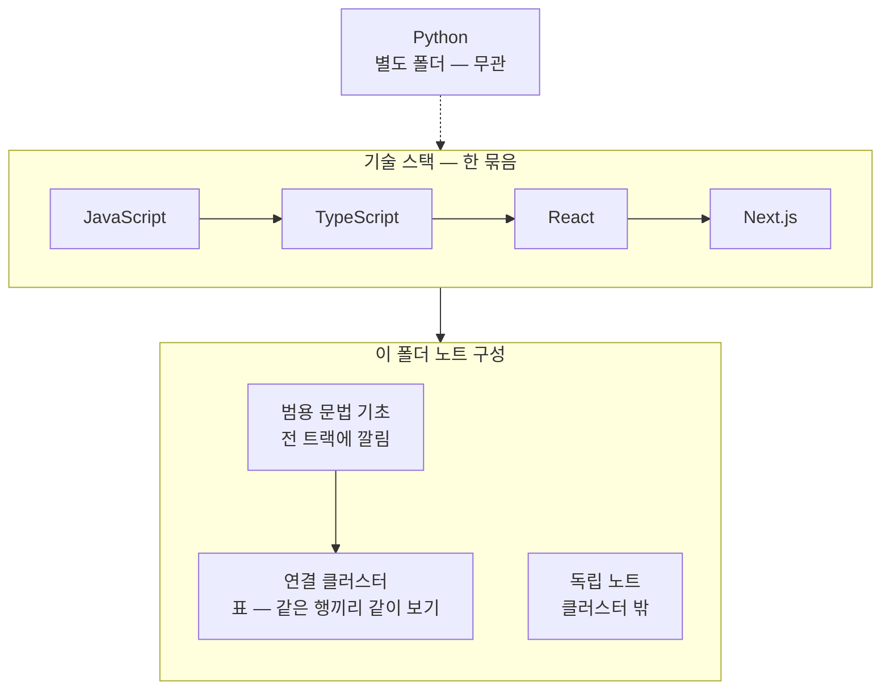

---
aliases:
  - 00_JS_Ecosystem_HomePage — JS · TS · React · Next.js
tags:
  - HomePage
related:
  - "[[00_NestJS_Ecosystem_HomePage]]"
  - "[[00_Tools_Ecosystem_HomePage]]"
cssclasses:
  - max
  - table-max
  - table-wrap
---

# 00_JS_Ecosystem_HomePage — JS · TS · React · Next.js

> [!info] 
> 이 넷은 같은 런타임(JS)과 같은 타입 시스템(TS) 위에서 React가 컴포넌트 모델을, Next.js가 그 위의 프레임워크를 얹은 한 묶음이라 폴더를 합쳤다. 아래 표는 "단계 순서"가 아니라 "서로 연결된 묶음" 기준 — 한 주제를 공부할 때 관련된 다른 트랙 노트를 바로 옆에서 같이 볼 수 있게 정리함.

```txt
Python(Pandas/Airflow/Kafka)은 이 묶음과 실제로 얽힌 적이 없어서 별도 폴더 유지
```



```txt
큰 틀: Python은 별도 → JS·TS·React·Next는 위에서 아래로 쌓임 → 아래 표는 문법 기초 · 연결 묶음 · 독립 노트 세 층
```

---

# 연결 클러스터 — 묶음별로 옆에서 같이 보기 ⭐️⭐️⭐️⭐️


| 클러스터           | JS                                                    | TS                                                              | React                                                                                                               | Next.js                                                                                                                                            |
| -------------- | ----------------------------------------------------- | --------------------------------------------------------------- | ------------------------------------------------------------------------------------------------------------------- | -------------------------------------------------------------------------------------------------------------------------------------------------- |
| 인증/토큰 흐름       | [[JS_URL_Encoding]]                                   | —                                                               | [[React_Context]]                                                                                                   | [[Auth_Concept]] · [[NextJS_TokenStorage]] · [[NextJS_AuthCache]] · [[NextJS_Routing]] · [[NextJS_API_Client]]                                     |
| 브라우저 환경 · DOM  | [[JS_BrowserAPI]] · [[JS_CustomEvent]] · [[JS_DOM]]   | [[TS_DOM_Events]]                                               | [[React_useRef]]                                                                                                    | [[NextJS_ServerClient]] (use client/server 경계)                                                                                                     |
| 스타일링 · CSS     | [[JS_BrowserAPI]] (style 섹션) · [[JS_DOM]] (classList) | —                                                               | [[React_CSSProperties]] · [[React_Styling]]                                                                         | —                                                                                                                                                  |
| React 훅 기초     | —                                                     | —                                                               | [[React_useMemo_useCallback_useEffect]] · [[React_Context]] · [[React_useRef]] · [[React_useId]] · [[React_Portal]] | —                                                                                                                                                  |
| 폼 처리           | [[JS_FormData]]                                       | —                                                               | [[React_useFormStatus]] · [[React_ControlledInput]]                                                                 | [[NextJS_Server_Actions]]                                                                                                                          |
| 차트/시각화         | [[JS_BrowserAPI]] (SSR 제약)                            | [[TS_Utility_Types]] (`PartialTheme`류)                          | [[React_Charts]]                                                                                                    | [[NextJS_ApiTypes_Mapper]] (데이터 shape 변환) · [[NestJS_Prisma]] (버전 변경 사례)                                                                                |
| API 통신 · 타입 매핑 | [[JS_Fetch_API]]                                      | —                                                               | —                                                                                                                   | [[NextJS_API_Client]] · [[NextJS_ApiTypes_Mapper]] · [[NextJS_UI_Types]] (← 백엔드 [[NestJS_DTO]]의 OpenAPI 타입 생성과 연결, [[00_NestJS_Ecosystem_HomePage]] 참고) |
| 임베드 · 미디어 재생   | [[JS_Promise]] · [[JS_BrowserAPI]] · [[JS_DOM]]       | [[TS_YouTube]] (`@types/youtube` · `YT.Player` · `PlayerState`) | [[React_useMemo_useCallback_useEffect]] · [[React_useRef]]                                                          | [[NextJS_ServerClient]]                                                                                                                            |
| 라우팅 · 메타데이터    | —                                                     | —                                                               | —                                                                                                                   | [[NextJS_Routing]] · [[NextJS_Metadata]]                                                                                                           |
| 날짜/문자열 — 독립 유틸 | [[JS_Date]] · [[JS_URL_Encoding]]                     | —                                                               | —                                                                                                                   | —                                                                                                                                                  |


```txt
같은 행에 있는 노트들은 서로 [[위키링크]]로 실제로 연결돼 있음 — 한 칸을 보다가 막히면
같은 행의 다른 칸(다른 트랙)을 같이 열어보면 풀리는 경우가 많음

이 표는 지금까지 같이 정리한 노트 기준이라, 폴더에 이미 있던 다른 노트
(React_Concept, NextJS_Env_Config 등)는 아직 안 들어가 있음 —
정리하면서 어느 클러스터에 들어가는지 보이면 행을 추가해나가면 됨
```

---

# 범용 문법 기초 — 한 트랙이 아니라 전부에 깔려있는 것 ⭐️⭐️⭐️

```txt
어느 한 클러스터에 넣기보다, 위 모든 노트의 코드에 반복해서 등장하는 기초 문법들
이것부터 모르면 위 클러스터의 코드 예시 자체가 안 읽히는 경우가 많음
```

| 언어         | 노트                                                                                                                                                                                                                                                                                                                                                                                                                          |
| ---------- | --------------------------------------------------------------------------------------------------------------------------------------------------------------------------------------------------------------------------------------------------------------------------------------------------------------------------------------------------------------------------------------------------------------------------- |
| TypeScript | [[TS_TypeAssertion]] (`as`) · [[TS_Generics]] (`<T>`) · [[TS_Class_Patterns]] (`implements`/`extends`/`readonly`) · [[TS_Utility_Types]] (`Record`/`Partial`/`Omit`/`ReturnType`) · [[TS_PartialUpdate]] (PATCH 객체 만들기) · [[TS_Type_Guards]] (`typeof`/`instanceof`/`in`/`is`/`unknown`)                                                                                                                                    |
| JavaScript | [[JS_OptionalChaining]] (`?.` / `??`) · [[JS_Array_Methods]] (`map`/`filter`/`reduce`/`Array.from` 등) · [[JS_Loops_Conditionals]] (`if`/`switch`/`for`/`while`) · [[JS_Operators]] (`===`/`&&`/`...`/구조분해/`instanceof`) · [[JS_Truthy_Falsy]] (truthy/falsy) · [[JS_Object_Methods]] (`Object.keys`/`entries`/`assign`) · [[JS_Map_Set]] (`Set`/`Map`/`WeakMap`/`WeakSet`) · [[JS_Promise]] (`async`/`await`/`Promise.all`) |

---
# 보안 기초 — 프레임워크 무관 ⭐️⭐️

```
JS/TS/React/Next.js 중 어느 트랙에도 속하지 않는, 웹 자체의 보안 개념
인증/토큰 클러스터(NextJS_TokenStorage 등)에서 "XSS 노출"/"CSRF 노출"이라고만 언급되던 것의 실제 내용
```

|개념|노트|
|---|---|
|XSS / CSRF / SameSite|[[Web_XSS_CSRF]]|
|쿠키 / HttpOnly / 서드파티 / ITP / 프록시|[[Web_Cookie]]|


---

# 클러스터에 안 들어가는 독립 노트 ⭐️

```txt
모든 노트가 다른 트랙과 얽힐 필요는 없음 — 그 자체로 완결된 노트들은 그냥 목록으로만 관리
```

| 트랙      | 독립 노트                                                   |
| ------- | ------------------------------------------------------- |
| JS      | [[JS_Primitive_Methods]]                                |
| TS      | —                                                       |
| React   | [[React_Concept]] · [[React_Component]] ·               |
| Next.js | [[NextJS_Concept]] · [[NextJS_Env_Config]]              |
| 도구/설정   | [[Monorepo_PNPM]] · [[00_Deployment_HomePage]] (배포 인프라) |


```txt
이 목록은 폴더 안에 있다고 알고 있는 노트 이름만 적어둔 것 — 실제 내용을 아직 안 봤으니
혹시 위 클러스터 표에 들어가야 하는 게 있다면 표로 옮기면 됨
```

---

# Toolbox — 복붙 스니펫 (범용)

```txt
Wiki(20)는 개념 · Toolbox(10)는 여러 프로젝트에 복사하는 패턴
임베드·미디어 클러스터 공부할 때 같이 보면 됨 — 프로젝트별 ER·진행은 [[00_Project_HomePage]]
```

| 하고 싶은 일 | 먼저 볼 노트 |
|---|---|
| YouTube embed · 101/150 fallback | [[Snippet_youtube-iframe-embed-react]] |
| 공유 URL → embed URL (올리기 API) | [[Snippet_normalize-embed-url]] |

---

# 폴더 합친 이유 — 짧게 기록

```txt
js / nextjs / react / typescript 네 폴더가 실제로 서로 계속 얽혀서 참조됨
(Python은 한 번도 얽힌 적 없어서 별도 유지)
→ 폴더를 나눠도 위키링크는 폴더 경계와 무관하게 연결되니, 분류는 접두사(JS_/TS_/React_/NextJS_)가
  이미 하고 있었음 — 폴더 분리는 그 분류를 중복으로 만들 뿐이라 합침
```