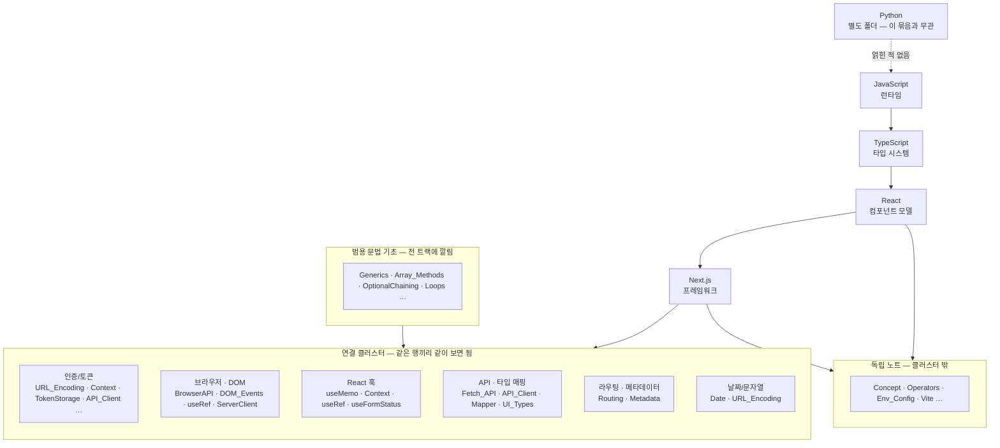

---
aliases:
  - 00_JS_Ecosystem_HomePage — JS · TS · React · Next.js
tags:
  - HomePage
related:
  - "[[00_NestJS_Ecosystem_HomePage]]"
---
# 00_JS_Ecosystem_HomePage — JS · TS · React · Next.js

> [!info] 
> 이 넷은 같은 런타임(JS)과 같은 타입 시스템(TS) 위에서 React가 컴포넌트 모델을, Next.js가 그 위의 프레임워크를 얹은 한 묶음이라 폴더를 합쳤다. 아래 표는 "단계 순서"가 아니라 "서로 연결된 묶음" 기준 — 한 주제를 공부할 때 관련된 다른 트랙 노트를 바로 옆에서 같이 볼 수 있게 정리함.

```
Python(Pandas/Airflow/Kafka)은 이 묶음과 실제로 얽힌 적이 없어서 별도 폴더 유지
```



---

# 연결 클러스터 — 묶음별로 옆에서 같이 보기 ⭐️⭐️⭐️⭐️

|클러스터|JS|TS|React|Next.js|
|---|---|---|---|---|
|인증/토큰 흐름|[[JS_URL_Encoding]]|—|[[React_Context]]|[[NextJS_TokenStorage]] · [[NextJS_AuthCache]] · [[NextJS_Routing]] · [[NextJS_API_Client]]|
|브라우저 환경 · DOM 이벤트|[[JS_BrowserAPI]] · [[JS_CustomEvent]]|[[TS_DOM_Events]]|[[React_useRef]]|[[NextJS_ServerClient]] (use client/server 경계)|
|React 훅 기초|—|—|[[React_useMemo_useCallback_useEffect]] · [[React_Context]] · [[React_useRef]] · [[React_useFormStatus]]|—|
|API 통신 · 타입 매핑|[[JS_Fetch_API]]|—|—|[[NextJS_API_Client]] · [[NextJS_API_Mapper]] · [[NextJS_UI_Types]]|
|라우팅 · 메타데이터|—|—|—|[[NextJS_Routing]] · [[NextJS_Metadata]]|
|날짜/문자열 — 독립 유틸|[[JS_Date]] · [[JS_URL_Encoding]]|—|—|—|

```
같은 행에 있는 노트들은 서로 [[위키링크]]로 실제로 연결돼 있음 — 한 칸을 보다가 막히면
같은 행의 다른 칸(다른 트랙)을 같이 열어보면 풀리는 경우가 많음

이 표는 지금까지 같이 정리한 노트 기준이라, 폴더에 이미 있던 다른 노트
(React_Concept, NextJS_Env_Config 등)는 아직 안 들어가 있음 —
정리하면서 어느 클러스터에 들어가는지 보이면 행을 추가해나가면 됨
```

---

# 범용 문법 기초 — 한 트랙이 아니라 전부에 깔려있는 것 ⭐️⭐️⭐️

```
어느 한 클러스터에 넣기보다, 위 모든 노트의 코드에 반복해서 등장하는 기초 문법들
이것부터 모르면 위 클러스터의 코드 예시 자체가 안 읽히는 경우가 많음
```

|언어|노트|
|---|---|
|TypeScript|[[TS_TypeAssertion]] (`as`) · [[TS_Generics]] (`<T>`) · [[TS_Class_Patterns]] (`implements`/`extends`/`readonly`)|
|JavaScript|[[JS_OptionalChaining]] (`?.` / `??`) · [[JS_Array_Methods]] (`map`/`filter`/`reduce` 등) · [[JS_Loops_Conditionals]] (`if`/`switch`/`for`/`while`)|

---

# 클러스터에 안 들어가는 독립 노트 ⭐️

```
모든 노트가 다른 트랙과 얽힐 필요는 없음 — 그 자체로 완결된 노트들은 그냥 목록으로만 관리
```

|트랙|독립 노트|
|---|---|
|JS|[[JS_Operators]] · [[JS_Destructuring]] · [[JS_Primitive_Methods]]|
|TS|[[TS_Type_Guards]] · [[TS_Utility_Types]]|
|React|[[React_Concept]] · [[React_Component]] · [[React_Charts]] · [[React_Vite]]|
|Next.js|[[NextJS_Concept]] · [[NextJS_Env_Config]]|

```
이 목록은 폴더 안에 있다고 알고 있는 노트 이름만 적어둔 것 — 실제 내용을 아직 안 봤으니
혹시 위 클러스터 표에 들어가야 하는 게 있다면(예: NextJS_Auth가 인증 흐름 클러스터와 얽힌다면)
표로 옮기면 됨
```

---

# 폴더 합친 이유 — 짧게 기록

```
js / nextjs / react / typescript 네 폴더가 실제로 서로 계속 얽혀서 참조됨
(Python은 한 번도 얽힌 적 없어서 별도 유지)
→ 폴더를 나눠도 위키링크는 폴더 경계와 무관하게 연결되니, 분류는 접두사(JS_/TS_/React_/NextJS_)가
  이미 하고 있었음 — 폴더 분리는 그 분류를 중복으로 만들 뿐이라 합침
```