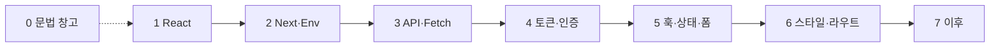

---
aliases:
  - 00_JS_Ecosystem_HomePage — JS · TS · React · Next.js
tags:
  - HomePage
related:
  - "[[00_NestJS_Ecosystem_HomePage]]"
  - "[[00_DB_HomePage]]"
cssclasses:
  - max
  - table-max
  - table-wrap
---
# 00_JS_Ecosystem_HomePage — JS · TS · React · Next.js

>[!info]
>이 넷은 같은 런타임(JS)과 같은 타입 시스템(TS) 위에서 React가 컴포넌트 모델을, Next.js가 그 위의 프레임워크를 얹은 한 묶음이라 폴더를 합쳤다.
>이 홈은 **만드는 순서**로 정리한다. 주제만 찾을 때는 아래 [[#빠른 찾기]]로.
>백엔드 Nest 축 → [[00_NestJS_Ecosystem_HomePage]]


```mermaid-beautiful
flowchart LR
  G["0 문법 창고"] -.-> M1["1 React"]
  M1 --> M2["2 Next·Env"]
  M2 --> M3["3 API·Fetch"]
  M3 --> M4["4 토큰·인증"]
  M4 --> M5["5 훅·상태·폼"]
  M5 --> M6["6 스타일·라우트"]
  M6 --> M7["7 이후"]
```

```txt
실전 축: React → Next(개념·Nest비교·Env) → fetch/lib → Bearer → UI 훅.
문법 창고(0): JS·TS 기본은 따로 둔다. 필요할 때만 연다. 실전 번호와 섞지 않음.
```

---

# 빠른 찾기

| 찾을 때 | 섹션 |
|---|---|
| JS · TS 문법 (창고) | [[#0. 문법 창고 · JS · TS]] |
| React 기초 · 컴포넌트 | [[#1. React 기초]] |
| Nest 비교 · Next 개념 · Env · Server/Client | [[#2. Next.js 입구]] |
| fetch · API 클라이언트 · 타입 | [[#3. API 통신]] |
| JWT · 토큰 저장 | [[#4. 인증 · 토큰]] |
| 훅 · Context · 폼 | [[#5. 훅 · 상태 · 폼]] |
| 스타일 · 라우팅 · 메타 | [[#6. 스타일 · 라우팅 · 메타]] |
| DOM · Canvas · WebSocket · 보안 | [[#7. 이후에 붙이는 것]] |

---

## 0. 문법 창고 · JS · TS

실전 흐름(1~6)과 **분리**.  
배열·Promise·제네릭이 막힐 때만 여기로.

### TypeScript

| 노트 | 내용 |
|---|---|
| [[TS_Type_Guards]] | typeof · instanceof · in · is · never · any vs unknown · as const |
| [[TS_Generics]] | `<T>` · keyof · Partial · readonly T[] · `&` 교차 타입 |
| [[TS_Utility_Types]] | Partial · Required · Omit · Pick · Record · ReturnType · Awaited · PATCH 패턴 |
| [[TS_TypeAssertion]] | `as` · `!` non-null · `property!` 확정 할당 · `satisfies` |
| [[TS_Class_Patterns]] | implements · extends · readonly |

```txt
web lib/api.ts · 페이지 import 할 때 쓰는 노트는
  → 아래 「2. Next.js 입구」의 import · tsconfig (실전 순서에 붙임)
```

### JavaScript

| 노트 | 내용 |
|---|---|
| [[JS_Operators]] | 구조분해 · 스프레드 · ?. · ?? · ! · !! · Boolean() · Truthy/Falsy |
| [[JS_FunctionPatterns]] | 옵션 객체 · early return · async 래퍼 · 내부 함수 추출 |
| [[JS_Promise]] | async/await · Promise\<T\> · 래퍼 · Promise.all |
| [[JS_Array_Methods]] | some · filter · map · reduce · findLast · 불변성 · Set |
| [[JS_Object_Methods]] | Object.keys · entries · assign · fromEntries · Map |
| [[JS_Loops_Conditionals]] | if · switch · for · while |
| [[JS_Primitive_Methods]] | String · Number · Math · 문자열 조합 |
| [[JS_JSON]] | stringify · parse · unknown 패턴 |
| [[JS_Date]] · [[JS_Intl]] | Date · 타임존 · 상대시간 · NumberFormat |
| [[JS_Regex]] | test · match · 캡처그룹 |
| [[JS_URL_Encoding]] | encodeURIComponent · URL · URLSearchParams |

```txt
await fetch 직전에 다시 볼 것: JS_Promise · JS_JSON
나머지(배열·날짜·정규식)는 UI·데이터 다룰 때
```

---

## 1. React 기초

프레임워크(Next) 전에 컴포넌트 모델.

| | 노트 |
|---|---|
| **개념** | [[React_Concept]] · [[React_Component]] |
| **타입** | [[React_Types]] |
| **도구** | [[React_Vite]] |

```txt
React_Concept     SPA · JSX · State · Props · Virtual DOM · React vs Next
React_Component   컴포넌트 작성 · props · children
React_Types       children · ReactNode · 이벤트 · Ref
```

---

## 2. Next.js 입구

Nest를 이미 본 뒤 Web으로 넘어올 때 **이 순서**.

1. **개념 + Nest 비교** — 방향이 반대(받음 vs 보냄), Module vs `lib`
2. **Env** — `NEXT_PUBLIC_*` · `.env.local` (Nest `EnvKeys`/Joi와 짝)
3. **Server / Client** — `window` 없음 · `'use client'` · 어디서 fetch
4. **import · tsconfig** — `lib/api.ts` 만들기 직전에

| 순서 | 노트 | 왜 여기 |
|---|---|---|
| 1 | [[NextJS_Concept]] | Nest↔Next 지도 · SSR · App Router · 왜 Next인가 |
| 2 | [[NextJS_Env_Config]] | `NEXT_PUBLIC_API_URL` · `.env.local` · (선택) Zod/t3-env |
| 3 | [[NextJS_ServerClient]] | 서버/클라이언트 경계 · Hydration |
| 4 | [[TS_ImportType]] · [[TS_TsConfig]] | `import type` · 경로 별칭 · API vs Web tsconfig |
| — | [[Monorepo_PNPM]] | `apps/web`이 모노레포에 있을 때 |

```txt
NextJS_Concept
  Nest 비교 표가 맨 앞 (요청 받음 vs fetch로 보냄)
  → ConfigService ↔ process.env.NEXT_PUBLIC_*
  → Guard 검증 ↔ 클라이언트가 Bearer 첨부
  → UsersModule ↔ lib/api.ts 함수 하나

NextJS_Env_Config
  Nest FRONTEND_URL (CORS: 누가 나를 호출)과
  Web NEXT_PUBLIC_API_URL (내가 누구를 호출)이 짝

TS_ImportType · TS_TsConfig
  문법 창고에 두지 않고 여기 — web 코드 쓸 때 바로 필요
```

---

## 3. API 통신

백엔드에 `fetch`로 붙는 구간. Bearer는 다음 단계에서 얹음.

| 순서 | 노트 | 왜 여기 |
|---|---|---|
| 1 | [[JS_Fetch_API]] | `fetch` · headers · JSON body · `res.ok` · `await res.json()` |
| 2 | [[NextJS_API_Client]] | `lib/api.ts` 래퍼 · 토큰 첨부 · FormData |
| 3 | [[NextJS_Types]] · [[NextJS_API_Mapper]] | API 타입 · UI 타입 · 매퍼 |
| — | [[OpenAPI_Codegen]] | 스펙 → 타입 자동 생성 (선택) |

```txt
NextJS_API_Client  fetchApi(공개)·authFetchApi(Bearer) 레이어 · lib/api/ 폴더구조 · 토큰 메모리 관리 · 도메인별 함수 분리
NextJS_API_Mapper  기능별 fetch 함수 · ApiXxx→UiXxx 변환 · 전체 흐름
NextJS_Types       API 타입(ApiXxx) · UI 타입(UiXxx) · 매퍼 패턴 (개념)
OpenAPI_Codegen    스펙 → 타입 자동 생성 · openapi-typescript · Orval · 백엔드 스택별 비교
                   ← 업계 표준 패턴 (NestJS·FastAPI·Spring 공통)
백엔드 문서         [[NestJS_Swagger]] (Nest 홈)
```

---

## 4. 인증 · 토큰

| | 노트 |
|---|---|
| **개념** | [[Auth_Concept]] |
| **Next.js** | [[NextJS_TokenStorage]] · [[NextJS_AuthState]] |

```txt
Auth_Concept        인증 vs 인가 · Session vs Token · JWT 구조 · Access+Refresh Token · OAuth · 저장 위치
NextJS_TokenStorage 메모리 vs localStorage vs httpOnly 쿠키 · authToken.ts 패턴 · 새로고침 복구
NextJS_AuthState    로그인 유저 정보를 Zustand로 앱 전체 공유 · AuthInitializer · 보호 라우트
NestJS 구현 → [[NestJS_Auth]] (🔐 NestJS 인증 섹션)
API 클라이언트 · 토큰 첨부 → [[NextJS_API_Client]] (📡 API 통신 섹션)
```

---

## 5. 훅 · 상태 · 폼

화면에서 login/me를 누를 때 · 상태를 나눌 때.

| 훅 / 역할 | 노트 |
|---|---|
| 사이드 이펙트 | [[React_useEffect]] |
| DOM · 값 보관 | [[React_useRef]] |
| 메모이제이션 | [[React_useMemo_useCallback]] |
| 전역 상태 | [[React_Context_Provider]] |
| 비동기 UI | [[React_AsyncUI]] |
| 고유 ID | [[React_useId]] |
| Portal · 모달 | [[React_Portal_Dialog]] |
| Suspense · Lazy | [[React_Suspense]] · [[React_Lazy]] |
| 외부 스토어 | [[React_useSyncExternalStore]] |
| **폼** | [[JS_FormData]] · [[React_ControlledInput]] · [[React_useFormStatus]] · [[React_DatePicker]] · [[NextJS_Server_Actions]] |

```txt
React_useEffect   fetch · 리스너 · cleanup · 의존성
React_useRef      focus · scroll · 렌더 무관 값
React_AsyncUI     이벤트 핸들러 비동기 · applyLocal
폼                controlled input · FormData · Server Actions
```

---

## 6. 스타일 · 라우팅 · 메타

| | 노트 |
|---|---|
| **스타일** | [[React_CSSProperties]] · [[React_Styling]] · [[React_LucideIcons]] · [[NextJS_Font]] |
| **라우팅 · 메타** | [[NextJS_Routing]] · [[NextJS_Metadata]] · [[NextJS_OGImage]] |

```txt
NextJS_Font      next/font · 한글 · CSS 변수
NextJS_Routing   App Router · 링크 · 동적 세그먼트
NextJS_Metadata  title · description · OG
```

---

## 7. 이후에 붙이는 것

필수 축(1~6) 위에 올리는 것. 필요할 때만.

### 브라우저 · DOM · Canvas

| | 노트 |
|---|---|
| **JS** | [[JS_BrowserAPI]] · [[JS_DOM]] · [[JS_Canvas]] · [[JS_FileAPI]] · [[JS_CustomEvent]] · [[JS_WebStorage]] |
| **TS** | [[TS_DOM_Events]] |
| **HTML** | [[HTML_ARIA]] |

### 실시간

| | 노트 |
|---|---|
| **Next.js** | [[NextJS_WebSocket]] |
| **패턴** | [[WebSocket_Patterns]] |

### 보안

| 노트 | 내용 |
|---|---|
| [[Web_XSS_CSRF]] | XSS · CSRF · SameSite |
| [[Web_Cookie]] | HttpOnly · 서드파티 · ITP · 프록시 |
| [[Web_Email]] | mailto · Resend · Formspree |

### 기타

| 트랙 | 노트 |
|---|---|
| **TS** | [[TS_YouTube]] |
| **배포** | [[00_Deployment_HomePage]] |

---

```txt
폴더를 합친 이유:
  js / nextjs / react / typescript가 서로 계속 얽혀 참조됨
  분류는 접두사(JS_ / TS_ / React_ / NextJS_)가 이미 함

홈을 이렇게 나눈 이유:
  예전에 1번이 JS·TS 전부라 Nest→Web 실전 흐름이 뒤로 밀림
  → 0 = 문법 창고 (따로)
  → 2 = Concept(Nest 비교) → Env → Server/Client → Import/TsConfig
  → 3 = Fetch → lib API 클라이언트
  Nest 홈(부트→Env→Prisma→CRUD→JWT)과 짝이 맞음
```
