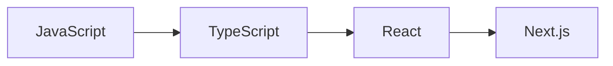

# 00_JS_Ecosystem_HomePage — JS · TS · React · Next.js

> [!info]
>  이 넷은 같은 런타임(JS)과 같은 타입 시스템(TS) 위에서 React가 컴포넌트 모델을, Next.js가 그 위의 프레임워크를 얹은 한 묶음이라 폴더를 합쳤다.


```mermaid-beautiful
flowchart LR
    JS["JavaScript"] --> TS["TypeScript"] --> REACT["React"] --> NEXT["Next.js"]
```

---

# 빠른 찾기

|찾을 때|섹션|
|---|---|
|인증 / JWT / 토큰|[[#🔐 인증 · 토큰]]|
|DOM / Canvas / 파일|[[#🌐 브라우저 · DOM · Canvas]]|
|스타일 / 폰트|[[#🎨 스타일링]]|
|React 훅|[[#⚛️ React 훅]]|
|폼 / 입력|[[#📝 폼 처리]]|
|API 통신 / 타입|[[#📡 API 통신 · 타입 매핑]]|
|라우팅 / 메타|[[#🗺️ 라우팅 · 메타데이터]]|
|날짜 / 문자열 / 유틸|[[#📅 날짜 · 문자열 · 유틸]]|
|JS · TS 문법 기초|[[#🔤 범용 문법 기초]]|
|보안|[[#🛡️ 보안]]|
|독립 노트|[[#📦 독립 노트]]|

---

## 🔐 인증 · 토큰

| |노트|
|---|---|
|**JS**|[[JS_URL_Encoding]]|
|**Next.js**|[[Auth_Concept]] · [[NextJS_TokenStorage]] · [[NextJS_AuthCache]] · [[NextJS_Routing]] · [[NextJS_API_Client]]|

```txt
Auth_Concept        OAuth 흐름 · JWT vs 세션
NextJS_TokenStorage 토큰 저장 전략
NextJS_AuthCache    캐시 + 인증 조합
Context로 로그인 상태 공유 → [[React_Context]] (⚛️ React 훅 섹션)
```

---

## 🌐 브라우저 · DOM · Canvas

| |노트|
|---|---|
|**JS**|[[JS_BrowserAPI]] · [[JS_DOM]] · [[JS_Canvas]] · [[JS_FileAPI]] · [[JS_CustomEvent]]|
|**TS**|[[TS_DOM_Events]]|
|**Next.js**|[[NextJS_ServerClient]]|

```txt
JS_BrowserAPI  window · navigator · Clipboard · ResizeObserver · style 직접 조작
JS_DOM         querySelector · classList · Pointer Events · scrollIntoView · textarea 패턴
JS_Canvas      Canvas 2D · StrokeLayer 패턴 · 정규화 좌표(0~1)
JS_FileAPI     File 객체 · FileReader · dataURL · 파일 검증
DOM 요소 접근(useRef) → [[React_useRef]] (⚛️ React 훅 섹션)
```

---

## 🎨 스타일링

| |노트|
|---|---|
|**React**|[[React_CSSProperties]] · [[React_Styling]] · [[React_LucideIcons]]|
|**Next.js**|[[NextJS_Font]]|

```txt
NextJS_Font        next/font · 한글 폰트 · 커스텀 클래스 · CSS 변수
React_LucideIcons  아이콘 설치 · props · 동적 아이콘
classList 조작 → [[JS_DOM]] / style 직접 조작 → [[JS_BrowserAPI]] (🌐 섹션)
```

---

## ⚛️ React 훅

|훅 / 역할|노트|
|---|---|
|기본 3대장|[[React_useMemo_useCallback_useEffect]]|
|DOM 접근 · 값 보관|[[React_useRef]]|
|전역 상태 공유|[[React_Context]]|
|비동기 UI 패턴|[[React_AsyncUI]]|
|고유 ID|[[React_useId]]|
|Portal|[[React_Portal]]|
|Suspense|[[React_Suspense]]|
|외부 스토어|[[React_useSyncExternalStore]]|

```txt
React_useMemo_useCallback_useEffect  언제 뭘 쓰는가 · useCallback 판단 기준 · cancelled 플래그
React_useRef     DOM 접근(focus · scroll) · 렌더링 무관 값 보관 · 드래그 진행 데이터
React_AsyncUI    이벤트 핸들러 비동기 · useEffect fetch · fire-and-forget · applyLocal
```

---

## 📝 폼 처리

| |노트|
|---|---|
|**JS**|[[JS_FormData]]|
|**React**|[[React_useFormStatus]] · [[React_ControlledInput]]|
|**Next.js**|[[NextJS_Server_Actions]]|

---

## 📡 API 통신 · 타입 매핑

| |노트|
|---|---|
|**JS**|[[JS_Fetch_API]]|
|**Next.js**|[[NextJS_API_Client]] · [[NextJS_ApiTypes_Mapper]] · [[NextJS_UI_Types]]|

```txt
NextJS_UI_Types ← 백엔드 NestJS_DTO의 OpenAPI 타입 생성과 연결
→ [[00_NestJS_Ecosystem_HomePage]] 참고
```

---

## 🗺️ 라우팅 · 메타데이터

| |노트|
|---|---|
|**Next.js**|[[NextJS_Routing]] · [[NextJS_Metadata]] · [[NextJS_OGImage]] · [[NextJS_WebSocket]]|

```txt
NextJS_OGImage    OG 이미지 · Apple 아이콘 · ImageResponse
NextJS_WebSocket  socket.io-client · 싱글턴 · 클린업 패턴
```

---

## 📅 날짜 · 문자열 · 유틸

|노트|내용|
|---|---|
|[[JS_Date]]|Date 객체 · 계산 · 비교 · KST 타임존 유틸|
|[[JS_JSON]]|stringify · parse · unknown 패턴|
|[[JS_WebStorage]]|localStorage · sessionStorage · Set 직렬화|
|[[JS_Intl]]|타임존 · 날짜 포맷 · 상대 시간 · 통화|
|[[JS_Regex]]|test · match · 캡처그룹 · 시간 파싱|
|[[JS_URL_Encoding]]|encodeURIComponent · new URL · URLSearchParams|

---

## 🔤 범용 문법 기초

### TypeScript

|노트|내용|
|---|---|
|[[TS_Generics]]|`<T>` · keyof · Partial 패치 · readonly T[]|
|[[TS_Utility_Types]]|Record · Partial · Omit · ReturnType · Awaited|
|[[TS_Type_Guards]]|typeof · instanceof · in · is · as const|
|[[TS_Unknown_Any]]|any · unknown · void · never|
|[[TS_TypeAssertion]]|`as` — 언제 쓰고 왜 위험한가|
|[[TS_ImportType]]|import type · type as alias · .d.ts · 경로 별칭|
|[[TS_TsConfig]]|API vs Web 옵션 비교|
|[[TS_Class_Patterns]]|implements · extends · readonly|
|[[TS_PartialUpdate]]|PATCH 객체 만들기|

### JavaScript

|노트|내용|
|---|---|
|[[JS_Operators]]|구조분해 · 스프레드 · ?. · ?? · ! · !! · Boolean() · void · [key]|
|[[JS_FunctionPatterns]]|옵션 객체 패턴 · early return · async 래퍼|
|[[JS_Promise]]|async/await · Promise<T> 타입 · 래퍼 패턴 · Promise.all|
|[[JS_Array_Methods]]|some · filter · map · reduce · findLast · 불변성|
|[[JS_Object_Methods]]|Object.keys · entries · assign · fromEntries|
|[[JS_Map_Set]]|Map · Set · ID 인덱싱 · WeakMap|
|[[JS_Loops_Conditionals]]|if · switch · for · while|
|[[JS_Primitive_Methods]]|String · Number · Math · Number.isNaN|
|[[JS_Truthy_Falsy]]|truthy/falsy 전체 목록|

---

## 🛡️ 보안

|노트|내용|
|---|---|
|[[Web_XSS_CSRF]]|XSS · CSRF · SameSite|
|[[Web_Cookie]]|HttpOnly · 서드파티 · ITP · 프록시|
|[[Web_Email]]|mailto · Resend · Formspree|

---

## 📦 독립 노트

|트랙|노트|
|---|---|
|**React**|[[React_Concept]] · [[React_Component]] · [[React_Vite]]|
|**Next.js**|[[NextJS_Concept]] · [[NextJS_Env_Config]]|
|**TS**|[[TS_YouTube]]|
|**도구**|[[Monorepo_PNPM]] · [[00_Deployment_HomePage]]|

---

```txt
폴더를 합친 이유:
  js / nextjs / react / typescript 네 폴더가 실제로 서로 계속 얽혀서 참조됨
  분류는 접두사(JS_ / TS_ / React_ / NextJS_)가 이미 하고 있음
  Python은 한 번도 얽힌 적 없어서 별도 유지
```