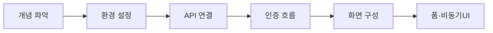

# 00_JS_Ecosystem_HomePage — JS · TS · React · Next.js

>[!info]
>NestJS(서버)를 알고 Next.js(클라이언트)로 넘어올 때 필요한 것들을 흐름 순서로 정리. JS·TS·React·Next.js는 같은 런타임과 타입 시스템 위에 있어 한 폴더로 합쳤다. 분류는 파일 접두사(JS_·TS_·React_·NextJS_)가 한다.

---

# 빠른 찾기

| 찾을 때 | 섹션 |
|---|---|
| React·Next.js 개념 | [[#1️⃣ 개념]] |
| 환경변수 · 프로젝트 설정 | [[#2️⃣ 환경 설정]] |
| NestJS API 연결 | [[#3️⃣ API 연결 — NestJS와 통신]] |
| 로그인 · 토큰 · 인증 상태 | [[#4️⃣ 인증 흐름]] |
| 화면 라우팅 · 메타데이터 | [[#5️⃣ 라우팅]] |
| 폼 · 입력 | [[#6️⃣ 폼 처리]] |
| 비동기 UI · 상태 관리 | [[#7️⃣ 비동기 UI · 상태]] |
| 스타일링 · 브라우저 | [[#8️⃣ 스타일 · 브라우저]] |
| JS · TS 문법 참조 | [[#9️⃣ JS · TS 참조]] |
| 날짜 · 유틸 | [[#🔟 유틸]] |

---

# NestJS → Next.js 흐름

```txt
NestJS                   Next.js
Module·Controller·Service  →  페이지·컴포넌트 + lib 유틸
ConfigService + Joi        →  NEXT_PUBLIC_* + .env.local
Guard가 Bearer 검증        →  클라이언트가 Bearer를 붙여서 보냄
요청이 서버로 들어옴         →  브라우저가 fetch로 밖으로 나감
UsersModule 새로 추가       →  lib/api.ts에 함수 하나 추가
```


```mermaid-beautiful
flowchart LR
  A[개념 파악] --> B[환경 설정]
  B --> C[API 연결]
  C --> D[인증 흐름]
  D --> E[화면 구성]
  E --> F[폼·비동기UI]
```

---

## 1️⃣ 개념

| 노트 | 내용 |
|---|---|
| [[React_Concept]] | SPA · 컴포넌트 · JSX · State · Props · Virtual DOM |
| [[NextJS_Concept]] | NestJS↔Next.js 머릿속 지도 · SSR·CSR·SSG · lib 폴더 역할 |
| [[NextJS_ServerClient]] | Server·Client Component 판단 기준 · Hydration · window 없음 · AuthBootstrap 분리 이유 |

---

## 2️⃣ 환경 설정

| 노트 | 내용 |
|---|---|
| [[NextJS_Env_Config]] | NEXT_PUBLIC_ 접두사 · .env.local · NestJS와 차이 · @t3-oss/env-nextjs |
| [[Monorepo_PNPM]] | pnpm workspace · apps/api + apps/web · Docker · 초기 설정 순서 |

---

## 3️⃣ API 연결 — NestJS와 통신

```txt
Next.js에서 NestJS로 요청을 보내는 레이어:
  JS_Fetch_API       fetch 기초 · res.ok · AbortController · CORS
  NextJS_API_Client  fetchApi·authFetchApi 레이어 vs apiFetch+token? 통합 패턴 · lib/api/ 폴더구조
  OpenAPI_Codegen    NestJS 스펙 → 타입 자동 생성
```

| 노트 | 내용 |
|---|---|
| [[JS_Fetch_API]] | fetch 기초 · res.ok · await 두 번 · CORS · 204 처리 · AbortController |
| [[NextJS_API_Client]] | 패턴A fetchApi·authFetchApi 분리 vs 패턴B apiFetch+token? · RequestInit & {token?} · lib/api/ |
| [[OpenAPI_Codegen]] | NestJS dump-openapi → openapi-typescript → api.d.ts |

---

## 4️⃣ 인증 흐름

```txt
NestJS Guard가 Bearer를 검증하는 쪽이라면
Next.js는 그 Bearer를 만들어서 헤더에 담아 보내는 쪽

개념 → 토큰 저장 → 유저 상태(Zustand) → 앱 시작 복구(AuthBootstrap) → 로그인 폼
```

| 노트 | 내용 |
|---|---|
| [[Auth_Concept]] | 인증 vs 인가 · Session vs Token · JWT 구조 · Access+Refresh · OAuth |
| [[NextJS_TokenStorage]] | 메모리 vs localStorage vs httpOnly 쿠키 · authToken.ts · Zustand auth-store 연동 |
| [[NextJS_AuthState]] | Context AuthProvider · useCallback·useMemo 안정화 · Zustand 대안 → [[React_Zustand]] |
| [[React_Zustand]] | create · selector · set/get · setSession·clearSession·hydrate · AuthBootstrap(앱 시작 복구) |
| [[React_FormValidation]] | React 19 form action · Zod 스키마 · react-hook-form · setError('root') |

```txt
NestJS 인증 구현 → [[NestJS_Auth]] (NestJS 볼트)
```

---

## 5️⃣ 라우팅

| 노트 | 내용 |
|---|---|
| [[NextJS_Routing]] | App Router · 동적경로 [id] · useParams · Link vs useRouter · window.location.replace |
| [[NextJS_Metadata]] | 메타데이터 개념 · title·description·OG · title 템플릿 · generateMetadata · 파일 기반 |

---

## 6️⃣ 폼 처리

```txt
React 19 form action (단순):
  <form action={asyncFn}> → FormData 자동 전달, e.preventDefault() 불필요

클라이언트 폼 (Zod + react-hook-form, 복잡한 검증):
  → 브라우저에서 검증 후 fetch로 NestJS API 호출

서버 폼 (Server Actions):
  → 별도 API Route 없이 함수 자체가 서버에서 실행
```

| | 노트 |
|---|---|
| **폼 패턴 비교 · Zod · RHF** | [[React_FormValidation]] |
| **Server Actions** | [[NextJS_Server_Actions]] |
| **Server Actions 상태** | [[React_useFormStatus]] |
| **FormData API · React 19 action** | [[JS_FormData]] |
| **기타** | [[React_ControlledInput]] · [[React_DatePicker]] |

---

## 7️⃣ 비동기 UI · 상태

| 노트 | 내용 |
|---|---|
| [[React_AsyncUI]] | isLoading·error·try-finally · useEffect fetch · cancelled 플래그 |
| [[React_Zustand]] | create · selector · set/get · AuthBootstrap · persist middleware |
| [[React_Context_Provider]] | Context 공유 상자 · useCallback·useMemo 안정화 · useAuth 커스텀 훅 |
| [[React_useMemo_useCallback]] | 메모이제이션 · 언제 쓰는지 판단 · React.memo |
| [[React_useEffect]] | 데이터 fetch · 이벤트 리스너 · cleanup · 의존성 · 무한루프 |
| [[React_useRef]] | DOM 접근(focus·scroll) · 렌더링 무관 값 보관 |

---

## 8️⃣ 스타일 · 브라우저

| |노트|
|---|---|
|**스타일**|[[React_CSSProperties]] · [[React_Styling]] · [[React_LucideIcons]] · [[NextJS_Font]]|
|**CSS 패턴**|[[CSS_Tricks]]|
|**차트**|[[React_Charts]]|
|**브라우저 API**|[[JS_BrowserAPI]] · [[JS_DOM]] · [[JS_Canvas]] · [[JS_FileAPI]] · [[JS_CustomEvent]]|
|**접근성**|[[HTML_ARIA]]|
|**WebSocket**|[[NextJS_WebSocket]] · [[WebSocket_Patterns]]|

```txt
React_CSSProperties  인라인 style 타입 · camelCase · CSS 변수(--var) + as CSSProperties
CSS_Tricks           line-clamp · overflow:hidden + ::after 클리핑 문제 · 말풍선 꼬리
React_Charts         Nivo(상세) · Recharts · Chart.js · Tremor 비교 + 통계 데이터 변환 패턴
```

---

## 9️⃣ JS · TS 참조

### TypeScript

| 노트 | 내용 |
|---|---|
| [[TS_TsConfig]] | API vs Web 옵션 비교 · strictPropertyInitialization · outDir+rootDir · include/exclude |
| [[TS_Generics]] | `<T>` · keyof · Partial · readonly T[] · `&` 교차 타입 (RequestInit & {token?}) |
| [[TS_Utility_Types]] | Partial · Required · Omit · Pick · Record · ReturnType · Awaited |
| [[TS_Type_Guards]] | typeof · instanceof · in · is · never · async/await 사이 narrowing 풀림 |
| [[TS_TypeAssertion]] | `as` · `!` non-null · `satisfies` |
| [[TS_ImportType]] | import type · .d.ts · 경로 별칭 · declare global · declare module · express.d.ts 패턴 |
| [[TS_Class_Patterns]] | implements · extends · readonly |

### JavaScript

| 노트                       | 내용                                                |
| ------------------------ | ------------------------------------------------- |
| [[JS_Operators]]         | 구조분해 · 스프레드 · ?. · ?? · !! · Truthy/Falsy         |
| [[JS_Promise]]           | async/await · Promise<T> · Promise.all            |
| [[JS_Array_Methods]]     | some · filter · map · reduce · 불변성 · Set          |
| [[JS_Object_Methods]]    | Object.keys · entries · fromEntries · Map         |
| [[JS_FunctionPatterns]]  | 옵션 객체 · early return · async 래퍼 · 폴백(fallback) 패턴 |
| [[JS_AlgorithmPatterns]] | GCD(최대공약수) · 서로소 step · 격자 산포 배치 · clamp          |
| [[JS_Primitive_Methods]] | String · Number · Math                            |
| [[JS_Regex]]             | test · replace · match · 캡처그룹 · `/\/$/` 분석        |

---

## 🔟 유틸

| 노트                                  | 내용                                                                                    |
| ----------------------------------- | ------------------------------------------------------------------------------------- |
| [[JS_Date]]                         | Date 객체 · 계산 · 비교 · 타임존                                                               |
| [[JS_Intl]]                         | DateTimeFormat · sv-SE 트릭 · en-CA + @db.Date · 상대시간 · NumberFormat                    |
| [[Snippet_date-statistics-pattern]] | toTzDateKey · startOfTzDay · formatFeedDate · formatCommentDate · toKstDate(@db.Date) |
| [[JS_JSON]]                         | stringify · parse · undefined·Date 주의 · 깊은 복사                                         |
| [[JS_WebStorage]]                   | localStorage · sessionStorage · Next.js SSR 주의                                        |
| [[JS_URL_Encoding]]                 | encodeURIComponent · new URL · URLSearchParams                                        |

---

## 🔐 보안

| 노트 | 내용 |
|---|---|
| [[Web_XSS_CSRF]] | XSS · CSRF · SameSite |
| [[Web_Cookie]] | HttpOnly · 서드파티 · ITP |
| [[Web_Email]] | mailto · Resend · Formspree |

---

## React 추가 훅

| 훅 | 노트 |
|---|---|
| 고유 ID | [[React_useId]] |
| Portal · 모달 | [[React_Portal_Dialog]] |
| Suspense · 지연 로딩 | [[React_Suspense]] · [[React_Lazy]] |
| 외부 스토어 | [[React_useSyncExternalStore]] |
| 타입 | [[React_Types]] |

---

```txt
폴더를 합친 이유:
  js / nextjs / react / typescript 네 폴더가 실제로 서로 계속 얽혀서 참조됨
  분류는 접두사(JS_ / TS_ / React_ / NextJS_)가 이미 하고 있음
  Python은 한 번도 얽힌 적 없어서 별도 유지
```
