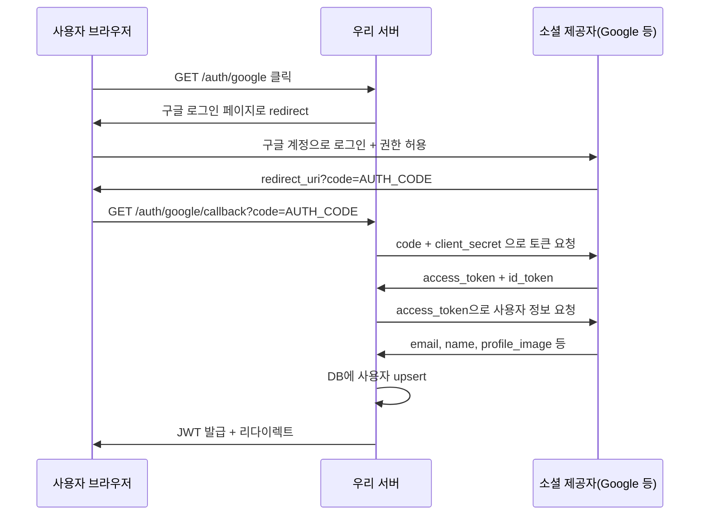

---
aliases:
  - Security
  - Session
  - JWT
  - OAuth
  - Auth
tags:
  - NestJS
related:
  - "[[00_JS_Ecosystem_HomePage]]"
  - "[[00_NestJS_Ecosystem_HomePage]]"
  - "[[Web_XSS_CSRF]]"
  - "[[Web_Cookie]]"
  - "[[NextJS_TokenStorage]]"
  - "[[NestJS_Auth]]"
---
# Auth_Concept — 인증 개념

> [!info] 
> 인증(Authentication) = "너 누구야?" 
>  인가(Authorization) = "너 이거 해도 돼?" 
>  소셜 로그인은 OAuth 2.0 프로토콜로 동작하고, 토큰 저장 방식은 JWT와 세션 중 하나를 고른다.

---

# 인증 vs 인가 ⭐️⭐️⭐️

|구분|의미|예시|
|---|---|---|
|인증 (Authentication)|신원 확인 — "이 사람이 맞는가"|로그인, OAuth, 지문|
|인가 (Authorization)|권한 확인 — "이 사람이 이 자원에 접근할 수 있는가"|RBAC, 관리자만 접근, 내 글만 수정|

```txt
인증이 먼저, 인가가 나중
로그인(인증) → "이 사람은 admin이다" → 관리자 페이지 접근 허용(인가)
```

---

# 로컬 인증 — ID / 비밀번호 ⭐️⭐️⭐️⭐️

```txt
흐름:
  ① 회원가입: 이메일 + 비밀번호 입력
  ② 서버: 비밀번호를 bcrypt로 해시 후 DB에 저장 (평문 저장 절대 금지)
  ③ 로그인: 이메일로 사용자 조회 → bcrypt.compare(입력비번, 해시) → 일치하면 토큰 발급
```

## 비밀번호 해싱 — bcrypt ⭐️⭐️⭐️⭐️

```typescript
import * as bcrypt from 'bcrypt';

// 회원가입 시 — 해시 생성
const saltRounds = 10;  // 해시 강도 (숫자가 클수록 느리고 안전)
const hash = await bcrypt.hash(plainPassword, saltRounds);
// DB에는 hash만 저장 — 원본 비밀번호는 어디에도 남기면 안 됨

// 로그인 시 — 검증
const isMatch = await bcrypt.compare(plainPassword, hashedFromDB);
// true → 로그인 허용 / false → 거부
```

```txt
bcrypt의 원리:
  단방향 해시 — 해시에서 원본을 역산할 수 없음
  같은 비밀번호도 매번 다른 해시를 만듦 (salt 때문에)
  → "비밀번호가 맞나?"는 compare로만 확인 가능

saltRounds = 10: 약 100ms — 로그인 1번에는 충분히 빠름, 무차별 대입은 느림
```

---

# OAuth 2.0 — 소셜 로그인의 원리 ⭐️⭐️⭐️⭐️

```txt
OAuth = "제3자 앱이 사용자 데이터에 접근할 수 있도록 허가하는 개방형 프로토콜"

핵심 개념:
  사용자가 우리 앱에 비밀번호를 직접 주지 않아도
  "구글이 대신 신원을 보증해줌"
  → 우리 서버는 구글로부터 "이 사용자가 인증됐다"는 확인을 받음
```

## Authorization Code Flow — 소셜 로그인 공통 흐름 ⭐️⭐️⭐️⭐️



```txt
핵심 단계 4개:
  ① 사용자를 소셜 제공자 로그인 페이지로 보냄
  ② 사용자가 허용하면 redirect_uri로 code(인가 코드)가 돌아옴
  ③ 서버가 code + client_secret으로 access_token 교환 (서버↔제공자, 사용자 관여 없음)
  ④ access_token으로 사용자 정보 조회 → DB upsert → 우리 JWT 발급

code는 단 한 번만 사용 가능, 수명이 짧음 (수분)
access_token은 제공자 API 호출에 쓰는 것 — 우리 서비스 인증에는 우리 JWT를 따로 발급
```

---

# JWT vs 세션 ⭐️⭐️⭐️⭐️

|구분|JWT|세션|
|---|---|---|
|상태 저장 위치|클라이언트(토큰 안에 정보 포함)|서버(세션 DB/메모리)|
|서버 상태|Stateless — 서버가 기억 안 해도 됨|Stateful — 서버가 세션 유지|
|검증 방법|서명 검증 (빠름)|DB 조회 (느릴 수 있음)|
|로그아웃|클라이언트에서 토큰 삭제 (서버 강제 무효화 어려움)|세션 삭제로 즉시 무효화|
|서버 확장|유리 (세션 공유 불필요)|서버 간 세션 공유 필요|

```txt
JWT 선택이 맞는 경우:
  REST API + 모바일 앱 조합
  여러 서버 인스턴스로 스케일아웃
  NestJS + Next.js 분리 구조 (우리 프로젝트)

세션 선택이 맞는 경우:
  서버사이드 렌더링 위주의 전통적 웹앱
  로그아웃 즉시 무효화가 중요한 경우 (금융 등)
  Redis 등으로 세션 공유 인프라가 있을 때
```

---

# 액세스 토큰 + 리프레시 토큰 ⭐️⭐️⭐️

```txt
액세스 토큰 (Access Token):
  API 호출에 쓰는 토큰 — Authorization: Bearer {token} 헤더
  수명이 짧음 (15분~1시간)
  탈취당해도 곧 만료됨

리프레시 토큰 (Refresh Token):
  액세스 토큰 재발급에만 쓰는 토큰
  수명이 김 (7일~30일)
  httpOnly 쿠키에 저장 (XSS 방어)
  → 리프레시 토큰으로 새 액세스 토큰 발급

흐름:
  액세스 토큰 만료 → /auth/refresh 요청 (리프레시 토큰 포함)
  서버: 리프레시 토큰 검증 → 새 액세스 토큰 발급
  클라이언트: 새 토큰으로 재요청
```

---

# 소셜 로그인 제공자 비교 ⭐️⭐️⭐️

|제공자|패키지|특이사항|
|---|---|---|
|Google|`passport-google-oauth20`|가장 표준적, 문서 풍부|
|Naver|`passport-naver-v2`|한국 전용, scope 제한적|
|Kakao|`passport-kakao`|kakao_account.email 경로 주의|
|Apple|전용 패키지 없음|JWT 직접 검증 방식, 이메일 숨기기 기능|

```txt
Apple Sign In의 특이점:
  다른 제공자와 달리 access_token으로 사용자 정보 API를 호출하지 않음
  대신 id_token(JWT)을 Apple의 공개키로 직접 검증해서 사용자 정보 추출
  사용자가 이메일 숨기기를 선택하면 릴레이 이메일(@privaterelay.appleid.com) 제공
  첫 로그인 시에만 이름 정보가 옴 — 이후 요청엔 없음 (DB에 저장해야 함)
```

---

# OAuth 앱 등록 — 공통 절차 ⭐️⭐️⭐️

```txt
각 제공자에서 공통으로 해야 하는 것:
  ① 개발자 콘솔에서 앱 등록
  ② Client ID + Client Secret 발급 → .env에 저장
  ③ redirect URI 등록 (콜백 URL)
     예: https://my-api.railway.app/auth/google/callback

redirect URI 규칙:
  개발: http://localhost:3000/auth/google/callback
  운영: https://api.example.com/auth/google/callback
  → 양쪽 다 등록해야 함 (콘솔에서 여러 개 등록 가능)

.env:
  GOOGLE_CLIENT_ID=...
  GOOGLE_CLIENT_SECRET=...
  GOOGLE_CALLBACK_URL=http://localhost:3000/auth/google/callback
```

---

# 한눈에

```txt
인증 vs 인가:
  Authentication  신원 확인 ("누구야")
  Authorization   권한 확인 ("이거 해도 돼?")

로컬 인증:
  비밀번호 → bcrypt.hash() → DB 저장
  로그인 → bcrypt.compare() → 일치하면 JWT 발급

OAuth 2.0 흐름 (소셜 로그인):
  ① /auth/google → 구글 로그인 페이지
  ② 사용자 허용 → redirect_uri?code=...
  ③ 서버: code + secret → access_token 교환
  ④ access_token → 사용자 정보 조회 → DB upsert → JWT 발급

JWT vs 세션:
  JWT     Stateless, 서버 확장 유리, 강제 만료 어려움
  세션    Stateful, 즉시 무효화 가능, 세션 공유 필요

액세스 + 리프레시:
  액세스  짧은 수명 (15분~1시간) — API 호출에 사용
  리프레시 긴 수명 (7~30일) — httpOnly 쿠키, 액세스 토큰 재발급에만

NestJS 구현 → [[NestJS_Auth]]
토큰 저장 위치 선택 → [[NextJS_TokenStorage]]
쿠키 보안 속성 → [[Web_Cookie]]
```