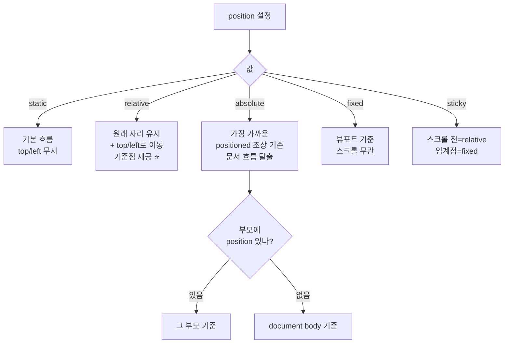

# CSS_Layout — 포지셔닝 · 레이아웃 · 인터랙션

>[!info]
> `position` · `z-index` · `display` · `pointer-events` · `cursor` · 선택자 패턴.
> 실전 코드에서 가장 자주 쓰이는 레이아웃·인터랙션 속성의 동작 원리.

---

# position ⭐️⭐️⭐️⭐️⭐️

## 5가지 비교

```txt
static   → 기본값. 위치 지정 속성(top/right/bottom/left) 무시
relative → 자기 자신의 원래 위치를 기준으로 이동. 공간은 그대로 차지
absolute → 가장 가까운 positioned 조상 기준으로 배치. 문서 흐름에서 빠짐
fixed    → 뷰포트(브라우저 창) 기준으로 고정. 스크롤해도 움직이지 않음
sticky   → 스크롤 전 = relative, 임계점 도달 = fixed처럼 달라붙음
```



```css
/* 부모 = relative, 자식 = absolute → 부모 안에 고정 배치 */
.parent {
  position: relative;   /* 기준점 역할 — 좌표 0,0이 여기 */
}
.child {
  position: absolute;
  top:   0.35rem;       /* 부모 위쪽 기준 */
  right: 0.4rem;        /* 부모 오른쪽 기준 */
  z-index: 3;
}
```

```txt
"positioned 조상" = position이 static이 아닌 (relative/absolute/fixed/sticky) 조상
→ absolute 자식을 특정 부모 안에 배치하려면 그 부모에 position: relative 필수

실전 패턴:
  카드 위에 뱃지·버튼 오버레이   → 카드: relative, 뱃지: absolute
  모달 배경(dim)                 → fixed, top:0, left:0, width:100%, height:100%
  헤더 고정                      → fixed, top:0
  섹션 제목 스크롤 달라붙기       → sticky, top:0
```

---

# z-index & stacking context ⭐️⭐️⭐️⭐️

```txt
z-index = 요소가 화면에서 쌓이는 순서 (높을수록 앞으로)
  기본값: auto (부모와 같은 레이어)
  숫자가 높을수록 위에 표시

z-index가 동작하려면:
  position: static이 아닌 값 (relative / absolute / fixed / sticky) 이어야 함
  또는 opacity < 1 / transform / filter / will-change가 있어도 stacking context 생성
```

```txt
Stacking Context (쌓임 맥락):
  독립된 레이어 평면을 만드는 것
  → 내부의 z-index는 외부와 비교되지 않음

  생성 조건:
    position + z-index(auto 아닌 값)
    opacity < 1
    transform 사용
    filter 사용
    isolation: isolate ← 명시적으로 context 생성

  실전 문제:
    모달(z-index: 1000)이 어떤 요소 뒤로 숨는다
    → 그 요소의 부모가 opacity나 transform으로 stacking context를 만들었기 때문
    → isolation: isolate로 context 분리하거나 구조를 변경
```

```css
/* 예: 캘린더 날짜 위 + 버튼 오버레이 */
.movie-calendar-day {
  position: relative;    /* absolute 자식의 기준 */
}
.movie-calendar-day-add {
  position: absolute;
  top: 0.35rem;
  right: 0.4rem;
  z-index: 3;            /* 날짜 숫자 위에 표시 */
}
```

---

# display: grid · flex — 중앙 정렬 패턴 ⭐️⭐️⭐️⭐️

## 한 줄 중앙 정렬

```css
/* place-items: center — grid에서 가로·세로 동시 중앙 정렬 */
.icon-wrapper {
  display: grid;
  place-items: center;   /* = align-items: center + justify-items: center */
}

/* flex에서 중앙 정렬 */
.icon-wrapper {
  display: flex;
  align-items: center;     /* 세로 중앙 */
  justify-content: center; /* 가로 중앙 */
}
```

```txt
place-items: center (grid) vs flex:
  아이콘·뱃지 등 단일 요소 중앙 → grid + place-items 한 줄로 간결
  여러 자식 요소 → flex + gap이 더 직관적

place-items 분해:
  place-items: <align-items> <justify-items>
  place-items: center        → align-items: center; justify-items: center;
  place-items: start end     → align-items: start; justify-items: end;

place-content (컨테이너 전체 기준):
  place-content: center → align-content + justify-content 동시
```

## grid vs flex 선택 기준

```txt
flex → 1차원 (행 OR 열)
  행 방향 아이콘 나열, 가로 네비게이션, 카드 한 줄 정렬

grid → 2차원 (행 AND 열)
  캘린더, 갤러리, 대시보드 레이아웃
  단일 요소 중앙 정렬도 grid + place-items가 간결

grid 단축:
  display: grid;
  place-items: center;     ← 자식 요소 중앙 정렬
  place-content: center;   ← 그리드 트랙 전체 중앙 정렬
```

---

# pointer-events ⭐️⭐️⭐️⭐️

```css
.overlay-badge {
  pointer-events: none;   /* 클릭·호버·터치 이벤트 무시 */
}
.overlay-badge {
  pointer-events: auto;   /* 기본값 — 이벤트 정상 수신 */
}
```

```txt
pointer-events: none 사용 상황:
  위에 떠있는 오버레이(뱃지, 라벨)가 아래 버튼 클릭을 막을 때
  → 뱃지: pointer-events: none → 클릭 이벤트가 뱃지를 통과해서 아래 버튼에 전달

  로딩 중 인터랙션 완전 차단
    .loading { pointer-events: none; opacity: 0.5; }

  SVG 내부 요소가 이벤트를 막을 때
    svg * { pointer-events: none; } → SVG 전체를 하나로 취급

실전 패턴 — 위 캘린더 예시:
  .movie-calendar-day-add {
    pointer-events: none;   ← 뱃지가 날짜 버튼 클릭을 막지 않게
  }
  → 날짜 버튼(.movie-calendar-day)의 클릭 이벤트는 정상 동작
```

---

# cursor ⭐️⭐️⭐️

```css
.button          { cursor: pointer;      } /* 손가락 — 클릭 가능 요소 */
.button:disabled { cursor: not-allowed;  } /* 금지 아이콘 — 비활성 상태 */
.text-select     { cursor: text;         } /* I-빔 — 텍스트 선택 가능 */
.drag-handle     { cursor: grab;         } /* 손 — 드래그 가능 */
.drag-handle:active { cursor: grabbing;  } /* 쥐는 손 — 드래그 중 */
.resize-col      { cursor: col-resize;   } /* 가로 리사이즈 */
.loading         { cursor: wait;         } /* 로딩 중 */
.no-interact     { cursor: default;      } /* 기본 화살표 */
```

```txt
not-allowed vs default:
  cursor: not-allowed → 사용자에게 "이건 안 됨"을 명시적으로 알림 (disabled 상태)
  cursor: default     → 단순히 기본 커서 (의미 전달 없음)

disabled 패턴 조합:
  button:disabled {
    cursor: not-allowed;
    opacity: 0.45;         ← 회색 처리로 시각적으로도 비활성 표현
    pointer-events: none;  ← 선택적: 이벤트까지 완전 차단
  }

주의:
  cursor: not-allowed + pointer-events: none → cursor가 보이지 않을 수 있음
  → cursor를 보여주려면 pointer-events: none 제거하고 JS로 이벤트 차단
```

---

# CSS 선택자 — 조건부 스타일 ⭐️⭐️⭐️⭐️

## :not() — 부정 선택자

```css
/* disabled가 아닌 버튼에만 hover 적용 */
.movie-calendar-day:not(:disabled):hover .movie-calendar-day-add {
  background: var(--lobby-gold, #d4b56a);
  color: #211f25;
}
```

```txt
:not(:disabled):hover 읽는 법:
  .movie-calendar-day → 이 요소가
  :not(:disabled)     → disabled 상태가 아니고
  :hover              → 호버 중일 때
  .movie-calendar-day-add → 그 안의 자식에 스타일 적용

:not()의 인수:
  :not(.class)         → 해당 클래스 없는 요소
  :not(:disabled)      → disabled 아닌 요소
  :not(:first-child)   → 첫 번째 자식 제외
  :not(.a, .b)         → a도 b도 아닌 요소 (modern CSS)
```

## 상태 선택자 조합

```css
/* 기본 상태 */
.btn { background: #333; }

/* hover — 마우스 올렸을 때 */
.btn:hover { background: #555; }

/* active — 클릭하는 순간 */
.btn:active { background: #111; }

/* focus — 키보드 포커스 */
.btn:focus-visible { outline: 2px solid var(--lobby-gold); }

/* disabled — 비활성 */
.btn:disabled {
  cursor: not-allowed;
  opacity: 0.45;
}

/* disabled일 때는 hover 스타일 제거 */
.btn:not(:disabled):hover { background: #555; }

/* checked — 체크박스·라디오 */
input:checked + label { color: var(--lobby-gold); }
```

## 자식·형제 선택자

```css
/* 자식 선택자 (직계 자식만) */
.card > .title { font-weight: 700; }

/* 후손 선택자 (깊이 무관) */
.card .title { font-weight: 700; }

/* 인접 형제 (바로 다음 요소) */
.label + .input { margin-top: 0.25rem; }

/* 일반 형제 (이후 모든 형제) */
.section ~ .section { border-top: 1px solid #333; }

/* 첫/마지막 자식 */
li:first-child { border-radius: 8px 8px 0 0; }
li:last-child  { border-radius: 0 0 8px 8px; }
li:not(:last-child) { border-bottom: 1px solid #333; }

/* n번째 자식 */
tr:nth-child(even) { background: rgb(255 255 255 / 0.03); }
tr:nth-child(2n+1) { background: rgb(255 255 255 / 0.06); }
```

---

# visibility · opacity · display 비교 ⭐️⭐️⭐️

```txt
                  공간 차지   렌더링   이벤트   transition 가능
display: none        ❌         ❌       ❌         ❌ (불가)
visibility: hidden   ✅         ✅       ❌         ✅ (가능)
opacity: 0           ✅         ✅       ✅         ✅ (가능)
```

```css
/* 페이드 인/아웃 애니메이션 → opacity + transition */
.tooltip {
  opacity: 0;
  visibility: hidden;          /* opacity:0 이어도 이벤트 막으려면 */
  transition: opacity 0.2s, visibility 0.2s;
}
.tooltip.visible {
  opacity: 1;
  visibility: visible;
}

/* display: none은 transition 불가 → 애니메이션이 필요하면 opacity 사용 */
```

---

# 캘린더 뱃지 코드 분석 — 전체 읽기

```css
/* 날짜 칸 전체 */
.movie-calendar-day {
  position: relative;    /* .movie-calendar-day-add의 absolute 기준 */
}

/* + 버튼 뱃지 (날짜 오른쪽 상단에 떠있음) */
.movie-calendar-day-add {
  position: absolute;    /* 부모(.movie-calendar-day) 기준으로 배치 */
  top:   0.35rem;        /* 위에서 0.35rem */
  right: 0.4rem;         /* 오른쪽에서 0.4rem */
  z-index: 3;            /* 날짜 숫자 위에 표시 */

  display: grid;
  place-items: center;   /* 안의 + 텍스트를 가로·세로 중앙 정렬 */

  width: 1.35rem;
  height: 1.35rem;
  border-radius: 50%;    /* 원형 */
  border: 1px solid rgb(212 181 106 / 0.7);   /* 골드 테두리 70% 투명도 */
  background: rgb(20 18 21 / 0.8);            /* 어두운 배경 80% 불투명 */
  color: var(--lobby-gold, #d4b56a);          /* CSS 변수, 폴백: #d4b56a */

  pointer-events: none;  /* 이 뱃지가 날짜 버튼 클릭을 막지 않게 */
}

/* disabled 아닌 날짜에 hover → 뱃지 색반전 */
.movie-calendar-day:not(:disabled):hover .movie-calendar-day-add {
  background: var(--lobby-gold, #d4b56a);
  color: #211f25;
}

/* disabled 날짜 */
.movie-calendar-day:disabled {
  cursor: not-allowed;   /* 금지 커서 */
  opacity: 0.45;         /* 흐리게 */
}
```

---

# linear-gradient — 배경 그라디언트 ⭐️⭐️⭐️⭐️

## 기본 문법

```css
/* linear-gradient(방향, 색상1, 색상2, ...) */
background: linear-gradient(180deg, #2b282b 0%, #17161a 100%);
/*
  180deg = 위→아래 (↓)
  0%  → #2b282b (시작 색)
  100%→ #17161a (끝 색)
*/

/* 방향 키워드 */
background: linear-gradient(to right,  #000, #fff);   /* 왼→오 (→) */
background: linear-gradient(to bottom, #000, #fff);   /* 위→아래 (↓) = 180deg */
background: linear-gradient(to top right, #000, #fff);/* 대각선 */
background: linear-gradient(145deg, #000, #fff);      /* 145도 */
```

## 색상 중간 정지점 (color stop)

```css
/* 투명→골드→투명 */
background: linear-gradient(
  90deg,
  transparent 0%,
  rgb(212 181 106 / 0.15) 50%,
  transparent 100%
);

/* 특정 구간에서만 색상 (hard stop) */
background: linear-gradient(
  180deg,
  #ff0000 0%,
  #ff0000 50%,   /* 50%까지 빨강 유지 */
  #0000ff 50%,   /* 50%부터 즉시 파랑 */
  #0000ff 100%
);
```

## 다중 배경 (multiple backgrounds)

```css
/*
  여러 background 레이어 → 쉼표로 구분
  앞에 있는 것이 위 레이어 (나중에 선언한 것이 아래)
*/
background:
  linear-gradient(145deg, rgb(212 181 106 / 0.08), transparent 35%),
  linear-gradient(180deg, #2b282b 0%, #17161a 100%);
/*
  위 레이어: 145도 골드빛 미세한 하이라이트 (8% 불투명, 35%까지만)
  아래 레이어: 위→아래 어두운 그라디언트 (기본 배경)
  
  읽는 법:
    첫 번째 gradient — 왼쪽 위에서 145도 방향으로 골드(8%) → 투명(35% 지점부터)
    두 번째 gradient — 위(#2b282b)에서 아래(#17161a)로 단순 어두운 그라디언트
    → 두 레이어가 겹쳐 "약간 빛나는 어두운 카드" 느낌
*/

/* 이미지 + gradient 조합 */
background:
  linear-gradient(to bottom, transparent 60%, rgb(0 0 0 / 0.8)),
  url('/movie-poster.jpg') center / cover no-repeat;
/* 포스터 이미지 위에 아래쪽 어둠 그라디언트 → 텍스트 가독성 */
```

---

# box-shadow — 그림자 ⭐️⭐️⭐️⭐️

## 문법

```css
/* box-shadow: x y blur spread color */
box-shadow: 0 1.5rem 4rem rgb(0 0 0 / 0.5);
/*
  x-offset:  0       (가로 이동 없음)
  y-offset:  1.5rem  (아래로 1.5rem)
  blur:      4rem    (흐림 반경)
  spread:    생략=0  (그림자 크기 확장 없음)
  color:     rgb(0 0 0 / 0.5) — 검정 50% 투명
*/
```

## inset — 내부 그림자

```css
box-shadow: inset 0 0 0 1px rgb(255 234 177 / 0.04);
/*
  inset  → 요소 안쪽으로 그림자
  x: 0, y: 0, blur: 0, spread: 1px
  → blur·offset 없이 spread만 → 테두리처럼 보임
  color: 밝은 골드빛 4% 불투명 → 미세한 내부 테두리 효과
*/
```

## 다중 그림자

```css
box-shadow:
  0 1.5rem 4rem rgb(0 0 0 / 0.5),      /* 외부 드롭 그림자 */
  inset 0 0 0 1px rgb(255 234 177 / 0.04);  /* 내부 미세 테두리 */
/*
  쉼표로 여러 그림자 겹치기 → 앞에 선언한 것이 위
  → 드롭 그림자 + 미세한 발광 테두리 조합
*/
```

## 자주 쓰는 패턴

```css
/* 카드 기본 그림자 */
box-shadow: 0 4px 16px rgb(0 0 0 / 0.12);

/* 호버 시 떠오르는 느낌 */
.card:hover {
  box-shadow: 0 12px 32px rgb(0 0 0 / 0.2);
  transform: translateY(-2px);
  transition: box-shadow 0.2s, transform 0.2s;
}

/* 버튼 눌림 효과 */
.btn:active {
  box-shadow: 0 1px 4px rgb(0 0 0 / 0.2);
  transform: translateY(1px);
}

/* 테두리 대신 shadow (border와 달리 레이아웃에 영향 없음) */
box-shadow: 0 0 0 1px rgb(255 255 255 / 0.1);   /* outline 효과 */
box-shadow: 0 0 0 2px var(--focus-ring);         /* focus ring */
```

---

# @media — 반응형 ⭐️⭐️⭐️⭐️

## 기본 문법

```css
/* max-width: 이 너비 이하일 때 */
@media (max-width: 30rem) {   /* 480px */
  .container { flex-direction: column; }
}

/* min-width: 이 너비 이상일 때 */
@media (min-width: 48rem) {   /* 768px */
  .sidebar { display: block; }
}

/* 범위 */
@media (min-width: 30rem) and (max-width: 60rem) {
  .card { grid-template-columns: repeat(2, 1fr); }
}
```

## 전략 — Mobile First vs Desktop First

```txt
Mobile First (권장):
  기본 스타일 = 모바일
  min-width media query로 큰 화면 확장
  → 브라우저가 필요한 스타일만 적용 (성능 유리)

Desktop First:
  기본 스타일 = 데스크탑
  max-width media query로 작은 화면 재정의
  → 기존 코드에 추가하는 방식 (레거시에 많음)
```

```css
/* Mobile First */
.grid {
  display: grid;
  grid-template-columns: 1fr;          /* 모바일: 1열 */
  gap: 1rem;
}
@media (min-width: 40rem) {            /* 640px 이상 */
  .grid { grid-template-columns: repeat(2, 1fr); }
}
@media (min-width: 64rem) {            /* 1024px 이상 */
  .grid { grid-template-columns: repeat(4, 1fr); }
}

/* Desktop First */
.grid {
  grid-template-columns: repeat(4, 1fr);  /* 데스크탑 기본 */
}
@media (max-width: 64rem) {
  .grid { grid-template-columns: repeat(2, 1fr); }
}
@media (max-width: 40rem) {
  .grid { grid-template-columns: 1fr; }
}
```

## 자주 쓰는 브레이크포인트 (rem 기준)

```txt
rem 사용 이유: 사용자 브라우저 글자 크기 설정을 존중 (16px 기본 가정)

  20rem  = 320px  — 매우 작은 모바일
  30rem  = 480px  — 소형 모바일
  40rem  = 640px  — 대형 모바일 / 소형 태블릿 (Tailwind sm)
  48rem  = 768px  — 태블릿 (Tailwind md)
  64rem  = 1024px — 소형 데스크탑 (Tailwind lg)
  80rem  = 1280px — 일반 데스크탑 (Tailwind xl)
  96rem  = 1536px — 대형 데스크탑 (Tailwind 2xl)
```

## 기타 미디어 특성

```css
/* 다크모드 */
@media (prefers-color-scheme: dark) {
  :root { --bg: #17161a; --text: #f0f0f0; }
}

/* 애니메이션 축소 요청 (접근성) */
@media (prefers-reduced-motion: reduce) {
  * { animation: none !important; transition: none !important; }
}

/* 인쇄 */
@media print {
  .no-print { display: none; }
  body { font-size: 12pt; color: black; }
}

/* hover 불가 장치 (터치스크린) */
@media (hover: none) {
  .hover-effect { display: none; }
}
```
