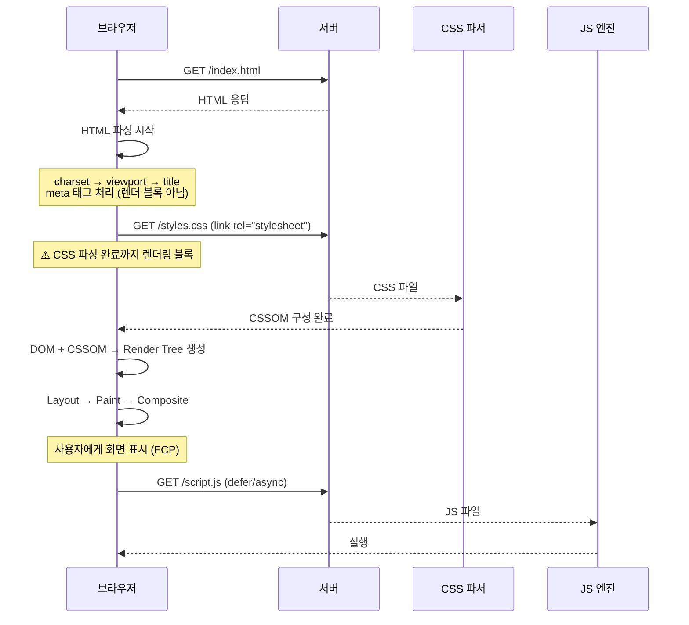

---
aliases:
  - head 태그
  - meta 태그
  - charset
  - viewport
  - Open Graph
  - og:
  - canonical
tags:
  - HTML
relations:
  - "[[00_JS_Ecosystem_HomePage]]"
  - "[[HTML_Semantics]]"
  - "[[NextJS_Metadata]]"
---
# HTML_Head_Meta — head · meta 태그

>[!info]
> `<head>`는 브라우저·검색엔진·SNS가 읽는 "페이지 자체에 대한 정보" 영역.
> 화면에는 렌더링되지 않지만 탭 제목·SEO·공유 미리보기·인코딩·뷰포트를 결정.
> Next.js에서는 `export const metadata`로 이 영역을 선언적으로 관리 → [[NextJS_Metadata]]

---

# `<head>` 기본 구조 ⭐️⭐️⭐️⭐️

```html
<!DOCTYPE html>
<html lang="ko">
<head>
  <!-- 1. 인코딩 — 반드시 첫 번째 -->
  <meta charset="UTF-8" />

  <!-- 2. 뷰포트 — 반드시 두 번째 -->
  <meta name="viewport" content="width=device-width, initial-scale=1.0" />

  <!-- 3. 탭 제목 -->
  <title>CINEMO — 영화관 로비 소셜</title>

  <!-- 4. SEO 설명 -->
  <meta name="description" content="영화관 로비 소셜 — 매표소 · 뽑기 · 후기방" />

  <!-- 5. 스타일시트 -->
  <link rel="stylesheet" href="/styles/global.css" />

  <!-- 6. 파비콘 -->
  <link rel="icon" href="/favicon.ico" />

  <!-- 7. OG (소셜 공유) -->
  <meta property="og:title" content="CINEMO" />
  <meta property="og:description" content="영화관 로비 소셜" />
  <meta property="og:image" content="https://cinemo.example.com/og.png" />

  <!-- 8. 정규 URL -->
  <link rel="canonical" href="https://cinemo.example.com" />
</head>
<body>
  ...
</body>
</html>
```

```txt
순서가 중요한 이유:
  charset → 브라우저가 이후 태그를 올바르게 파싱하려면 가장 먼저 필요
  viewport → 레이아웃 계산 전에 필요
  나머지 → 순서 자유롭지만 관례상 title → description → 리소스 순
```

---

# 필수 메타 태그 ⭐️⭐️⭐️⭐️

## charset

```html
<meta charset="UTF-8" />
```

```txt
UTF-8: 전 세계 문자 지원 (한글 포함)
없으면: 한글·특수문자가 깨져서 보임
위치: <head>의 첫 번째 — 이 태그 이전에 나오는 텍스트는 잘못 파싱될 수 있음
```

## viewport

```html
<meta name="viewport" content="width=device-width, initial-scale=1.0" />
```

```txt
width=device-width    → CSS 픽셀 너비 = 디바이스 너비
initial-scale=1.0     → 초기 줌 배율 (1 = 100%)

없으면:
  모바일 브라우저가 데스크탑 사이트라고 가정 → 980px로 렌더링 후 축소
  → 텍스트가 아주 작게 보임
  → 미디어쿼리가 의도대로 동작 안 함
```

## title

```html
<title>후기방 | CINEMO</title>
```

```txt
브라우저 탭 이름
구글 검색 결과 파란 제목 링크
페이지마다 고유해야 SEO에 유리
권장 길이: 50~60자

패턴: "페이지명 | 사이트명"
  후기방 | CINEMO
  React 상태 관리 | 공이의 노트
```

## description

```html
<meta name="description" content="영화관 로비 소셜 — 매표소 · 뽑기 · 후기방" />
```

```txt
구글 검색 결과 제목 아래 회색 설명 텍스트
클릭률(CTR)에 직접 영향
권장 길이: 120~160자 (초과하면 "..." 잘림)

구글이 항상 이 텍스트를 쓰는 건 아님:
  페이지 본문에서 더 적합한 텍스트를 자동 추출하기도 함
  → 그래도 description은 항상 작성 (fallback 역할)
```

---

# Open Graph (OG) — 소셜 공유 미리보기 ⭐️⭐️⭐️⭐️

```html
<!-- 필수 4개 -->
<meta property="og:title"       content="CINEMO — 영화관 로비 소셜" />
<meta property="og:description" content="매표소 · 뽑기 · 후기방" />
<meta property="og:image"       content="https://cinemo.example.com/og.png" />
<meta property="og:url"         content="https://cinemo.example.com" />

<!-- 권장 추가 -->
<meta property="og:type"        content="website" />   <!-- website | article | video -->
<meta property="og:site_name"   content="CINEMO" />
<meta property="og:locale"      content="ko_KR" />

<!-- 이미지 크기 (카카오·슬랙 최적화) -->
<meta property="og:image:width"  content="1200" />
<meta property="og:image:height" content="630" />
<meta property="og:image:alt"    content="CINEMO 로비 화면" />
```

```txt
카카오톡·슬랙·트위터·페이스북에 링크를 공유했을 때 나오는 미리보기 카드
og:image 권장 크기: 1200 × 630px (2:1 비율)
og:image는 반드시 절대 URL (https://...)

og:type:
  website → 일반 페이지
  article → 블로그 글·뉴스 (publishedTime, author 추가 가능)
  video   → 동영상 콘텐츠
```

```txt
트위터(X) 카드 — OG와 별도 네임스페이스:
  <meta name="twitter:card"        content="summary_large_image" />
  <meta name="twitter:title"       content="CINEMO" />
  <meta name="twitter:description" content="영화관 로비 소셜" />
  <meta name="twitter:image"       content="https://cinemo.example.com/og.png" />

twitter:card 종류:
  summary              → 작은 썸네일 + 텍스트
  summary_large_image  → 큰 이미지 카드 (권장)
  player               → 동영상 플레이어 내장
```

---

# `<link>` 태그 ⭐️⭐️⭐️

## rel 값 비교

|rel 값|용도|
|---|---|
|`stylesheet`|CSS 파일 로드|
|`icon`|파비콘 (탭 아이콘)|
|`apple-touch-icon`|iOS 홈화면 아이콘|
|`canonical`|정규 URL 지정 (중복 페이지 처리)|
|`preload`|리소스 미리 로드 (폰트, 이미지)|
|`preconnect`|외부 도메인과 미리 연결 (Google Fonts 등)|
|`alternate`|다국어 페이지 연결|
|`manifest`|PWA manifest.json|

```html
<!-- 파비콘 여러 크기 -->
<link rel="icon" href="/favicon.ico" sizes="any" />
<link rel="icon" href="/icon.svg" type="image/svg+xml" />
<link rel="apple-touch-icon" href="/apple-touch-icon.png" />

<!-- canonical — 중복 콘텐츠 처리 -->
<link rel="canonical" href="https://cinemo.example.com/posts/1" />
<!-- 같은 콘텐츠가 여러 URL로 접근 가능할 때 (쿼리스트링 등) 
     어느 URL이 "진짜"인지 검색엔진에 알려줌 -->

<!-- preconnect — Google Fonts 성능 최적화 -->
<link rel="preconnect" href="https://fonts.googleapis.com" />
<link rel="preconnect" href="https://fonts.gstatic.com" crossorigin />

<!-- preload — 폰트 미리 로드 -->
<link rel="preload" href="/fonts/Pretendard.woff2" as="font" type="font/woff2" crossorigin />
```

---

# robots — 검색엔진 크롤링 제어 ⭐️⭐️⭐️

```html
<!-- 색인 허용 (기본값) -->
<meta name="robots" content="index, follow" />

<!-- 색인 금지 (관리자 페이지, 로그인 후 페이지 등) -->
<meta name="robots" content="noindex, nofollow" />

<!-- 색인은 하되 링크는 추적 안 함 -->
<meta name="robots" content="index, nofollow" />
```

```txt
index  → 검색 결과에 이 페이지 표시 여부
follow → 이 페이지의 링크를 크롤러가 따라갈지 여부

noindex 사용 상황:
  로그인 필요 페이지 (/dashboard, /profile)
  관리자 페이지
  개발·스테이징 환경
  검색 결과 페이지 (내부 검색 → 검색엔진 색인 불필요)
```

---

# 브라우저가 head를 처리하는 방식 ⭐️⭐️⭐️



```txt
렌더 블록 리소스:
  <link rel="stylesheet"> → CSS 파싱 끝나야 렌더링 시작
  <script> (async/defer 없으면) → 파싱 멈추고 다운로드·실행

성능 최적화:
  CSS → <head>에 (render block이지만 FOUC 방지)
  JS  → <body> 마지막 또는 <script defer>
  폰트 → <link rel="preload"> 또는 font-display: swap
```

---

# HTML head vs Next.js Metadata ⭐️⭐️⭐️⭐️

```txt
HTML 직접 작성:
  <head>를 직접 편집
  페이지마다 수동 복붙 → 실수 위험, DRY 위반

Next.js App Router → [[NextJS_Metadata]]:
  export const metadata = { title: '...' }
  → Next.js가 <head>에 자동으로 주입
  → template 패턴으로 " | 사이트명" 자동 붙이기
  → generateMetadata()로 DB 데이터 기반 동적 생성

대응 관계:
  HTML <title>                     → metadata.title
  HTML <meta name="description">   → metadata.description
  HTML <meta property="og:*">      → metadata.openGraph
  HTML <meta name="twitter:*">     → metadata.twitter
  HTML <link rel="canonical">      → metadata.alternates.canonical
  HTML <meta name="robots">        → metadata.robots
  HTML <link rel="icon">           → metadata.icons (또는 파일 기반)
```
