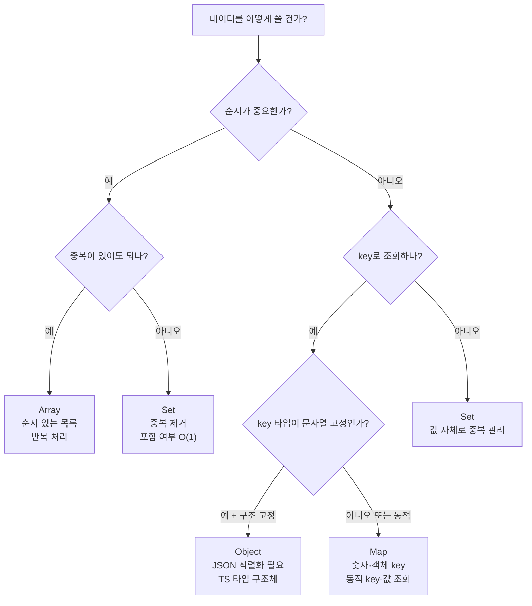

# JS_Algorithm_Concept — 알고리즘·자료구조 기초

> [!info]
> `JS_AlgorithmPatterns` 의 전 단계 — "왜 이 코드가 빠른가/느린가"를 이해하기 위한 기초 개념.
> 알고리즘, 자료구조, 탐색 방식, 자료구조 선택 기준을 정리함.

---

# 알고리즘이란 ⭐️⭐️⭐️

```txt
알고리즘(Algorithm) = 특정 문제를 해결하기 위한 단계적 절차

  입력(Input) → [알고리즘] → 출력(Output)

  예시: "배열에서 특정 값 찾기"
    절차 1: 첫 번째 요소부터 시작
    절차 2: 목표값과 같으면 반환
    절차 3: 다르면 다음 요소로
    절차 4: 끝까지 없으면 -1 반환
  → 이 절차 자체가 알고리즘 (선형 탐색)

왜 알고리즘을 신경 쓰나:
  데이터가 100개일 때는 어떤 방법이든 빠름
  데이터가 100,000개가 되면 잘못된 방법은 수십 배 느려짐
  → 알고리즘 = 데이터 규모가 커져도 버티는 방법 선택
```

---

# 자료구조란 ⭐️⭐️⭐️

```txt
자료구조(Data Structure) = 데이터를 어떤 형태로 저장하느냐

  같은 데이터라도 어떤 자료구조에 담느냐에 따라
  조회·삽입·삭제의 속도가 달라짐

  예: 영화 100만 편 중 특정 영화 찾기
    배열(Array) → 처음부터 하나씩 비교 → 최대 100만 번
    Map         → 해시로 위치 직접 계산 → 1번
```

---

# JS 자료구조 선택 기준 ⭐️⭐️⭐️⭐️⭐️

## Array · Object · Map · Set 비교

| 자료구조 | 내부 구조 | key 타입 | 순서 보장 | 언제 쓰나 |
|---|---|---|---|---|
| `Array` | 인덱스 기반 | 숫자(index) | ✅ 삽입 순서 | 순서 있는 목록, 반복 처리 |
| `Object` | 해시 테이블 | 문자열·Symbol | ❌(ES2015+ 일부 보장) | 고정 키 구조체, JSON 직렬화 |
| `Map` | 해시 테이블 | **어떤 타입도 가능** | ✅ 삽입 순서 | 동적 키-값 조회, 빈번한 추가·삭제 |
| `Set` | 해시 테이블 | — (값 자체가 키) | ✅ 삽입 순서 | 중복 제거, 포함 여부 확인 |

## Object vs Map — 실무 선택 기준

```txt
Object 선택:
  키가 문자열이고 컴파일 타임에 확정됨
  JSON 직렬화/역직렬화 필요 (Map은 JSON.stringify 안 됨)
  TypeScript 타입으로 구조가 고정됨
  → { name: string; age: number } 같은 데이터 구조

Map 선택:
  키가 숫자, 객체 참조 등 문자열 이외의 타입
  키가 런타임에 동적으로 결정됨
  크기를 자주 확인해야 함 (map.size vs Object.keys(obj).length)
  반복 중 추가·삭제가 일어남
  → tmdbId(number) → title 같은 런타임 조회 테이블
```

```typescript
// Object — 고정 구조
const user = { id: 1, name: 'Alice', role: 'admin' };

// Map — 동적 키-값
const titleMap = new Map<number, string>();
titleMap.set(1234, 'Inception');
titleMap.get(1234);   // 'Inception'
titleMap.size;        // 1
```

## Set — 중복 제거 & 포함 여부

```typescript
// 중복 제거
const ids = [1, 2, 2, 3, 3, 3];
const unique = [...new Set(ids)];  // [1, 2, 3]

// 포함 여부 — O(1)
const allowed = new Set(['admin', 'manager']);
allowed.has('admin');   // true  — O(1)
allowed.has('guest');   // false — O(1)

// 배열 .includes() 와 차이:
// Array.includes()   → O(n) 선형 탐색
// Set.has()          → O(1) 해시 조회
```

---

# 탐색 방식 — 선형 탐색 vs 해시 탐색 ⭐️⭐️⭐️⭐️

## 선형 탐색 (Linear Search)

```txt
앞에서부터 하나씩 비교하며 찾음

  [10, 20, 30, 40, 50] 에서 40 찾기
  10 비교 → 다름
  20 비교 → 다름
  30 비교 → 다름
  40 비교 → 찾음! (4번)

  최선: 첫 번째에 있으면 1번
  최악: 마지막에 있거나 없으면 n번
  → O(n)

JS에서 선형 탐색하는 것들:
  Array.find()
  Array.findIndex()
  Array.includes()
  Array.indexOf()
  for/for...of 루프
```

## 해시 탐색 (Hash Lookup)

```txt
key를 해시 함수로 변환 → 저장 위치를 직접 계산

  Map { 1234 → 'Inception', 5678 → 'Dune' }

  map.get(1234) 호출 시:
  1. hash(1234) → 버킷 위치 3번 계산
  2. 3번 버킷 접근 → 'Inception' 반환
  → 몇 개가 있든 항상 1번

  → O(1)

JS에서 해시 탐색하는 것들:
  Map.get(key)
  Map.has(key)
  Set.has(value)
  Object[key] 접근 (단, 문자열 key)
```

## 두 탐색의 실전 차이

```typescript
const movies = [
  { tmdbId: 1234, title: 'Inception' },
  { tmdbId: 5678, title: 'Dune' },
  // ... 500개
];

// ❌ 선형 탐색 — O(n)
const movie = movies.find(m => m.tmdbId === 1234);

// ✅ 해시 탐색 — O(1) (전처리 필요)
const map = new Map(movies.map(m => [m.tmdbId, m.title]));
const title = map.get(1234);

// 단 한 번만 조회하면 → 그냥 .find() 써도 됨
// 반복문 안에서 여러 번 조회하면 → 반드시 Map 전처리
```

---

# 자료구조 선택 흐름도 ⭐️⭐️⭐️⭐️



---

# 연관 노트

```txt
Big O 시간복잡도 + 실전 코드 패턴 → [[JS_AlgorithmPatterns]]
Map 조회 캐시 패턴 실전 예제    → [[JS_AlgorithmPatterns]] "시간 복잡도" 섹션
JS 코드 설계 패턴 모음          → [[JS_Patterns]]
```
