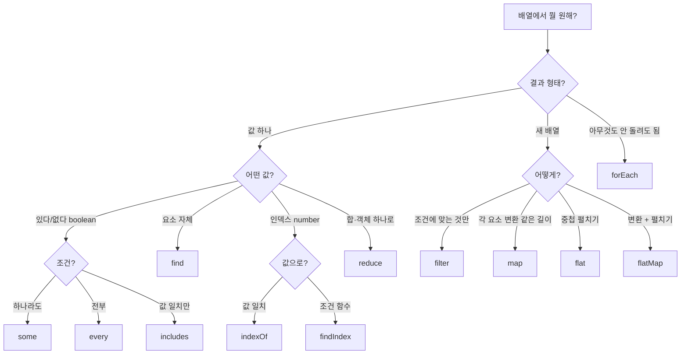

---
aliases:
  - array methods
  - Array.from
  - filter
  - forEach
  - map
  - reduce
tags:
  - JavaScript
related:
  - "[[00_JS_Ecosystem_HomePage]]"
  - "[[JS_Loops_Conditionals]]"
  - "[[JS_Map_Set]]"
  - "[[JS_Object_Methods]]"
  - "[[JS_Operators]]"
  - "[[JS_Primitive_Methods]]"
  - "[[JS_Promise]]"
  - "[[NextJS_ApiTypes_Mapper]]"
  - "[[TS_Type_Guards]]"
---
# JS_Array_Methods — 배열 메서드

> [!info] 
> 배열 메서드를 고를 때 핵심 질문 하나: "결과가 **값(불린/숫자)** 이 필요한가, **새 배열**이 필요한가?"
>  변환이 아니라 검사만 필요하면 `some`/`every`/`find`, 새 배열이 필요하면 `filter`/`map`.

---
# 흐름도



---

# 한눈에 — 언제 뭘 쓰는가 ⭐️⭐️⭐️⭐️️

|메서드|하는 일|반환|언제|
|---|---|---|---|
|`some`|하나라도 조건 맞는 게 있나?|`boolean`|존재 여부 확인|
|`every`|전부 다 조건에 맞나?|`boolean`|전체 검증|
|`find`|앞에서 첫 번째 일치 항목|요소 or `undefined`|특정 항목 꺼내기|
|`findLast`|뒤에서 첫 번째 일치 항목 (ES2023)|요소 or `undefined`|마지막 일치 항목|
|`findIndex`|앞에서 첫 번째 일치 인덱스|`number` (-1이면 없음)|위치 찾기|
|`findLastIndex`|뒤에서 첫 번째 일치 인덱스 (ES2023)|`number` (-1이면 없음)|마지막 위치|
|`filter`|조건 맞는 것만 골라내|새 배열|목록 필터링·제거|
|`map`|각 요소를 변환|새 배열 (같은 길이)|형태 변환|
|`reduce`|배열 → 값 하나로 축약|누적값|합계·그룹핑|
|`includes`|이 값이 배열에 있나?|`boolean`|원시값 존재 확인|
|`indexOf`|이 값의 인덱스|`number` (-1이면 없음)|원시값 위치|
|`sort`|비교 함수로 정렬 (원본 변경)|원본 배열|정렬 (복사 후 사용 권장)|
|`flatMap`|map 후 flat|새 배열|1:N 변환|
|`forEach`|각 요소에 부수효과|`undefined`|반복 실행|


---
# 조건 함수 (Predicate) — return true/false의 의미 ⭐️⭐️⭐️⭐️

```txt
filter / some / find / every 에 넘기는 함수를 "조건 함수(predicate)"라고 함
이 함수가 true를 반환하면 "이 요소는 조건에 맞음"
이 함수가 false를 반환하면 "이 요소는 조건에 안 맞음"

filter  → true인 요소만 남김
some    → 하나라도 true면 전체 true 반환
find    → 처음으로 true가 된 요소 반환
every   → 전부 true여야 true 반환
```

## early return 패턴 분석 ⭐️⭐️⭐️⭐️

```typescript
function matchesQuery(room: ApiRoom, raw: string): boolean {
  const q = raw.trim().replace(/^#/, '').toLowerCase();

  if (!q) return true;
  //  ↑ q가 빈 문자열이면 → 검색어 없음 → 모든 방이 조건에 맞음 → true

  if (room.name.toLowerCase().includes(q)) return true;
  //  ↑ 방 이름에 검색어가 있으면 → 조건에 맞음 → true (이후 검사 불필요)

  return room.topicTags.some((t) =>
    t.replace(/^#/, '').toLowerCase().includes(q),
  );
  //  ↑ 태그 중 하나라도 검색어 포함 → true / 없으면 → false
  //  즉, 이 return은 true일 수도 false일 수도 있음
}

// 사용: filter에 넘겨서 조건에 맞는 방만 추출
rooms.filter((room) => matchesQuery(room, searchQuery));
```


```txt
각 return 이 뜻하는 것:

  if (!q) return true
    q = '' 또는 ' ' (빈 문자열/공백) → trim() 후 비어있음
    검색어가 없으면 → 전부 보여줘야 함 → "이 방은 조건에 맞음"(true)
    → filter에서 모든 방이 통과됨

  if (room.name.includes(q)) return true
    이름에 검색어가 있으면 이미 답이 나옴 → "맞음"(true) 바로 반환
    태그까지 검사할 필요 없음 → 조기 반환(early return)으로 불필요한 연산 생략

  return room.topicTags.some(...)
    여기까지 온 것 = 이름에는 없었음
    태그 중에서 하나라도 일치하면 → some이 true 반환 → matchesQuery도 true
    태그도 전부 불일치 → some이 false 반환 → matchesQuery도 false
    즉, 이 한 줄이 "맞음/안 맞음" 두 경우를 모두 처리

!q:
  q는 string — 빈 문자열('')은 falsy
  !q = !'hello' → false (검색어 있음)
  !q = !''      → true  (검색어 없음)
  → [[JS_Truthy_Falsy]] 참고
```

## early return 읽는 법

```typescript
function predicate(item): boolean {
  if (확실히 맞는 조건) return true;   // 답이 나왔으니 즉시 종료
  if (확실히 맞는 조건) return true;   // 또 다른 케이스
  return 마지막_판단;                  // 여기까지 오면 마지막 조건으로 결정
  //     ↑ true 또는 false 둘 다 가능
}
```

```txt
왜 early return을 쓰는가:
  답이 확실한 순간 바로 반환 → 이후 검사를 안 해도 됨
  코드가 위에서 아래로 읽히며 "이 경우엔 맞음, 저 경우엔 맞음, 그 외엔..." 구조
  else 중첩 없이 평평하게 읽힘

  // early return 없는 버전 — 읽기 어려움
  if (!q) {
    return true;
  } else if (room.name.includes(q)) {
    return true;
  } else {
    return room.topicTags.some(...);
  }
```


---

# some vs filter — 가장 헷갈리는 구분 ⭐️⭐️⭐️⭐️

```txt
some   → "이런 게 하나라도 있나?" → true / false  (불린만 필요할 때)
filter → "조건 맞는 것만 골라내" → 새 배열       (항목들이 필요할 때)
```

```typescript
const messages = [{ id: '1' }, { id: '2' }, { id: '3' }];

// some — 존재 여부만 알면 됨 (배열 안 만듦)
const hasMessage = messages.some((m) => m.id === '2');  // true

// filter — 나머지를 새 배열로 (삭제 패턴)
const without2 = messages.filter((m) => m.id !== '2');  // [{ id: '1' }, { id: '3' }]
```

## 실전 — 중복 방지 (some) ⭐️⭐️⭐️⭐️

```typescript
// REST 응답 + 소켓 echo로 같은 메시지가 두 번 올 수 있는 상황
const appendMessage = useCallback((message: ApiRoomMessage) => {
  setMessages((prev) => {
    if (prev.some((m) => m.id === message.id)) return prev;  // 이미 있으면 그대로
    return [...prev, message];                                 // 없으면 추가
  });
}, []);
```

```txt
some을 쓰는 이유:
  "이미 있나?"라는 불린 질문이기 때문
  있으면 prev를 그대로 반환 (배열 자체가 필요하지 않음)
  없으면 뒤에 추가

filter로 하면 안 되는 이유:
  filter는 새 배열을 만드는 것 — 여기선 배열이 필요한 게 아님
  "있나 없나"를 알고 싶은 것 → some이 정확한 선택

조기 종료(early exit):
  some은 조건을 만족하는 항목을 찾는 순간 나머지 순회를 멈춤
  filter는 무조건 전체를 순회해야 함
  → 긴 배열에서 존재 확인은 some이 성능상 유리
```

## 실전 — 삭제 (filter) ⭐️⭐️⭐️⭐️

```typescript
// 소켓으로 삭제 이벤트가 왔을 때 목록에서 제거
setMessages((prev) =>
  prev.filter((m) => m.id !== deletedId)   // 조건 반대 — 제외할 것을 걸러냄
);
```

```txt
filter를 쓰는 이유:
  삭제 = "이 항목 빼고 나머지 전부" → 새 배열이 필요
  "있나 없나"가 아니라 "나머지 배열" 자체가 목적

  filter의 조건 방향:
    남길 것  →  조건을 긍정으로  (m.id === targetId 아닌 것 빼고 남기면)
    제거할 것 →  조건을 부정으로  (m.id !== deletedId)
```

---

# some / every ⭐️⭐️⭐️

```typescript
const nums = [1, 2, 3, 4, 5];

nums.some((n) => n > 3)    // true  — 4, 5 중 하나라도 > 3
nums.every((n) => n > 0)   // true  — 전부 > 0
nums.every((n) => n > 3)   // false — 1,2,3은 아님

// 실전
const hasUnread = messages.some((m) => !m.isRead);
const allSent   = messages.every((m) => m.status === 'sent');
```

```txt
some  → OR 논리 (하나라도 맞으면 true)
every → AND 논리 (모두 맞아야 true)

빈 배열에서:
  [].some(...)  → false (하나도 없으니 당연히 false)
  [].every(...) → true  (반례가 없으니 true — 빈 배열의 전체 검증은 참)
```

---

# find / findIndex ⭐️⭐️⭐️

```typescript
const users = [
  { id: 1, name: '홍길동' },
  { id: 2, name: '김철수' },
];

users.find((u) => u.id === 2)       // { id: 2, name: '김철수' }
users.find((u) => u.id === 99)      // undefined
users.findIndex((u) => u.id === 2)  // 1
users.findIndex((u) => u.id === 99) // -1
```

```txt
find vs filter:
  find   → 첫 번째 항목 하나만 (없으면 undefined)
  filter → 조건 맞는 전부 (없으면 빈 배열)

  "특정 항목 꺼내기" → find
  "조건 맞는 항목들 모두" → filter
```

---
# find / findIndex / findLast / findLastIndex ⭐️⭐️

```typescript
const users = [
  { id: 1, name: '홍길동' },
  { id: 2, name: '김철수' },
  { id: 3, name: '홍길순' },
];

// find — 앞에서부터 첫 번째 일치
users.find((u) => u.name.startsWith('홍'))       // { id: 1, name: '홍길동' }
users.find((u) => u.id === 99)                    // undefined

// findIndex — 앞에서부터 첫 번째 인덱스
users.findIndex((u) => u.name.startsWith('홍'))  // 0
users.findIndex((u) => u.id === 99)              // -1

// findLast — 뒤에서부터 첫 번째 일치 (ES2023)
users.findLast((u) => u.name.startsWith('홍'))   // { id: 3, name: '홍길순' }

// findLastIndex — 뒤에서부터 첫 번째 인덱스 (ES2023)
users.findLastIndex((u) => u.name.startsWith('홍')) // 2
```


```txt
find vs findLast:
  find      앞(인덱스 0)에서 시작 → 첫 번째 일치 항목
  findLast  뒤(마지막 인덱스)에서 시작 → 마지막 일치 항목

언제 findLast가 필요한가:
  배열이 시간순으로 정렬돼 있을 때 "가장 최근에 조건을 만족한 항목"
  메시지 목록에서 "마지막 추천 메시지"
  이벤트 로그에서 "가장 마지막 실패 이벤트"
```

## 실전 — 메시지 목록에서 마지막 항목 찾기

```typescript
// 채팅 메시지 중 가장 최근 추천 메시지 꺼내기
const lastRec = messages.findLast(
  (m) => m.type === 'recommendation' && m.recommendation,
)?.recommendation;

// 옵셔널 체이닝: findLast가 undefined를 반환하면 .recommendation 접근 안 함
const nowPlaying = lastRec
  ? { title: lastRec.title, artist: lastRec.artist }
  : null;
```

```txt
findLast 브라우저/Node 지원:
  ES2023 — Node.js 20+, Chrome 97+, Safari 15.4+
  (구형 환경이라면 [...arr].reverse().find(...) 으로 대체 가능)

  대안:
  messages.slice().reverse().find((m) => m.type === 'recommendation')
  → slice()로 복사 후 reverse() (원본 보존) → find
  → findLast가 없는 환경에서 동일한 동작
```
---

# filter ⭐️⭐️⭐️⭐️

```typescript
const nums    = [1, 2, 3, 4, 5];
const evens   = nums.filter((n) => n % 2 === 0);          // [2, 4]
const gt3     = nums.filter((n) => n > 3);                 // [4, 5]

// 객체 배열
const active  = users.filter((u) => u.isActive);
const admins  = users.filter((u) => u.role === 'admin');

// null/undefined 제거
const values  = [1, null, 2, undefined, 3];
const cleaned = values.filter((v) => v !== null && v !== undefined);
// 또는 타입 서술어로 → [[TS_Type_Guards]]
const cleaned = values.filter((v): v is number => v !== null && v !== undefined);
```

---

# map ⭐️⭐️⭐️⭐️

```typescript
const nums   = [1, 2, 3];
const doubled = nums.map((n) => n * 2);          // [2, 4, 6]

// 객체 변환
const names   = users.map((u) => u.name);        // ['홍길동', '김철수']
const dtos    = users.map((u) => toUserDto(u));  // 형태 변환
```

```txt
map vs forEach:
  map     → 변환된 새 배열 반환 (원본 유지)
  forEach → 반환값 없음, 부수효과만

  값이 필요하면 map / 부수효과(로깅, DOM 조작)만 필요하면 forEach
```

---

# forEach ⚠️ async와 함께 쓰면 안 됨 ⭐️⭐️⭐️

```typescript
// ❌ forEach + async — await를 기다리지 않음
users.forEach(async (user) => {
  await sendEmail(user.email);  // 완료를 기다리지 않고 다음으로 넘어감
});

// ✅ for...of — 순서대로 기다림
for (const user of users) {
  await sendEmail(user.email);
}

// ✅ Promise.all — 전부 동시에 실행
await Promise.all(users.map((user) => sendEmail(user.email)));
```

---

# reduce ⭐️⭐️⭐️

```typescript
const nums = [1, 2, 3, 4, 5];

// 합계
const sum = nums.reduce((acc, n) => acc + n, 0);  // 15

// 배열 → 객체 (그룹핑)
const byRole = users.reduce<Record<string, User[]>>((acc, user) => {
  (acc[user.role] ??= []).push(user);
  return acc;
}, {});
// { admin: [...], user: [...] }

// 배열 → Map
const userMap = users.reduce((map, user) => {
  map.set(user.id, user);
  return map;
}, new Map<string, User>());
```

---

# flat / flatMap ⭐️⭐️

```typescript
const nested = [[1, 2], [3, 4], [5]];
nested.flat()     // [1, 2, 3, 4, 5]
nested.flat(2)    // 2단계 중첩까지 펼치기

// flatMap = map + flat(1)
const sentences = ['hello world', 'foo bar'];
sentences.flatMap((s) => s.split(' '));  // ['hello', 'world', 'foo', 'bar']
```

---
# sort — 비교 함수 규칙 ⭐️⭐️⭐️⭐️

```typescript
arr.sort((a, b) => 비교값);
```

|반환값|의미|결과|
|---|---|---|
|음수 (`-1`)|a가 b보다 앞|a → b 순서 유지|
|양수 (`1`)|a가 b보다 뒤|b → a 순서로 바꿈|
|`0`|순서 무관|현재 순서 유지|


```txt
외우는 법:
  "a - b" → 오름차순 (작은 것이 앞)
  "b - a" → 내림차순 (큰 것이 앞)

  음수가 나오면 a가 앞 → a < b 일 때 a가 앞 → 오름차순
```

## 숫자 정렬

```typescript
const nums = [3, 1, 4, 1, 5, 9, 2, 6];

nums.sort((a, b) => a - b);  // [1, 1, 2, 3, 4, 5, 6, 9]  오름차순
nums.sort((a, b) => b - a);  // [9, 6, 5, 4, 3, 2, 1, 1]  내림차순
```

## 날짜/시간 정렬

```typescript
// 오래된 순 (오름차순)
messages.sort((a, b) =>
  new Date(a.createdAt).getTime() - new Date(b.createdAt).getTime()
);

// 최신순 (내림차순)
messages.sort((a, b) =>
  new Date(b.createdAt).getTime() - new Date(a.createdAt).getTime()
);

// Date 객체 타임스탬프 비교
members.sort((a, b) => a.joinedAt.getTime() - b.joinedAt.getTime());
```

## 문자열 정렬

```typescript
names.sort((a, b) => a.localeCompare(b));           // 오름차순 (언어 인식)
names.sort((a, b) => b.localeCompare(a));           // 내림차순
names.sort((a, b) => a.localeCompare(b, 'ko'));     // 한국어 기준 정렬
```

```txt
a.localeCompare(b):
  a < b → 음수 → a 앞
  a > b → 양수 → b 앞
  a === b → 0

단순 < / > 비교 대신 localeCompare를 쓰는 이유:
  한글, 대소문자, 특수문자를 언어 규칙에 맞게 정렬
  'b' < 'a' 이런 ASCII 순서 문제 없음
```

## 다중 조건 정렬 ⭐️⭐️⭐️⭐️

```typescript
// 방장을 항상 앞에, 나머지는 입장 시각 순
const owner = RoomMemberRole.owner;

members.sort((a, b) => {
  // a가 방장, b는 아님 → a를 앞으로
  if (a.role === owner && b.role !== owner) return -1;
  // b가 방장, a는 아님 → b를 앞으로 (a를 뒤로)
  if (b.role === owner && a.role !== owner) return 1;
  // 둘 다 방장이거나 둘 다 아님 → 입장 시각 오름차순
  return a.joinedAt - b.joinedAt;
});
```

```txt
다중 조건 정렬 읽는 법:
  return -1 → 현재 a, b 순서 그대로 (a 앞)
  return 1  → b, a로 바꿈 (b 앞)
  return 0 또는 두 번째 기준 → 첫 번째 조건이 같을 때 두 번째로 판단

"1차 기준이 같으면 2차 기준으로" 패턴:
  const primary = a.role.localeCompare(b.role);
  if (primary !== 0) return primary;         // 1차: 역할 순
  return a.joinedAt - b.joinedAt;           // 2차: 입장 시각 순
```
---

# 불변성 — 원본 배열을 바꾸지 않는 메서드 ⭐️⭐️⭐️

```txt
원본 유지 (새 배열/값 반환):
  map / filter / reduce / flat / flatMap / concat / slice
  some / every / find / findIndex / includes / indexOf

원본을 직접 바꾸는 메서드 (React state에서 직접 사용 금지):
  push / pop / shift / unshift
  splice / sort / reverse / fill

React state 업데이트:
  setState(prev => [...prev, newItem])        // push 대신
  setState(prev => prev.filter(...))          // splice 대신
  setState(prev => [...prev].sort(...))       // sort 대신 (복사 후 정렬)
```

---

# 한눈에

```txt
존재 확인 (불린):
  some    하나라도 조건 일치 → true/false (조기 종료)
  every   전부 조건 일치 → true/false
  includes 이 값이 있나 (원시값)

항목 꺼내기:
  find      첫 번째 일치 항목 (없으면 undefined)
  findIndex 첫 번째 일치 인덱스 (없으면 -1)

새 배열 만들기:
  filter  조건 맞는 것만 (길이 줄어듦)
  map     각 요소 변환 (같은 길이)
  flat    중첩 배열 펼치기
  flatMap map + flat

부수효과:
  forEach  반환 없음 — async와 함께 쓰면 안 됨

값 하나로 축약:
  reduce  합계, 그룹핑, 배열→객체/Map

불변성:
  push/splice/sort 등은 원본 변경
  React state에서는 항상 복사 후 새 배열 반환
```