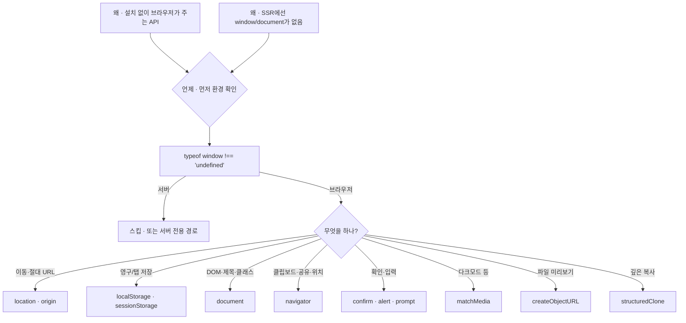

---
aliases:
  - 브라우저 API
  - document
  - navigator
  - window
tags:
  - JavaScript
related:
  - "[[00_JS_Ecosystem_HomePage]]"
  - "[[JS_CustomEvent]]"
  - "[[NextJS_Routing]]"
  - "[[NextJS_TokenStorage]]"
  - "[[JS_DOM]]"
  - "[[JS_URL_Encoding]]"
  - "[[JS_WebStorage]]"
  - "[[JS_JSON]]"
---
# JS_BrowserAPI — 브라우저 내장 API

> [!info]
>  브라우저가 JS에 기본으로 제공하는 API 모음
>  설치 없이 바로 사용할 수 있고, React/Next.js 어디서든 동일하게 동작한다.

---
# 흐름도



> URL/쿼리 — [[JS_URL_Encoding]]  
> CustomEvent 동기화 — [[JS_CustomEvent]]  
> 기능 지원 — `navigator.share`처럼 값 존재도 따로 확인

---

# 빠르게 찾기 ⭐️⭐️⭐️

|카테고리|API|
|---|---|
|환경/기능 감지 패턴|`typeof window/navigator !== 'undefined'`|
|다이얼로그|`confirm` / `alert` / `prompt`|
|페이지 이동|`location` (origin으로 절대 URL 만들기 포함)|
|저장소|`localStorage` / `sessionStorage`|
|DOM 조작|`document`, `classList`, `dataset`, `style` → 상세: [[JS_DOM]]|
|시스템 설정 감지|`matchMedia` (다크모드 등)|
|타이머|`setTimeout` / `setInterval`|
|디바이스/사용자 정보|`navigator` (클립보드, 공유, 언어 등), `geolocation`|
|URL/쿼리스트링|`URLSearchParams`|
|파일|`File` 미리보기 (`createObjectURL`)|
|창 제어|`window.open` / `window.scroll`|
|깊은 복사|`structuredClone`|
|컴포넌트 간 동기화|→ 별도 노트 [[JS_CustomEvent]] (`dispatchEvent`/`addEventListener`)|

---

# typeof X !== 'undefined' — 환경/기능 감지 패턴 ⭐️⭐️⭐️⭐️

```txt
이 패턴 자체는 Next.js 전용도, 브라우저 API 하나도 아님 —
"지금 이 전역 식별자가 이 환경에 존재하는가"를 안전하게 확인하는 범용 JS 패턴
window/document/navigator/localStorage 등 이 노트의 거의 모든 API 앞에 반복해서 등장함
```

## 왜 typeof로 확인하나 — ReferenceError 회피 ⭐️⭐️⭐️

```typescript
if (window) { ... }                          // ❌ window가 선언 안 된 환경(Node.js)에서
                                              //    ReferenceError로 그 즉시 코드가 죽음
if (typeof window !== 'undefined') { ... }   // ✅ 선언조차 안 된 식별자에도 안전
```

```txt
보통 선언 안 된 변수를 참조하면 ReferenceError가 남
하지만 typeof는 JS에서 유일하게 "선언조차 안 된 식별자"에 적용해도 에러를 안 던지고
그냥 문자열 'undefined'를 돌려주는 연산자임 — 그래서 존재 여부를 안전하게 먼저 물어볼 수 있음
```

## 세 가지 쓰임 — 문법은 같아도 목적은 다름 ⭐️⭐️⭐️⭐️

|상황|예시|확인하는 것|
|---|---|---|
|서버 환경 감지|`typeof window !== 'undefined'`|Node.js(SSR)에는 window/document/localStorage 자체가 없음|
|기능 지원 여부 감지|`navigator.share`처럼 값 자체로 체크, 또는 `typeof X === 'function'`|브라우저에서 실행 중이어도, 모든 브라우저가 그 기능을 지원하진 않음|
|모듈 최상단 코드|파일 맨 위에서 바로 `window`를 참조하는 경우|import되는 순간(서버든 클라이언트든) 즉시 실행돼서 더 위험함|

```txt
①은 "이 코드가 지금 어디서 실행되는가"의 문제, ②는 "이 브라우저가 이 기능을 갖고 있는가"의 문제 —
완전히 다른 질문인데 똑같이 typeof/존재 확인 문법을 쓰기 때문에 헷갈리기 쉬움
```

## 의외의 포인트 — useEffect 안에서는 ①이 보통 필요 없음 ⭐️⭐️⭐️

```txt
useEffect의 콜백은 정의상 컴포넌트가 브라우저에 마운트된 "이후"에만 실행됨 — SSR 중에는 절대 안 돎
→ useEffect 안에서 window/document를 쓸 때, typeof window 체크(①)는 대부분 불필요

①이 진짜 필요한 자리:
  렌더링 중에 바로 실행되는 코드 (컴포넌트 함수 본문 자체)
  모듈 최상단 (import되는 즉시 실행되는 코드)
  누가 어디서 호출할지 모르는 범용 유틸 함수 (서버/클라이언트 양쪽에서 호출될 가능성이 있는 함수)

반면 ②(기능 지원 여부)는 useEffect/이벤트 핸들러 안이어도 여전히 필요함 —
"브라우저에서 실행 중"이라는 건 보장돼도, "이 브라우저가 이 API를 지원한다"는 보장은 별개이기 때문
(아래 navigator.share가 정확히 이 ②번 사례)
```

---

# 다이얼로그 — confirm / alert / prompt

```typescript
const ok   = window.confirm('정말 삭제하시겠습니까?');   // 확인/취소 → boolean
window.alert('저장되었습니다.');                          // 알림만
const name = window.prompt('이름을 입력하세요.');         // 입력 → string | null
```

|함수|확인|취소/닫기|
|---|---|---|
|`confirm`|`true`|`false`|
|`prompt`|입력한 문자열|`null`|

```txt
window 생략 가능: confirm(...) === window.confirm(...)

React 사용 예:
  onClick={() => { if (confirm('삭제할까요?')) deleteItem(id); }}
```

## window.confirm vs 커스텀 모달

| |`window.confirm`|커스텀 모달|
|---|---|---|
|디자인|브라우저 기본, 변경 불가|자유|
|비동기 작업|어려움 (블로킹)|자연스러움|
|접근성(aria)|제어 불가|직접 제어|
|적합한 곳|내부 어드민, 빠른 구현|사용자 대면 서비스|

```tsx
// 커스텀 confirm 모달 — State로 제어
const [confirmOpen, setConfirmOpen] = useState(false);
const [targetId, setTargetId] = useState<number | null>(null);

const handleDeleteClick = (id: number) => { setTargetId(id); setConfirmOpen(true); };
const handleConfirm = async () => {
  if (!targetId) return;
  await deleteItem(targetId);
  setConfirmOpen(false);
};

{confirmOpen && (
  <div role="dialog" aria-modal="true">
    <button onClick={handleConfirm}>확인</button>
    <button onClick={() => setConfirmOpen(false)}>취소</button>
  </div>
)}
```

```txt
role="dialog" / aria-modal="true" → 스크린리더에 모달임을 알림
```

---

# 페이지 이동 — window.location

```typescript
location.href        // 전체 URL
location.pathname    // 경로만 (/movie/1)
location.search      // 쿼리 (?title=abc)
location.origin      // 도메인 (https://example.com)

location.href = '/login';     // 이동 (히스토리 남음, 새로고침 발생)
location.replace('/login');   // 이동 (히스토리 교체)
location.reload();            // 새로고침
```

```txt
Next.js 에서는 보통 이걸 대신 사용 — 자세한 비교는 [[NextJS_Routing]] 참고:
  location.href = url   →  router.push(url)     (SPA, 새로고침 없음)
  location.reload()     →  router.refresh()

  의도적으로 "완전 새로고침" 이동이 필요할 때만 location 직접 사용
```

## location.origin — 절대 URL 만들기 ⭐️

```typescript
const shareUrl =
  typeof window !== 'undefined'
    ? `${window.location.origin}/posts/${id}`
    : `/posts/${id}`;
```

```txt
location.origin이 주는 것: 프로토콜+도메인+포트까지 합친 부분만 (예: 'https://example.com')
  pathname처럼 "지금 보고 있는 경로"가 아니라 "이 사이트의 기준 주소" 자체

왜 필요한가: /posts/3 같은 상대 경로는 그 사이트 안에서만 의미가 있음
  공유 버튼처럼 "이 링크를 메신저·SNS 등 바깥으로 그대로 복사해서 보낼 때"는
  상대 경로로는 안 되고 https://example.com/posts/3 같은 완전한 절대 URL이 필요함

typeof window 체크를 같이 두는 이유(위 "환경 감지" ① 패턴):
  이 함수가 서버에서도 호출될 가능성이 있다면(메타데이터 생성 등) origin을 미리 알 방법이 없어서
  상대 경로로 대신함 — 클라이언트에서만 호출된다는 게 확실하면 이 체크는 생략해도 됨
```

---

# 저장소 — localStorage / sessionStorage ⭐️

```txt
localStorage  탭 닫아도 유지 / sessionStorage  탭 닫으면 삭제
JSON 직렬화, Set 저장, JSON.parse unknown 패턴, SSR 가드
→ [[JS_WebStorage]] 참고
JSON.stringify / JSON.parse 전체 → [[JS_JSON]] 참고
```

---

# DOM 조작 — document ⭐️⭐️⭐️

```txt
querySelector / createElement / appendChild 같은 기본 DOM 조작 →  [[JS_DOM]]
이 섹션은 BrowserAPI 특화 사용 패턴 (다크모드 테마, 전역 html 조작)에 집중
```

```typescript
document.title = '영화 목록 | MyApp';

// React에서 보통 useRef로 대체, document.title은 useEffect 안에서
useEffect(() => { document.title = `${movie.title} | MyApp`; }, [movie.title]);
```

## document.documentElement — `<html>` 태그 자체 ⭐️

```typescript
document.documentElement   // <html> 엘리먼트
document.body               // <body> 엘리먼트
document.head               // <head> 엘리먼트
```

```txt
다크모드 같은 "페이지 전체" 설정을 줄 때 documentElement를 쓰는 이유:
  html에 클래스/속성을 걸어야 head 안의 <style> 선택자(html.dark, [data-theme])와
  body 전체에 동시에 영향을 줄 수 있음
  body에만 걸면 head/scrollbar 같은 body 바깥 영역엔 적용 안 됨
```

## classList.toggle의 두 번째 인자 — force ⭐️

```typescript
el.classList.toggle('dark');          // 있으면 제거, 없으면 추가 (반전)
el.classList.toggle('dark', isDark);  // isDark 값에 따라 강제 설정
//                          ↑ true면 무조건 추가, false면 무조건 제거 (반전 아님)
```

```txt
force 없이 toggle('dark')만 쓰면 안 되는 이유:
  toggle은 "현재 상태를 뒤집기"가 기본 동작
  → 같은 코드가 두 번 실행되면 클래스가 있다/없다를 왔다갔다 반복함

  toggle('dark', isDark)처럼 두 번째 인자를 주면:
  → isDark가 true인 동안 이 코드를 몇 번 실행해도 항상 'dark'가 "있는" 상태로 고정됨
  → "현재 변수 값에 맞춰 강제로 설정"하고 싶을 때는 항상 force 인자를 같이 씀
```

## dataset — data-* 속성 다루기 ⭐️

```typescript
el.dataset.theme = 'dark';        // <html data-theme="dark">로 설정됨
el.dataset.theme                  // 'dark' 읽기

// camelCase ↔ kebab-case 자동 변환
el.dataset.userId = '42';         // <html data-user-id="42">
```

```txt
className은 "있다/없다" 정보만 표현 (다크면 dark 클래스 있음/없음)
data-*는 "어떤 값인지"까지 표현 가능 (data-theme="system"/"light"/"dark" 3가지 값)
→ CSS에서도 [data-theme="dark"] { ... }처럼 값 기준 선택자 사용 가능
```

## style — 인라인 스타일 직접 조작

```typescript
el.style.color           = 'red';
el.style.backgroundColor = 'black';   // CSS background-color → camelCase
el.style.colorScheme     = isDark ? 'dark' : 'light';
```

|CSS 속성|`el.style.*`|예시 값|
|---|---|---|
|`color`|`color`|`'red'`, `'#333'`|
|`background-color`|`backgroundColor`|`'black'`, `'#fff'`|
|`font-size`|`fontSize`|`'16px'`, `'1.2rem'`|
|`font-weight`|`fontWeight`|`'bold'`, `600`|
|`display`|`display`|`'none'`, `'flex'`|
|`width` / `height`|`width` / `height`|`'100px'`, `'50%'`|
|`border-radius`|`borderRadius`|`'8px'`|
|`opacity`|`opacity`|`'0.5'`|
|`transform`|`transform`|`'translateX(10px)'`|
|`z-index`|`zIndex`|`'10'`|
|`color-scheme`|`colorScheme`|`'dark'`, `'light'`|

```txt
⚠️ 단위 포함한 문자열이어야 함
  el.style.width = 100       ❌
  el.style.width = '100px'   ✅
```

## classList.toggle vs style.colorScheme — 둘 다 쓰는 이유

|방법|역할|적용 대상|
|---|---|---|
|`classList.toggle('dark', isDark)`|내가 작성한 CSS 클래스(`.dark { ... }`)를 켜고 끔|내가 직접 스타일링한 요소들|
|`style.colorScheme = 'dark'`|브라우저에게 "지금 다크/라이트 모드"라고 알림|스크롤바·체크박스·셀렉트 박스 같은 브라우저 기본 UI|

```txt
classList만 쓰면: 내가 만든 컴포넌트는 다크모드 되는데
                  브라우저가 그려주는 기본 UI(스크롤바 등)는 그대로 라이트로 남음
→ 다크모드를 제대로 구현하려면 보통 이 둘을 함께 씀
```

## 종합 — applyTheme 함수 ⭐️

```typescript
export const applyTheme = (preference: ThemePreference) => {
  const root   = document.documentElement;
  const isDark = resolveIsDark(preference);

  root.classList.toggle('dark', isDark);
  root.dataset.theme     = preference;
  root.style.colorScheme = isDark ? 'dark' : 'light';
};
```

```txt
classList.toggle  → 내가 정의한 CSS 클래스 켜고 끄기 (boolean만 표현)
dataset.theme     → 실제 선택된 값 자체를 기록 (system인지 직접 선택인지 구분 가능)
style.colorScheme → 브라우저 네이티브 요소까지 다크/라이트 일치

→ 셋 다 같은 root(html)에 적용하는 이유는 documentElement가
  페이지 전체에 영향을 줄 수 있는 가장 바깥 요소이기 때문
→ resolveIsDark의 'system' 분기 처리는 아래 "시스템 설정 감지" 섹션 참고
```

---

# 시스템 설정 감지 — window.matchMedia ⭐️

```typescript
const isDark = window.matchMedia('(prefers-color-scheme: dark)').matches;
// true  → OS/브라우저 설정이 다크 모드
// false → 라이트 모드
```

```txt
matchMedia(쿼리)가 반환하는 MediaQueryList 객체:
  .matches    현재 그 쿼리에 해당하는지 (boolean)
  .media      넘긴 쿼리 문자열 그대로
  .addEventListener('change', cb)   사용자가 설정을 바꾸면 실시간 감지
```

## 자주 쓰는 미디어 쿼리

```typescript
window.matchMedia('(prefers-color-scheme: dark)').matches
window.matchMedia('(max-width: 768px)').matches
window.matchMedia('(prefers-reduced-motion: reduce)').matches
```

## 실전 — 시스템 다크모드 감지 함수 ⚠️

```typescript
// ⚠️ 자주 하는 실수 — 화살표 함수 { } 블록에서 return 빠뜨리기
export const getSystemPreferDark = () => {
  typeof window !== 'undefined' &&
    window.matchMedia('(prefers-color-scheme: dark)').matches;
  // return이 없어서 항상 undefined 반환
};

// ✅ return 추가
export const getSystemPreferDark = () => {
  return (
    typeof window !== 'undefined' &&
    window.matchMedia('(prefers-color-scheme: dark)').matches
  );
};
```

## 실시간 변경 감지 — change 이벤트

```tsx
useEffect(() => {
  const mq = window.matchMedia('(prefers-color-scheme: dark)');
  const handleChange = (e: MediaQueryListEvent) => { setIsDark(e.matches); };
  mq.addEventListener('change', handleChange);
  return () => mq.removeEventListener('change', handleChange);
}, []);
```

---

# 타이머 — setTimeout / setInterval

```typescript
const timer = setTimeout(() => console.log('3초 후'), 3000);
clearTimeout(timer);

const interval = setInterval(() => console.log('1초마다'), 1000);
clearInterval(interval);
```

```tsx
// React — 클린업 필수 (언마운트 시 취소)
useEffect(() => {
  const timer = setTimeout(() => setShowToast(false), 3000);
  return () => clearTimeout(timer);
}, []);
```

---

# 디바이스/사용자 정보 — navigator

```typescript
await navigator.clipboard.writeText('복사할 텍스트');
navigator.onLine      // true / false
navigator.language    // 'ko-KR'
```

## navigator.share — 네이티브 공유 시트 ⭐️⭐️⭐️

```typescript
async function shareLink(url: string, title: string) {
  if (typeof navigator !== 'undefined' && navigator.share) {
    await navigator.share({ url, title });
    return;
  }
  await navigator.clipboard.writeText(url);
}
```

```txt
navigator.share가 있을 때만 호출하는 이유 — 기능 지원 여부 감지(②) 패턴의 실제 사례:
  모바일 Safari/Chrome 등 일부 환경에서만 OS 네이티브 공유 시트를 띄워주는 API
  데스크톱 브라우저 다수는 navigator.share 자체가 undefined
  → 있는지 먼저 확인하고, 없으면 클립보드 복사로 대체

typeof navigator !== 'undefined'까지 같이 붙이는 이유:
  navigator.share를 확인하기도 전에 navigator 자체가 없는 환경(SSR)일 수 있음
  → ①(환경 감지) + ②(기능 감지) 두 체크가 동시에 필요
```

## navigator — 실무에서 자주 보는 나머지들 ⭐️⭐️⭐️

|API|용도|
|---|---|
|`navigator.clipboard.readText()`|클립보드 읽기|
|`navigator.userAgent`|브라우저/OS 식별 문자열 (기능 분기에는 ② 방식이 더 안전)|
|`navigator.vibrate(ms)`|모바일 기기 진동|
|`navigator.serviceWorker`|PWA 오프라인 캐싱·푸시 알림|
|`navigator.mediaDevices.getUserMedia()`|카메라/마이크 접근|
|`navigator.permissions.query()`|권한 상태를 프롬프트 없이 미리 확인|
|`navigator.sendBeacon()`|페이지를 떠나도 안전하게 전송되는 로그 요청|

```typescript
// userAgent — 모바일 여부 대략 판단 (위조 가능, 기능 감지가 더 정확)
const isMobile = /Mobile|Android|iPhone/i.test(navigator.userAgent);

// serviceWorker 등록
if ('serviceWorker' in navigator) {
  navigator.serviceWorker.register('/sw.js');
}

// sendBeacon — 페이지를 떠나는 순간에도 전송 보장
window.addEventListener('pagehide', () => {
  navigator.sendBeacon('/api/log', JSON.stringify({ event: 'leave' }));
});
```

## navigator.geolocation — 위치 정보

```typescript
navigator.geolocation.getCurrentPosition(
  (position) => {
    const { latitude, longitude, accuracy } = position.coords;
  },
  (error) => { console.error(error.code, error.message); },
);
```

|`error.code`|의미|
|---|---|
|1|`PERMISSION_DENIED` — 사용자 거부|
|2|`POSITION_UNAVAILABLE` — 위치 사용 불가|
|3|`TIMEOUT` — 시간 초과|

```typescript
// 옵션
navigator.geolocation.getCurrentPosition(successCb, errorCb, {
  enableHighAccuracy: false,  // true=GPS(정확·느림) / false=Wi-Fi·IP(빠름)
  timeout:            10000,  // 최대 대기 시간(ms)
  maximumAge:         300000, // 캐시된 위치 재사용 허용 시간(ms)
});
```

## status 상태 머신 패턴

```typescript
// ❌ boolean 여러 개 → 조합이 복잡해짐
const [isLoading, setIsLoading] = useState(false);
const [isError, setIsError]     = useState(false);

// ✅ 하나의 status로 통합
const [status, setStatus] = useState<'idle'|'loading'|'error'|'ready'|'denied'>('idle');
```

```txt
idle → loading → ready / error / denied
불가능한 조합(isLoading + isError 동시 true) 자체가 안 생김
이 status 패턴은 geolocation 전용이 아니라 비동기 작업 전반에 재사용 가능
```

---

# URL 조작 — URLSearchParams · new URL

```txt
URL 인코딩(encodeURIComponent) · new URL() · URLSearchParams
→ [[JS_URL_Encoding]] 참고
```

---

# 파일 — File 미리보기 (URL.createObjectURL)

```javascript
const file = e.target.files[0];
const previewUrl = URL.createObjectURL(file);
// 'blob:http://localhost:3000/...' ← 브라우저 메모리의 파일을 가리키는 임시 URL

URL.revokeObjectURL(previewUrl);   // 메모리 해제 — 안 하면 메모리 누수
```

```typescript
// 업로드 + 미리보기 교체 패턴
const applyPhotoFile = async (file: File) => {
  const localPreview = URL.createObjectURL(file);  // ① 즉시 로컬 미리보기
  setPhotoPreview(localPreview);

  try {
    const { url } = await uploadPhoto(file);       // ② 서버 업로드
    setPhotoPreview(url);                          // ③ 서버 URL로 교체
  } catch {
    setPhotoPreview('');
  } finally {
    URL.revokeObjectURL(localPreview);             // ④ 항상 정리
  }
};
```

```txt
finally에서 revoke하는 이유: 성공(서버 URL로 교체) / 실패(어차피 안 씀) 둘 다 정리 필요
```

---

# 창 제어 — window.open / window.scroll

```typescript
window.open('https://example.com', '_blank');
window.scrollTo({ top: 0, behavior: 'smooth' });
window.scrollY   // 현재 세로 스크롤 위치
```

```tsx
// React — 스크롤 감지 패턴 (클린업 필수)
useEffect(() => {
  const handleScroll = () => setScrollY(window.scrollY);
  window.addEventListener('scroll', handleScroll);
  return () => window.removeEventListener('scroll', handleScroll);
}, []);
```

---

# 데이터 복사 — structuredClone (깊은 복사) ⭐️⭐️⭐️⭐️

```txt
어디서 import하는 함수가 아니라, 브라우저와 최신 Node.js(17+)가 기본으로 제공하는 전역 함수
fetch/setTimeout처럼 그냥 바로 호출하면 됨 — import 없이 쓸 수 있어서
"어디서 가져오는 거지" 하고 찾아도 안 나오는 게 당연함
```

```typescript
const original = { user: { name: '홍길동' }, tags: ['a', 'b'] };
const copy = structuredClone(original);

copy.user.name = '김철수';
original.user.name; // '홍길동' — 원본은 안 바뀜
```

## 얕은 복사 vs 깊은 복사 ⭐️⭐️⭐️⭐️

```typescript
const shallow = { ...original };
shallow.user.name = '김철수';
original.user.name; // '김철수' — 안쪽 객체는 같은 참조라 원본도 같이 바뀜 ⚠️
```

|방법|중첩 객체도 독립 복사|
|---|---|
|`{ ...obj }` / `[...arr]`|아니요 — 한 단계만 (얕은 복사)|
|`structuredClone(obj)`|네 — 몇 단계든 전부 새로 복사 (깊은 복사)|

## 실전 — "되돌리기" 가능한 편집 상태 ⭐️⭐️⭐️⭐️

```tsx
useEffect(() => {
  if (!open || !card) return;
  setMode('view');
  setCustomization(structuredClone(card.customization));
}, [open, card]);
```

```txt
structuredClone 없이 그대로 넘기면:
  state와 card.customization이 같은 객체를 가리킴
  → 편집 중에 중첩 필드를 바꾸면 저장 안 했는데 원본도 같이 바뀜

structuredClone으로 감싸면:
  완전히 독립된 복사본 → 취소 시 그냥 버리면 됨 (원본은 멀쩡)
```

## 한계

```txt
복사 못 하는 것: 함수(function) / DOM 노드 / 클래스 인스턴스의 메서드(프로토타입 체인)
→ 순수 데이터(객체/배열/Date/Map/Set 등)에만 적합
```

---

# 한눈에

|API|용도|반환|
|---|---|---|
|`typeof window !== 'undefined'`|서버 환경 감지|boolean|
|`navigator.share`처럼 값으로 체크|기능 지원 여부 감지|boolean|
|`confirm(msg)`|확인/취소|boolean|
|`prompt(msg)`|입력받기|string \| null|
|`location.href = url`|페이지 이동(새로고침)|—|
|`location.origin`|프로토콜+도메인+포트 — 절대 URL 만들 때|string|
|`localStorage.setItem/getItem`|영구 저장/읽기|— / string\|null|
|`sessionStorage.setItem/getItem`|탭 한정 저장/읽기|— / string\|null|
|`document.title = ...`|탭 제목 변경|—|
|`window.matchMedia(query).matches`|미디어 쿼리(다크모드 등) 검사|boolean|
|`navigator.clipboard.writeText(v)`|클립보드 복사|Promise|
|`navigator.share({ url, title })`|네이티브 공유 시트|Promise|
|`navigator.geolocation.getCurrentPosition(cb)`|현재 위치|void|
|`URL.createObjectURL(file)`|파일 미리보기 URL|string(blob:)|
|`URL.revokeObjectURL(url)`|미리보기 URL 해제|void|
|`window.scrollTo(...)`|스크롤 이동|—|
|`setTimeout/setInterval`|지연/반복 실행|timerId|
|URL 조작|→ [[JS_URL_Encoding]] (`new URL` · `URLSearchParams` · `encodeURIComponent`)|—|
|`structuredClone(obj)`|깊은 복사 (import 없이 전역 사용)|복사본|

```txt
DOM 기본 조작 (querySelector/createElement/appendChild 등) → [[JS_DOM]]
컴포넌트 간 상태 동기화 (dispatchEvent/addEventListener/CustomEvent) → [[JS_CustomEvent]]
```