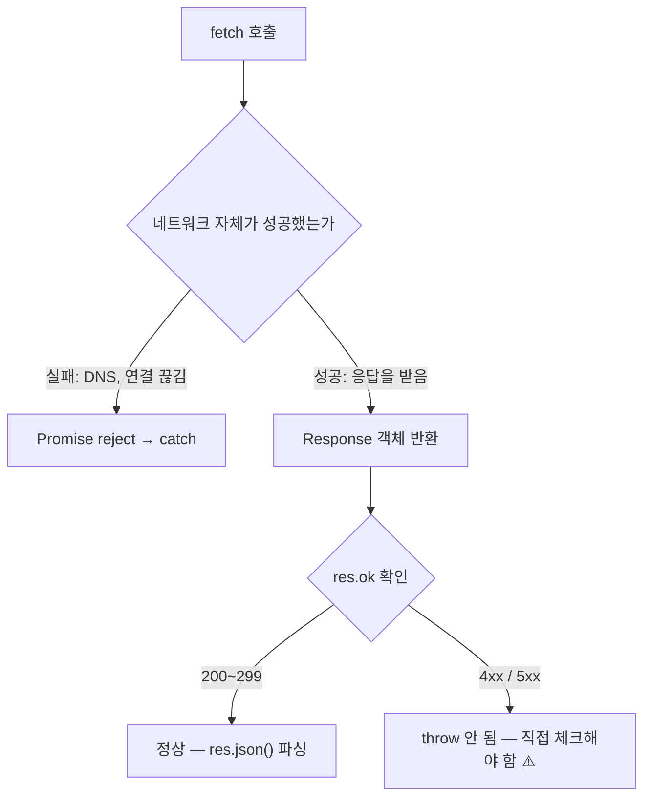

---
aliases:
  - fetch
  - RequestInit
  - Response
  - credentials
  - fetch wrapper
  - fetchAPI
tags:
  - JavaScript
related:
  - "[[00_JS_Ecosystem_HomePage]]"
  - "[[NestJS_CORS]]"
---
# JS_Fetch_API — fetch & HTTP 요청

# 한 줄 요약

```txt
fetch = URL 로 HTTP 요청을 보내는 JavaScript 내장 함수
실전에서는 매번 직접 쓰지 않고, 공통 옵션·에러처리를 감싼 "래퍼 함수" 하나로 만들어
앱 전체에서 재사용하는 게 표준 패턴 ⭐️⭐️

이 노트 순서: fetch 자체를 완전히 이해 → 그걸 왜/어떻게 래퍼로 감싸는지
```

---

---

# fetch 란 — 등장 배경

| 시대       | 방식                                                |
| -------- | ------------------------------------------------- |
| 예전 브라우저  | `XMLHttpRequest`(XHR) — 콜백 기반, 코드가 복잡             |
| fetch 등장 | Promise 기반으로 재설계, 브라우저 내장                         |
| Node.js  | 18+ 부터 전역 내장 (설치 불필요) / 17 이하는 `node-fetch` 설치 필요 |

```bash
node --version   # v18 이상이면 fetch 바로 사용 가능
```

---

---

# 기본 사용법 ⭐️

```javascript
const res  = await fetch(url, options);   // Response 객체 반환 (body 아님)
const data = await res.json();            // body 를 JS 객체로 파싱
```

|인자|설명|
|---|---|
|`url`|요청 주소 (문자열, 필수)|
|`options`|`RequestInit` — method/headers/body 등, 생략하면 기본 GET|

```txt
fetch 가 반환하는 건 "응답 자체"일 뿐 — body 를 꺼내려면 res.json()/res.text() 등을 또 호출해야 함
```

---

---

# RequestInit — 요청 옵션 ⭐️⭐️

```javascript
fetch(url, {
  method: 'POST',
  headers: { 'Content-Type': 'application/json' },
  body: JSON.stringify({ title: '제목' }),
  cache: 'no-store',
  credentials: 'include',
});
```

|옵션|값|설명|
|---|---|---|
|`method`|`'GET'`(기본)/`'POST'`/`'PATCH'`/`'PUT'`/`'DELETE'`|HTTP 메서드|
|`headers`|`{ 'Content-Type': ..., Authorization: ... }`|요청 헤더|
|`body`|문자열 또는 `FormData`만 허용|요청 본문 (POST/PATCH 등)|
|`cache`|`'no-store'`(매번 새 요청)/`'force-cache'`(캐시 우선)|캐시 정책|
|`credentials`|`'same-origin'`(기본)/`'include'`/`'omit'`|쿠키 전송 여부|

## JSON.stringify — 왜 필요한가

```txt
body 는 문자열/FormData 만 허용 — 객체를 그대로 넣으면 "[object Object]" 로 전송됨 ⚠️

body: { title: '...' }            ❌
body: JSON.stringify({ title }})  ✅ + headers: { 'Content-Type': 'application/json' } 세트로

Content-Type 선언 + JSON.stringify 둘 중 하나만 하면 서버가 body 를 제대로 못 읽음
필요한 경우: POST/PATCH(body 있음) / 불필요: GET/DELETE(body 없음)
```

## credentials: 'include' — 언제 필요한가 ⭐️

|인증 방식|credentials 필요?|
|---|---|
|JWT (Authorization 헤더로 토큰 전달)|불필요 — 헤더에 직접 담아 보냄|
|쿠키 기반 (httpOnly 세션 등)|same-origin이면 기본값으로 충분 / **cross-origin이면 `'include'` 필수**|

```txt
cross-origin 이란: 프론트(localhost:3001)와 백엔드(localhost:3000)처럼 포트/도메인이 다른 경우
  → 기본값(same-origin)이면 브라우저가 쿠키를 안 보냄

⚠️ credentials:'include' 는 서버 쪽 CORS 설정도 같이 필요:
  credentials: true, origin: '구체적인 주소' (와일드카드 * 불가) → [[NestJS_CORS]] 참고
```

---

---

# Response 객체 — res ⭐️⭐️

```javascript
res.status       // 200 / 404 / 500 등 상태 코드
res.ok           // 200~299 이면 true
res.statusText   // 'OK' / 'Not Found' 등

await res.json()  // JSON → JS 객체
await res.text()  // 텍스트/XML/HTML
await res.blob()  // 파일/이미지
```

```txt
⚠️ body 는 스트림 — res.json()/res.text() 는 한 번만 호출 가능, 두 번째 호출은 에러
```

## res.json() 은 항상 any — as 로 타입을 직접 알려줘야 함 ⭐️⭐️

```typescript
const data = await res.json();                    // TS 입장에서 any
const data = (await res.json()) as Movie[];        // "이 모양이라고 치자" 는 단언
```

```txt
res.json() 의 타입 정의 자체가 Promise<any> (fetch 표준 타입 내장) — 응답 모양을 TS 가 알 길이 없음
⚠️ as 는 검증이 아니라 약속일 뿐 — 실제 응답이 그 모양이 아니어도 에러를 안 냄
  진짜로 검증하려면 zod 같은 스키마 검증 라이브러리 필요
  → 뒤에 나오는 fetchAPI<T> 의 제네릭도 본질적으로 같은 역할 (응답 모양을 미리 약속)
→ 자세한 응답 타입 설계는 [[TS_API_Types]] 참고
```

---

---

# ⚠️ fetch 는 4xx / 5xx 에서 throw 하지 않음 — 가장 헷갈리는 특성 ⭐️⭐️⭐️



```javascript
// ❌ res.ok 체크 없으면 404 여도 그냥 진행됨
const res = await fetch('/movies/999');
const data = await res.json();   // 404 응답의 에러 body 가 그냥 파싱됨

// ✅ 항상 체크
const res = await fetch('/movies/999');
if (!res.ok) throw new Error(`HTTP ${res.status}: ${res.statusText}`);
const data = await res.json();
```

```txt
axios 는 4xx/5xx 에서 자동으로 throw 함 — axios 쓰던 사람이 fetch 로 옮기면 이 차이로 버그 잦음
```

---

---

# HTTP 메서드별 사용법

```javascript
const res = await fetch('/movies');                                       // GET
const res = await fetch('/movies', { method: 'POST',                      // POST
  headers: { 'Content-Type': 'application/json' },
  body: JSON.stringify({ title: '인터스텔라', year: 2014 }) });
const res = await fetch('/movies/1', { method: 'PATCH',                   // PATCH
  headers: { 'Content-Type': 'application/json' },
  body: JSON.stringify({ title: '수정된 제목' }) });
const res = await fetch('/movies/1', { method: 'DELETE' });               // DELETE
```

|메서드|body|JSON.stringify|
|---|---|---|
|GET / DELETE|없음|불필요|
|POST / PATCH|있음|필요|

---

---

# 헤더 다루기 ⭐️

```javascript
fetch(url, {
  headers: {
    ...defaultHeaders,
    ...extraHeaders,   // 같은 키 있으면 "나중에 오는 것" 이 덮어씀
  },
});
```

```txt
Content-Type: application/json   JSON 을 보내고 받겠다는 선언 (POST/PATCH 필수)
Authorization: Bearer {token}    JWT 토큰 전달, 서버가 이 헤더로 사용자 식별
```

---

---

# XML 등 비-JSON 응답

```javascript
const res = await fetch('https://apis.data.go.kr/...');
if (!res.ok) throw new Error(`HTTP ${res.status}`);
const xml = await res.text();   // res.json() 아님 ⚠️ — 이후 fast-xml-parser 등으로 파싱
```

---

---

# 기본 에러 처리 패턴

```javascript
async function getMovie(id) {
  const res = await fetch(`/api/movies/${id}`);
  if (!res.ok) {
    const body = await res.json().catch(() => ({}));   // body 파싱 실패해도 빈 객체로 대체
    throw new Error(`HTTP ${res.status}: ${body.message ?? res.statusText}`);
  }
  return res.json();
}
```

> TypeScript 에서 에러 타입 처리 → [[TS_API_Types]]

---

---

# Node.js 에서 fetch

```txt
Node 18+: 전역 내장, 브라우저와 동일한 문법
NestJS 에서 외부 API 호출: HttpModule(axios 래퍼) 없이 fetch 로 충분 (Node 18+ 가정)
```

# fetch vs axios

| |fetch|axios|
|---|---|---|
|설치|불필요 (Node 18+)|필요|
|4xx/5xx|`res.ok` 직접 체크 ⚠️|자동 throw|
|JSON 파싱|`await res.json()`|자동|
|TS 제네릭|직접 구현|내장 지원|
|인터셉터|없음|있음|

```txt
간단한 호출 → fetch + 직접 만든 래퍼로 충분 / 인터셉터·공통처리 복잡 → axios 고려
```

---

---

---

# 여기까지 fetch 자체 — 이제 실전에서 감싸는 법 ⭐️⭐️

```txt
지금까지 본 옵션(credentials/cache/headers)과 체크(res.ok, JSON.stringify)는
API 호출마다 매번 반복하게 됨 → 한 곳에 모아 "래퍼 함수"로 만드는 게 표준 패턴
```

# 왜 래퍼로 감싸는가

```txt
매번 반복되는 것: baseURL 조합 / credentials / Content-Type / res.ok 체크 / res.json() 파싱
→ 직접 다 쓰면: 코드 중복 + 한 곳이라도 빠뜨리면 버그
→ 래퍼로 모으면: 호출하는 쪽은 endpoint 와 옵션만 넘기면 됨 (baseURL/인증 방식이 바뀌어도 한 곳만 수정)
```

---

---

# fetchAPI 래퍼 — 한 조각씩 분해 ⭐️⭐️⭐️

```typescript
async function fetchAPI<T>(endpoint: string, options?: RequestInit): Promise<T> {
  let res: Response;
  try {
    res = await fetch(`${getApiBaseUrl()}${endpoint}`, {
      ...options,
      credentials: 'include',
      cache: 'no-store',
      headers: { 'Content-Type': 'application/json', ...options?.headers },
    });
  } catch {
    throw new Error('네트워크 오류가 발생했습니다.');
  }

  if (!res.ok) {
    const body = await res.json().catch(() => ({}));
    throw new Error(body.message ?? `HTTP ${res.status}`);
  }
  return res.json();
}
```

## ① `<T>` 제네릭 — 호출하는 쪽이 응답 타입을 지정

```typescript
const notices = await fetchAPI<Notice[]>('/notices');   // notices 가 자동으로 Notice[] 타입
const notice  = await fetchAPI<Notice>('/notices/1');    // 단건이면 Notice
```

```txt
T 는 함수가 "호출될 때" 결정되는 타입 변수 — 함수 하나로 어떤 응답이든 타입 안전하게 재사용
```

## ② endpoint + baseURL 분리

```txt
endpoint = '/notices' 처럼 "이 호출에서만" 다른 부분
baseURL  = 환경(개발/배포, 서버/브라우저)마다 다른 부분
→ getApiBaseUrl() 함수 하나에 그 차이를 모아두면 호출 코드는 환경을 신경 안 써도 됨
  (Next.js 에서의 구체적인 분기 패턴은 [[Next_API_Integration]] 참고)
```

## ③ `let res: Response`를 try 밖에서 선언하는 이유

|구분|잡는 상황|
|---|---|
|`try/catch`|네트워크 자체 끊김, DNS 실패 — fetch 가 진짜로 reject 될 때만|
|`res.ok` 체크|요청은 성공했지만 서버가 4xx/5xx 로 응답했을 때|

```txt
res 를 try 바깥에 선언해서, try 안에서는 "연결 자체" 만 확인하고
try 가 끝난 뒤 res.ok 로 "응답 내용" 을 확인하도록 책임을 분리한 것
```

## ④ ⚠️ 옵션 merge 순서 함정 — Content-Type 이 사라지는 버그 ⭐️⭐️⭐️

```typescript
// ❌ 이렇게 쓰면 headers 를 한 번 합쳐놓고, 바로 다음 ...options 가 또 펼쳐지며 덮어씀
fetch(url, {
  headers: { 'Content-Type': 'application/json', ...options?.headers },
  ...options,   // ⚠️ options.headers 가 있으면 위에서 합친 headers 를 통째로 교체
});
```

```txt
규칙: 같은 key 가 여러 번 나오면 "나중에 오는 것이 이김"
options = { headers: { Authorization: 'Bearer xyz' } } 라면:
  ① headers 를 { Content-Type: ..., Authorization: ... } 로 잘 합침
  ② 그런데 ...options 가 다시 펼쳐지며 headers 가 options.headers "원본"으로 교체됨
  ③ 최종 headers = { Authorization: 'Bearer xyz' } ← Content-Type 사라짐 ⚠️

호출하는 쪽이 headers 를 안 넘기면 문제없다가, 넘기는 순간에만 조용히 사라지는 버그라 발견 어려움
```

```typescript
// ✅ 수정 — ...options 를 먼저 펼치고, headers 는 맨 마지막에
fetch(url, {
  ...options,
  headers: { 'Content-Type': 'application/json', ...options?.headers },   // 마지막 = 항상 최종값
});
```

```txt
일반화한 원칙: 안에서 "또 합쳐야 하는" 속성(headers)은 객체 리터럴의 항상 마지막에 둘 것
```

## ⑤ res.ok 체크 + 에러 메시지 추출

```typescript
if (!res.ok) {
  const body = await res.json().catch(() => ({}));   // 파싱 실패해도 빈 객체로 대체
  throw new Error(body.message ?? `HTTP ${res.status}`);   // 서버 메시지 우선, 없으면 상태코드
}
```

---

---

# 완성형 — 사용 예

```typescript
const notices = await fetchAPI<Notice[]>('/notices');                    // GET 목록
const notice  = await fetchAPI<Notice>(`/notices/${id}`);                // GET 단건
const created = await fetchAPI<Notice>('/notices', {                     // POST
  method: 'POST', body: JSON.stringify({ title, content }),
});
const me = await fetchAPI<User>('/users/me', {                           // 커스텀 헤더
  headers: { 'X-Custom-Header': 'value' },
});
```

```txt
호출하는 쪽은 baseURL/credentials/cache/res.ok 체크를 전혀 신경 안 씀 — 이게 래퍼의 목적
```

---

---

# 또 다른 스타일 — 엔드포인트별로 직접 함수 작성 ⭐️⭐️

```txt
공통 래퍼(fetchAPI<T>) 와 달리, "엔드포인트마다 함수를 하나씩 직접 쓰는" 스타일도 흔히 씀
둘 다 정답 — 프로젝트/팀 취향에 따라 선택
```

```typescript
// lib/fetchX.ts — X 자리에 도메인 이름만 바꿔서 재사용
export async function fetchXList(): Promise<X[]> {
  if (!API_URL) throw new Error('NEXT_PUBLIC_API_URL이 설정되지 않았습니다.');

  const res = await fetch(`${API_URL}/x`, { next: { revalidate: 0 } });   // Next.js 캐싱 옵션
  if (!res.ok) throw new Error(`API 요청 실패 GET /x: ${res.status}`);

  const data = (await res.json()) as ApiX[];
  return mapXs(data);   // API → UI 타입 변환은 매퍼에게 위임 ([[Next_API_Integration]] 참고)
}
```

|비교|공통 래퍼 `fetchAPI<T>`|엔드포인트별 함수|
|---|---|---|
|반복 설정(credentials/cache/headers)|한 곳에 모음|함수마다 직접 적음|
|새 엔드포인트 추가|호출 한 줄만 추가|함수를 통째로 작성|
|특이 케이스 처리|옵션으로 끼워 넣어야 함|함수 안에서 자유롭게|

```txt
선택 기준: 엔드포인트가 많고 옵션이 거의 똑같음 → 공통 래퍼 / 엔드포인트마다 캐싱·매퍼가 제각각 → 개별 함수
실제로는 대부분 공통 래퍼 + 특이한 엔드포인트 한두 개만 개별 함수로 섞어 쓰는 경우가 많음
```

---

---

# 한눈에

```txt
fetch(url, options) → Response → res.json()
옵션: method/headers/body(JSON.stringify 필요)/cache/credentials('include'는 cross-origin 쿠키 시)

⚠️ 4xx/5xx 는 throw 안 함 — res.ok 직접 체크 필수 (axios 와의 최대 차이점)
⚠️ res.json() 은 항상 Promise<any> — as 또는 제네릭 <T> 로 타입 약속 (검증 아님)
⚠️ headers 처럼 "또 합쳐야 하는" 옵션은 스프레드 중 항상 마지막에

실전 패턴: fetchAPI<T>(endpoint, options) 래퍼 하나로 baseURL/credentials/res.ok 체크를 모음
  (또는 엔드포인트별 함수 스타일 — 위 비교 참고)

fetch 자체가 아니라 "Next.js 에 어떻게 구조화해서 배치하는가" → [[Next_API_Integration]]
응답 타입 설계 → [[TS_API_Types]]
```