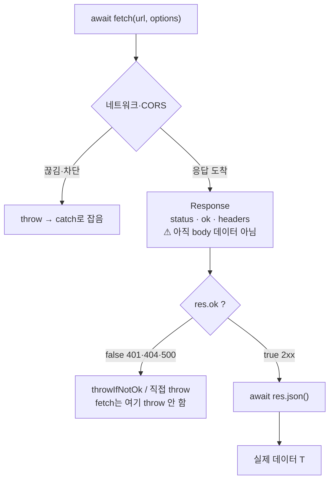

---
aliases:
  - fetchAPI
  - HTTP
  - Fetch
  - Network
  - 요청 옵션
tags:
  - JavaScript
related:
  - "[[00_JS_Ecosystem_HomePage]]"
  - "[[NextJS_API_Mapper]]"
  - "[[NextJS_Types]]"
  - "[[NextJS_Concept]]"
  - "[[JS_Fetch_API]]"
  - "[[NextJS_ServerClient]]"
---
# JS_Fetch_API — fetch

> [!info] fetch = 브라우저 내장 HTTP 요청 API.
>  `await fetch(url)`이 반환하는 것은 데이터가 아닌 Response 객체 — `await res.json()`으로 한 번 더 파싱해야 함. 
>  HTTP 4xx·5xx는 reject하지 않으므로 `res.ok`를 직접 확인해야 한다. 
>  CORS 차단은 fetch가 throw함. 
>  `AbortController`로 요청 취소. 
>  실제 프로젝트에서는 래퍼를 만들어서 씀 → [[NextJS_API_Client]]

---
# 흐름도


```mermaid-beautiful
flowchart TD
  A["await fetch(url, options)"] --> B{네트워크·CORS}
  B -->|끊김·차단| X["throw → catch로 잡음"]
  B -->|응답 도착| C["Response<br/>status · ok · headers<br/>⚠ 아직 body 데이터 아님"]
  C --> D{"res.ok ?"}
  D -->|false 401·404·500| E["throwIfNotOk / 직접 throw<br/>fetch는 여기 throw 안 함"]
  D -->|true 2xx| F["await res.json()"]
  F --> G["실제 데이터 T"]
```

```txt
핵심 한 줄:
  await fetch → Response(껍데기) → ok 확인 → await json → 데이터
  4xx/5xx는 왼쪽 X가 아니라 가운데 D에서 갈라짐
```

---

# fetch란 ⭐️⭐️⭐️⭐️

```txt
브라우저에 내장된 HTTP 요청 API
  별도 설치 없이 window.fetch() 로 사용 가능
  Node.js 18+ 에서도 기본 지원

용도:
  서버에 데이터를 요청하거나 (GET)
  데이터를 서버에 보내거나 (POST/PATCH/DELETE)
  파일을 업로드하거나 (FormData)
  외부 API를 호출할 때
```

---

# 두 단계로 이루어진 응답 ⭐️⭐️⭐️⭐️

```txt
fetch를 처음 쓸 때 가장 많이 헷갈리는 부분:
await fetch(url) 의 결과가 데이터가 아니라 "Response 객체"
```

```typescript
// ① 첫 번째 await — HTTP 헤더가 도착하면 완료
const res = await fetch('/api/user');
// res = Response 객체 (아직 데이터가 아님)
// res.status = 200, res.ok = true 같은 정보만 있음

// ② 두 번째 await — body(실제 데이터)를 파싱
const user = await res.json();
// 이제야 실제 데이터를 얻음
```

```txt
왜 두 단계인가:
  HTTP 응답은 헤더와 body가 따로 도착함
  헤더가 먼저 도착 → status 코드, Content-Type 등을 먼저 확인 가능
  body는 그 다음 스트리밍으로 도착 → 파싱까지 기다려야 함

  → 헤더만 보고 "파일이 너무 크면 body 파싱 안 하기" 같은 최적화 가능
  → 일반적으로는 그냥 두 줄로 이어서 씀
```

---

# ⚠️ fetch는 HTTP 에러에 throw 안 함 ⭐️⭐️⭐️⭐️

```txt
fetch를 쓸 때 가장 흔한 실수:
  "await fetch를 try/catch로 감쌌으니까 에러 처리 됐겠지" → ❌
```

```typescript
// ❌ 잘못된 에러 처리
try {
  const res  = await fetch('/api/user');
  const user = await res.json();
  // 404나 500이어도 여기까지 실행됨!
} catch (err) {
  // 네트워크 자체가 끊겼을 때만 여기로
}
```

```typescript
// ✅ 올바른 에러 처리 — res.ok 체크 필수
const res = await fetch('/api/user');

if (!res.ok) {
  // 4xx, 5xx → res.ok = false
  throw new Error(`HTTP 에러: ${res.status}`);
}

const user = await res.json();  // 여기서야 안전하게 파싱
```

```txt
fetch의 동작 방식:
  네트워크 자체 실패 (인터넷 끊김, CORS 에러) → Promise reject → catch로
  HTTP 응답 옴 (200, 404, 500 전부) → Promise resolve → catch 안 들어옴

res.ok:
  status 200~299 → true
  status 400, 404, 500 등 → false

  if (!res.ok) throw 패턴을 항상 써야 에러 응답을 잡을 수 있음
```

---

# Response 객체 ⭐️⭐️⭐️

```typescript
const res = await fetch('/api/user');

res.status      // HTTP 상태 코드: 200, 404, 500 ...
res.statusText  // 상태 메시지: "OK", "Not Found" ...
res.ok          // status 200~299 이면 true
res.headers     // 응답 헤더

// body 파싱 메서드 (한 번만 쓸 수 있음)
await res.json()        // JSON → JavaScript 객체
await res.text()        // 일반 텍스트
await res.blob()        // 이미지·파일 같은 바이너리
await res.arrayBuffer() // 바이너리를 ArrayBuffer로
```

```txt
body 파싱은 한 번만:
  res.json()을 한 번 호출하면 body 스트림이 소비됨
  다시 res.text()를 호출하면 빈 값 반환
  → 한 가지만 선택해서 한 번만 파싱

Content-Type 확인:
  res.headers.get('content-type')
  'application/json' → res.json()
  'text/html' → res.text()
  'image/...' → res.blob()
```

---

# res.text() — 파싱 제어권을 직접 갖는 패턴 ⭐️⭐️⭐️⭐️

```txt
res.json()의 문제:
  body가 비어있으면  → SyntaxError: Unexpected end of JSON input
  body가 HTML이면   → SyntaxError: Unexpected token '<'
  에러 정보 없이 터짐 → 어떤 응답이 왔는지 알 수 없음

res.text()는 어떤 응답이든 string으로 읽음 — 절대 throw 안 함
→ 읽은 뒤 직접 분기처리 가능
```

```typescript
const raw = await res.text();

if (!raw.trim()) {
  // 빈 body 처리 (204 No Content 등)
  return undefined;
}

try {
  const body = JSON.parse(raw);  // JSON이면 파싱
  // body 사용...
} catch {
  // HTML·plain text 에러 → raw 앞 200자 포함해서 throw
  throw new Error(`JSON 파싱 실패 (HTTP ${res.status}): ${raw.slice(0, 200)}`);
}
```

```txt
text() vs json() 선택:
  res.json()  서버가 항상 JSON, 빈 body 없다고 확신할 때 (간단한 경우)
  res.text()  204·빈 body·HTML 에러 가능성 있을 때 (래퍼 함수 구현 시)

  Response body는 스트림 → text()·json()·blob() 중 하나만 호출 가능
  text()로 읽으면 이후 json() 추가 호출 불가 — JSON.parse(raw) 로 직접 파싱
```

---
️
# 요청 옵션 — URL 다음에 뭘 넣는가 ⭐️⭐️⭐️⭐️

```typescript
fetch(url, {
  method:  'POST',
  headers: { ... },
  body:    JSON.stringify(data),
})
//   ↑ 이 두 번째 인자가 RequestInit
//     "어떻게 요청을 보낼 것인가"를 정의
```

## 언제 무엇을 넣는가

```typescript
// GET — 데이터 조회 (method, body 없어도 됨)
fetch('/posts')

// GET + 인증 — 로그인 필요한 조회
fetch('/posts/my', {
  headers: { Authorization: `Bearer ${token}` },
  // method 생략 = GET (기본값)
  // body 없음 = 조회니까
})

// POST — 데이터 생성 (method + body + token)
fetch('/posts', {
  method:  'POST',
  headers: {
    'Content-Type':  'application/json',   // body 형식 알림
    'Authorization': `Bearer ${token}`,    // 인증
  },
  body: JSON.stringify({ title: '제목', content: '내용' }),
  // body = 서버에 보내는 데이터
})

// PATCH — 일부 수정 (POST와 구조 같음, method만 다름)
fetch('/posts/123', {
  method:  'PATCH',
  headers: {
    'Content-Type':  'application/json',
    'Authorization': `Bearer ${token}`,
  },
  body: JSON.stringify({ title: '수정된 제목' }),
})

// DELETE — 삭제 (body 없음)
fetch('/posts/123', {
  method:  'DELETE',
  headers: { Authorization: `Bearer ${token}` },
  // body 없음 = 삭제 대상은 URL의 /123으로 이미 지정
})
```

## 조합 기준

```txt
method:
  생략      → GET (조회)
  'POST'    → 생성 (body 있음)
  'PATCH'   → 일부 수정 (body 있음)
  'PUT'     → 전체 교체 (body 있음)
  'DELETE'  → 삭제 (body 보통 없음)

headers.Authorization:
  Guard 있는 NestJS 엔드포인트 → 반드시 필요
  공개 API → 생략

headers.Content-Type:
  body가 있을 때만 → 'application/json'
  body 없으면 생략 (GET, DELETE)
  FormData 업로드 → 생략 (브라우저가 자동 설정)

body:
  POST·PATCH·PUT → JSON.stringify(데이터)
  GET·DELETE     → 생략
  파일 업로드    → FormData 객체 (JSON.stringify 안 함)
```

## Input 타입 vs Response 타입 — 무엇을 보내고 받는가

```typescript
// Input 타입 = 내가 body에 담아 보내는 것
type CreatePostInput = {
  title:   string;
  content: string;
};

// Response 타입 = 서버가 주는 것 (제네릭 <T>로 표현)
type PostItem = {
  id:        string;
  title:     string;
  content:   string;
  createdAt: string;
};

// 도메인 함수에서
async function createPost(token: string, input: CreatePostInput) {
  //                               ↑ 보내는 것 타입          ↑ 받는 것 타입
  const res = await fetch('/posts', {                      //  ↓
    method:  'POST',                           const data: PostItem = await res.json();
    headers: {
      'Content-Type':  'application/json',
      'Authorization': `Bearer ${token}`,
    },
    body: JSON.stringify(input),  // Input 타입 → JSON 문자열
  });
  return res.json() as PostItem;  // 응답 → Response 타입으로
}
```

```txt
token: string
  → 문자열 그 자체 (Bearer 뒤에 붙임)
  → 어디서 왔는가: 로그인 시 서버가 발급, 앱에서 저장
  → [[NextJS_TokenStorage]] 토큰 저장 방법

input: CreatePostInput
  → 요청 body의 타입 = "내가 서버에 보내는 데이터의 구조"
  → JSON.stringify(input) 으로 문자열화해서 body에 넣음
  → NestJS의 CreatePostDto와 같은 필드

<PostItem> 제네릭
  → "이 fetch가 반환하는 데이터의 타입"
  → res.json() 결과가 PostItem 타입임을 TypeScript에 알림
  → 화면에서 data.title, data.createdAt 자동완성 가능
```

---
# credentials — 쿠키 포함 ⭐️⭐️⭐️

```typescript
const res = await fetch('/api/user', {
  credentials: 'include',   // cross-origin 요청에 쿠키 포함
});
```

```txt
credentials 옵션:
  'omit'        쿠키 안 보냄 (기본값)
  'same-origin' 같은 도메인일 때만 쿠키 포함
  'include'     cross-origin도 쿠키 포함

서버에서 Set-Cookie로 인증 토큰을 관리할 때 필요
서버 CORS 설정에 credentials: true 도 같이 필요 → [[NestJS_CORS]]
```

---

# 자주 쓰는 패턴

## GET 요청

```typescript
const res  = await fetch('/api/posts');
if (!res.ok) throw new Error(`${res.status}`);
const posts = await res.json();
```

## POST — JSON 전송

```typescript
const res = await fetch('/api/posts', {
  method:  'POST',
  headers: { 'Content-Type': 'application/json' },
  body:    JSON.stringify({ title: '제목', content: '내용' }),
});
if (!res.ok) throw new Error(`${res.status}`);
const post = await res.json();
```

## FormData — 파일 업로드

```typescript
const formData = new FormData();
formData.append('image', file);           // File 객체
formData.append('title', '이미지 제목');  // 텍스트도 같이

const res = await fetch('/api/upload', {
  method: 'POST',
  body:   formData,
  // Content-Type 헤더 직접 설정 금지
  // → 브라우저가 boundary 포함해서 자동 설정
});
```

```txt
FormData를 쓸 때 Content-Type을 직접 설정하면 안 되는 이유:
  multipart/form-data의 Content-Type은 boundary 값을 포함해야 함
  예: Content-Type: multipart/form-data; boundary=----abc123

  직접 'multipart/form-data'만 쓰면 boundary 없어서 서버가 파싱 실패
  → Content-Type 헤더를 아예 안 넣으면 브라우저가 올바르게 자동 설정
```

## DELETE — body 없음

```typescript
const res = await fetch(`/api/posts/${postId}`, {
  method: 'DELETE',
  // body 없음 → Content-Type 헤더도 불필요
});
if (!res.ok) throw new Error(`${res.status}`);
// 204 No Content면 res.json() 호출 불필요
```

---

# fetch vs apiFetch ⭐️⭐️⭐️

```txt
fetch를 직접 쓰면 매 요청마다 반복해야 하는 것들:
  ① Base URL 앞에 붙이기
  ② Authorization 헤더 추가
  ③ res.ok 체크
  ④ 에러 응답 body 파싱
  ⑤ JSON.stringify

→ apiFetch 래퍼를 만들어서 이 반복을 없앰
  프로젝트에서는 fetch를 직접 쓰지 않고 apiFetch만 씀
  apiFetch 구현 → [[NextJS_API_Client]]
```

```typescript
// 직접 fetch
const res = await fetch(`${process.env.NEXT_PUBLIC_API_URL}/users/me`, {
  headers: { Authorization: `Bearer ${token}` },
});
if (!res.ok) throw new Error(`${res.status}`);
const user = await res.json();

// apiFetch 래퍼 사용
const user = await apiFetch<ApiUser>('/users/me');
```

---

# CORS 에러 — 왜 fetch가 throw하는가 ⭐️⭐️⭐️⭐️

```txt
fetch가 throw하는 두 가지 경우:
  ① 네트워크 자체 실패 (인터넷 끊김)
  ② CORS 에러

CORS (Cross-Origin Resource Sharing):
  브라우저 보안 정책 — 다른 도메인에 fetch하면 브라우저가 차단
  http://localhost:3031 → http://localhost:3030/api
  → 포트가 달라서 cross-origin → CORS 정책 적용

  서버(NestJS)가 Origin을 허용하지 않으면:
  → 브라우저가 응답을 차단 → fetch가 TypeError: Failed to fetch → throw

  → catch로 잡히지만 status 코드를 알 수 없음
  → 서버가 응답을 보냈어도 브라우저가 차단한 것
```

```typescript
try {
  const res = await fetch('http://localhost:3030/api/posts');
} catch (err) {
  // err.message = "TypeError: Failed to fetch"
  // 네트워크 끊김인지, CORS 차단인지 코드로 구분 어려움
  // → 브라우저 개발자 도구 Console에서 CORS 에러 확인
}
```

```txt
CORS 에러 해결:
  → NestJS의 app.enableCors() 설정 확인 → [[NestJS_CORS]]
  → origin에 프론트 URL이 포함되어 있는지 확인
  → credentials: true 이면 서버도 credentials: true 필요

개발 중 CORS 에러 없애는 방법:
  Next.js의 rewrites를 이용해서 프록시 설정
  (브라우저 → Next.js → NestJS, 브라우저 입장에서 same-origin)
```

---

# 204 No Content — body 없는 응답 ⭐️⭐️⭐️

```typescript
// DELETE 요청 — 204 응답 시 body가 없음
const res = await fetch(`/api/posts/${id}`, { method: 'DELETE' });

if (!res.ok) throw new Error(`${res.status}`);

// ❌ 204이면 body가 없어서 json() 호출 시 에러
// const data = await res.json();

// ✅ 상태 코드 확인 후 분기
if (res.status !== 204) {
  const data = await res.json();
}

// 또는 단순하게
if (res.ok && res.status !== 204) {
  return await res.json();
}
```

```txt
204 No Content:
  성공했지만 응답 body가 없음 (DELETE, 일부 PATCH)
  res.ok = true
  res.json() 호출하면 SyntaxError: Unexpected end of JSON input

  → res.status === 204 이면 json() 호출 금지
```

---

# TypeScript와 fetch ⭐️⭐️⭐️

```typescript
// fetch의 반환 타입은 Promise<Response>
// res.json()의 반환 타입은 Promise<any>

// 제네릭으로 타입 지정
async function fetchUser(id: string): Promise<ApiUser> {
  const res = await fetch(`/api/users/${id}`);
  if (!res.ok) throw new Error(`${res.status}`);
  return res.json() as Promise<ApiUser>;
  //                  ↑ as로 타입 단언 (실제 검증은 아님)
}

// 또는 래퍼를 제네릭으로 만들어서
async function typedFetch<T>(url: string): Promise<T> {
  const res = await fetch(url);
  if (!res.ok) throw new Error(`${res.status}`);
  return res.json() as Promise<T>;
}

const user = await typedFetch<ApiUser>('/api/users/me');
//                             ↑ 이게 반환 타입이 됨
```

```txt
as Promise<ApiUser>:
  TypeScript에게 "이 json()의 결과가 ApiUser야"라고 알려주는 것
  실제 런타임에서 타입을 보장하지는 않음
  → 서버가 다른 형태를 보내면 런타임 에러 가능
  → openapi-typescript로 생성한 타입을 쓰면 더 안전 → [[OpenAPI_Codegen]]
```

---

# AbortController — 요청 취소 ⭐️⭐️⭐️

```typescript
// useEffect 안에서 fetch할 때 — 컴포넌트 언마운트 시 취소
useEffect(() => {
  const controller = new AbortController();

  async function load() {
    try {
      const res = await fetch('/api/posts', {
        signal: controller.signal,  // 취소 신호 연결
      });
      if (!res.ok) throw new Error(`${res.status}`);
      const data = await res.json();
      setPosts(data);
    } catch (err) {
      if (err instanceof Error && err.name === 'AbortError') return;
      // AbortError는 의도적인 취소 — 에러가 아님
      setError('불러오지 못했어요.');
    }
  }

  void load();

  return () => controller.abort();  // 언마운트 시 요청 취소
}, []);
```

```txt
AbortController가 필요한 이유:
  컴포넌트가 언마운트됐는데 fetch 응답이 오면
  → setState를 호출 → React 경고 + 메모리 누수
  → controller.abort()로 응답이 와도 무시

  cancelled 플래그 패턴과의 차이:
  cancelled 플래그 → 응답은 오지만 setState를 안 함
  AbortController → 네트워크 요청 자체를 취소 (더 효율적)
```