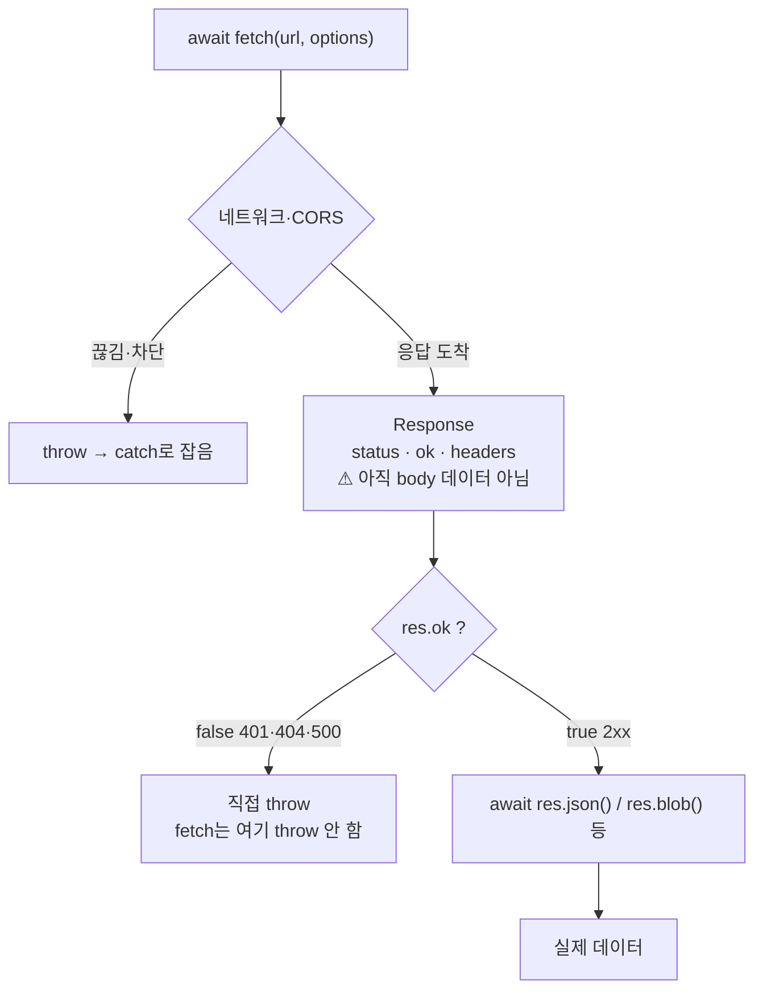

---
aliases:
  - fetchAPI
  - HTTP
  - Fetch
  - Network
  - 요청 옵션
  - Blob
  - createObjectURL
  - revokeObjectURL
  - 파일 다운로드
  - anchor download
  - response.blob
tags:
  - JavaScript
related:
  - "[[00_JS_Ecosystem_HomePage]]"
  - "[[NextJS_API_Mapper]]"
  - "[[NextJS_Types]]"
  - "[[NextJS_Concept]]"
  - "[[NextJS_ServerClient]]"
  - "[[NextJS_API_Client]]"
  - "[[NestJS_Excel]]"
  - "[[JS_FileAPI]]"
---
# JS_Fetch_API — fetch

> [!info] fetch = 브라우저·Node.js 18+ 내장 HTTP 요청 API
>
> | 구분 | 핵심 |
> |---|---|
> | 두 단계 응답 | `await fetch` → Response(껍데기) → `await res.json()` → 데이터 |
> | 에러 처리 | 4xx·5xx는 reject 아님 → `res.ok` 직접 확인 필수 |
> | throw 하는 경우 | 네트워크 실패·CORS 차단만 throw |
> | 파싱 메서드 | `json()` · `text()` · `blob()` · `arrayBuffer()` — 하나만, 한 번만 |
> | 취소 | `AbortController` + `signal` |
> | 실무 | 래퍼 함수로 감싸서 씀 → [[NextJS_API_Client]] |

---

# 흐름도 ⭐️⭐️⭐️⭐️


```mermaid
flowchart TD
  A["await fetch(url, options)"] --> B{네트워크·CORS}
  B -->|끊김·차단| X["throw → catch로 잡음"]
  B -->|응답 도착| C["Response\nstatus · ok · headers\n⚠ 아직 body 데이터 아님"]
  C --> D{"res.ok ?"}
  D -->|false 401·404·500| E["직접 throw\nfetch는 여기 throw 안 함"]
  D -->|true 2xx| F["await res.json() / res.blob() 등"]
  F --> G["실제 데이터"]
```

```txt
핵심 한 줄:
  await fetch → Response(껍데기) → ok 확인 → await json → 데이터
  4xx/5xx는 왼쪽 X가 아니라 가운데 D에서 갈라짐
```

---

# 핵심 동작 원리 ⭐️⭐️⭐️⭐️

## 두 단계로 이루어진 응답

```txt
fetch를 처음 쓸 때 가장 많이 헷갈리는 부분:
  await fetch(url)의 결과가 데이터가 아니라 "Response 객체"
```

```typescript
// ① 첫 번째 await — HTTP 헤더가 도착하면 완료
const res = await fetch('/api/user');
// res = Response 객체 (아직 데이터가 아님)
// res.status, res.ok 같은 정보만 있음

// ② 두 번째 await — body(실제 데이터)를 파싱
const user = await res.json();
// 이제야 실제 데이터를 얻음
```

```txt
왜 두 단계인가:
  HTTP 응답은 헤더와 body가 따로 도착함
  헤더가 먼저 도착 → status 코드, Content-Type 먼저 확인 가능
  body는 그 다음 스트리밍으로 도착 → 파싱까지 기다려야 함
```

---

## ⚠️ fetch는 HTTP 에러에 throw 안 함

```txt
가장 흔한 실수:
  "await fetch를 try/catch로 감쌌으니까 에러 처리 됐겠지" → ❌
```

```typescript
// ❌ 잘못된 에러 처리
try {
  const res  = await fetch('/api/user');
  const user = await res.json();
  // 404나 500이어도 여기까지 실행됨!
} catch (err) {
  // 네트워크 자체가 끊겼을 때만 여기로
}

// ✅ 올바른 에러 처리 — res.ok 체크 필수
const res = await fetch('/api/user');
if (!res.ok) throw new Error(`HTTP 에러: ${res.status}`);
const user = await res.json();
```

```txt
fetch의 동작 방식:
  네트워크 자체 실패 (인터넷 끊김, CORS 에러) → Promise reject → catch로
  HTTP 응답 옴 (200, 404, 500 전부)            → Promise resolve → catch 안 들어옴

res.ok:
  status 200~299 → true
  status 400, 404, 500 등 → false
  if (!res.ok) throw 패턴을 항상 써야 에러 응답을 잡을 수 있음
```

---

# Response 객체 ⭐️⭐️⭐️⭐️

```typescript
const res = await fetch('/api/user');

res.status      // HTTP 상태 코드: 200, 404, 500 ...
res.statusText  // 상태 메시지: "OK", "Not Found" ...
res.ok          // status 200~299 이면 true
res.headers     // Headers 객체 — res.headers.get('content-type')

// body 파싱 메서드 (한 번만 쓸 수 있음)
await res.json()        // JSON → JavaScript 객체
await res.text()        // 어떤 body든 string으로 읽음 (절대 throw 안 함)
await res.blob()        // 이미지·파일·xlsx 같은 이진 데이터 → Blob
await res.arrayBuffer() // 이진 데이터 → ArrayBuffer
```

```txt
body 파싱은 한 번만:
  res.json()을 호출하면 body 스트림이 소비됨
  이후 res.text() 호출하면 빈 값 반환
  → 한 가지만 선택해서 한 번만 파싱

Content-Type별 선택:
  'application/json'  → res.json()
  'text/html'         → res.text()
  이미지·파일·xlsx    → res.blob()
```

---

# 요청 옵션 — method / headers / body ⭐️⭐️⭐️⭐️

```typescript
fetch(url, {
  method:      'POST',
  headers:     { 'Content-Type': 'application/json', Authorization: `Bearer ${token}` },
  body:        JSON.stringify(data),
  credentials: 'include',   // 쿠키 포함 시
})
```

## 언제 무엇을 넣는가

```typescript
// GET — 조회 (method 생략 = GET)
fetch('/posts')
fetch('/posts/my', { headers: { Authorization: `Bearer ${token}` } })

// POST — 생성
fetch('/posts', {
  method:  'POST',
  headers: { 'Content-Type': 'application/json', Authorization: `Bearer ${token}` },
  body:    JSON.stringify({ title: '제목', content: '내용' }),
})

// PATCH — 일부 수정
fetch('/posts/123', {
  method:  'PATCH',
  headers: { 'Content-Type': 'application/json', Authorization: `Bearer ${token}` },
  body:    JSON.stringify({ title: '수정된 제목' }),
})

// DELETE — 삭제 (body 없음)
fetch('/posts/123', {
  method:  'DELETE',
  headers: { Authorization: `Bearer ${token}` },
})
```

```txt
method:   생략 = GET | 'POST' | 'PATCH' | 'PUT' | 'DELETE'

headers:
  Authorization      Guard 있는 엔드포인트 → 필수
  Content-Type       body가 JSON일 때만 → 'application/json'
                     GET/DELETE → 생략
                     FormData → 생략 (브라우저 자동 설정)

body:     POST·PATCH·PUT → JSON.stringify(data) | FormData 객체
          GET·DELETE     → 생략
```

## credentials — 쿠키 포함

```typescript
fetch('/api/user', { credentials: 'include' })
```

```txt
'omit'        쿠키 안 보냄 (기본값)
'same-origin' 같은 도메인일 때만 쿠키 포함
'include'     cross-origin도 쿠키 포함 → 서버 CORS도 credentials: true 필요
```

---

# 패턴 모음 ⭐️⭐️⭐️⭐️

## GET

```typescript
const res   = await fetch('/api/posts');
if (!res.ok) throw new Error(`${res.status}`);
const posts = await res.json();
```

## POST — JSON 전송

```typescript
const res = await fetch('/api/posts', {
  method:  'POST',
  headers: { 'Content-Type': 'application/json' },
  body:    JSON.stringify({ title: '제목', content: '내용' }),
});
if (!res.ok) throw new Error(`${res.status}`);
const post = await res.json();
```

## FormData — 파일 업로드

```typescript
const formData = new FormData();
formData.append('image', file);          // File 객체
formData.append('title', '이미지 제목'); // 텍스트도 같이

const res = await fetch('/api/upload', {
  method: 'POST',
  body:   formData,
  // Content-Type 헤더 직접 설정 금지
  // → 브라우저가 boundary 포함해서 자동 설정
});
```

```txt
Content-Type을 직접 설정하면 안 되는 이유:
  multipart/form-data의 Content-Type은 boundary 값을 포함해야 함
  예: Content-Type: multipart/form-data; boundary=----abc123
  직접 'multipart/form-data'만 쓰면 boundary 없어서 서버가 파싱 실패
  → Content-Type 헤더를 아예 안 넣으면 브라우저가 올바르게 자동 설정
```

## DELETE — body 없음

```typescript
const res = await fetch(`/api/posts/${postId}`, { method: 'DELETE' });
if (!res.ok) throw new Error(`${res.status}`);
// 204 No Content면 res.json() 호출 불필요
```

---

# res.blob() — 파일 다운로드 패턴 ⭐️⭐️⭐️⭐️

## Blob이란

```txt
Blob (Binary Large Object)
  브라우저 메모리에 올라간 이진 데이터 덩어리
  이미지·PDF·엑셀 같은 파일 전체를 메모리에 담는 컨테이너

  Node.js Buffer와 대응:
    Node.js  → Buffer  (서버 사이드)
    브라우저 → Blob    (클라이언트 사이드)

  res.blob():
    서버에서 받은 이진 응답(xlsx, PDF 등)을 Blob으로 변환
    res.json()이 JSON 파싱이라면 res.blob()은 이진 파싱
```

## URL.createObjectURL / revokeObjectURL ⭐️⭐️⭐️⭐️

```txt
문제:
  Blob은 메모리 안에 있는 데이터 덩어리
  <a href="...">에 넣으려면 URL이 필요한데 Blob은 URL이 아님

해결:
  URL.createObjectURL(blob)
    → "blob:https://example.com/uuid-..." 형태의 임시 URL 생성
    → 이 URL은 브라우저 메모리 내 Blob을 가리키는 포인터
    → <a href={url} download> 에 넣을 수 있게 됨

메모리 해제:
  URL.revokeObjectURL(url)
    → 임시 URL과 Blob 참조를 해제 → GC가 메모리 회수 가능
    → 다운로드 직후 바로 해제해도 됨 (파일 저장은 이미 브라우저가 시작함)
    → 호출 안 하면 탭 닫힐 때까지 Blob이 메모리 점유 → 메모리 누수
```

## anchor download 트릭 ⭐️⭐️⭐️

```txt
<a download> 속성:
  링크를 클릭했을 때 새 탭 열기 대신 파일로 다운로드
  download="파일명.xlsx" → 저장될 파일 기본명 지정 (사용자가 변경 가능)

트릭:
  버튼 클릭 → fetch → 응답 파일을 프로그래밍 방식으로 다운로드해야 할 때
  보이지 않는 <a> 엘리먼트를 DOM에 추가 → 강제 클릭 → 바로 제거
```

## 전체 패턴 ⭐️⭐️⭐️⭐️

```typescript
async function downloadDailyExcel(token: string): Promise<void> {
  const response = await fetch('/v1/admin/reports/daily-excel', {
    headers: { Authorization: `Bearer ${token}` },
  });

  if (!response.ok) {
    // 에러 응답은 JSON — blob()이 아닌 text()로 파싱
    const raw = await response.text();
    try {
      const body = JSON.parse(raw) as { message?: string };
      throw new Error(body.message ?? `HTTP ${response.status}`);
    } catch {
      throw new Error(`HTTP ${response.status}: ${raw.slice(0, 200)}`);
    }
  }

  // ① 이진 응답을 Blob으로 변환
  const blob = await response.blob();

  // ② Content-Disposition 헤더에서 파일명 추출
  const filename =
    response.headers.get('content-disposition')
      ?.match(/filename="([^"]+)"/)?.[1]
    ?? 'report.xlsx';

  // ③ Blob → 임시 URL 생성
  const url = URL.createObjectURL(blob);

  // ④ 보이지 않는 anchor → 강제 클릭
  const anchor = document.createElement('a');
  anchor.href     = url;
  anchor.download = filename;
  document.body.appendChild(anchor);
  anchor.click();
  anchor.remove();

  // ⑤ 임시 URL 해제 — Blob 메모리 회수
  URL.revokeObjectURL(url);
}
```

```txt
에러 처리가 두 갈래인 이유:
  성공 → body가 이진 파일 (xlsx 등) → blob()으로 파싱
  실패 → body가 JSON 에러 메시지   → text() + JSON.parse 로 파싱
  res.ok로 먼저 분기해야 혼용 가능

  ⚠️ Response body는 한 번만 파싱 가능
     ok 체크 전에 blob()을 먼저 호출하면 에러일 때 JSON body를 읽을 수 없음
     → 반드시 res.ok 확인 후 blob()/text() 중 하나만 호출
```

## Content-Disposition 헤더 파싱 ⭐️⭐️⭐️

```typescript
response.headers.get('content-disposition')
  ?.match(/filename="([^"]+)"/)?.[1]

// 헤더값 예시: 'attachment; filename="cinemo-2026-08-25.xlsx"'
//                           ↑ 이 파일명 부분을 추출
```

```txt
?.match(/filename="([^"]+)"/)?.[1] 분해:

  ?.match(...)       null이면 undefined (optional chaining)
  /filename="([^"]+)"/
    filename="  리터럴 매칭
    ([^"]+)     " 아닌 문자들을 캡처 그룹으로 수집 → 파일명
    "           닫는 따옴표
  ?.[1]         캡처 그룹 [1] ([0]은 전체 매치)
                매칭 실패면 undefined

  ?? 'report.xlsx'  → null/undefined일 때 기본값 폴백

NestJS StreamableFile의 disposition 설정:
  disposition: `attachment; filename="report.xlsx"`
  → [[NestJS_Excel#응답으로 직접 다운로드 — StreamableFile]]
```

---

# 에러 처리 ⭐️⭐️⭐️⭐️

## res.text() — 파싱 제어권

```txt
res.json()의 문제:
  body가 비어있으면 → SyntaxError: Unexpected end of JSON input
  body가 HTML이면  → SyntaxError: Unexpected token '<'
  에러 정보 없이 터짐 → 어떤 응답이 왔는지 알 수 없음

res.text()는 어떤 응답이든 string으로 읽음 — 절대 throw 안 함
→ 읽은 뒤 직접 분기처리 가능
```

```typescript
const raw = await res.text();

if (!raw.trim()) return undefined;    // 빈 body (204 No Content 등)

try {
  const body = JSON.parse(raw);       // JSON이면 파싱
} catch {
  // HTML·plain text → raw 앞 200자 포함해서 throw
  throw new Error(`JSON 파싱 실패 (HTTP ${res.status}): ${raw.slice(0, 200)}`);
}
```

```txt
text() vs json() 선택:
  res.json()  서버가 항상 JSON, 빈 body 없다고 확신할 때
  res.text()  204·빈 body·HTML 에러 가능성 있을 때 (래퍼 함수 구현 시)

  text()로 읽으면 이후 json() 추가 호출 불가 — JSON.parse(raw)로 직접 파싱
```

## 204 No Content

```typescript
const res = await fetch(`/api/posts/${id}`, { method: 'DELETE' });
if (!res.ok) throw new Error(`${res.status}`);

// ❌ 204이면 body가 없어서 json() 호출 시 SyntaxError
// ✅ 상태 코드 확인 후 분기
if (res.status !== 204) {
  const data = await res.json();
}
```

```txt
204 No Content:
  성공했지만 응답 body가 없음 (DELETE, 일부 PATCH)
  res.ok = true  /  res.json() 호출하면 SyntaxError
  → res.status !== 204 조건 확인 후 json() 호출
```

## CORS 에러 — fetch가 실제로 throw하는 경우

```txt
fetch가 throw하는 두 가지:
  ① 네트워크 자체 실패 (인터넷 끊김)
  ② CORS 에러 — 브라우저가 응답을 차단

CORS (Cross-Origin Resource Sharing):
  브라우저 보안 정책 — 다른 도메인에 fetch하면 브라우저가 차단
  서버(NestJS)가 Origin을 허용하지 않으면
  → TypeError: Failed to fetch 로 throw → catch로 잡힘
  → status 코드를 알 수 없음 (브라우저가 응답 차단한 것)
  → 브라우저 개발자 도구 Console에서 CORS 에러 확인

  해결: NestJS app.enableCors() 설정 확인 → [[NestJS_CORS]]
```

---

# TypeScript와 fetch ⭐️⭐️⭐️

```typescript
// res.json()의 반환 타입은 Promise<any>
// → as로 타입 단언해서 자동완성 활용

async function fetchUser(id: string): Promise<ApiUser> {
  const res = await fetch(`/api/users/${id}`);
  if (!res.ok) throw new Error(`${res.status}`);
  return res.json() as Promise<ApiUser>;
}

// 제네릭 래퍼
async function typedFetch<T>(url: string): Promise<T> {
  const res = await fetch(url);
  if (!res.ok) throw new Error(`${res.status}`);
  return res.json() as Promise<T>;
}

const user = await typedFetch<ApiUser>('/api/users/me');
```

```txt
as Promise<ApiUser>:
  TypeScript에게 타입을 알려주는 것 — 실제 런타임 검증은 아님
  → 서버가 다른 형태를 보내면 런타임 에러 가능
  → openapi-typescript로 생성한 타입 사용 시 더 안전 → [[OpenAPI_Codegen]]
```

---

# AbortController — 요청 취소 ⭐️⭐️⭐️

```typescript
useEffect(() => {
  const controller = new AbortController();

  async function load() {
    try {
      const res = await fetch('/api/posts', {
        signal: controller.signal,  // 취소 신호 연결
      });
      if (!res.ok) throw new Error(`${res.status}`);
      const data = await res.json();
      setPosts(data);
    } catch (err) {
      if (err instanceof Error && err.name === 'AbortError') return;
      // AbortError는 의도적인 취소 — 에러가 아님
      setError('불러오지 못했어요.');
    }
  }

  void load();
  return () => controller.abort();  // 언마운트 시 요청 취소
}, []);
```

```txt
AbortController가 필요한 이유:
  컴포넌트가 언마운트됐는데 fetch 응답이 오면
  → setState를 호출 → React 경고 + 메모리 누수
  → controller.abort()로 응답이 와도 무시

cancelled 플래그 패턴과의 차이:
  cancelled 플래그 → 응답은 오지만 setState를 안 함
  AbortController → 네트워크 요청 자체를 취소 (더 효율적)
```

## AbortSignal.timeout() — 타임아웃 전용 단축 ⭐️⭐️⭐️

`AbortController` 없이 한 줄로 타임아웃 설정. Node.js 17.3+ / 브라우저 모두 지원.

```typescript
const res = await fetch(url, {
  signal: AbortSignal.timeout(5000),  // 5초 초과 → TimeoutError throw
});
```

```txt
AbortController.abort()  → err.name === 'AbortError'
AbortSignal.timeout()    → err.name === 'TimeoutError'   ← 이름이 다름, 구분해서 catch

언제 쓰나?
  외부 API(카카오·네이버·결제 등) 서버사이드 호출 시
  → 응답 없으면 서버 스레드 점유 → 다른 요청까지 지연 → 장애 전파
  → 타임아웃으로 빠르게 실패(fail fast)

AbortController와 차이:
  AbortController — 컴포넌트 언마운트 등 "외부 조건으로 취소" 에 적합
  AbortSignal.timeout — 단순 시간 제한에 적합, 코드가 더 짧음
```

```typescript
// TimeoutError 잡기
try {
  const res = await fetch(url, { signal: AbortSignal.timeout(5000) });
  if (!res.ok) throw new Error(`${res.status}`);
  return res.json();
} catch (err) {
  if (err.name === 'TimeoutError') {
    // 5초 내 응답 없음
  }
  throw err;
}
```


---

# fetch vs apiFetch ⭐️⭐️⭐️

```txt
fetch를 직접 쓰면 매 요청마다 반복:
  ① Base URL 앞에 붙이기
  ② Authorization 헤더 추가
  ③ res.ok 체크
  ④ 에러 응답 body 파싱
  ⑤ JSON.stringify

→ apiFetch 래퍼를 만들어서 이 반복을 없앰
→ [[NextJS_API_Client]]
```

```typescript
// 직접 fetch
const res = await fetch(`${process.env.NEXT_PUBLIC_API_URL}/users/me`, {
  headers: { Authorization: `Bearer ${token}` },
});
if (!res.ok) throw new Error(`${res.status}`);
const user = await res.json();

// apiFetch 래퍼 사용
const user = await apiFetch<ApiUser>('/users/me');
```
