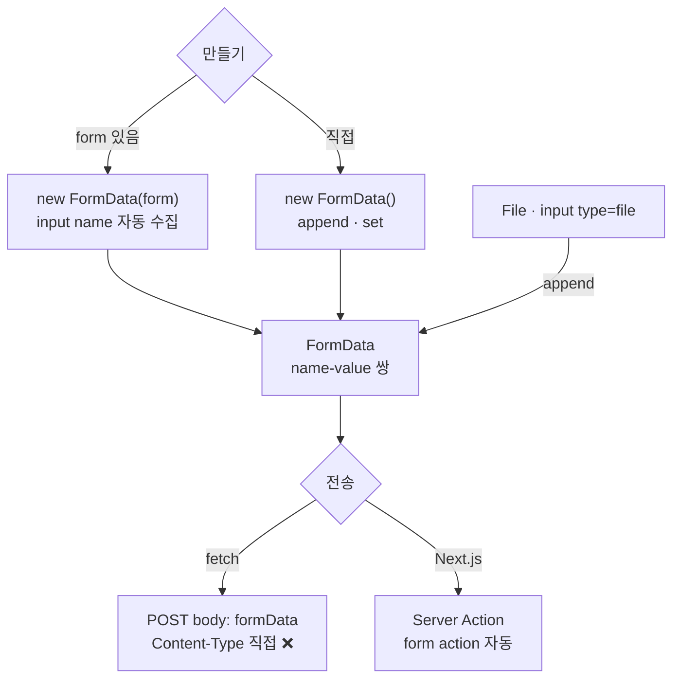

---
aliases:
  - FormData
  - multipart/form-data
  - append vs set
tags:
  - JavaScript
related:
  - "[[00_JS_Ecosystem_HomePage]]"
  - "[[NextJS_Server_Actions]]"
  - "[[JS_Object_Methods]]"
  - "[[JS_Operators]]"
  - "[[JS_BrowserAPI]]"
---
# JS_FormData — name-값 수집 / 파일 업로드

> [!info] 
> FormData는 `<form>`의 입력값들을 "이름(name)-값" 쌍으로 다루는 표준 브라우저 객체다. 
> 파일 업로드까지 포함해서 서버로 보낼 수 있는 거의 유일한 표준 방법이다.

```txt
JS_BrowserAPI에 모아둔 다른 브라우저 API(localStorage, URLSearchParams 등)와 같은 카테고리지만,
분량이 꽤 있어서 [[JS_CustomEvent]]처럼 독립 노트로 분리해둠 — 카테고리 자체는 [[JS_BrowserAPI]] 참고
```

---
# 흐름도



```txt
연결 고리 = input name ↔ formData.get(name) — id는 무관
파일 있으면 FormData · 텍스트만이면 JSON도 가능
append = 같은 name 누적 · set = 덮어쓰기 · 다중 선택은 getAll()
```

---

# FormData 만들기 — 두 가지 방법 ⭐️⭐️

```html
<form id="signupForm">
  <input name="email" type="email" />
  <input name="nickname" type="text" />
</form>
```

```javascript
// 방법 1 — 기존 <form>에서 자동으로 수집
const form = document.querySelector('#signupForm');
const formData = new FormData(form);
// form 안의 모든 input[name]/textarea[name]/select[name] 값이 자동으로 들어감

// 방법 2 — 빈 FormData를 직접 만들고 하나씩 채움
const formData2 = new FormData();
formData2.append('email', 'test@test.com');
formData2.append('nickname', '홍길동');
```

```txt
연결 고리는 오직 name 속성:
  <input name="email">  ↔  formData.get('email')
  → name이 없으면 FormData에 안 들어감, id는 전혀 관계 없음
```

---

# 주요 메서드 ⭐️⭐️⭐️

|메서드|역할|
|---|---|
|`append(name, value)`|값을 추가 — 같은 name이 이미 있어도 "둘 다" 유지됨 (덮어쓰지 않음)|
|`set(name, value)`|값을 설정 — 같은 name이 있으면 "덮어씀" (하나만 남음)|
|`get(name)`|그 name의 첫 번째 값 하나 (없으면 `null`)|
|`getAll(name)`|그 name의 모든 값을 배열로 (체크박스 여러 개 선택 등)|
|`has(name)`|그 name이 있는지 `true`/`false`|
|`delete(name)`|그 name의 값을 전부 제거|
|`entries()` / `keys()` / `values()`|전체를 순회할 때 (for...of와 함께)|

## append vs set — 헷갈리지 않기 ⭐️

```javascript
const fd = new FormData();
fd.append('hobby', '독서');
fd.append('hobby', '영화감상');   // 같은 name을 또 append

fd.get('hobby');      // '독서' (첫 번째 값만)
fd.getAll('hobby');   // ['독서', '영화감상'] (전부)

fd.set('hobby', '게임');   // 기존 값들을 다 지우고 하나로 덮어씀
fd.getAll('hobby');        // ['게임']
```

```txt
체크박스처럼 "같은 name으로 여러 값이 동시에 선택될 수 있는" 입력은
get() 한 번만 쓰면 첫 번째 값만 가져오는 실수를 하기 쉬움 → 그럴 땐 항상 getAll()
```

## 전체 순회하기

```javascript
for (const [name, value] of formData.entries()) {
  console.log(name, value);
}

// 일반 객체로 한 번에 변환 (값이 1:1인 경우에만 적합 — 같은 name 중복이 있으면 마지막 값만 남음)
const obj = Object.fromEntries(formData);
```

```txt
formData.entries()가 [name, value] 배열을 반환해서 for...of + 구조분해로 바로 꺼낼 수 있는 것,
그리고 Object.fromEntries로 다시 객체로 되돌리는 것까지 — 이 패턴 자체는 FormData만의 것이 아니라
Object.entries/fromEntries 전반에 적용되는 일반 패턴 — 자세한 건 [[JS_Object_Methods]] 참고
```

---

# 파일 업로드 ⭐️⭐️⭐️

```html
<input type="file" name="profileImage" />
```

```javascript
const fileInput = document.querySelector('input[type="file"]');
const formData = new FormData();
formData.append('profileImage', fileInput.files[0]);   // File 객체를 그대로 append
```

```txt
fileInput.files는 FileList(선택된 파일들의 목록) — files[0]으로 첫 번째 파일을 꺼냄
FormData.append는 두 번째 인자로 File/Blob 객체를 그대로 받을 수 있음
→ 파일을 base64로 직접 인코딩하거나 따로 처리할 필요 없이, FormData에 넣기만 하면 됨
```

```javascript
// 여러 파일을 한꺼번에 보내고 싶으면
[...fileInput.files].forEach((file) => formData.append('photos', file));
// 같은 name('photos')으로 여러 번 append → 서버는 getAll 스타일로 여러 개를 받게 됨
```

```txt
[...fileInput.files] — FileList는 배열이 아니라 유사 배열(array-like)이라 forEach를 직접 못 씀
스프레드(...)로 먼저 진짜 배열로 펼친 뒤에 forEach를 이어 쓴 것
(스프레드 자체의 동작은 [[JS_Operators]], forEach 자체는 [[JS_Array_Methods]] 참고)
```

---

# fetch로 전송하기 ⭐️⭐️⭐️

```javascript
const res = await fetch('/api/upload', {
  method: 'POST',
  body: formData,   // FormData 객체를 그대로 body에
});
```

## ⚠️ Content-Type 헤더를 직접 설정하면 안 되는 이유

```txt
JSON을 보낼 땐 보통 이렇게 함:
  headers: { 'Content-Type': 'application/json' }

근데 FormData를 보낼 땐 Content-Type을 절대 직접 쓰면 안 됨:
  body로 FormData를 넘기면 브라우저가 자동으로
  'Content-Type: multipart/form-data; boundary=----WebKitFormBoundary...'
  같은 헤더를 직접 만들어서 붙여줌

  boundary는 "각 필드/파일을 구분하는 경계선 문자열"인데
  이 값은 매번 랜덤하게 생성되고, 브라우저만 정확히 알 수 있음
  → 내가 직접 'multipart/form-data'라고만 적으면 boundary가 빠져서
    서버가 어디서부터 어디까지가 한 필드인지 구분을 못 해 파싱에 실패함

→ FormData를 body로 쓸 땐 headers를 그냥 생략하는 게 정답 (브라우저가 다 알아서 채움)
```

---

# FormData vs JSON — 언제 뭘 쓰나 ⭐️⭐️

|상황|선택|
|---|---|
|파일 업로드가 포함됨|FormData (거의 유일한 표준 방법)|
|순수 텍스트/숫자만, 파일 없음|`JSON.stringify(객체)`도 가능, 더 다루기 편함|
|폼을 그대로 제출하는 전통적인 방식|FormData (브라우저가 자동 수집)|

```javascript
// JSON으로 보낼 때
fetch(url, {
  method: 'POST',
  headers: { 'Content-Type': 'application/json' },
  body: JSON.stringify({ email, nickname }),
});

// FormData로 보낼 때
fetch(url, { method: 'POST', body: formData });   // headers 생략
```

```txt
파일이 하나라도 섞여 있으면 JSON으로는 보낼 수 없음 (JSON은 텍스트 기반이라 바이너리 파일을
그대로 못 담음 — 굳이 하려면 base64 인코딩 같은 변환이 필요해서 더 번거로움)
→ 그래서 "파일 업로드 여부"가 FormData/JSON 선택의 가장 큰 기준
```

---

# Next.js Server Action에서는 — 자동으로 생김

```txt
일반 HTML/JS에서는 위처럼 new FormData(form)으로 "직접" 만들어야 하지만
Next.js의 <form action={서버함수}> 패턴에서는
  브라우저가 폼 제출 시 FormData를 "자동으로" 만들어서 서버 함수의 인자로 넘겨줌
→ 이 노트가 다룬 FormData 자체의 메서드(get/getAll/append 등)는 그대로 똑같이 적용됨
  (Next.js 쪽 활용은 [[NextJS_Server_Actions]] 참고)
```

---

# 한눈에

```txt
new FormData(form)         기존 폼에서 자동 수집
new FormData() + append()  직접 하나씩 채우기

append  같은 name 누적 (체크박스 등) / set  같은 name 덮어쓰기
get     첫 값 하나 / getAll  전체 배열로 (다중 선택엔 getAll 필수)

파일: <input type="file">의 files[0](File 객체)를 append에 그대로 넣으면 됨
여러 파일은 [...files].forEach(file => formData.append(name, file))

fetch로 보낼 때 Content-Type 헤더는 직접 쓰지 말 것 — 브라우저가 boundary까지 알아서 채움

파일 있으면 FormData, 순수 텍스트만이면 JSON도 가능 — 파일 유무가 선택 기준

Object.fromEntries(formData)로 일반 객체로 변환 가능 — [[JS_Object_Methods]] 참고
Next.js Server Action에서는 이 FormData가 자동으로 만들어짐 — [[NextJS_Server_Actions]] 참고
```