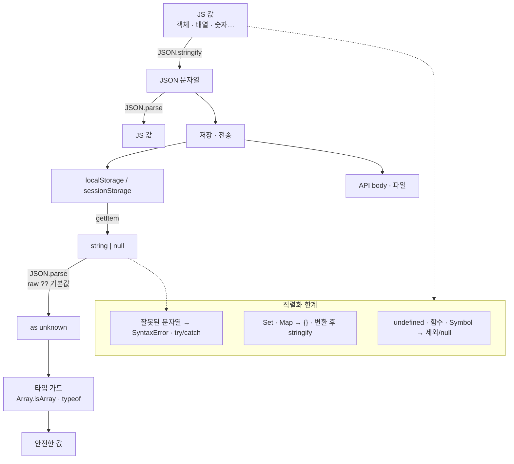

# JS_JSON — JSON 직렬화 & 역직렬화

> [!info] 
> JSON = 데이터를 문자열로 표현하는 포맷. 
> `JSON.stringify`로 값 → 문자열, 
> `JSON.parse`로 문자열 → 값. 저장·전송에 쓸 수 있는 건 문자열뿐이라서 객체·배열·Set 등은 반드시 직렬화가 필요하다.

---
# 흐름도



```txt
한 줄 왕복:
  값 ──stringify──▶ 문자열 ──저장/전송──▶ 문자열 ──parse──▶ 값

왜 필요하나:
  storage · HTTP는 문자열만 받음
  → 객체/배열/Set을 그대로 못 넣음 → stringify 필수
  → 꺼낸 뒤 parse + (권장) as unknown + 가드

실전 예 (친구 요청 seen ids):
  sessionStorage.setItem(key, JSON.stringify([...ids]))
  JSON.parse(raw) as unknown → Array.isArray → string[] 필터
  → [[JS_WebStorage]]
```

---

# JSON.stringify — 값 → 문자열 ⭐️⭐️⭐️⭐️

```typescript
JSON.stringify({ name: '홍길동', age: 30 })
// → '{"name":"홍길동","age":30}'

JSON.stringify([1, 2, 3])
// → '[1,2,3]'

// 들여쓰기 — 읽기 좋게 (디버깅, 파일 저장 시)
JSON.stringify({ name: '홍길동' }, null, 2)
// → '{\n  "name": "홍길동"\n}'
```

## 직렬화되지 않는 값 ⭐️⭐️⭐️

```typescript
JSON.stringify(undefined)           // undefined (문자열 아님 — 결과가 없음)
JSON.stringify({ a: undefined })    // '{}'       (undefined 속성은 제외)
JSON.stringify([undefined])         // '[null]'   (배열 안 undefined는 null로)
JSON.stringify(() => {})            // undefined  (함수 제외)
JSON.stringify(Symbol())            // undefined  (Symbol 제외)
JSON.stringify(new Set(['a']))      // '{}'       (Set — 내부 슬롯이라 못 읽음)
JSON.stringify(new Map([['a', 1]])) // '{}'       (Map — 마찬가지)
JSON.stringify(new Date())          // '"2024-01-01T00:00:00.000Z"' (ISO 문자열로)
JSON.stringify(Infinity)            // 'null'
JSON.stringify(NaN)                 // 'null'
```

```txt
직렬화 안 되는 것들의 공통점:
  JSON은 JavaScript 전용이 아닌 범용 포맷
  → 모든 언어에서 표현 가능한 값만: 문자열, 숫자, boolean, null, 배열, 객체

  undefined, 함수, Symbol → JSON에 없는 개념 → 제외되거나 null로 변환
  Set, Map → 내부 슬롯에 데이터 → JSON이 읽지 못함

Set / Map 저장:
  [...set]      배열로 변환 후 JSON.stringify
  Object.fromEntries(map)  객체로 변환 후 JSON.stringify
  → 상세 → [[JS_WebStorage]]
```

## replacer — 직렬화 제어 ⭐️

```typescript
// 특정 필드만 포함
JSON.stringify(user, ['name', 'email'])
// → '{"name":"홍길동","email":"hong@example.com"}'

// 함수로 세밀하게 제어
JSON.stringify(data, (key, value) => {
  if (key === 'password') return undefined;  // 비밀번호 제외
  return value;
});
```

---

# JSON.parse — 문자열 → 값 ⭐️⭐️⭐️⭐️

```typescript
JSON.parse('{"name":"홍길동","age":30}')
// → { name: '홍길동', age: 30 }

JSON.parse('[1,2,3]')
// → [1, 2, 3]

// ⚠️ 유효하지 않은 JSON → SyntaxError
JSON.parse('undefined')  // SyntaxError
JSON.parse('{name:홍}')  // SyntaxError (키는 반드시 큰따옴표)
JSON.parse("'hello'")    // SyntaxError (작은따옴표 안 됨)
```

```txt
JSON 문법 규칙 (JS 객체 리터럴과 다른 점):
  키는 반드시 큰따옴표   { "name": "홍" }   ← 작은따옴표 안 됨
  trailing comma 안 됨  { "a": 1, }        ← 마지막 쉼표 에러
  undefined 없음        null만 허용
  주석 안 됨            // 주석 → 에러
```

## getItem과 같이 쓸 때 — ?? 기본값 ⭐️⭐️

```typescript
// getItem은 없으면 null 반환
// JSON.parse(null)은 null을 반환하지만 타입이 any라 위험
const raw = localStorage.getItem('user');

// ?? 'null'로 방어 — JSON.parse('null')은 null을 정상 반환
const user = JSON.parse(raw ?? 'null') as User | null;

// 배열 기본값
const list = JSON.parse(localStorage.getItem('items') ?? '[]') as Item[];
```

---

# JSON.parse — unknown 타입 안전 패턴 ⭐️⭐️⭐️⭐️

```typescript
// JSON.parse 반환 타입은 any — 검증 없이 쓰면 런타임 에러 위험
const raw    = localStorage.getItem('data');
const parsed = JSON.parse(raw ?? 'null') as unknown;  // ← unknown으로 받기

// 이후 타입 가드로 좁히기
if (typeof parsed === 'string') { /* string */ }
if (Array.isArray(parsed)) { /* 배열 */ }
if (parsed !== null && typeof parsed === 'object') { /* 객체 */ }
```

```typescript
// 실전 — 배열 + 요소 타입까지 검증
function parseStringArray(raw: string | null): string[] {
  try {
    const parsed = JSON.parse(raw ?? '[]') as unknown;
    if (!Array.isArray(parsed)) return [];
    return parsed.filter((x): x is string => typeof x === 'string');
    //            ↑ 타입 서술어 — true면 x가 string임을 TS에 알림
    //            → filter 결과가 string[]로 확정
    //            → [[TS_Type_Guards]] / [[JS_Array_Methods]] 참고
  } catch {
    return [];
  }
}
```

```txt
as unknown이 as any보다 나은 이유:
  as any  → 이후 모든 접근이 타입 검사 없이 통과 (위험)
  as unknown → 타입 가드로 좁히기 전까지 아무것도 못 씀 (안전)

try-catch가 필요한 이유:
  JSON.parse는 잘못된 JSON에서 SyntaxError 던짐
  외부에서 저장된 값이 유효한 JSON이라는 보장 없음
  → catch에서 기본값 반환이 항상 안전
```

---

# reviver — 파싱 제어 ⭐️

```typescript
// 날짜 문자열을 Date 객체로 자동 변환
const data = JSON.parse(jsonString, (key, value) => {
  if (key === 'createdAt' && typeof value === 'string') {
    return new Date(value);
  }
  return value;
});
```

```txt
JSON.parse(text, reviver):
  파싱 후 각 키-값 쌍마다 reviver 함수 호출
  반환값이 실제 값으로 사용됨
  → 날짜 문자열 → Date 객체 변환에 자주 씀
```

---

# 직렬화 가능 타입 한눈에

|타입|직렬화 결과|비고|
|---|---|---|
|`string`|`"hello"`|큰따옴표로 감싸짐|
|`number`|`42`|Infinity/NaN → null|
|`boolean`|`true` / `false`||
|`null`|`null`||
|일반 객체|`{"key":"value"}`||
|배열|`[1,"a",true]`||
|`undefined`|제외/null|속성이면 제외, 배열이면 null|
|함수|제외||
|`Symbol`|제외||
|`Set`|`{}`|`[...set]` 후 직렬화|
|`Map`|`{}`|`Object.fromEntries(map)` 후 직렬화|
|`Date`|`"2024-01-01T00:00:00.000Z"`|ISO 문자열 (역직렬화 시 Date로 변환 안 됨)|
|`BigInt`|TypeError|지원 안 함|

---

# 한눈에

```txt
JSON.stringify(value, replacer?, space?)
  값 → 문자열
  undefined/함수/Symbol → 제외 (속성) 또는 null (배열)
  Set/Map → {} (직렬화 전 배열/객체로 변환 필요)
  space: 2  들여쓰기 (디버깅, 파일 저장)

JSON.parse(text, reviver?)
  문자열 → 값
  잘못된 JSON → SyntaxError → try-catch 필수
  반환 타입 any → as unknown으로 받고 타입 가드로 좁히기

자주 쓰는 조합:
  저장: JSON.stringify([...set])
  읽기: JSON.parse(raw ?? '[]') as unknown → Array.isArray → filter 타입 서술어
  날짜 복원: JSON.parse(text, (k, v) => k === 'date' ? new Date(v) : v)

Set/Map 직렬화 → [[JS_WebStorage]]
타입 서술어 filter 패턴 → [[TS_Type_Guards]] / [[JS_Array_Methods]]
```