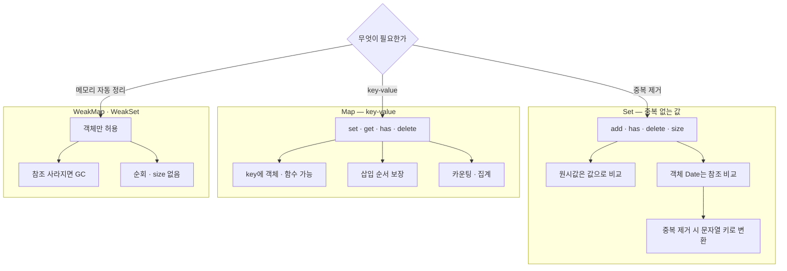

---
aliases:
  - 자료구조
  - 중복제거
  - Map
  - Set
  - WeakMap
  - WeakSet
tags:
  - JavaScript
related:
  - "[[00_JS_Ecosystem_HomePage]]"
  - "[[JS_Array_Methods]]"
  - "[[React_useMemo_useCallback_useEffect]]"
  - "[[NestJS_StatsBucket]]"
  - "[[NestJS_Throttle]]"
---
# JS_Map_Set — Set / Map / WeakMap / WeakSet

> [!info] 
> Set은 중복 없는 "값" 모음(배열 중복 제거에 자주 씀)이고, Map은 key-value 저장소(객체보다 자유로운 key, 순서 보장)다.
>  WeakSet/WeakMap은 Set/Map과 거의 같지만, 참조가 사라지면 자동으로 메모리가 정리된다.

---
# 흐름도



```txt
Set은 값 중복 제거 · Map은 key-value · Weak는 참조 없어지면 자동 GC
Set에 객체 Date는 참조 비교 — 같은 날은 YYYY-MM-DD 문자열 키로
```

---

# Set — 중복 없는 값 모음 ⭐️

## 기본 사용

```javascript
const set = new Set();

set.add(1);
set.add(2);
set.add(1);          // 이미 있음 → 무시됨

set.size             // 2 (중복 제거됨)
set.has(1)            // true
set.delete(1);
set.has(1)            // false
```

|메서드|의미|
|---|---|
|`add(value)`|값 추가|
|`has(value)`|값이 있는지 확인 (true/false)|
|`delete(value)`|값 제거|
|`size`|들어있는 값의 개수|

```javascript
// 배열로 바로 생성 — 가장 흔한 사용법
const arr = [1, 2, 2, 3, 3, 3];
const unique = new Set(arr);
[...unique]              // [1, 2, 3]
// 또는
Array.from(new Set(arr)) // 결과 동일 — Array.from 자체는 [[JS_Array_Methods]] 참고
```

## 순회

```javascript
const set = new Set(['a', 'b', 'c']);

for (const value of set) { console.log(value); }
set.forEach(value => console.log(value));
```

## ⚠️ Set은 "참조"로 중복을 판단함 (객체/Date 주의) ⭐️

```javascript
new Set([1, 1, 2]).size          // 2  ← 원시값은 값 자체로 비교됨

new Set([{}, {}]).size           // 2  ← 객체는 참조로 비교 → 다른 객체로 취급
new Set([new Date('2026-06-16'), new Date('2026-06-16')]).size
// → 2  ← 같은 날짜를 가리켜도 "다른 Date 인스턴스" → 중복 제거 안 됨!
```

```txt
이유: Set은 SameValueZero 비교 알고리즘을 씀
  원시값(number, string)  → 값 자체로 비교 (1 === 1)
  객체(object, Date 포함) → 참조로 비교 ({} === {} → false)
  → 객체/배열의 === 비교가 "참조"로 일어난다는 것은 [[JS_Operators]] 참고 — Set의 중복 판단도 같은 원리

그래서 Date를 직접 Set에 넣어 "같은 날"을 걸러내려 하면 실패함
→ 해결: Date 대신 "날짜를 나타내는 문자열(YYYY-MM-DD)"을 Set의 기준으로 사용
```

## 실전 — 같은 날짜 중복 제거 ⭐️

```typescript
// 방문/이벤트 기록 — 같은 날 여러 건이 있어도 달력엔 점 하나만
const visitedDates = useMemo(() => {
  const seen = new Set<string>();      // 날짜 "문자열"을 기준으로 중복 체크
  const dates: Date[] = [];

  for (const visit of visits) {
    const key = visit.visitedAt.slice(0, 10);   // 'YYYY-MM-DD' 부분만 추출
    if (seen.has(key)) continue;                // 이미 처리한 날짜면 건너뜀
    seen.add(key);
    dates.push(toVisitDate(visit.visitedAt));    // 실제로 쓸 Date는 따로 변환해서 push
  }
  return dates;
}, [visits]);
```

```txt
왜 Set<string>이고 Set<Date>가 아닌지:
  visit.visitedAt은 ISO 문자열('2026-06-18T03:00:00.000Z')
  slice(0, 10)으로 'YYYY-MM-DD' 부분만 뽑으면 → 원시값(string)
  → 원시값은 Set이 "값"으로 비교하므로 같은 날짜 문자열은 정확히 중복 제거됨

  반대로 Date 객체를 바로 Set에 넣었다면
  → 위에서 본 것처럼 "참조"로 비교되어 중복 제거가 안 됐을 것

흐름:
  1. seen(문자열 Set)으로 "이 날짜를 이미 처리했는지" 빠르게 확인 (has는 O(1))
  2. 처음 보는 날짜면 seen에 추가 + dates 배열에 실제 Date를 push
  3. 이미 처리한 날짜면 continue로 건너뜀 → 같은 날 여러 건이 있어도 한 번만 push

  Set 없이 visits.map(v => toVisitDate(v.visitedAt))만 하면:
  → 같은 날짜가 여러 번 들어간 배열이 됨 (중복 제거 안 됨)
  → 달력 같은 컴포넌트에 그대로 넘기면 같은 날짜 표시가 중복 적용되는 식의 버그가 생김

seen이라는 이름:
  "이미 본(seen) 항목들"이라는 의미의 흔한 관용적 변수명
  → 중복 체크용 Set에 자주 붙이는 이름일 뿐, 꼭 이 이름이어야 하는 건 아님
```

---

# Map — key-value 저장 ⭐️

## 기본 사용

```javascript
const map = new Map();

map.set('a', 1);
map.set('b', 2);

map.get('a')     // 1
map.has('a')     // true
map.delete('a');
map.size         // 1

// 생성자에 배열로 바로 초기화
const map2 = new Map([
  ['a', 1],
  ['b', 2],
]);
```

|메서드|의미|
|---|---|
|`set(key, value)`|key-value 추가 (이미 있는 key면 값 덮어씀)|
|`get(key)`|key로 value 조회 (없으면 undefined)|
|`has(key)`|key가 있는지 확인 (true/false)|
|`delete(key)`|key 제거|
|`size`|들어있는 key-value 쌍의 개수|

## Map vs 일반 Object — 언제 Map을 쓰나

```txt
Object                            Map
key가 string / Symbol만 가능        key로 객체 / 함수 / Date 등 아무 값이나 가능
순서 보장이 명세상 핵심은 아님        삽입 순서 그대로 보장
size 속성 없음 (Object.keys 필요)    map.size로 바로 개수 확인
프로토타입 체인과 섞여 있음           순수한 key-value 저장소

Map이 유리한 경우:
  key가 객체/함수여야 할 때 (예: 컴포넌트 인스턴스별 데이터)
  key-value 쌍이 자주 추가/삭제될 때
  순서 보장이 중요한 경우
```

## 순회

```javascript
const map = new Map([['a', 1], ['b', 2]]);

for (const [key, value] of map) { console.log(key, value); }
map.forEach((value, key) => console.log(key, value));

[...map.keys()]     // ['a', 'b']
[...map.values()]   // [1, 2]
[...map.entries()]  // [['a', 1], ['b', 2]]
```

## 실전 — 카운팅 패턴 ⭐️

```typescript
// 항목별 발생 횟수 집계
function countByKey(items: Item[]) {
  const counts = new Map<number, number>();

  for (const item of items) {
    counts.set(item.groupId, (counts.get(item.groupId) ?? 0) + 1);
    //                        ↑ 없으면 0, 있으면 현재 값 +1
  }
  return counts;
}
```

```txt
이 카운팅 패턴을 "미리 0으로 채운 고정 키 목록" 위에서 하면 — 날짜별/시간대별 통계처럼
데이터가 없는 구간도 0으로 보여줘야 하는 차트용 집계가 됨 — 실전 적용은 [[NestJS_StatsBucket]] 참고

Map을 "마지막 실행 시각"을 기억하는 스로틀링 저장소로 쓰는 패턴은 [[NestJS_Throttle]] 참고
```

---

# WeakMap / WeakSet — 약한 참조 ⭐️

```txt
일반 Map/Set의 문제:
  map.set(someObject, data)로 객체를 key로 저장하면
  → map이 그 객체를 계속 참조하게 됨
  → someObject를 다른 곳에서 다 안 써도, map에 남아있는 한 GC(가비지 컬렉션) 안 됨
  → 의도치 않은 메모리 누수 가능

WeakMap / WeakSet은:
  key(WeakMap) 또는 값(WeakSet)으로 "객체만" 허용
  그 객체가 다른 곳에서 더는 참조되지 않으면 → GC 대상이 됨 (Map에 남아있어도 자동 정리)
```

```javascript
const cache = new WeakMap();

function getMetadata(domNode) {
  if (!cache.has(domNode)) {
    cache.set(domNode, { clicks: 0 });
  }
  return cache.get(domNode);
}

// domNode가 화면에서 제거되고 다른 곳에서 참조도 안 하면
// → cache 안의 항목도 자동으로 GC됨 (직접 delete 안 해도 됨)
```

## 일반 Map/Set과의 차이 ⭐️

```txt
WeakMap / WeakSet은:
  key(또는 값)로 객체만 가능 (원시값 X)
  순회 불가 — forEach, for...of, size 없음
    (객체가 언제 GC될지 알 수 없어서, 순회 자체가 의미 없음)
  has / get / set / delete만 가능

→ "이 객체에 대한 부가 데이터를 저장하고 싶은데,
   객체가 사라지면 그 데이터도 같이 사라져야 한다"는 상황에 적합
```

---

# 한눈에

| |Set|Map|WeakSet|WeakMap|
|---|---|---|---|---|
|저장|값만|key-value|값만 (객체만)|key-value (key는 객체만)|
|중복|허용 안 함|key 중복 허용 안 함|허용 안 함|key 중복 허용 안 함|
|비교 방식|SameValueZero (객체는 참조 비교)|key도 동일|참조 비교|key 참조 비교|
|순회|가능|가능|불가능|불가능|
|size|있음|있음|없음|없음|
|GC|일반 참조 (메모리에 계속 남음)|일반 참조|약한 참조 (자동 정리)|약한 참조 (자동 정리)|

```txt
배열 중복 제거            → [...new Set(arr)] 또는 Array.from(new Set(arr)) — [[JS_Array_Methods]] 참고
객체/Date 중복 제거        → 원시값(문자열 등)으로 변환 후 Set 사용 ⭐️
key-value 저장            → Map (key가 객체/함수일 수도 있을 때 특히 유리)
객체별 부가 데이터 + 메모리 누수 방지 → WeakMap
```