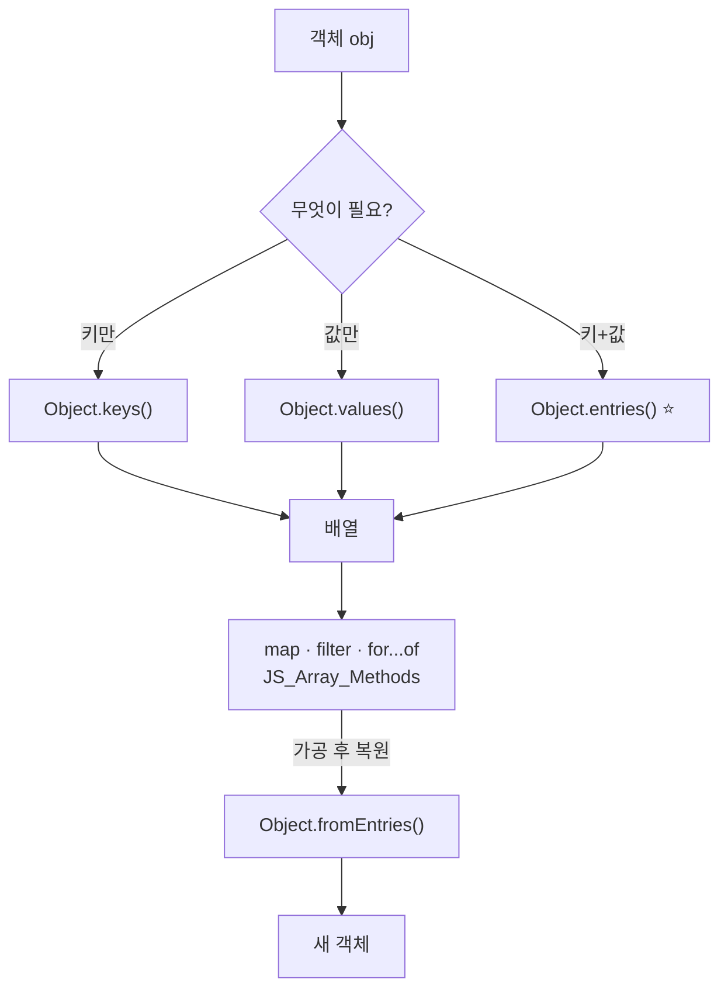

# JS_Object_Methods — 객체를 배열로 다루기

> [!info] 
>  Object.keys/values/entries는 객체의 내용을 배열로 뽑아내는 방법이다.
>   객체 자체는 map/filter 같은 배열 메서드를 직접 못 쓰지만, 일단 이 메서드들로 배열을 만들고 나면 [[JS_Array_Methods]]의 모든 메서드를 그대로 이어서 쓸 수 있다.

---
# 흐름도



```txt
객체는 map/filter 직접 ❌ — keys/values/entries로 배열 만든 뒤 배열 메서드 사용
모르겠으면 entries부터 — 키만 [k] · 값만 [, v] 구조분해로 건너뛰기
합치기: 평소 { ...a, ...b } · fromEntries는 entries 가공 후 되돌릴 때
```

---

# 왜 필요한가 — 객체는 배열 메서드를 직접 못 씀 ⭐️⭐️⭐️

```typescript
const obj = { a: 1, b: 2 };

obj.map((v) => v * 2);   // ❌ TypeError — 객체엔 map이 없음

Object.entries(obj).map(([k, v]) => v * 2);   // ✅ 일단 배열로 바꾸면 map 사용 가능
```

```txt
배열 메서드(map/filter/reduce 등)는 Array.prototype에 정의돼있어서 배열에서만 동작함
객체 자체를 순회/변환하고 싶다면, 먼저 Object.keys/values/entries로 "배열"을 만들어야
그 다음부터 익숙한 배열 메서드 체이닝을 그대로 이어 쓸 수 있음
```

---

# Object.keys / values / entries — 세 가지 ⭐️⭐️⭐️⭐️

```typescript
const user = { name: '공이', age: 20 };

Object.keys(user);    // ['name', 'age']             — 키만
Object.values(user);  // ['공이', 20]                 — 값만
Object.entries(user); // [['name', '공이'], ['age', 20]] — [키, 값] 쌍의 배열
```

|메서드|반환|언제 쓰나|
|---|---|---|
|`Object.keys(obj)`|키 문자열 배열|키 이름만 필요할 때 (개수 세기, 키 목록 확인 등)|
|`Object.values(obj)`|값 배열|값만 필요할 때 (합계 계산, 값 목록 확인 등)|
|`Object.entries(obj)`|`[키, 값]` 쌍의 배열|키와 값을 같이 다뤄야 할 때 — 가장 범용적|

```txt
셋 중 뭘 골라야 할지 모르겠다면: 일단 Object.entries부터 떠올리는 게 안전함
키만 필요하면 나중에 [k] 만 쓰고 무시하면 되고, 값만 필요하면 [, v] 로 키를 건너뛰면 됨
→ entries가 keys+values를 합친 가장 일반적인 형태이기 때문
```

---

# Object.entries — for...of와 짝, 구조분해와 잘 어울림 ⭐️⭐️⭐️

```typescript
for (const [key, value] of Object.entries(user)) {
  console.log(key, value);
}
```

```txt
Object.entries가 [키, 값] "배열"을 반환하기 때문에, for...of의 각 반복에서
배열 구조분해([key, value])로 바로 이름을 붙여 꺼낼 수 있음 — 이 둘이 항상 같이 다니는 이유
(구조분해 자체의 동작은 [[JS_Operators]] 참고)
```

---

# 실전 — class-validator 에러 순회 ⭐️⭐️⭐️⭐️

```typescript
// 키만 필요한 경우 — 어떤 제약을 어겼는지만 알면 됨
for (const key of Object.keys(error.constraints)) {
  messages.push(getValidationMessage(error.property, key));
}

// 키 + 값(기본 메시지) 둘 다 필요한 경우 — 영어 기본 메시지를 fallback으로 같이 써야 할 때
for (const [key, msg] of Object.entries(error.constraints ?? {})) {
  messages.push(toKoMessage(key, msg));
}
```

```txt
[[NestJS_DTO]]의 exceptionFactory에서 이 둘이 같이 등장한 이유:
  Object.keys만 쓴 버전  → 키만으로 한국어 메시지를 표에서 찾아오니 영어 기본 메시지(값) 자체는 필요 없음
  Object.entries를 쓴 버전 → 표에 없는 키일 때 "원래 영어 메시지를 그대로 보여줄 fallback"이 필요해서
                            그 영어 메시지(값)까지 같이 꺼내야 함
  → 어느 메서드를 쓰는지는 "값(기존 메시지)도 같이 써야 하는가"로 결정됨
```

---

# 빈 객체 확인 — Object.keys(obj).length === 0 ⭐️⭐️

```typescript
if (Object.keys(obj).length === 0) {
  // 객체가 비어있음
}
```

```txt
빈 객체 {}는 truthy라서 if (obj)만으로는 "비었는지" 확인이 안 됨 — 자세한 이유는 [[JS_Truthy_Falsy]] 참고
Object.keys(obj)로 키 배열을 뽑아서 그 length가 0인지 보는 게 "내용이 비었는가"를 확인하는 정확한 방법
```

---

# Object.fromEntries — entries의 반대 ⭐️

```typescript
const entries = [['a', 1], ['b', 2]];
Object.fromEntries(entries); // { a: 1, b: 2 }
```

```txt
Object.entries(obj)로 배열로 바꾼 뒤, 배열 메서드(map/filter 등)로 가공하고,
다시 객체로 되돌리고 싶을 때 짝으로 씀 — "객체 → 배열로 변환·가공 → 다시 객체로" 흐름의 마지막 단계

예: 값을 전부 2배로 만든 새 객체
Object.fromEntries(
  Object.entries(user).map(([k, v]) => [k, typeof v === 'number' ? v * 2 : v])
);
```

---

# Object.assign vs 스프레드({...obj}) — 합치는 두 가지 방법 ⭐️⭐️⭐️⭐️

```typescript
const a = { x: 1 };
const b = { y: 2 };

const merged1 = Object.assign(a, b);   // ⚠️ a 자신이 바뀜! { x: 1, y: 2 }
a === merged1                           // true — 새 객체가 아니라 a를 직접 변형한 것

const merged2 = { ...a, ...b };         // ✅ a, b는 그대로, 완전히 새 객체가 만들어짐
a === merged2                           // false
```

|방법|원본 변형 여부|
|---|---|
|`Object.assign(target, ...sources)`|`target`(첫 번째 인자) 자체를 직접 변형함|
|`{ ...obj }` (스프레드)|항상 새 객체를 만듦 — 원본은 그대로|

```txt
React를 포함한 대부분의 최신 코드에서 스프레드를 더 흔히 쓰는 이유:
  state 등을 직접 변형(mutate)하면 안 되는 규칙이 많아서, "항상 새 객체를 만드는" 스프레드가 더 안전함
  Object.assign은 "정말 원본 자체를 합쳐서 바꾸고 싶을 때"만 의도적으로 사용
  (스프레드 자체의 동작과 얕은 복사 주의점은 [[JS_Operators]] 참고)

빈 객체를 첫 번째 인자로 주면 Object.assign도 새 객체를 만드는 것처럼 쓸 수 있음:
  Object.assign({}, a, b)  → { ...a, ...b } 와 결과는 같음, 그래도 스프레드 쪽이 더 짧고 흔함
```

---

# Object.freeze — 얕은 불변성 ⭐️

```typescript
const config = Object.freeze({ apiUrl: 'https://example.com', nested: { a: 1 } });

config.apiUrl = '다른 값'; // 조용히 무시됨(strict mode면 에러) — 변경 안 됨
config.nested.a = 2;        // ⚠️ 이건 바뀜! — freeze는 "한 단계"만 동결함
```

```txt
Object.freeze는 얕은(shallow) 동결 — 객체 바로 아래 단계의 값 재할당만 막음
중첩된 객체/배열 내부까지는 보호 안 됨 — 완전한 깊은 불변성이 필요하면 별도 라이브러리나
재귀적으로 직접 freeze를 적용해야 함
```

---

# 한눈에

| 메서드                             | 반환                              | 핵심                                    |
| ------------------------------- | ------------------------------- | ------------------------------------- |
| `Object.keys(obj)`              | 키 배열                            | 키만 필요할 때                              |
| `Object.values(obj)`            | 값 배열                            | 값만 필요할 때                              |
| `Object.entries(obj)`           | `[키,값]` 배열                      | 가장 범용적, `for...of`+구조분해와 잘 맞음         |
| `Object.fromEntries(arr)`       | 객체                              | `entries`로 가공한 배열을 다시 객체로             |
| `Object.assign(target, ...src)` | target 자체(변형됨)                  | 원본을 직접 합쳐야 할 때만 — 평소엔 스프레드 권장         |
| `{ ...obj }`                    | 새 객체                            | 원본을 안 건드리고 합치기 — 더 흔하게 쓰임             |
| `Object.freeze(obj)`            | 동결된 obj                         | 한 단계만 불변, 중첩은 안 막아줌                   |
| 빈 객체 확인                         | `Object.keys(obj).length === 0` | `if (obj)`로는 안 됨([[JS_Truthy_Falsy]]) |