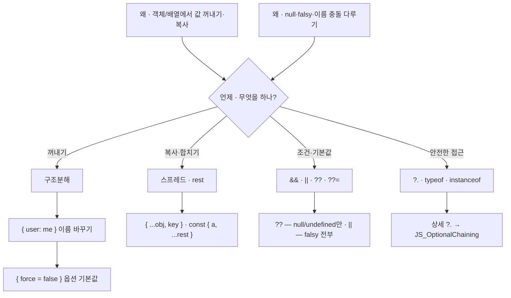

---
aliases:
  - 구조분해
  - destructuring
  - instanceof
  - logical NOT
  - operators
  - rest
  - spread
tags:
  - JavaScript
related:
  - "[[00_JS_Ecosystem_HomePage]]"
  - "[[JS_Array_Methods]]"
  - "[[JS_BrowserAPI]]"
  - "[[JS_Loops_Conditionals]]"
  - "[[JS_OptionalChaining]]"
  - "[[JS_Promise]]"
  - "[[JS_Truthy_Falsy]]"
  - "[[NestJS_Controller]]"
  - "[[NextJS_API_Client]]"
  - "[[React_Context]]"
  - "[[NestJS_Throttle]]"
---
# JS_Operators — 연산자 & 구조분해

> [!info] 
> 구조분해 · 스프레드 · 논리 연산자처럼 매일 쓰는 문법이지만 `{ user: me }` 같은 이름 바꾸기나 `??=` 같은 할당 단축형은 처음 보면 헷갈린다.

---
# 흐름도



> `==` / `!=` 피하기 — `===` / `!==`  
> truthy/falsy — [[JS_Truthy_Falsy]]

---

# 구조분해 (Destructuring) ⭐️⭐️⭐️⭐️

## 객체 구조분해 — 기본

```typescript
const person = { name: '홍길동', age: 30, city: '서울' };

const { name, age } = person;
// person.name → name, person.age → age
```

## 이름 바꾸기 (Alias) ⭐️⭐️⭐️⭐️

```typescript
const { name: displayName } = person;
// person.name을 꺼내서 displayName이라는 변수에 담음
// name 변수는 생기지 않음 — displayName만 생김

const { user: me } = useAuth();
// useAuth()가 반환한 객체의 user 필드를
// me라는 이름의 변수로 받음
```

```txt
{ 원래이름: 새이름 } — 콜론 뒤가 "이 범위에서 쓸 변수명"

왜 이름을 바꾸는가 — 이름 충돌(Naming Collision) 해결:

  // props로 받은 user = 프로필 대상 (피드/댓글에서 탭한 사람)
  function ProfileSheet({ user }: { user: User }) {

    // useAuth()도 user를 반환하는데 이건 "로그인한 나"
    // 같은 스코프에서 user가 두 개 → 하나를 me로 이름 바꾸기
    const { user: me } = useAuth();

    // 이제 두 개가 명확히 구분됨
    // user = 보고 있는 상대방
    // me   = 로그인한 나
  }
```

## 이름 충돌과 deps 배열 ⭐️⭐️⭐️

```typescript
useEffect(() => {
  if (!user || !me) return;
  void loadRelation();
}, [open, user, me]);
//          ↑     ↑
//    props user  useAuth user (이름만 me로 바뀐 것)
```

```txt
deps에 user와 me가 둘 다 있는 이유:
  user  → 어떤 프로필을 보고 있는가 (props에서 온 변수)
  me    → 내가 누구인가 (useAuth에서 온 변수)

  "이름을 me로 바꿨으니 같은 거 아냐?" 라고 느낄 수 있지만
  const { user: me } = useAuth() 는
  useAuth()의 user를 "me라는 새 변수명으로 꺼낸 것"일 뿐
  props의 user와는 출처부터 완전히 다른 별개의 값

  → 둘 다 바뀔 수 있고, 둘 다 바뀌면 effect를 다시 실행해야 하므로
    deps 배열에 둘 다 있어야 함
```

## 기본값 설정

```typescript
const { name = '익명', role = 'user' } = person;
// person.name이 undefined일 때만 '익명' 사용
// null이면 기본값 안 씀 (null ≠ undefined)
```

## 이름 바꾸기 + 기본값 조합

```typescript
const { user: me = null } = useAuth();
// user를 me로 꺼내는데, undefined면 null로 대체
```

## 중첩 구조분해

```typescript
const { address: { city, zip } } = person;
// person.address.city → city
// person.address.zip  → zip

// 실전 — API 응답
const { data: { user, token } } = await login(email, password);
```

## 나머지 모으기 — rest

```typescript
const { name, ...rest } = person;
// name을 꺼내고, 나머지는 rest 객체로 모음
// rest = { age: 30, city: '서울' }
```

---
# 함수 옵션 객체 패턴 — `{ force = false }` ⭐️⭐️⭐️⭐️

```txt
함수 인자가 많아지거나, 일부가 선택적일 때
boolean 인자를 여러 개 나열하는 대신 객체 하나로 묶는 패턴
```

```typescript
// ❌ 인자가 많아지면 순서 기억이 어려움
touchLastActiveAt(userId, role, true, false, 'admin');

// ✅ 옵션 객체 — 이름으로 의미가 명확
touchLastActiveAt(userId, role, { force: true });
```

## TypeScript 타입 정의

```typescript
interface TouchOptions {
  force?:  boolean;  // ? = 선택적 — 안 넘겨도 됨
  silent?: boolean;
}

async function touchLastActiveAt(
  userId: number,
  role:   string,
  options: TouchOptions = {},  // 통째로 안 넘겨도 됨 (기본값 빈 객체)
): Promise<void> {
  const { force = false, silent = false } = options;
  //       ↑ 안 넘기면 false가 기본값
  
  if (!force && /* 최근에 업데이트했으면 */) return;
  // force: true면 이 early return을 건너뛰고 강제 업데이트
}
```

## 호출 방법

```typescript
// 기본값으로 호출 — 세 번째 인자 생략
await touchLastActiveAt(userId, role);

// 옵션 일부만 전달 — 나머지는 기본값
await touchLastActiveAt(userId, role, { force: true });

// 여러 옵션 전달
await touchLastActiveAt(userId, role, { force: true, silent: true });
```


```txt
options = {} 기본값의 의미:
  호출하는 쪽이 세 번째 인자를 아예 안 넘겨도
  내부에서 {}(빈 객체)를 받은 것처럼 동작
  → { force = false, silent = false }가 모두 기본값으로 처리됨

  options: TouchOptions = {} 없이 options?: TouchOptions로 선언하면:
  → options가 undefined일 수 있어서 const { force } = options 에서 에러
  → 구조분해 전에 options ?? {} 처리 필요 → 번거로움
  → = {} 기본값이 더 깔끔
```

## force 플래그가 자주 쓰이는 패턴

```typescript
// 파라미터에서 바로 구조분해 — 변수명 없이 더 짧게
async function touchLastActiveAt(
  userId: number,
  role:   string,
  { force = false }: TouchOptions = {},
) {
  if (!force && checkRecentlyUpdated()) return;  // 최근에 했으면 스킵
  await update();                                 // force: true면 무조건 실행
}
```

```txt
force 플래그가 쓰이는 상황:
  "보통은 스킵하지만 이 경우엔 반드시 실행해야 해"
  → 서비스 레벨 쓰로틀 건너뛰기 패턴 → [[NestJS_Throttle]] 참고
```

## `Partial<T>`— 옵션 객체 타입 유틸리티 ⭐️⭐️


```typescript
interface UserUpdateData {
  name:  string;
  email: string;
  image: string;
}

// Partial<T> = 모든 필드를 optional로 만듦
async function updateUser(userId: number, data: Partial<UserUpdateData>) {
  // name만, email만, 셋 다, 아무것도 안 넘겨도 타입 통과
}

updateUser(1, { name: '새이름' });  // ✅
```


```txt
옵션 객체는 보통 모든 필드가 선택적
→ interface에 ?를 전부 붙이거나 Partial<T>를 쓰거나
→ Partial<T> 상세는 [[TS_Utility_Types]] 참고
```

---

# 배열 구조분해 ⭐️⭐️⭐️

```typescript
const [first, second, ...others] = [1, 2, 3, 4, 5];
// first = 1, second = 2, others = [3, 4, 5]

// 건너뛰기
const [, second, , fourth] = [1, 2, 3, 4];
// second = 2, fourth = 4

// useState — 배열 구조분해의 대표 사례
const [count, setCount] = useState(0);
// 반환 배열의 [0] → count, [1] → setCount
```

```txt
useState가 배열을 반환하는 이유:
  객체를 반환하면 { value, setValue }처럼 이름이 고정됨
  배열을 반환하면 [count, setCount]처럼 원하는 이름으로 자유롭게 받을 수 있음
  → 같은 훅을 여러 번 써도 이름 충돌 없음

  const [count, setCount] = useState(0);
  const [name, setName]   = useState('');
```

## Promise.all 결과 구조분해

```typescript
const [friends, requests] = await Promise.all([
  fetchFriends(),
  fetchFriendRequests(),
]);
// 순서대로 배열 구조분해 — 인덱스 0 → friends, 1 → requests
```

---

# 스프레드 (...) ⭐️⭐️⭐️⭐️

## 배열 스프레드

```typescript
const a = [1, 2, 3];
const b = [4, 5, 6];

const merged = [...a, ...b];          // [1, 2, 3, 4, 5, 6]
const copy   = [...a];                // 얕은 복사
const added  = [...a, 7];            // [1, 2, 3, 7]
const sorted = [...items].sort(...);  // 원본 안 건드리고 정렬
```

## 객체 스프레드

```typescript
const defaults = { theme: 'light', lang: 'ko' };
const overrides = { theme: 'dark' };

const config = { ...defaults, ...overrides };
// { theme: 'dark', lang: 'ko' }
// 같은 키는 나중에 오는 것이 이김 ⭐️

// state 업데이트 패턴
setState(prev => ({ ...prev, name: '새이름' }));
// 기존 state 유지하면서 name만 바꿈
```

```txt
⚠️ 스프레드는 얕은 복사 — 중첩 객체는 참조가 공유됨
  깊은 복사가 필요하면 structuredClone() → [[JS_BrowserAPI]]
```

## 함수 인자 스프레드

```typescript
const nums = [1, 5, 3, 2, 4];
Math.max(...nums);    // Math.max(1, 5, 3, 2, 4)
Math.min(...nums);    // Math.min(1, 5, 3, 2, 4)

// 배열을 개별 인자로 펼쳐서 넘김
```

---

# 논리 연산자 ⭐️⭐️⭐️⭐️

## && — 앞이 truthy일 때만 뒤를 반환

```typescript
user && user.name           // user 있으면 user.name, 없으면 user(falsy) 반환
isLoggedIn && <UserMenu />  // 조건부 렌더링 — React에서 자주 쓰임
a && b && c                 // a, b 둘 다 truthy여야 c 반환
```

## || — 앞이 falsy면 뒤를 반환

```typescript
name || '익명'     // name이 falsy(undefined, null, '', 0 등)면 '익명'
port || 3000      // port가 없으면 3000 — ⚠️ port가 0이면 0도 falsy로 처리됨
```

## ?? — null/undefined일 때만 뒤를 반환 ⭐️⭐️⭐️

```typescript
name ?? '익명'    // name이 null 또는 undefined일 때만 '익명'
port ?? 3000     // port가 null/undefined일 때만 3000 (0은 그대로 0)
```

```txt
|| vs ??:
  || = falsy 전부 (0, '', false, null, undefined, NaN)
  ?? = null/undefined만

  포트 번호, 카운터, 빈 문자열처럼 0이나 ''도 유효한 값이라면 반드시 ??
  → [[JS_OptionalChaining]] 참고
```

## &&= · ||= · ??= — 논리 할당 단축형 ⭐️⭐️

```typescript
// &&= — 왼쪽이 truthy일 때만 오른쪽 할당
a &&= b  // if (a) a = b; 와 동일

// ||= — 왼쪽이 falsy일 때만 오른쪽 할당
a ||= b  // if (!a) a = b; 와 동일

// ??= — 왼쪽이 null/undefined일 때만 오른쪽 할당
a ??= b  // if (a == null) a = b; 와 동일

// 실전 패턴
cache ??= await fetchData();  // 캐시가 없을 때만 fetch
user.nickname ||= '익명';      // 닉네임 없으면 기본값 설정
```

---

# 삼항 연산자 ⭐️⭐️⭐️

```typescript
const label = isLoggedIn ? '로그아웃' : '로그인';
const value = items.length > 0 ? items[0] : null;

// JSX — 조건부 렌더링
{isLoading ? <Spinner /> : <Content />}
```

```txt
중첩 삼항은 가독성이 나빠짐 → 변수로 미리 계산하거나 if문 사용 권장
```

---

# 비교 연산자 ⭐️⭐️

```typescript
===  // 값 + 타입이 같음 (항상 이걸 쓸 것)
!==  // 값 또는 타입이 다름
==   // 타입 변환 후 비교 → 예측 불가 ('0' == 0 → true) — 피할 것
!=   // 마찬가지로 피할 것
```

```typescript
// 숫자 비교
<, >, <=, >=

// 특수 케이스
NaN === NaN  // false — NaN은 자기 자신과도 같지 않음
Number.isNaN(value)  // NaN 확인은 이걸 쓸 것
```

---

# typeof · instanceof ⭐️⭐️⭐️

```typescript
typeof 'hello'       // 'string'
typeof 42            // 'number'
typeof null          // 'object' ← 버그, null이 아님
typeof undefined     // 'undefined'
typeof (() => {})    // 'function'

[] instanceof Array   // true
err instanceof Error  // true
```

```txt
런타임 타입 확인 → [[TS_Type_Guards]] 참고
```

---

# 옵셔널 체이닝 (?.) ⭐️⭐️⭐️

```typescript
user?.name           // user가 null/undefined면 undefined
user?.address?.city  // 중간 어디서든 없으면 undefined
arr?.[0]             // 배열도 ?.로
fn?.()               // 함수 존재할 때만 호출
```

```txt
자세한 내용 (prev?.() 콜백 보존 패턴 등) → [[JS_OptionalChaining]]
```

---

# 한눈에

|문법|예시|의미|
|---|---|---|
|구조분해|`const { name } = obj`|객체에서 꺼내기|
|이름 바꾸기|`const { user: me } = useAuth()`|user를 꺼내서 me라는 이름으로|
|기본값|`const { name = '익명' } = obj`|undefined일 때만 기본값|
|배열 구조분해|`const [a, b] = arr`|인덱스 순서대로|
|스프레드|`{ ...obj, key: val }`|복사 + 덮어쓰기, 나중 것이 이김|
|rest|`const { a, ...rest } = obj`|나머지를 한 객체로|
|`&&`|`a && b`|a가 truthy면 b 반환|
|`\|`|`a \| b`|a가 falsy면 b (0·''도 falsy)|
|`??`|`a ?? b`|a가 null/undefined면 b만|
|`??=`|`a ??= b`|a가 null/undefined일 때만 b를 a에 할당|
|`?.`|`obj?.prop`|null/undefined면 undefined, 아니면 접근|

```txt
이름 충돌 해결 패턴:
  같은 스코프에서 출처가 다른 두 값이 같은 이름일 때
  하나를 { 원래이름: 새이름 }으로 꺼내서 구분
  → deps 배열에는 "새이름"(me)이 들어감 — props의 user와는 별개
```