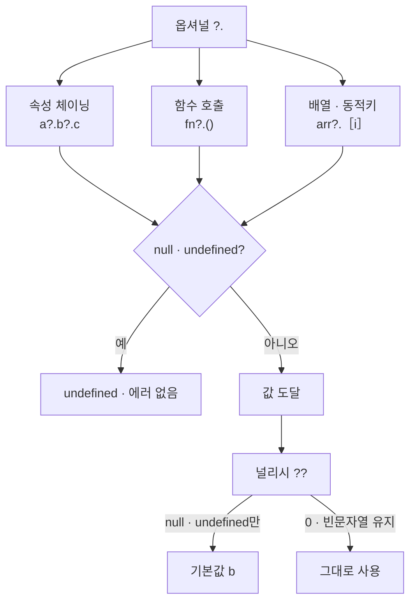

---
aliases:
  - coalescing
  - doubleQuestion
  - nullish
  - optional chaining
  - questionDot
  - ?.()
tags:
  - JavaScript
related:
  - "[[00_JS_Ecosystem_HomePage]]"
  - "[[NextJS_API_Client]]"
  - "[[TS_PartialUpdate]]"
  - "[[JS_Promise]]"
  - "[[JS_DOM]]"
---
# JS_OptionalChaining — ?. 와 ??

> [!info]
>  `?.`는 "중간에 null/undefined가 있으면 거기서 멈추고 undefined를 반환"하는 옵셔널 체이닝이고,
>   `??`는 "왼쪽이 null/undefined일 때만(0이나 ''는 살리고) 오른쪽 기본값을 쓰는" 널리시 코얼레싱이다. 
>   거의 모든 비동기/응답 처리 코드에서 이 둘이 짝으로 등장한다.

```txt
?.()는 TypeScript 문법이 아니라 JavaScript(ES2020) 표준 문법
TypeScript는 그 위에 타입 검사만 더하는 것
```

---
# 흐름도



```txt
?. = 중간에 없으면 멈춤 · 일반 접근은 TypeError
?? = null · undefined만 기본값 — 0 · 빈 문자열은 유효한 값
흔한 조합: error?.message ?? 기본 메시지
```

---

# ?. — 옵셔널 체이닝 ⭐️⭐️⭐️⭐️

```typescript
user?.passwordHash
// user가 null/undefined면 → 그 자리에서 멈추고 undefined 반환 (에러 안 남)
// user가 있으면 → user.passwordHash 그대로 읽음

// ?. 없이 쓰면:
user.passwordHash
// user가 null이면 → "Cannot read properties of null" TypeError로 그 자리에서 죽음
```

```txt
체인이 길어도 중간 어디서든 끊어주는 게 ?.의 핵심:
  a?.b?.c?.d
  → a가 없으면 거기서 끝 (b/c/d는 시도조차 안 함, undefined 반환)
  → a는 있는데 b가 없으면 거기서 끝
  → 끝까지 다 있으면 d 값까지 정상적으로 도달
```

---

# ?.() — 함수 호출에 적용 ⭐️⭐️⭐️⭐️

```typescript
onClose?.();
// onClose가 함수면 호출, undefined/null이면 그냥 아무 일도 안 일어남

// 아래와 동일
if (onClose) {
  onClose();
}
```

```txt
?.()는 TypeScript가 아니라 JavaScript 표준 문법 (ES2020)
"이 함수가 존재할 수도, 없을 수도 있다"는 상황에서 if 체크 없이 안전하게 호출
```

## 기존 콜백을 보존하면서 새 콜백 등록하는 패턴 ⭐️⭐️⭐️⭐️

```typescript
// 전역 이벤트 핸들러에 새 동작을 추가하되, 기존에 등록된 콜백도 유지해야 할 때
const prev = window.onSomeEvent;           // 기존 콜백을 먼저 저장

window.onSomeEvent = () => {
  prev?.();                                // 기존 콜백이 있으면 먼저 실행
  // 새로운 동작
  doNewThing();
};
```

```txt
prev?.()가 필요한 이유:
  다른 라이브러리나 코드가 이미 window.onSomeEvent를 등록해뒀을 수 있음
  그냥 덮어쓰면 기존 콜백이 사라짐 → 다른 기능이 망가질 수 있음
  → 기존 것을 prev에 저장해두고, 새 핸들러 안에서 prev?.()로 기존 것도 같이 실행

prev의 타입:
  window.onSomeEvent가 처음엔 undefined일 수 있음
  → prev가 undefined면 prev?.()는 아무 일도 안 함
  → prev가 함수면 먼저 실행하고, 그다음 새 동작 실행
```

## 실전 예시 — 외부 스크립트 API 로드

```typescript
// YouTube IFrame API 같은 외부 스크립트는 로드 완료 후 전역 콜백을 호출함
// 이미 다른 곳에서 이 콜백을 등록해뒀을 수 있으므로 기존 것을 보존해야 함
function waitForAPI(win: Window): Promise<ExternalAPI> {
  return new Promise((resolve, reject) => {
    const prev = win.onExternalAPIReady;      // 기존 콜백 저장

    win.onExternalAPIReady = () => {
      prev?.();                               // 기존 콜백 먼저 실행
      if (win.ExternalAPI?.isReady) {
        resolve(win.ExternalAPI);
      } else {
        reject(new Error('API를 사용할 수 없습니다.'));
      }
    };
  });
}
```

```txt
이 패턴이 쓰이는 상황:
  전역 이벤트 핸들러(window.onXxx)를 여러 곳에서 등록해야 할 때
  기존 핸들러를 덮어쓰지 않고 체인처럼 연결하는 방식
  라이브러리 개발이나 서드파티 스크립트 연동 시 자주 등장
```

---

# ?.[] — 배열/동적 키 접근 ⭐️⭐️

```typescript
arr?.[0]          // arr가 없으면 undefined, 있으면 첫 번째 요소
obj?.[dynamicKey] // 대괄호 접근에도 동일하게 적용
```

---

# ?? — 널리시 코얼레싱 ⭐️⭐️⭐️⭐️

```typescript
const message = error?.message ?? '알 수 없는 오류';
// error?.message가 null 또는 undefined일 때만 '알 수 없는 오류' 사용
```

```txt
?.와 ??가 항상 짝으로 보이는 이유:
  ?.로 "혹시 없을 수도 있는 값"을 안전하게 꺼내고
  ??로 "그게 진짜 없으면 쓸 기본값"을 바로 옆에 정해두는 조합이 매우 흔함
```

## ?? vs || — 가장 헷갈리는 차이 ⭐️⭐️⭐️⭐️

```typescript
const count = 0;
count || 10  // 10  ← 0은 falsy라서 ||가 기본값으로 넘어가버림 (의도와 다를 수 있음)
count ?? 10  // 0   ← 0은 null/undefined가 아니므로 ??는 그대로 0을 유지함
```

|연산자|기본값으로 넘어가는 조건|
|---|---|
|`\|`|왼쪽이 falsy 전부 (`0`, `''`, `false`, `null`, `undefined`, `NaN`)|
|`??`|왼쪽이 정확히 `null` 또는 `undefined`일 때만|

```txt
"값이 0이거나 빈 문자열일 수도 있는데, 그것도 유효한 값으로 살리고 싶다"면 반드시 ??
페이지 번호(0이 유효), 빈 문자열 입력 등을 다룰 때 ||를 쓰면 의도와 다르게 동작하기 쉬움
```

---

# 실전 — 에러 메시지 추출 패턴 ⭐️⭐️⭐️

```typescript
const error = (await res.json()) as { message?: string | string[] } | null;
const message = Array.isArray(error?.message) ? error.message[0] : error?.message;
throw new Error(message ?? `요청 실패: ${res.status} ${res.statusText}`);
```

```txt
한 줄씩:
  error?.message     — error 자체가 null일 수도 있어서 ?.로 안전하게 접근
  Array.isArray(...) — message가 string인지 string[]인지 분기
  message ?? `...`   — 위 과정에서 message 자체가 없었다면(null/undefined)
                       그제서야 직접 만든 기본 메시지로 대체
```

---

# 한눈에

|연산자|역할|
|---|---|
|`a?.b`|a가 null/undefined면 그 자리에서 멈추고 undefined 반환|
|`fn?.()`|fn이 함수면 호출, 아니면 아무 일도 안 함|
|`prev?.()`|prev(기존 콜백)가 있으면 실행, undefined면 무시 — 콜백 체인 패턴|
|`arr?.[i]`|배열/객체가 없으면 undefined, 있으면 그 인덱스/키 값|
|`a ?? b`|a가 null/undefined일 때만 b 사용 (0, '', false는 그대로 유지)|
|`a \| b`|a가 모든 falsy 값(0, '', false 포함)일 때 b 사용 — ??보다 범위가 넓음|
|자주 같이 쓰는 조합|`error?.message ?? '기본 메시지'`|

```txt
?.()의 기존 콜백 보존 패턴:
  const prev = window.onEvent;
  window.onEvent = () => { prev?.(); /* 새 동작 */ };
  → 기존 핸들러 저장 → 새 핸들러에서 prev?.()로 기존 것 먼저 실행 → 새 동작 추가
```