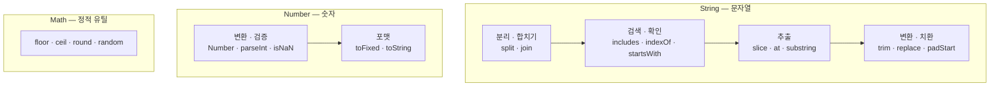

---
aliases:
  - includes
  - indexOf
  - Math
  - Number
  - padStart
  - slice
  - String
  - toFixed
tags:
  - JavaScript
related:
  - "[[00_JS_Ecosystem_HomePage]]"
  - "[[JS_Array_Methods]]"
  - "[[JS_Truthy_Falsy]]"
  - "[[JS_Operators]]"
  - "[[TS_Generics]]"
---
# JS_Primitive_Methods — 문자열 & 숫자 메서드

> [!info] 
> String: 문자열 분리·검색·추출·변환·치환. 
> Number: 숫자 변환·검증·포맷. Math: floor·ceil·round·random. 
> 같은 이름인데 Array에도 있는 메서드(indexOf, slice, includes 등) → [[JS_Array_Methods]] 참고

---
# 흐름도



```txt
indexOf · slice · includes — Array에도同名 있지만 prototype이 다름 → [[JS_Array_Methods]] 참고
String.indexOf = 부분 문자열 위치 / Array.indexOf = 요소(===) 위치
```

---

# ⚠️ String과 Array — 같은 이름인데 다른 메서드 ⭐️⭐️

```txt
indexOf / slice / includes는 String에도, Array에도 둘 다 존재함
→ 이름이 같아서 "같은 메서드를 그냥 다른 타입에도 쓰는 것"처럼 보이지만
  실제로는 String.prototype과 Array.prototype에 각각 따로 정의된 별개의 메서드
```

```javascript
// String.indexOf — 부분 문자열이 "시작하는 위치"를 찾음
'hello world'.indexOf('wor')   // 7  ← 'wor'가 시작하는 인덱스

// Array.indexOf — 배열 안에서 "그 값과 정확히 같은(===) 요소"의 위치를 찾음
['a', 'b', 'c'].indexOf('b')   // 1  ← 'b'와 같은 요소가 있는 인덱스
```

|메서드 이름|String에서 하는 일|Array에서 하는 일|
|---|---|---|
|`indexOf`|부분 문자열이 시작하는 위치|값과 똑같은(===) 요소의 위치|
|`includes`|부분 문자열 포함 여부|그 값과 같은 요소가 있는지 여부|
|`slice`|문자 범위로 부분 문자열 추출|인덱스 범위로 부분 배열 추출|

```txt
indexOf가 가장 헷갈리는 이유:
  String.indexOf → "여러 글자로 된 패턴이 어디서 시작하나" (부분 일치, 위치 탐색)
  Array.indexOf  → "이 값과 똑같은 원소가 몇 번째에 있나" (정확한 일치, 원소 탐색)
  → 둘 다 "위치(인덱스)를 반환"한다는 점만 같고, "무엇을 찾는지"는 다름

CYCLE.indexOf(preference) 같은 코드가 헷갈리는 이유:
  CYCLE이 배열이라는 걸 모르고 보면 String 버전인 줄 알고
  "preference라는 글자가 CYCLE 안에 있나?"로 잘못 해석하게 됨
  → 사실은 "CYCLE 배열 안에서 preference와 같은 값이 몇 번째 칸에 있나"를 찾는 것
  → 자세한 Array.indexOf / findIndex 비교는 [[JS_Array_Methods]] 참고
```

---

# String — 분리 & 합치기 ⭐️

```javascript
// split — 문자열 → 배열
'a,b,c'.split(',')           // ['a', 'b', 'c']
'hello'.split('')            // ['h','e','l','l','o']
'hello world'.split(' ')     // ['hello', 'world']
'hello'.split('', 3)         // ['h','e','l']  최대 3개

// join — 배열 → 문자열 (Array 메서드지만 String과 세트로 자주 씀)
['a','b','c'].join(',')      // 'a,b,c'
['a','b','c'].join('')       // 'abc'
['a','b','c'].join(' - ')    // 'a - b - c'

// 자주 쓰는 조합
'hello world'.split(' ').reverse().join(' ')  // 'world hello'
'2020-02-15'.split('-').join('/')             // '2020/02/15'
```

---

# String — 검색 & 확인 ⭐️

```javascript
const str = 'Hello World';

str.includes('World')     // true
str.includes('world')     // false (대소문자 구분)

str.indexOf('o')          // 4 (첫 번째 o)
str.indexOf('z')          // -1

str.startsWith('Hello')   // true
str.endsWith('World')     // true

'hello123'.search(/\d+/)  // 5 (정규식 — 숫자 시작 위치)
```

---

# String — 추출 ⭐️

```javascript
const str = 'Hello World';

// slice(start, end)
str.slice(0, 5)   // 'Hello'
str.slice(6)      // 'World'
str.slice(-5)     // 'World'  (뒤에서 5개)
str.slice(6, 8)   // 'Wo'

// at — 인덱스 접근 (음수 가능)
str.at(0)         // 'H'
str.at(-1)        // 'd'  (마지막 문자)
```

---

# String — 변환 ⭐️

```javascript
// 대소문자
'hello'.toUpperCase()     // 'HELLO'
'HELLO'.toLowerCase()     // 'hello'

// 공백 제거
'  hello  '.trim()        // 'hello'
'  hello  '.trimStart()   // 'hello  '
'  hello  '.trimEnd()     // '  hello'

// 반복
'ab'.repeat(3)            // 'ababab'

// 패딩 (자릿수 맞추기) ⭐️
'5'.padStart(3, '0')      // '005'
'5'.padEnd(3, '0')        // '500'
'42'.padStart(5, '0')     // '00042'

// 시간 포맷 실전 패턴
const h = 9, m = 5;
`${String(h).padStart(2, '0')}:${String(m).padStart(2, '0')}`  // '09:05'
```

---

# String — 치환 ⭐️

```javascript
// replace — 첫 번째만 치환
'hello hello'.replace('hello', 'hi')      // 'hi hello'

// replaceAll — 전체 치환
'hello hello'.replaceAll('hello', 'hi')   // 'hi hi'

// 정규식 + g 플래그 — 전체 치환
'hello hello'.replace(/hello/g, 'hi')     // 'hi hi'

// 실전 패턴
'2020-02-15'.replace(/-/g, '/')           // '2020/02/15'
'  spaces  '.replace(/\s+/g, ' ').trim()  // 'spaces'
```

---

# String — 한눈에

|메서드|역할|
|---|---|
|`split(sep)`|문자열 → 배열|
|`includes(str)`|포함 여부 (boolean)|
|`indexOf(str)`|부분 문자열 시작 위치 (없으면 -1)|
|`startsWith / endsWith`|시작/끝 확인|
|`slice(s, e)`|부분 추출|
|`at(i)`|인덱스 접근 (음수 가능)|
|`toUpperCase / toLowerCase`|대소문자 변환|
|`trim()`|앞뒤 공백 제거|
|`padStart(n, c)`|앞 패딩 ⭐️|
|`padEnd(n, c)`|뒤 패딩|
|`replace(a, b)`|첫 번째 치환|
|`replaceAll(a, b)`|전체 치환|
|`repeat(n)`|반복|

---

# Number — 문자열 → 숫자 변환 ⭐️

```javascript
// Number() — 전체 변환 (숫자 아니면 NaN)
Number('42')        // 42
Number('3.14')      // 3.14
Number('')          // 0
Number('abc')       // NaN
Number(true)        // 1
Number(null)        // 0
Number(undefined)   // NaN

// parseInt — 정수만 (앞에서부터 파싱)
parseInt('42px')    // 42    (숫자 부분만)
parseInt('3.14')    // 3     (소수점 버림)
parseInt('abc')     // NaN
parseInt('10', 2)   // 2     (2진수로 파싱)
parseInt('ff', 16)  // 255   (16진수)

// parseFloat — 소수점 포함
parseFloat('3.14abc')  // 3.14
parseFloat('3.14.15')  // 3.14 (두 번째 . 부터 무시)

// 단항 + 연산자
+'42'    // 42
+'3.14'  // 3.14
+''      // 0
+'abc'   // NaN
```

```txt
언제 뭘 쓰나:
  Number()     엄격하게 전체가 숫자인지 확인
  parseInt()   '42px'처럼 앞부분 숫자만 필요할 때
  parseFloat() 소수점 포함 파싱
  +'42'        단축형 (코드가 짧아짐)

  URL 파라미터 변환: +id / Number(id) / parseInt(id) 전부 OK
```

---

# Number — 숫자 → 문자열

```javascript
(42).toString()       // '42'
(255).toString(16)    // 'ff'   (16진수)
(10).toString(2)      // '1010' (2진수)

String(42)            // '42'
42 + ''               // '42'  (암묵적 변환)
```

---

# Number — 소수점 포맷 ⭐️

```javascript
// toFixed — 소수점 자리수 지정 (문자열 반환)
(3.14159).toFixed(2)   // '3.14'
(3.14159).toFixed(0)   // '3'
(3.1).toFixed(3)       // '3.100'

// 숫자로 다시 변환
+(3.14159).toFixed(2)  // 3.14 (number)

// toPrecision — 유효 자리수 지정
(3.14159).toPrecision(4)  // '3.142'
```

---
# Number — 검증 ⭐️

```javascript
Number.isNaN(NaN)       // true
Number.isNaN('hello')   // false  ← Number.isNaN은 엄격
isNaN('hello')          // true   ← 전역 isNaN은 변환 후 확인 (주의)

Number.isFinite(42)          // true
Number.isFinite(Infinity)    // false

Number.isInteger(42)     // true
Number.isInteger(42.0)   // true
Number.isInteger(42.5)   // false

Number.isSafeInteger(9007199254740991)   // true  (MAX_SAFE_INTEGER)
Number.isSafeInteger(9007199254740992)   // false
```

## Number.isNaN vs 전역 isNaN ⭐️⭐️⭐️⭐️

```typescript
// 전역 isNaN — 인자를 Number로 변환한 뒤 확인
isNaN('hello')   // true  ← '문자열'을 Number('hello') = NaN 으로 변환 후 체크
isNaN('')        // false ← Number('')  = 0 으로 변환 → NaN 아님
isNaN(null)      // false ← Number(null) = 0
isNaN(undefined) // true  ← Number(undefined) = NaN

// Number.isNaN — 변환 없이 NaN 그 자체인지만 확인
Number.isNaN('hello')   // false ← 문자열은 NaN이 아님
Number.isNaN('')        // false
Number.isNaN(null)      // false
Number.isNaN(undefined) // false
Number.isNaN(NaN)       // true  ← NaN만 true
```

```txt
어떤 것을 써야 하는가:
  Number.isNaN  → 정확히 NaN인지 확인할 때 (권장)
  isNaN         → "숫자로 변환했을 때 유효한 숫자인가" 를 확인할 때
                  (의도를 잘못 파악할 수 있어서 Number.isNaN + Number() 조합이 더 명확)
```

## NaN의 특이한 성질 ⭐️⭐️⭐️

```typescript
typeof NaN          // 'number'  ← NaN은 숫자 타입이지만 숫자가 아님
NaN === NaN         // false     ← NaN은 자기 자신과도 같지 않은 유일한 값
NaN !== NaN         // true
Number.isNaN(NaN)   // true      ← NaN 여부를 확인하는 올바른 방법

// === 로 NaN을 확인하면 안 되는 이유
const n = NaN;
n === NaN           // false  ← 항상 false (직접 비교 불가)
Number.isNaN(n)     // true   ← 이렇게 해야 함
```

```txt
NaN이 자기 자신과 같지 않은 이유:
  IEEE 754 부동소수점 표준에서 NaN은 "Not a Number"
  "알 수 없는 값"이므로 두 개의 "알 수 없음"이 같다고 할 수 없음
  → NaN을 감지하려면 반드시 Number.isNaN() 사용
```

## 실전 — 폼 입력 파싱 후 검증 ⭐️⭐️⭐️⭐️

```typescript
// mm:ss 또는 초(seconds) 입력값을 숫자로 파싱
function parseMmSs(input: string): number {
  const parts = input.split(':');
  if (parts.length === 2) {
    const [mm, ss] = parts.map(Number);
    return mm * 60 + ss;
  }
  return Number(input);
}

// 파싱 후 NaN 검증
const start = parseMmSs(startInput);
const end   = parseMmSs(endInput);

if (Number.isNaN(start) || Number.isNaN(end)) {
  setFormError('구간은 초 또는 mm:ss 로 적어 주세요.');
  return;
}
```

```txt
파싱 → 검증 패턴:
  문자열 입력 → Number() / parseInt() / parseFloat() 로 변환 → Number.isNaN()으로 실패 체크
  변환 결과가 NaN이면 → 잘못된 입력 → 에러 메시지 표시

Number('1:30')   // NaN ← 콜론이 있으면 변환 안 됨 → 직접 파싱 필요
Number('90')     // 90
Number('')       // 0   ← 빈 문자열은 0으로 변환 (주의)
Number('abc')    // NaN
```

## Number() vs parseInt() vs parseFloat()

```typescript
Number('42.5')      // 42.5   문자열 전체를 숫자로 (엄격)
Number('42abc')     // NaN    숫자가 아닌 문자 포함 → 실패
Number('')          // 0      빈 문자열 → 0
Number(null)        // 0
Number(undefined)   // NaN
Number(true)        // 1
Number(false)       // 0

parseInt('42.5')    // 42     정수 부분만 (소수점 무시)
parseInt('42abc')   // 42     앞부분 숫자만 읽음
parseInt('abc42')   // NaN    앞이 숫자가 아니면 NaN
parseInt('0xFF', 16) // 255   진수 지정 가능

parseFloat('42.5')  // 42.5  소수점 포함
parseFloat('42abc') // 42    앞부분 숫자만 읽음
```


```txt
선택 기준:
  Number()      입력이 순수 숫자 문자열이어야 할 때 (폼 검증 등)
  parseInt()    정수만 필요하고 뒤에 단위가 붙을 수 있을 때 ('42px' → 42)
  parseFloat()  소수점이 있는 숫자, 뒤에 단위가 붙을 수 있을 때

  parseInt/parseFloat는 앞부분 숫자만 읽기 때문에
  '42abc' → 42 처럼 "오염된 입력"도 통과시킴
  → 폼 검증에서 엄격하게 쓰려면 Number() + isNaN 조합이 더 안전
```

---

# Math — 수학 함수 ⭐️

```javascript
// 올림 / 내림 / 반올림
Math.ceil(4.1)     // 5
Math.floor(4.9)    // 4
Math.round(4.5)    // 5

// 절댓값
Math.abs(-5)       // 5

// 최대 / 최소
Math.max(1, 5, 3)          // 5
Math.min(1, 5, 3)          // 1
Math.max(...[1, 5, 3])     // 5  (배열에 적용)

// 거듭제곱 / 제곱근
Math.pow(2, 10)    // 1024
2 ** 10            // 1024 (동일)
Math.sqrt(16)      // 4

// 상수
Math.PI            // 3.141592653589793
```

## Math.random ⭐️

```javascript
// 0 이상 1 미만 난수
Math.random()

// 0 ~ n-1 정수 난수
Math.floor(Math.random() * n)

// min ~ max 정수 난수 (포함)
Math.floor(Math.random() * (max - min + 1)) + min

// 실전 패턴
Math.floor(Math.random() * 100)      // 0~99
Math.floor(Math.random() * 6) + 1    // 주사위 1~6
```

## pickOne — 배열에서 무작위 하나 꺼내기 ⭐️⭐️⭐️

```typescript
// Math.random 응용 — 제네릭 유틸 함수
function pickOne<T>(items: readonly T[]): T {
  return items[Math.floor(Math.random() * items.length)];
}

// 사용
const WISHES = ['행복하세요.', '좋은 하루 되세요.', '즐거운 하루!'] as const;
const wish = pickOne(WISHES);  // 셋 중 하나 랜덤 반환
```

```txt
readonly T[]로 파라미터를 받는 이유:
  as const 배열 + 일반 배열 모두 받을 수 있게 (더 넓게)
  함수 안에서 배열을 바꾸지 않겠다는 선언
  → [[TS_Generics]] "readonly T[] 제네릭 파라미터" 참고
```

---

# 실전 — 배열 순환(cycle) 토글 패턴 ⭐️⭐️

```txt
"여러 옵션을 순서대로 돌려가며 다음 값으로 바꾸기" — 흔한 UI 패턴
예: light → dark → system → light → ... (테마 토글 버튼 클릭마다 다음 값으로)
```

```typescript
const CYCLE: ThemePreference[] = ['light', 'dark', 'system'];

const onClick = () => {
  const next = CYCLE[(CYCLE.indexOf(preference) + 1) % CYCLE.length];
  applyTheme(next);
};
```

```txt
한 조각씩 분해:

  CYCLE.indexOf(preference)
    → CYCLE은 배열! ['light','dark','system'] 안에서
      현재 preference와 같은 값이 몇 번째(0,1,2)에 있는지 찾음 (Array.indexOf)
    예: preference='dark'면 → 1

  ... + 1
    → 다음 칸의 인덱스로 한 칸 이동 (1 + 1 = 2)

  ... % CYCLE.length
    → 나머지 연산으로 "배열 길이를 넘어가면 다시 0으로" 순환
    CYCLE.length = 3이므로:
      인덱스 0 → 1 → 2 → (2+1=3, 3%3=0) → 다시 0으로 순환
    이 부분이 없으면 마지막 값 다음에 CYCLE[3] = undefined가 되어버림 ⚠️

  CYCLE[...]
    → 위에서 계산한 "다음 인덱스"로 실제 다음 값을 꺼냄

옵션이 몇 개든, 순서가 어떻든 동일한 형태로 재사용 가능
(indexOf + 1) % length  →  "다음 칸, 끝에 가면 처음으로"를 표현하는 표준 공식
```

---

# Number — 한눈에

| 메서드                   | 역할                           |
| --------------------- | ---------------------------- |
| `Number(v)`           | 숫자 변환 (엄격)                   |
| `parseInt(s, radix)`  | 정수 파싱                        |
| `parseFloat(s)`       | 소수점 파싱                       |
| `(n).toFixed(d)`      | 소수점 자리수 포맷 (문자열)             |
| `Number.isNaN(v)`     | NaN 확인 (엄격)                  |
| `Number.isInteger(v)` | 정수 확인                        |
| `Number.isFinite(v)`  | 유한 숫자 확인                     |
| `Math.floor(n)`       | 내림                           |
| `Math.ceil(n)`        | 올림                           |
| `Math.round(n)`       | 반올림                          |
| `Math.abs(n)`         | 절댓값                          |
| `Math.max(...arr)`    | 최대값                          |
| `Math.min(...arr)`    | 최소값                          |
| `Math.random()`       | 0~1 난수                       |
| `Math.pow(b, e)`      | 거듭제곱                         |
| `Math.sqrt(n)`        | 제곱근                          |
| `n % m`               | 나머지 — 순환(cycle) 패턴에 자주 사용 ⭐️ |
