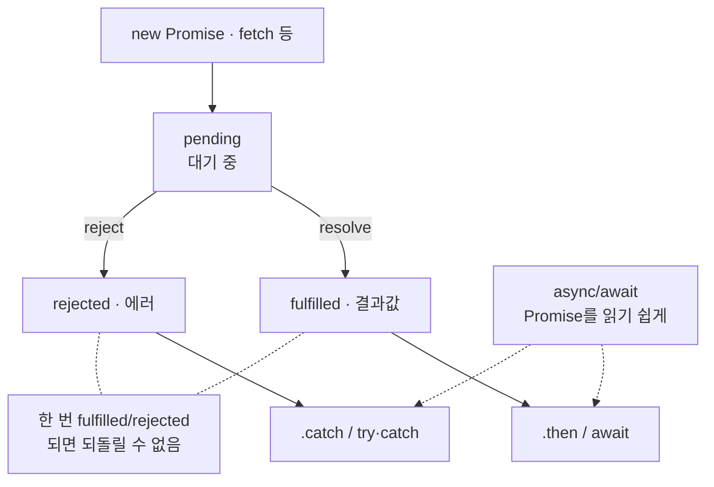

---
aliases:
  - Promise
  - async/await
  - Promise.al
  - then
  - Promise.resolve
  - Promise.reject
tags:
  - JavaScript
related:
  - "[[00_JS_Ecosystem_HomePage]]"
  - "[[JS_Array_Methods]]"
  - "[[JS_Loops_Conditionals]]"
  - "[[JS_Operators]]"
  - "[[NestJS_Throttle]]"
---
# JS_Promise — 비동기 처리의 기본 단위

> [!info] 
> Promise는 "지금은 모르지만 나중에 결과가 나올 값"을 표현하는 객체
>  pending(대기) → fulfilled(성공) 또는 rejected(실패) 중 하나로 끝나는 상태 머신이고, async/await는 이 Promise를 다루는 문법을 더 읽기 쉽게 만들어준 것일 뿐

---
# 흐름도



```txt
이미 Promise 반환 함수(fetch 등)는 new Promise로 다시 감쌀 필요 없음 — await만
여러 개 동시: Promise.all · 순서대로: for...of + await
fire-and-forget: void promise.catch() — [[NestJS_Throttle]]
```

---

# Promise란 — 세 가지 상태 ⭐️⭐️⭐️⭐️

```txt
pending    아직 결과가 안 나온 상태 (진행 중)
fulfilled  성공적으로 끝남 — 결과값을 가짐
rejected   실패로 끝남 — 에러를 가짐

한 번 fulfilled나 rejected가 되면 그 뒤로 다시 안 바뀜 (한 번만 결정되는 상태)
```

```javascript
const promise = fetch('/api/data'); // 이 시점엔 아직 pending — 응답이 안 왔으니까
```

---

# new Promise() — 직접 만들기 ⭐️⭐️⭐️⭐️

```txt
Promise를 만드는 가장 근본적인 방법
콜백 기반 API(setTimeout, 이벤트, 구형 라이브러리 등)를 Promise로 감쌀 때 사용
```

## 기본 구조

```javascript
const promise = new Promise((resolve, reject) => {
  // 이 함수(executor)는 new Promise()와 동시에 즉시 실행됨

  // 성공 시: resolve(값) 호출 → fulfilled 상태로 전환
  // 실패 시: reject(에러) 호출 → rejected 상태로 전환
});
```

```txt
executor 함수:
  new Promise()에 넘기는 콜백 — 즉시 실행됨 (비동기 아님)
  resolve / reject 중 먼저 호출된 것만 적용됨
  두 번째 호출은 무시됨 (상태는 한 번 결정되면 안 바뀜)
```

## setTimeout 래핑 — 가장 기본적인 예시

```javascript
// 콜백 기반 (기존 방식)
setTimeout(() => {
  console.log('1초 후');
}, 1000);

// Promise로 래핑
function delay(ms) {
  return new Promise((resolve) => {
    setTimeout(() => resolve(), ms); // ms 후에 resolve 호출 → fulfilled
  });
}

await delay(1000);
console.log('1초 후');
```

## 이벤트/스크립트 로드 래핑 ⭐️⭐️⭐️

```typescript
// 외부 스크립트가 로드될 때까지 기다리는 Promise
function loadScript(src: string): Promise<void> {
  return new Promise((resolve, reject) => {
    const script = document.createElement('script');
    script.src = src;
    script.onload  = () => resolve();           // 로드 성공 → fulfilled
    script.onerror = () => reject(new Error(`스크립트 로드 실패: ${src}`)); // 실패 → rejected
    document.head.appendChild(script);
  });
}

// 사용
async function loadExternalAPI(): Promise<ExternalAPI> {
  if (window.API?.ready) return Promise.resolve(window.API); // 이미 있으면 바로 반환
  await loadScript('https://example.com/api.js');            // 없으면 로드 후 대기
  return window.API;
}
```

## resolve / reject 중 먼저 호출된 것만 유효

```javascript
const p = new Promise((resolve, reject) => {
  resolve('성공');  // ← 이게 먼저 실행됨 → fulfilled
  reject('실패');   // ← 무시됨 (이미 상태가 결정됨)
});

const result = await p; // '성공'
```

## executor 안에서 에러가 throw되면 자동 reject

```javascript
const p = new Promise((resolve, reject) => {
  throw new Error('뭔가 잘못됨'); // → reject(new Error('뭔가 잘못됨'))과 동일하게 동작
  resolve('이건 실행 안 됨');
});

// p는 rejected 상태
```

## 언제 new Promise()가 필요한가

```txt
콜백 기반 API를 Promise로 래핑할 때:
  setTimeout / setInterval / XMLHttpRequest
  addEventListener (load, error 등)
  구형 라이브러리 (callback 패턴)

반대로 필요 없는 경우:
  이미 Promise를 반환하는 함수(fetch, prisma.xxx() 등)는
  async/await로 바로 다루면 됨 — 굳이 new Promise로 다시 감쌀 필요 없음

  ❌ 불필요한 래핑
  return new Promise(async (resolve) => {
    const data = await fetchData();
    resolve(data);
  });

  ✅ 그냥 async/await
  return await fetchData();
```

---

# Promise.resolve / Promise.reject — 이미 아는 값으로 만들기 ⭐️⭐️⭐️

```txt
Promise.resolve(value)  → 이미 fulfilled 상태인 Promise를 즉시 반환
Promise.reject(reason)  → 이미 rejected 상태인 Promise를 즉시 반환

new Promise()의 단축형 — 비동기 작업이 필요 없고 결과가 이미 있을 때
```

## Promise.resolve — 대표 패턴

```typescript
// early return — 이미 값이 있으면 바로 반환
async function loadExternalAPI(): Promise<ExternalAPI> {
  if (window.API?.ready) return Promise.resolve(window.API);
  return new Promise((resolve) => {
    window.onAPIReady = () => resolve(window.API);
    loadScript('https://example.com/api.js');
  });
}

// 캐시 패턴
let cache: Data | null = null;
async function getData(): Promise<Data> {
  if (cache) return Promise.resolve(cache);
  cache = await fetchData();
  return cache;
}

// 동기 값을 비동기 인터페이스에 맞추기
function getLocalValue(key: string): Promise<string> {
  return Promise.resolve(localStorage.getItem(key) ?? '');
}
```

```txt
async 함수 안에서는:
  return value;  ← 이것도 동일하게 동작 (async는 return값을 자동으로 Promise.resolve로 감쌈)

일반 함수(async 아님)에서 반환 타입이 Promise<T>여야 할 때 명시적으로 사용
```

## Promise.reject — 대표 패턴

```typescript
// 일반 함수에서 조건 불만족 시 즉시 실패 Promise 반환
function validateAge(age: number): Promise<number> {
  if (age < 0) return Promise.reject(new Error('나이는 0 이상이어야 합니다.'));
  return Promise.resolve(age);
}
```

```txt
async 함수 안에서는:
  throw new Error('...')  ← 동일하게 동작 (async는 throw를 Promise.reject로 감쌈)

일반 함수에서 실패 Promise를 반환해야 할 때 사용
```

## new Promise() vs Promise.resolve/reject 관계

```txt
new Promise((resolve, reject) => {
  resolve(value);   // ← Promise.resolve(value)와 같은 일
  reject(reason);   // ← Promise.reject(reason)와 같은 일
});

Promise.resolve/reject는 이미 결정된 상태의 Promise를 한 줄로 만드는 단축형
비동기 작업이 있으면 → new Promise()
결과가 이미 있으면  → Promise.resolve/reject
```

---

# .then() / .catch() / .finally() — Promise를 다루는 기본 방법 ⭐️⭐️⭐️⭐️

```javascript
fetch('/api/data')
  .then((res) => res.json())
  .then((data) => console.log(data))
  .catch((err) => console.error(err))
  .finally(() => console.log('끝'));
```

|메서드|언제 실행되나|
|---|---|
|`.then(fn)`|fulfilled됐을 때, 결과값을 fn에 넘겨서 실행|
|`.catch(fn)`|rejected됐을 때, 에러를 fn에 넘겨서 실행|
|`.finally(fn)`|성공/실패와 무관하게 항상 마지막에 실행|

```txt
.then()을 여러 번 이어붙일 수 있는 이유:
  .then() 자체도 새로운 Promise를 반환하기 때문
  → .then().then().catch()처럼 체이닝 가능 (배열 메서드 체이닝과 같은 발상)
```

---

# async/await — Promise를 다루는 더 읽기 쉬운 문법 ⭐️⭐️⭐️⭐️

```javascript
async function getData() {
  try {
    const res  = await fetch('/api/data');
    const data = await res.json();
    return data;
  } catch (err) {
    console.error(err);
  } finally {
    console.log('끝');
  }
}
```

```txt
async 함수는 항상 Promise를 반환함:
  return data;처럼 평범한 값을 반환해도,
  그 함수를 호출하면 결과는 항상 Promise로 한 번 감싸져서 나옴

await는 "그 Promise가 fulfilled/rejected될 때까지 기다렸다가 결과값을 꺼내오는" 것:
  .then() 체인을 안 쓰고도, 마치 동기 코드처럼 위에서 아래로 읽을 수 있게 해줌

try/catch가 .catch()의 역할을 대신함:
  await한 Promise가 reject되면 그 자리에서 throw된 것처럼 동작 → catch 블록이 잡음

.then() 체이닝과 async/await는 결국 같은 걸 하는 두 가지 문법
지금은 async/await가 훨씬 더 흔하게 쓰임 (NestJS/Next.js 코드 전반)
```

---

# Promise.all — 여러 Promise를 동시에 실행 ⭐️⭐️⭐️⭐️

```typescript
const [total, hidden, today] = await Promise.all([
  this.prisma.user.count(),
  this.prisma.user.count({ where: { isActive: false } }),
  this.prisma.user.count({ where: { createdAt: { gte: startOfToday } } }),
]);
```

```txt
순서대로 하나씩 await (직렬):
  총 걸리는 시간 = 세 쿼리 시간의 합

Promise.all (병렬):
  세 쿼리를 동시에 날리고 "전부 다" 끝날 때까지만 기다림
  총 걸리는 시간 = 그중 가장 오래 걸리는 쿼리 하나의 시간

→ 서로 의존 관계가 없는 독립적인 작업들일 때만 안전하게 동시 실행 가능

배열 순서가 항상 보장됨:
  반환 배열의 순서 = 입력한 배열의 순서 (먼저 끝난 순서 아님)
  → const [total, hidden, today] = await Promise.all([...])처럼 이름 붙이기 가능
  (배열 구조분해 자체는 [[JS_Operators]] 참고)
```

## ⚠️ 하나라도 실패하면 전체가 실패 ⭐️⭐️⭐️⭐️

```txt
배열 안의 Promise 중 하나라도 reject되면 Promise.all 전체가 즉시 reject됨
다른 두 개가 이미 성공했어도 그 결과는 버려짐 — 받을 방법이 없음

→ "일부 실패는 허용하고 싶다"면 Promise.allSettled 사용
```

---

# Promise.allSettled / race / any ⭐️⭐️⭐️

|메서드|동작|
|---|---|
|`Promise.all`|전부 성공해야 성공 — 하나라도 실패하면 즉시 전체 실패|
|`Promise.allSettled`|성공/실패 무관하게 전부 기다린 뒤, 각각의 결과를 모아서 반환|
|`Promise.race`|가장 먼저 끝난 것(성공이든 실패든) 하나만 반환|
|`Promise.any`|가장 먼저 "성공"한 것 하나만 반환 — 전부 실패해야만 전체 실패|

```javascript
const results = await Promise.allSettled([fetchA(), fetchB(), fetchC()]);
// [{ status: 'fulfilled', value: ... }, { status: 'rejected', reason: ... }, ...]
// 실패한 것도 배열에 그대로 있음 — 어떤 게 성공/실패했는지 각자 확인 가능
```

```txt
실무에서 가장 자주 쓰는 건 Promise.all (독립적인 작업 동시 실행)
"일부 실패는 허용하고 싶다"는 요구가 있을 때만 allSettled로 바꾸는 정도면 충분
race/any는 비교적 특수한 상황 (타임아웃 구현, 여러 소스 중 가장 빠른 응답 쓰기 등)
```

---

# 직렬(for...of + await) vs 병렬(Promise.all) ⭐️⭐️⭐️⭐️

```txt
판단 기준은 딱 하나 — "다음 작업이 이전 작업의 결과를 필요로 하는가?"

필요함 (의존 관계 있음)  → 직렬: for...of + await로 하나씩 순서대로
필요 없음 (서로 독립적) → 병렬: Promise.all로 동시에 — 보통 훨씬 빠름

forEach + async가 await를 안 기다려주는 이유,
for...of / Promise.all 중 어느 쪽을 써야 하는지의 실전 코드 비교
→ [[JS_Array_Methods]] "forEach/map에서 async를 쓸 때" 참고
```

---

# 한눈에

| 개념                                     | 핵심                                                     |
| -------------------------------------- | ------------------------------------------------------ |
| Promise                                | "나중에 결과가 나올 값" — pending → fulfilled 또는 rejected       |
| `new Promise((resolve, reject) => {})` | 콜백 기반 API를 Promise로 래핑할 때 — resolve=성공, reject=실패      |
| `.then()` / `.catch()` / `.finally()`  | 성공 시 / 실패 시 / 항상 실행되는 콜백                               |
| `async` / `await`                      | Promise를 동기 코드처럼 읽기 쉽게 만든 문법 (같은 것의 다른 표현)             |
| `Promise.resolve(value)`               | 이미 fulfilled인 Promise — early return, 캐시, 동기→비동기 인터페이스 |
| `Promise.reject(reason)`               | 이미 rejected인 Promise — 일반 함수에서 실패 반환 시                 |
| `Promise.all([...])`                   | 독립적인 작업들을 동시에 실행, 전부 끝나면 결과를 순서대로 배열로                  |
| `Promise.all`의 함정                      | 하나라도 실패하면 전체 즉시 실패 — 다른 성공 결과도 버려짐                     |
| `Promise.allSettled`                   | 성공/실패 무관하게 전부의 결과를 모아서 반환                              |
| 직렬 vs 병렬                               | 이전 결과에 의존하면 직렬(`for...of`), 독립적이면 병렬(`Promise.all`)    |