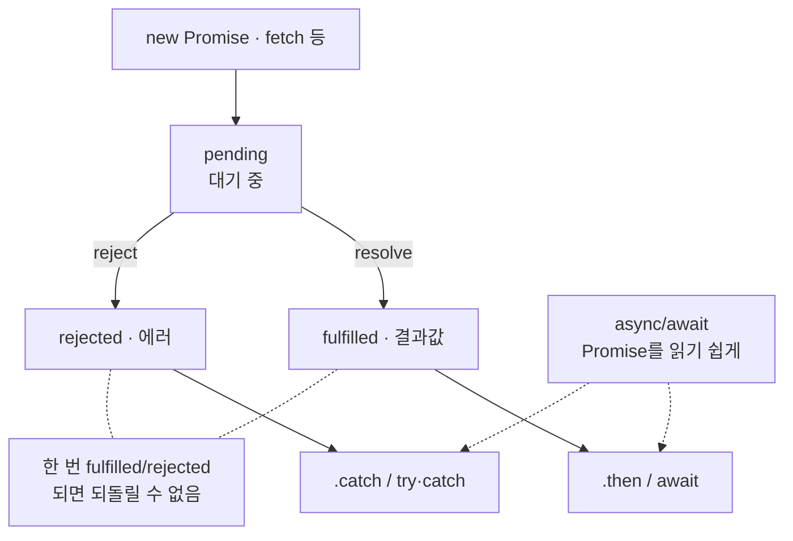

# JS_Promise — 비동기 처리의 기본 단위

> [!info] 
> Promise는 "지금은 모르지만 나중에 결과가 나올 값"을 표현하는 객체
>  pending(대기) → fulfilled(성공) 또는 rejected(실패) 중 하나로 끝나는 상태 머신이고, async/await는 이 Promise를 다루는 문법을 더 읽기 쉽게 만들어준 것일 뿐이다.

---

# 흐름도



```txt
이미 Promise 반환 함수(fetch 등)는 new Promise로 다시 감쌀 필요 없음 — await만
여러 개 동시: Promise.all · 순서대로: for...of + await
fire-and-forget: void promise.catch() — [[NestJS_Throttle]]
```

---

# Promise란 — 세 가지 상태 ⭐️⭐️⭐️⭐️

```txt
pending    아직 결과가 안 나온 상태 (진행 중)
fulfilled  성공적으로 끝남 — 결과값을 가짐
rejected   실패로 끝남 — 에러를 가짐

한 번 fulfilled나 rejected가 되면 그 뒤로 다시 안 바뀜 (한 번만 결정되는 상태)
```

```javascript
const promise = fetch('/api/data'); // 이 시점엔 아직 pending — 응답이 안 왔으니까
```

---

# new Promise() — 직접 만들기 ⭐️⭐️⭐️⭐️

```txt
Promise를 만드는 가장 근본적인 방법
콜백 기반 API(setTimeout, 이벤트, 구형 라이브러리 등)를 Promise로 감쌀 때 사용
```

## 기본 구조

```javascript
const promise = new Promise((resolve, reject) => {
  // 이 함수(executor)는 new Promise()와 동시에 즉시 실행됨

  // 성공 시: resolve(값) 호출 → fulfilled 상태로 전환
  // 실패 시: reject(에러) 호출 → rejected 상태로 전환
});
```

```txt
executor 함수:
  new Promise()에 넘기는 콜백 — 즉시 실행됨 (비동기 아님)
  resolve / reject 중 먼저 호출된 것만 적용됨
  두 번째 호출은 무시됨 (상태는 한 번 결정되면 안 바뀜)
```

## setTimeout 래핑 — 가장 기본적인 예시

```javascript
function delay(ms) {
  return new Promise((resolve) => {
    setTimeout(() => resolve(), ms);
  });
}

await delay(1000);
console.log('1초 후');
```

## 이벤트/스크립트 로드 래핑 ⭐️⭐️⭐️

```typescript
function loadScript(src: string): Promise<void> {
  return new Promise((resolve, reject) => {
    const script = document.createElement('script');
    script.src     = src;
    script.onload  = () => resolve();
    script.onerror = () => reject(new Error(`스크립트 로드 실패: ${src}`));
    document.head.appendChild(script);
  });
}
```

## 언제 new Promise()가 필요한가

```txt
콜백 기반 API를 Promise로 래핑할 때:
  setTimeout / setInterval / XMLHttpRequest / addEventListener

반대로 필요 없는 경우:
  이미 Promise를 반환하는 함수(fetch, prisma.xxx() 등)는
  async/await로 바로 다루면 됨

  ❌ 불필요한 래핑
  return new Promise(async (resolve) => {
    const data = await fetchData();
    resolve(data);
  });

  ✅ 그냥 async/await
  return await fetchData();
```

---

# Promise.resolve / Promise.reject — 이미 아는 값으로 만들기 ⭐️⭐️⭐️

```typescript
// early return — 이미 값이 있으면 바로 반환
async function loadExternalAPI(): Promise<ExternalAPI> {
  if (window.API?.ready) return Promise.resolve(window.API);
  return new Promise((resolve) => {
    window.onAPIReady = () => resolve(window.API);
    loadScript('https://example.com/api.js');
  });
}

// 캐시 패턴
let cache: Data | null = null;
async function getData(): Promise<Data> {
  if (cache) return Promise.resolve(cache);
  cache = await fetchData();
  return cache;
}
```

```txt
async 함수 안에서는 return value;만 써도 자동으로 Promise.resolve()로 감싸짐
일반 함수(async 아님)에서 반환 타입이 Promise<T>여야 할 때 명시적으로 사용
```

---

# .then() / .catch() / .finally() ⭐️⭐️⭐️⭐️

```javascript
fetch('/api/data')
  .then((res) => res.json())
  .then((data) => console.log(data))
  .catch((err) => console.error(err))
  .finally(() => console.log('끝'));
```

|메서드|언제 실행되나|
|---|---|
|`.then(fn)`|fulfilled됐을 때, 결과값을 fn에 넘겨서 실행|
|`.catch(fn)`|rejected됐을 때, 에러를 fn에 넘겨서 실행|
|`.finally(fn)`|성공/실패와 무관하게 항상 마지막에 실행|

---

# async/await ⭐️⭐️⭐️⭐️

```javascript
async function getData() {
  try {
    const res  = await fetch('/api/data');
    const data = await res.json();
    return data;
  } catch (err) {
    console.error(err);
  } finally {
    console.log('끝');
  }
}
```

```txt
async 함수는 항상 Promise를 반환함
await는 fulfilled/rejected될 때까지 기다렸다가 결과값을 꺼내오는 것
try/catch가 .catch()의 역할을 대신함

.then() 체이닝과 async/await는 결국 같은 걸 하는 두 가지 문법
지금은 async/await가 훨씬 더 흔하게 쓰임 (NestJS/Next.js 코드 전반)
```

---

# 실전 — async 래퍼 패턴 ⭐️⭐️⭐️⭐️

```txt
버튼이 여러 개인데 각 버튼마다 이 구조가 반복될 때:

  버튼 A:          버튼 B:
  setActing(true)  setActing(true)
  setError('')     setError('')
  try {            try {
    await likePost() await deletePost()
    await reload()   await reload()
  } catch ...      } catch ...
  finally { ... }  finally { ... }

→ 다른 건 await ~~() 한 줄뿐 — 나머지는 전부 똑같이 반복
→ 함수를 인자로 받는 래퍼 하나로 공통 부분을 추출
```

```typescript
// fn: () => Promise<unknown>
//   unknown = "fn이 어떤 타입을 resolve하든 상관없음, 어차피 await만 함"
//   void로 두면 Promise<ApiFriendship>처럼 반환값이 있는 함수를 넣을 때 TS 에러
const runAction = async (fn: () => Promise<unknown>) => {
  setActing(true);
  setError('');
  try {
    await fn();          // 반환값은 사용 안 함 — unknown이라 안전
    await loadRelation();
  } catch (err) {
    setError(err instanceof Error ? err.message : '요청에 실패했어요.');
  } finally {
    setActing(false);
  }
};
```

```typescript
// 사용 — 각 버튼은 runAction에 "무엇을 할지"만 넘김
<button onClick={() => void runAction(() => likePost(id))}>좋아요</button>
<button onClick={() => void runAction(() => deletePost(id))}>삭제</button>
<button onClick={() => void runAction(() => followUser(id))}>팔로우</button>
```

```txt
⚠️ void가 두 곳에 등장하는데 완전히 다른 얘기:

  onClick에서 void runAction(...)
    → runAction이 반환하는 Promise를 "의도적으로 버리는" 연산자
    → floating promise 경고 방지 — 이 자리는 그대로

  fn: () => Promise<unknown>
    → unknown = "fn이 어떤 타입을 resolve하든 상관없음, 어차피 await fn()만 함"
    → Promise<void>로 두면 반환값이 있는 함수(Promise<ApiFriendship> 등)를 넣을 때 TS 에러
    → runAction은 fn()의 결과를 쓰지 않으니 가장 넓은 unknown이 맞음

() => likePost(id) 를 넘기는 이유:
  likePost(id)라고 쓰면 그 자리에서 즉시 실행됨
  () => likePost(id)라고 쓰면 "나중에 호출될 함수"가 됨
  → runAction 안의 await fn()이 실행될 때 비로소 likePost(id)가 호출됨

fn: () => Promise<unknown> 타입:
  인자 없는 함수 = ()
  어떤 값이든 resolve할 수 있는 Promise = Promise<unknown>
  → 함수 타입 표기법 자세히 → [[TS_Generics]] 참고
```

## 조건부 early return — Promise.resolve()를 no-op으로 ⭐️⭐️⭐️

```typescript
onClick={() =>
  void runAction(() => {
    if (!friendship) return Promise.resolve(); // 조건 불만족 → 아무것도 안 함
    return respondFriendRequest(friendship.id, 'decline');
  })
}
```

```txt
fn: () => Promise<void> 타입이라 모든 코드 경로에서 Promise를 반환해야 함

  if (!friendship) return;
    → undefined 반환 → () => Promise<void> 타입 불일치 → TS 에러

  if (!friendship) return Promise.resolve();
    → 이미 fulfilled 상태인 "아무것도 안 하는 Promise" 반환
    → runAction 안에서 await fn() 실행 → 즉시 완료
    → 이후 공통 로직(loadRelation, setActing 등)은 그대로 실행됨

주의:
  Promise.resolve()로 early return해도 runAction 안의 await fn() 이후 로직은 계속 실행됨
  "loadRelation까지 포함해서 아예 아무것도 하지 말고 싶다"면
  runAction 호출 자체를 조건문으로 감싸야 함

  onClick={() => {
    if (!friendship) return;
    void runAction(() => respondFriendRequest(friendship.id, 'decline'));
  }}
```

## 반환값이 있는 버전

```typescript
// 결과를 받아서 쓰고 싶을 때
const runActionWithResult = async <T>(fn: () => Promise<T>): Promise<T | null> => {
  setActing(true);
  setError('');
  try {
    const result = await fn();
    return result;
  } catch (err) {
    setError(err instanceof Error ? err.message : '요청에 실패했어요.');
    return null;
  } finally {
    setActing(false);
  }
};

// 사용
const post = await runActionWithResult(() => fetchPost(id));
```

```txt
이 패턴이 유용한 조건:
  공통 처리(로딩 상태, 에러 처리, 후처리)가 여러 곳에 반복될 때
  변하는 부분(어떤 API를 호출하는가)만 다를 때

프레임워크 무관 패턴 — NestJS 서비스에서도 동일하게 적용 가능
```

---

# Promise.all — 여러 Promise를 동시에 실행 ⭐️⭐️⭐️⭐️

```typescript
const [total, hidden, today] = await Promise.all([
  this.prisma.user.count(),
  this.prisma.user.count({ where: { isActive: false } }),
  this.prisma.user.count({ where: { createdAt: { gte: startOfToday } } }),
]);
```

```txt
직렬: 총 걸리는 시간 = 세 쿼리 시간의 합
병렬: 총 걸리는 시간 = 그중 가장 오래 걸리는 쿼리 하나의 시간

→ 서로 의존 관계가 없는 독립적인 작업들일 때만 안전하게 동시 실행 가능
반환 배열의 순서 = 입력한 배열의 순서 (먼저 끝난 순서 아님)
```

## ⚠️ 하나라도 실패하면 전체가 실패 ⭐️⭐️⭐️⭐️

```txt
하나라도 reject되면 Promise.all 전체가 즉시 reject됨
다른 두 개가 이미 성공했어도 그 결과는 버려짐
→ "일부 실패는 허용하고 싶다"면 Promise.allSettled 사용
```

---

# Promise.allSettled / race / any ⭐️⭐️⭐️

|메서드|동작|
|---|---|
|`Promise.all`|전부 성공해야 성공 — 하나라도 실패하면 즉시 전체 실패|
|`Promise.allSettled`|성공/실패 무관하게 전부 기다린 뒤, 각각의 결과를 모아서 반환|
|`Promise.race`|가장 먼저 끝난 것(성공이든 실패든) 하나만 반환|
|`Promise.any`|가장 먼저 "성공"한 것 하나만 반환 — 전부 실패해야만 전체 실패|

---

# 직렬(for...of + await) vs 병렬(Promise.all) ⭐️⭐️⭐️⭐️

```txt
판단 기준: "다음 작업이 이전 작업의 결과를 필요로 하는가?"

필요함 (의존 관계 있음)  → 직렬: for...of + await
필요 없음 (서로 독립적) → 병렬: Promise.all — 보통 훨씬 빠름

forEach + async가 await를 안 기다려주는 이유 → [[JS_Array_Methods]] 참고
```

---

# 한눈에

| 개념                                     | 핵심                                                        |
| -------------------------------------- | --------------------------------------------------------- |
| Promise                                | "나중에 결과가 나올 값" — pending → fulfilled 또는 rejected          |
| `new Promise((resolve, reject) => {})` | 콜백 기반 API를 Promise로 래핑할 때                                 |
| `.then()` / `.catch()` / `.finally()`  | 성공 시 / 실패 시 / 항상 실행                                       |
| `async` / `await`                      | Promise를 동기 코드처럼 읽기 쉽게 만든 문법                              |
| `Promise.resolve(value)`               | 이미 fulfilled인 Promise — early return, 캐시 패턴               |
| `Promise.reject(reason)`               | 이미 rejected인 Promise — 일반 함수에서 실패 반환 시                    |
| `Promise.all([...])`                   | 독립적인 작업 동시 실행, 전부 끝나면 순서대로 배열로                            |
| `Promise.all`의 함정                      | 하나라도 실패하면 전체 즉시 실패                                        |
| `Promise.allSettled`                   | 성공/실패 무관하게 전부의 결과를 모아서 반환                                 |
| 직렬 vs 병렬                               | 이전 결과에 의존하면 직렬(`for...of`), 독립적이면 병렬(`Promise.all`)       |
| async 래퍼 패턴                            | `(fn: () => Promise<void>) => {}` — 공통 로직 추출, 변하는 부분만 인자로 |