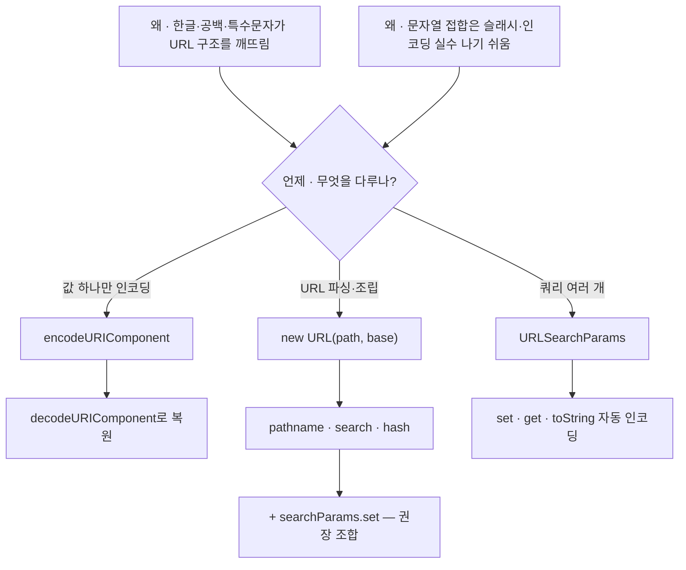

---
aliases:
  - decodeURIComponent
  - encodeURI
  - encodeURIComponent
  - URLSearchParams
  - Browser
tags:
  - JavaScript
related:
  - "[[00_JS_Ecosystem_HomePage]]"
  - "[[NextJS_Routing]]"
  - "[[NestJS_Auth]]"
  - "[[JS_BrowserAPI]]"
---
# JS_URL_Encoding — URL 조작 & 인코딩

> [!info] 
> URL에 한글·공백·특수문자가 들어가면 반드시 인코딩이 필요하다.
>  `encodeURIComponent`는 문자를 인코딩하고, `new URL()`은 URL 구조를 파싱·조립하며, `URLSearchParams`는 쿼리스트링을 다룬다.

---
# 흐름도



> 실무 — `new URL` + `searchParams.set` (OAuth redirect 등)  
> `encodeURI`는 구조 문자 유지 — 파라미터 값에는 `encodeURIComponent`

---

# 왜 인코딩이 필요한가 ⭐️⭐️⭐️

```txt
URL은 ASCII 문자만 허용
한글, 공백, ?, &, = 같은 특수문자는 URL 구조와 충돌 가능

  검색어: "서울 맛집"
  ❌ /search?q=서울 맛집      → 공백이 URL 구조를 깨뜨림
  ✅ /search?q=%EC%84%9C%EC%9A%B8%20%EB%A7%9B%EC%A7%91   → 퍼센트 인코딩
```

---

# encodeURIComponent / decodeURIComponent ⭐️⭐️⭐️⭐️

```typescript
// 인코딩 — 문자 → %XX 형태
encodeURIComponent('서울 맛집')
// → '%EC%84%9C%EC%9A%B8%20%EB%A7%9B%EC%A7%91'

encodeURIComponent('hello world')  // → 'hello%20world'
encodeURIComponent('a=1&b=2')      // → 'a%3D1%26b%3D2'  (=와 &도 인코딩)
encodeURIComponent('/path/to')     // → '%2Fpath%2Fto'   (/도 인코딩)

// 디코딩 — %XX → 원래 문자
decodeURIComponent('%EC%84%9C%EC%9A%B8')  // → '서울'
decodeURIComponent('hello%20world')       // → 'hello world'
```

```txt
encodeURIComponent vs encodeURI:
  encodeURIComponent  쿼리 파라미터 값에 사용 — /, ?, &, = 포함 전부 인코딩
  encodeURI           URL 전체에 사용 — 구조 문자(/, ?, &, =)는 그대로 유지

  실무에서는 encodeURIComponent를 씀
  → 파라미터 값에 &나 =가 들어오면 URL이 깨지기 때문
  → URLSearchParams / new URL을 쓰면 자동으로 처리됨 (직접 쓸 일이 줄어듦)
```

## 실전 — 쿼리스트링 직접 조합할 때

```typescript
// ❌ 인코딩 안 하면 한글/특수문자에서 깨짐
const url = `/search?q=${query}&category=${category}`;

// ✅ encodeURIComponent로 각 값 인코딩
const url = `/search?q=${encodeURIComponent(query)}&category=${encodeURIComponent(category)}`;

// ✅✅ URLSearchParams 사용 — 자동 인코딩 (더 권장)
const params = new URLSearchParams({ q: query, category });
const url = `/search?${params.toString()}`;
```

---

# new URL() — URL 파싱 & 조립 ⭐️⭐️⭐️⭐️

```typescript
// 절대 URL 파싱
const url = new URL('https://example.com/path?q=hello#section');
url.protocol  // 'https:'
url.host      // 'example.com'
url.pathname  // '/path'
url.search    // '?q=hello'
url.hash      // '#section'
url.origin    // 'https://example.com'
url.href      // 전체 URL 문자열

// 상대 경로 + base URL 조합
const url = new URL('/auth/oauth/callback', 'https://my-app.vercel.app');
// → 'https://my-app.vercel.app/auth/oauth/callback'
```

```txt
new URL(path, base):
  첫 번째 인자가 절대 URL이면 base 무시
  첫 번째 인자가 상대 경로면 base + 상대경로로 조합
  → 문자열 접합(baseUrl + path)보다 안전 (슬래시 중복, 특수문자 자동 처리)

Node.js 10+, 모든 최신 브라우저에서 사용 가능 — import 없이 전역
```

## URL 속성 한눈에

|속성|예시 값|읽기/쓰기|
|---|---|---|
|`href`|`'https://example.com/path?q=1#h'`|읽기/쓰기|
|`origin`|`'https://example.com'`|읽기 전용|
|`protocol`|`'https:'`|읽기/쓰기|
|`host`|`'example.com:8080'` (포트 포함)|읽기/쓰기|
|`hostname`|`'example.com'` (포트 제외)|읽기/쓰기|
|`port`|`'8080'`|읽기/쓰기|
|`pathname`|`'/path'`|읽기/쓰기|
|`search`|`'?q=1'`|읽기/쓰기|
|`searchParams`|`URLSearchParams 인스턴스`|읽기 전용 (내용 수정은 가능)|
|`hash`|`'#section'`|읽기/쓰기|

## URL 속성 수정

```typescript
const url = new URL('https://example.com/old?q=1');
url.pathname = '/new';
url.searchParams.set('q', '2');
url.hash = '#top';
url.toString(); // 'https://example.com/new?q=2#top'
```

---

# URLSearchParams — 쿼리스트링 빌드 ⭐️⭐️⭐️⭐️

```typescript
// 생성
const sp = new URLSearchParams();
sp.set('q', '서울 맛집');   // 자동 인코딩
sp.set('page', '1');
sp.toString()               // 'q=%EC%84%9C%EC%9A%B8+%EB%A7%9B%EC%A7%91&page=1'

// 객체로 초기화
const sp = new URLSearchParams({ q: '서울', page: '1' });

// 현재 URL의 쿼리 읽기
const sp = new URLSearchParams(window.location.search);
sp.get('q');     // '서울 맛집'  (자동 디코딩)
sp.has('page');  // true
```

|메서드|역할|
|---|---|
|`sp.set(k, v)`|설정 (덮어쓰기)|
|`sp.get(k)`|읽기 (없으면 `null`)|
|`sp.append(k, v)`|추가 (중복 허용)|
|`sp.delete(k)`|삭제|
|`sp.has(k)`|존재 여부|
|`sp.toString()`|`'k=v&k2=v2'` 문자열 변환|

## 조건부 파라미터 빌드

```typescript
function buildSearchParams(filters: {
  keyword?: string;
  category?: string;
  page?: number;
}) {
  const sp = new URLSearchParams();
  if (filters.keyword)  sp.set('q',        filters.keyword);
  if (filters.category) sp.set('category', filters.category);
  if (filters.page)     sp.set('page',     String(filters.page));
  return sp;
}

const params = buildSearchParams({ keyword: '서울 맛집', page: 2 });
// → 'q=%EC%84%9C%EC%9A%B8+%EB%A7%9B%EC%A7%91&page=2'
```

---

# new URL + searchParams 조합 패턴 ⭐️⭐️⭐️⭐️

```typescript
// OAuth 성공 후 프론트로 토큰 전달
function buildOAuthSuccessRedirect(accessToken: string, next: string): string {
  const url = new URL('/auth/oauth/callback', FRONTEND_URL);
  url.searchParams.set('accessToken', accessToken);
  url.searchParams.set('next', next);
  return url.toString();
  // → 'https://my-app.vercel.app/auth/oauth/callback?accessToken=eyJ...&next=%2Fprofile'
}

// 에러 redirect
function buildOAuthErrorRedirect(error: string, next: string): string {
  const url = new URL('/login', FRONTEND_URL);
  url.searchParams.set('oauthError', error);
  url.searchParams.set('next', next);
  return url.toString();
}
```

```txt
url.searchParams.set()의 자동 인코딩:
  next에 '/profile' 같은 값이 들어오면 '%2Fprofile'로 자동 인코딩
  encodeURIComponent를 직접 쓸 필요 없음

문자열 접합 vs new URL:
  ❌ baseUrl + '/callback?token=' + token + '&next=' + next
     → next에 특수문자 있으면 URL 깨짐, 슬래시 중복 위험

  ✅ new URL('/callback', baseUrl) + searchParams.set(...)
     → URL 구조를 알고 각 부분을 올바르게 인코딩
```

---

# location.origin — 절대 URL 만들기 ⭐️⭐️

```typescript
// 브라우저에서 현재 사이트의 기준 주소
const shareUrl = `${window.location.origin}/posts/${id}`;
// → 'https://my-app.vercel.app/posts/42'
```

```txt
location.origin = 프로토콜 + 도메인 + 포트 (경로 제외)
공유 링크처럼 "이 사이트 바깥으로 보낼 절대 URL"이 필요할 때 사용
브라우저 전용 — SSR/서버에서는 FRONTEND_URL 환경변수로 대체
```

---

# 언제 무엇을 쓰는가

|상황|방법|
|---|---|
|파라미터 값에 한글/특수문자|`encodeURIComponent()` 또는 `URLSearchParams`|
|URL 전체 파싱 (각 부분 꺼내기)|`new URL(href)`|
|상대경로 + base 조합|`new URL(path, base)`|
|쿼리스트링 빌드 (여러 파라미터)|`URLSearchParams` + `toString()`|
|쿼리스트링 + URL 함께 조립|`new URL(path, base)` + `url.searchParams.set()`|
|현재 URL의 쿼리 읽기|`new URLSearchParams(window.location.search)`|
|공유/리다이렉트용 절대 URL|`window.location.origin` + 경로 조합|

---

# 한눈에

```txt
인코딩:
  encodeURIComponent(str)  → %XX 형태로 인코딩 (쿼리 파라미터 값에)
  decodeURIComponent(str)  → 원래 문자로 디코딩
  URLSearchParams가 있으면 직접 쓸 일이 줄어듦 (자동 처리)

URL 파싱/조립:
  new URL(href)             절대 URL 파싱 → .protocol .host .pathname .search 등
  new URL(path, base)       상대경로 + base 조합
  url.pathname = '...'      속성 직접 수정
  url.toString()            전체 URL 문자열로

URLSearchParams:
  new URLSearchParams()     빈 파라미터 빌더
  new URLSearchParams(obj)  객체로 초기화
  sp.set(k, v)              설정 (자동 인코딩)
  sp.get(k)                 읽기 (자동 디코딩)
  sp.toString()             'k=v&k2=v2' 변환

조합 패턴:
  const url = new URL('/callback', BASE);
  url.searchParams.set('token', token);
  url.toString()  → 자동 인코딩된 완성 URL
```