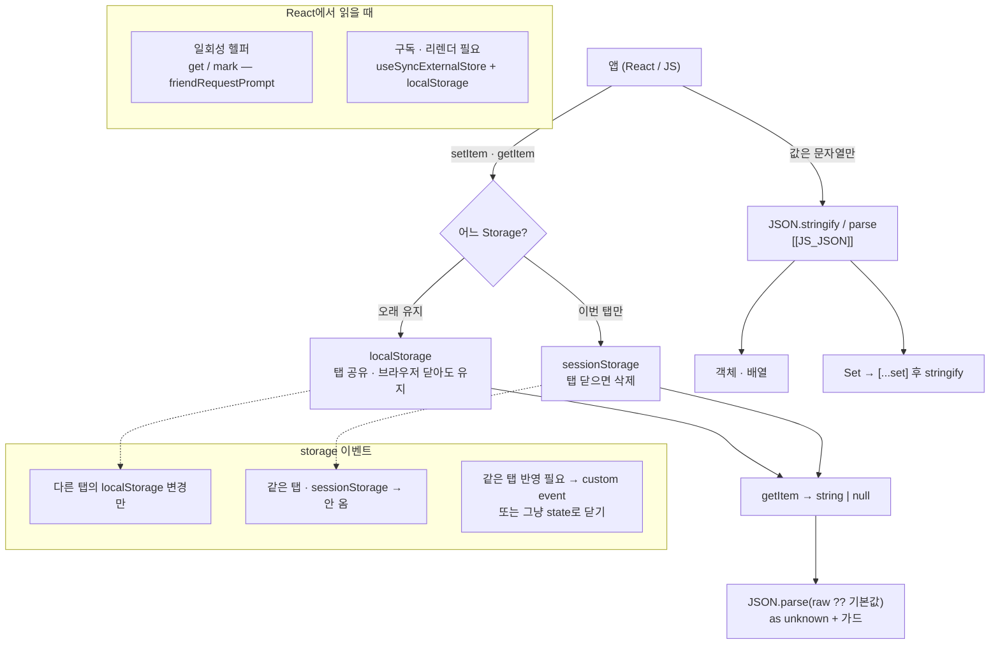

---
aliases:
  - localStorage
  - sessionStrage
tags:
  - JavaScript
related:
  - "[[00_JS_Ecosystem_HomePage]]"
  - "[[JS_BrowserAPI]]"
  - "[[JS_JSON]]"
  - "[[TS_Type_Guards]]"
  - "[[JS_Array_Methods]]"
  - "[[React_useSyncExternalStore]]"
---
# JS_WebStorage — localStorage & sessionStorage

> [!info] 
> Web Storage = 브라우저에 데이터를 문자열로 저장하는 API.
>  `localStorage`는 브라우저를 닫아도 유지, `sessionStorage`는 탭을 닫으면 삭제. 
>  값은 반드시 문자열 — 객체·배열·Set은 JSON 직렬화 필요.

---
# 흐름도



```txt
선택:
  다음에 와도 유지 (토큰 · 테마 · 최근 로그인) → localStorage
  이번 세션만 (친구 요청 모달 seen ids) → sessionStorage

왕복:
  값 → stringify → setItem
  getItem → parse → 가드 → 값

storage 이벤트 오해:
  "쓰면 무조건 통지" ❌
  다른 탭 localStorage만 ✅ · 같은 탭 / session ❌
  → UI 구독은 useSyncExternalStore (local) 또는 Host state (session seen)
```

---

# localStorage vs sessionStorage ⭐️⭐️⭐️⭐️

| |`localStorage`|`sessionStorage`|
|---|---|---|
|유지 기간|브라우저를 완전히 닫아도 유지|탭을 닫는 순간 삭제|
|공유 범위|같은 도메인이면 모든 탭에서 공유|그 탭 안에서만|
|용량|약 5~10MB|약 5~10MB|
|언제 쓰는가|로그인 토큰, 테마, 언어 설정|폼 임시 저장, 세션 중 이미 본 항목|

```txt
선택 기준:
  "다음에 다시 와도 유지" → localStorage
  "이번 탭에서만, 새로고침은 OK" → sessionStorage

  예: 받은 친구 요청 알림을 이번 세션 동안 다시 안 띄우기
  → 탭 닫으면 리셋이 자연스러운 동작 → sessionStorage
```

---

# 기본 API — 둘 다 동일 ⭐️⭐️⭐️⭐️

```typescript
// 저장 — 값은 반드시 문자열
localStorage.setItem('theme', 'dark');
sessionStorage.setItem('draft', '임시 내용');

// 읽기 — 없으면 null
const theme = localStorage.getItem('theme');   // 'dark' 또는 null

// 삭제 (1개)
localStorage.removeItem('theme');

// 전체 삭제 (같은 도메인의 전체 storage)
localStorage.clear();
```

| 메서드                   | 역할              | 반환값                         |
| --------------------- | --------------- | --------------------------- |
| `setItem(key, value)` | 저장 (이미 있으면 덮어씀) | void                        |
| `getItem(key)`        | 읽기              | <code>string \| null</code> |
| `removeItem(key)`     | 해당 key 삭제       | void                        |
| `clear()`             | 전체 삭제           | void                        |
| `key(index)`          | index 번째 key 반환 | <code>string \| null</code> |
| `length`              | 저장된 항목 수        | `number`                    |

---

# 객체·배열 저장 — JSON 직렬화 ⭐️⭐️⭐️⭐️

```typescript
// ❌ 객체를 그냥 넣으면 "[object Object]"
localStorage.setItem('user', { id: 1 });

// ✅ JSON.stringify → JSON.parse
localStorage.setItem('user', JSON.stringify({ id: 1, name: '홍길동' }));
const user = JSON.parse(localStorage.getItem('user') ?? 'null');
```

```txt
이유: Web Storage는 문자열만 저장 가능
  문자열이 아닌 값을 넣으면 .toString() 이 자동 호출됨
  객체의 .toString() = "[object Object]" (의미 없음)
  → JSON.stringify로 문자열화, JSON.parse로 복원

JSON.stringify / JSON.parse 상세 → [[JS_JSON]]
```

---

# Set 저장 — 배열 경유 필수 ⭐️⭐️⭐️⭐️

```typescript
// ❌ Set은 JSON.stringify 직접 안 됨 → '{}'
JSON.stringify(new Set(['a', 'b']));  // '{}'

// ✅ 배열로 변환 후 저장
sessionStorage.setItem('seen_ids', JSON.stringify([...ids]));

// 꺼낼 때: 배열 → Set 복원
const raw = sessionStorage.getItem('seen_ids');
const arr = JSON.parse(raw ?? '[]') as string[];
const set = new Set(arr);
```

```txt
Set이 {}로 직렬화되는 이유:
  JSON.stringify는 객체의 열거 가능한(enumerable) 속성을 직렬화
  Set/Map은 값을 내부 슬롯에 저장 → 일반 속성 없음 → JSON이 못 읽음
  → [...set] 또는 Array.from(set)으로 배열 변환 후 직렬화

Map도 같은 이유로 JSON 직접 안 됨:
  JSON.stringify(new Map([['a', 1]]))  // '{}'
  → [...map.entries()]나 Object.fromEntries(map)으로 변환 필요
```

---

# JSON.parse — unknown 타입 안전 패턴 ⭐️⭐️⭐️⭐️

```typescript
function readSeenIds(): Set<string> {
  if (typeof window === 'undefined') return new Set();  // SSR 가드
  try {
    const raw = sessionStorage.getItem('seen_ids');
    if (!raw) return new Set();

    const parsed = JSON.parse(raw) as unknown;                  // ① unknown으로

    if (!Array.isArray(parsed)) return new Set();               // ② 배열 검증

    return new Set(                                             // ③ 요소 검증
      parsed.filter((id): id is string => typeof id === 'string')
    );
  } catch {
    return new Set();                                           // ④ fallback
  }
}
```

```txt
각 단계가 필요한 이유:

① as unknown
  JSON.parse 반환 타입은 any — 뭔지 모름
  as unknown으로 "모른다"고 명시 → 좁히기 전까지 못 씀

② Array.isArray
  저장된 값이 배열이 아닐 수 있음 (외부 조작, 버전 불일치)
  배열인지 먼저 확인해야 .filter() 호출 가능

③ filter((id): id is string => typeof id === 'string')
  배열 요소 하나하나를 string으로 좁히는 타입 서술어
  결과가 string[]로 확정 → new Set<string>() 가능
  filter + 타입 서술어 패턴 → [[TS_Type_Guards]] / [[JS_Array_Methods]]

④ try-catch
  JSON.parse는 유효하지 않은 JSON에서 SyntaxError를 던짐
  catch {}로 에러 변수 없이 빈 Set 반환 (안전한 fallback)
```

---

# sessionStorage 실전 — 세션 동안 본 항목 기억하기 ⭐️⭐️⭐️

```typescript
const SEEN_KEY = 'app_seen_request_ids';  // 상수로 오타 방지

function readSeenIds(): Set<string> { /* 위 패턴 */ }

function writeSeenIds(ids: Set<string>) {
  if (typeof window === 'undefined') return;
  sessionStorage.setItem(SEEN_KEY, JSON.stringify([...ids]));
}

export function getUnseenIds(allIds: string[]): string[] {
  const seen = readSeenIds();
  return allIds.filter((id) => !seen.has(id));  // Set.has() = O(1)
}

export function markAsSeen(ids: string[]) {
  if (ids.length === 0) return;
  const seen = readSeenIds();
  for (const id of ids) seen.add(id);
  writeSeenIds(seen);
}
```

```txt
Set.has() vs Array.includes():
  Set.has()        O(1) — 크기에 무관하게 빠름
  Array.includes() O(n) — 배열 길이에 비례

key 상수화 (SEEN_KEY):
  문자열 오타 방지
  나중에 key 이름 바꿀 때 한 곳만 수정
```

---

# SSR 가드 패턴 ⭐️⭐️⭐️

```typescript
// localStorage / sessionStorage는 브라우저 전용 → 서버에서 에러
if (typeof window === 'undefined') return null;

// 함수 안에서
function getToken(): string | null {
  if (typeof window === 'undefined') return null;
  return localStorage.getItem('accessToken');
}
```

```txt
typeof window === 'undefined':
  서버(Node.js)에는 window 전역 객체가 없음
  Next.js App Router에서 Server Component나 SSR 중에 localStorage를 쓰면 에러
  → typeof로 window 존재 여부 확인 후 접근

typeof를 쓰는 이유:
  window !== undefined  → window가 선언 안 됐으면 ReferenceError
  typeof window         → 선언 안 됐어도 에러 없이 'undefined' 문자열 반환
  → typeof가 더 안전한 이유 → [[JS_BrowserAPI]] 참고

React에서 localStorage를 안전하게 읽는 방법:
  useSyncExternalStore + getServerSnapshot → [[React_useSyncExternalStore]]
```

---

# 주의사항

```txt
보안:
  httpOnly 쿠키와 달리 JS로 직접 접근 가능 → XSS 공격 시 탈취 위험
  인증 토큰을 localStorage에 저장하는 것의 트레이드오프 → [[NextJS_TokenStorage]]

용량:
  약 5~10MB (브라우저마다 다름) — 큰 데이터는 IndexedDB 사용
  용량 초과 시 QuotaExceededError 던짐 → try-catch 권장

직렬화:
  저장: JSON.stringify (객체·배열·Set 등)
  읽기: JSON.parse + 타입 검증 (always)
  → [[JS_JSON]] 참고

컴포넌트 동기화:
  같은 탭에서 localStorage를 바꿔도 storage 이벤트 안 발생
  → 여러 컴포넌트가 동기화되려면 [[React_useSyncExternalStore]] 또는 [[JS_CustomEvent]]
```

---

# 한눈에

```txt
localStorage   탭 닫아도 유지, 같은 도메인 모든 탭 공유
sessionStorage 탭 닫으면 삭제, 그 탭 안에서만

기본 API: setItem / getItem(null 가능) / removeItem / clear

저장 시 직렬화:
  문자열만 → 그대로
  객체·배열 → JSON.stringify
  Set/Map → [...set] 배열로 변환 후 JSON.stringify

읽기 시 검증 패턴:
  JSON.parse → as unknown → Array.isArray → filter(타입 서술어) → new Set
  try-catch로 깨진 JSON 방어

SSR 가드: if (typeof window === 'undefined') return null/new Set()

보안: JS 접근 가능 → XSS 주의 → 토큰은 httpOnly 쿠키 고려
```