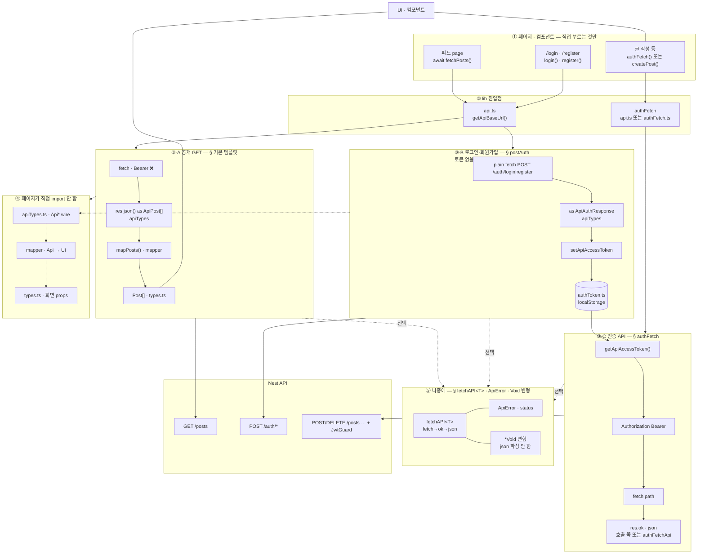
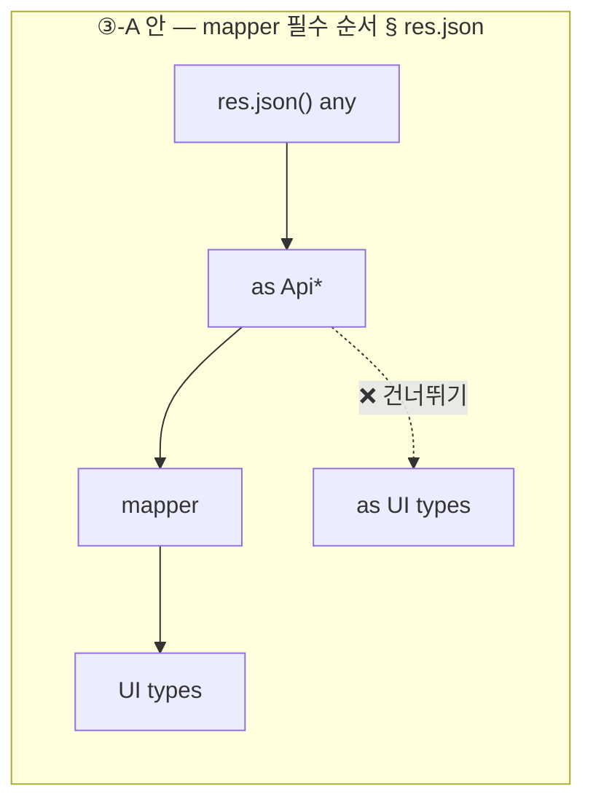
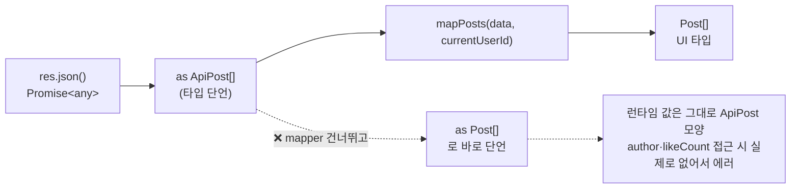

# NextJS_API_Client — api.ts: fetch 호출 한 곳에 모으기

# 한 줄 요약

```txt
api.ts = 실제로 fetch 를 호출하는 함수들을 모아두는 파일
주소 결정(getApiBaseUrl) + 요청(fetch) + 응답 받기(apiTypes) + 변환(mapper) 을 한 함수 안에서 끝냄
```

>[!info] 
> api.ts는 실제로 fetch를 호출하는 함수들을 모아두는 파일이다.
>  주소 결정(getApiBaseUrl) + 요청(fetch) + 응답 받기(apiTypes) + 변환(mapper)을 한 함수 안에서 끝낸다 — "fetch 호출 → apiTypes로 받기 → mapper로 변환"까지를 한 함수 안에 캡슐화한 것.

## 4개 파일의 마지막 조각 — 이 노트가 어디 들어가는지

|파일|역할|참고|
|---|---|---|
|`types.ts`|화면이 쓰는 모양|[[NextJS_UI_Types]]|
|`apiTypes.ts` + `mapper`|API 모양 정의 + 변환|[[NextJS_API_Mapper]]|
|**`api.ts` (이 노트)**|위 둘을 fetch 호출과 묶어서 컴포넌트에 내보냄|—|

```txt
이 노트는 가장 단순한 형태의 api.ts(공개 요청 하나)부터 시작해서,
인증 요청 → 반복 패턴을 줄이는 공통 래퍼(fetchAPI<T>, ApiError) → body가 없는 응답(Void 변형)까지
단계적으로 발전시켜 나감 — "처음엔 이 정도면 충분" → "반복/예외가 보이면 이 방향으로 정리" 순서로 읽으면 됨
```

## lib 4파일 — 정의 vs 실행 ⭐️⭐️⭐️

```txt
4개 파일이 전부 "같은 무게" 로 호출되는 게 아님 — 페이지가 직접 부르는 건 그중 하나뿐
```

|파일|역할|페이지가 직접 부름?|
|---|---|---|
|`api.ts`|진입점 — `fetchPosts()`|✅ `await fetchPosts()`|
|`apiTypes.ts`|`Api*` 타입 정의 (wire 그대로)|❌ `api.ts` 안에서 `as` 로만 사용|
|`mapPost.ts`|Api → UI 변환|❌ `api.ts` 가 `mapPosts` 호출|
|`types.ts`|`Post` UI shape|❌ mapper 반환 타입 · 컴포넌트 props 로만 쓰임|

```txt
헷갈리지 말 것: [[NextJS_API_Mapper]] 에서 본 "apiTypes → mapper → types" 순서는
api.ts 함수 "안에서" 일나는 일임 — api.ts 가 그 순서에서 빠진 게 아니라,
그 순서 전체를 통째로 묶어주는 껍데기가 바로 api.ts
→ 페이지(컴포넌트)는 이 4개 파일 중 api.ts 딱 하나만 직접 부름 — 나머지 3개는 api.ts 안에서만 쓰임
```



|그림|이 노트 섹션|한 줄|
|---|---|---|
|③-A|기본 템플릿 · res.json→mapper|공개 피드 — **apiTypes 먼저**, mapper 거쳐 UI|
|③-B|로그인/회원가입|**Bearer 없음** — 성공 시 **토큰 저장**|
|③-C|authFetch|**토큰 읽기 → Bearer** — 보호 API|
|⑤|fetchAPI<T> · Void 변형|반복 로직 묶기 + **body 없는 응답** 대응|
|credentials/cache|코드 한 줄씩|**쿠키 필요 여부** · 데이터별 cache|
|BASE_URL|다음 단계|env 검증 강화|

```txt
page.tsx 입장에서 보이는 건 딱 한 줄, await fetchPosts() 뿐
apiTypes/mapper/types 가 만들어내는 변환 과정 전체는 api.ts 안에 숨어서, 호출하는 쪽은 신경 쓸 필요가 없음
```



---

# 기본 템플릿 — 공개 요청 ⭐️⭐️⭐️

```typescript
// lib/api.ts
import type { ApiPost } from './apiTypes';
import { mapPosts } from './mapPost';
import type { Post } from './types';

function getApiBaseUrl(): string {
  const url = process.env.NEXT_PUBLIC_API_URL;
  if (!url) {
    throw new Error('NEXT_PUBLIC_API_URL 환경변수가 설정되지 않았습니다. 확인해주세요!');
  }
  return url.replace(/\/$/, '');
}

/** 공개 피드 — Bearer 없음 */
export async function fetchPosts(currentUserId?: string): Promise<Post[]> {
  const res = await fetch(`${getApiBaseUrl()}/posts`, {
    credentials: 'include',
    cache: 'no-store',
  });

  if (!res.ok) {
    throw new Error(`/posts 요청 실패: ${res.status} ${res.statusText}`);
  }

  const data = (await res.json()) as ApiPost[];
  return mapPosts(data, currentUserId);
}
```

---

# 코드 한 줄씩 ⭐️⭐️⭐️

## getApiBaseUrl()

```txt
process.env.NEXT_PUBLIC_API_URL 이 없으면 바로 에러를 던짐
  → "조용히 undefined 로 진행" 시키는 것보다, 왜 안 되는지 즉시 알려주는 게 디버깅에 훨씬 나음

.replace(/\/$/, '') — 주소 끝에 슬래시가 있으면 제거
  NEXT_PUBLIC_API_URL=http://localhost:3000/ 처럼 슬래시를 포함해서 설정해도 안전하게 만들어줌
  → 없으면 `${url}/posts` 가 http://localhost:3000//posts 처럼 슬래시가 중복될 수 있음

auth 전용으로 별도 getApiAuthUrl() 같은 함수를 또 만들 필요는 보통 없음 —
  같은 백엔드의 같은 호스트라면 getApiBaseUrl() 하나로 충분함
  (인증 서버가 정말 다른 호스트/서비스로 분리돼 있을 때만 별도 함수가 의미 있음)
```

> `NEXT_PUBLIC_API_URL` 자체에 대한 내용 → [[NextJS_Env_Config]]

## credentials: 'include' ⭐️⭐️

```txt
브라우저가 쿠키를 같이 보낼지 결정하는 옵션 — 'include' 면 cross-origin 이어도 쿠키를 실어서 보냄

⚠️ "공개 피드 — Bearer 없음" 인데 credentials: 'include' 가 있는 이유:
  Bearer 토큰을 안 쓴다는 것과, 쿠키 자체를 안 보낸다는 것은 별개임
  로그인 여부에 따라 다른 결과를 보여주는 공개 피드(예: 본인이 누른 좋아요만 표시)라면
  Bearer 토큰 없이도 세션 쿠키는 필요할 수 있음

  → 정말 아무 인증 정보도 필요 없는 완전 공개 엔드포인트라면 이 옵션 자체를 생략해도 됨
```

> credentials 옵션 종류 전체는 [[JS_Fetch_API]] 참고 인증 요청(authFetch)에서는 왜 다르게 다루는지 → 아래 "credentials: 'include' 다시 보기" 섹션

## cache: 'no-store' — 데이터 특성에 따라 바뀔 수 있음 ⭐️⭐️⭐️

```txt
지금은 'no-store'(매번 새로 요청, 캐시 안 함) — 피드처럼 자주 바뀌는 데이터에 적합
이 값은 고정이 아님 — 같은 코드 구조에서 데이터 특성이 바뀌면 옵션만 바꾸면 됨
```

|옵션|동작|적합한 데이터|
|---|---|---|
|`cache: 'no-store'`|매번 새로 요청|자주 바뀌는 피드, 실시간성이 중요한 목록|
|`next: { revalidate: 60 }`|60초 캐시 후 재검증|공지사항처럼 가끔 바뀌는 데이터|
|`cache: 'force-cache'` (기본값)|최대한 캐시 재사용|거의 안 바뀌는 정적 데이터|

> 캐싱 옵션의 더 깊은 내용(Data Cache, revalidatePath 등) → [[NextJS_Caching_Frontend]]

## res.json() → apiTypes → mapper — 이 두 줄이 핵심 ⭐️⭐️⭐️

```typescript
const data = (await res.json()) as ApiPost[];
return mapPosts(data, currentUserId);
```

```txt
① (await res.json()) as ApiPost[]
   res.json() 은 항상 Promise<any> — TS 가 응답 모양을 모르므로 "이건 ApiPost[] 모양일 거다" 라고 직접 알려줌
   (as 는 검증이 아니라 단언일 뿐 — [[JS_Fetch_API]] 의 "res.json() 은 항상 any" 참고)

   ⚠️ 여기서 받는 타입은 반드시 apiTypes(원본 그대로의 타입) 여야 함 — UI 타입(Post)으로 바로 단언하면 안 됨
   실제 응답은 ApiPost 모양인데 타입만 Post 라고 우기면, mapper 를 거치지 않은 "거짓 타입" 이 되어버림
   (런타임 값은 그대로인데 TS 는 이미 변환된 것처럼 믿게 됨 — 나중에 author/likeCount 같은 필드 접근 시 실제로는 없어서 터짐)

② mapPosts(data, currentUserId)
   방금 받은 ApiPost[] 를 UI 타입 Post[] 로 변환 — 이 함수를 통과하는 순간 apiTypes 모양은 사라지고
   화면이 원하는 모양만 남음 ([[NextJS_API_Mapper]] 참고)

   currentUserId 를 같이 넘기는 이유:
   mapper 가 "이 글에 내가 좋아요를 눌렀는지"(likedByMe) 처럼 로그인한 사용자 기준으로
   계산해야 하는 필드를 채우려면, 누가 보고 있는지 정보가 있어야 하기 때문
```



```txt
실선(→)이 정상 경로 — res.json() 은 항상 먼저 apiTypes 로 받고, mapper 를 거쳐야 비로소 UI 타입이 됨
점선(⇢)이 위험한 경로 — apiTypes 단계를 건너뛰고 UI 타입으로 바로 단언하면
  TS 는 속아서 author/likeCount 가 있다고 믿지만, 런타임 값은 변환되지 않은 그대로라 실제로 접근하면 에러
```

---

# 함수 이름 짓는 법 — fetch 접두사 ⭐️

```txt
fetch 접두사(fetchPosts, fetchPost)는 "네트워크 요청이 실제로 일어난다" 는 걸 이름에서부터 드러냄
이 신호가 있으면, 호출하는 쪽도 "이건 비동기고 실패할 수 있다" 는 걸 이름만 보고 짐작할 수 있음

login/register/authFetch처럼 fetch로 시작하지 않는 이름도 있음 — "관용적으로 이미 자리잡은 이름"
(login, register, logout 등)이거나 "여러 요청에 쓰이는 범용 도구"(authFetch)일 때는 예외로 봄
```

---

# 인증이 필요한 요청 — authFetch ⭐️⭐️⭐️

```txt
공개 요청(fetchPosts)과 인증이 필요한 요청은 모양이 다름
공개 요청은 "이 엔드포인트 하나만 호출하는 구체적인 함수" 인 반면,
인증이 필요한 요청은 "어떤 경로든 Bearer를 붙여서 호출해주는 범용 래퍼" 가 먼저 필요함
```

```typescript
// lib/api.ts (이어서)
import { getApiAccessToken } from './authToken';

/** Bearer 토큰을 자동으로 붙여주는 fetch — 인증이 필요한 요청들의 공통 통로 */
export async function authFetch(path: string, init?: RequestInit): Promise<Response> {
  const token = getApiAccessToken();
  if (!token) {
    throw new Error('로그인이 필요합니다.');
  }

  const headers = new Headers(init?.headers);
  headers.set('Authorization', `Bearer ${token}`);

  return fetch(`${getApiBaseUrl()}${path}`, { ...init, headers });
}
```

```typescript
// 사용 예 — 인증이 필요한 POST
const res = await authFetch('/posts', {
  method: 'POST',
  headers: { 'Content-Type': 'application/json' },
  body: JSON.stringify({ title, content }),
});
if (!res.ok) throw new Error(`요청 실패: ${res.status}`);
const data = await res.json();
```

```txt
fetchPosts()와 authFetch()의 차이:
  fetchPosts()   "/posts 를 호출한다"는 구체적인 함수 하나 — 응답까지 apiTypes/mapper로 다 처리
  authFetch()    "어떤 경로든 Bearer를 붙여서 호출해준다"는 범용 래퍼 — 응답 처리는 호출하는 쪽이 알아서

→ authFetch는 fetchPosts 같은 구체적 함수들이 내부에서 가져다 쓰는 "조립 부품"에 더 가까움
  (예: createPost() 같은 함수가 내부에서 authFetch('/posts', { method: 'POST', ... })를 호출하는 식)

토큰이 없을 때 바로 throw하는 것도 "지금 단계의 가장 단순한 버전" — 로그인 페이지로 리다이렉트하는 등
더 정교한 처리가 필요해지면 이 자리만 고치면 됨 (호출하는 쪽 코드는 안 바뀜)

authFetch가 raw Response를 그대로 돌려주는 이유(파싱까지 안 끝내는 이유):
  파일 다운로드처럼 JSON이 아닌 응답, 또는 body 자체가 없는 응답(204 등)까지 한 함수가 다 처리하려 하면
  오히려 복잡해짐 — "Bearer만 붙여주는 가장 낮은 단계"로 남겨두고,
  JSON 파싱까지 포함한 더 편한 버전은 아래 authFetchApi로 따로 만드는 쪽이 더 유연함
```

```txt
init?: RequestInit
  → fetch 옵션을 받을 수도 있고, 안 받을 수도 있음

new Headers(init?.headers)
  → 기존 headers가 있으면 복사
  → 없으면 빈 headers 생성

headers.set(...)
  → Authorization 토큰 추가

{ ...init, headers }
  → 기존 fetch 옵션은 그대로 사용
  → headers만 토큰이 추가된 값으로 바꿈

> authFetch는 기존 fetch 설정은 유지하면서 Authorization 헤더만 자동으로 붙여주는 함수
```

---

# 로그인 / 회원가입 — authFetch를 안 쓰는 요청 ⭐️⭐️⭐️

```txt
로그인/회원가입은 "토큰이 아직 없는 상태"에서 호출하는 요청이라, Bearer를 붙여주는
authFetch를 쓸 수가 없음(붙일 토큰 자체가 없음) → 그래서 평범한 fetch + JSON body로 따로 처리함
```

```typescript
async function postAuth(
  path: 'login' | 'register',
  body: Record<string, string>,
): Promise<ApiAuthResponse> {
  const res = await fetch(`${getApiBaseUrl()}/auth/${path}`, {
    method: 'POST',
    headers: { 'Content-Type': 'application/json' },
    body: JSON.stringify(body),
  });

  if (!res.ok) {
    const error = (await res.json()) as { message?: string | string[] } | null;
    const message = Array.isArray(error?.message) ? error.message[0] : error?.message;
    throw new Error(message ?? `Auth ${path} 요청 실패: ${res.status} ${res.statusText}`);
  }

  const data = (await res.json()) as ApiAuthResponse;
  setApiAccessToken(data.accessToken); // 받은 토큰을 즉시 저장 — 다음 요청부터 authFetch가 꺼내 씀
  return data;
}

export async function login(email: string, password: string) {
  return postAuth('login', { email, password });
}

// register도 email + password가 기본 — 가입 폼에 필드가 더 있다면 인자와 body에 그대로 추가하면 됨
// 예: register(email: string, password: string, nickname: string) { return postAuth('register', { email, password, nickname }); }
export async function register(email: string, password: string) {
  return postAuth('register', { email, password });
}
```

```txt
postAuth가 login/register를 하나로 묶는 이유:
  에러 처리, 토큰 저장(setApiAccessToken) 로직이 완전히 똑같음 — 다른 건 호출 경로와 body뿐
  (토큰 저장 함수 자체는 [[NextJS_TokenStorage]] 참고)

message가 string 이거나 string[] 일 수 있는 이유:
  NestJS의 기본 ValidationPipe는 DTO 검증 실패 시 message를 배열로 돌려줌
  (이메일도, 비밀번호도 둘 다 잘못 입력하는 식으로 여러 필드가 동시에 검증 실패할 수 있어서)
  반면 UnauthorizedException('문구')처럼 직접 던진 예외는 message가 문자열 하나임
  → 클라이언트는 둘 다 받을 수 있다고 가정하고 처리해야 안전함
  (ValidationPipe 자체의 동작은 [[NestJS_Controller]] 참고)
```

```txt
⚠️ login은 async로 선언했는데 register는 async 없이 선언해도 동작은 똑같음
   (postAuth가 이미 Promise를 반환하므로 그대로 반환해도 Promise임)
   다만 같은 파일 안에서 스타일이 섞이면 나중에 헷갈릴 수 있어서 둘 다 같은 스타일로 통일 권장
```

---

# credentials: 'include' 다시 보기 — "인증 방식"이 아니라 "쿠키 필요 여부" ⭐️⭐️⭐️

```txt
흔히 듣는 설명: "JWT Bearer 방식이라 auth POST에는 credentials: 'include'를 안 넣는다"
→ 결과적으로 맞을 때가 많지만, 정확한 이유는 아님

진짜 기준은 딱 하나: "이 요청이 쿠키를 보내거나 받아야 하는가" — 인증 방식(JWT냐 세션이냐)과는
직접적인 관련이 없음. 위 fetchPosts()에 credentials: 'include'가 있던 이유도
"Bearer가 없어서"가 아니라 "공개 피드도 세션 쿠키로 개인화될 수 있어서"였음 (기본 템플릿 섹션 참고)
```

|상황|credentials: 'include' 필요한가|
|---|---|
|로그인/회원가입 응답에서 refresh token을 httpOnly 쿠키로도 같이 내려줌|필요함 — 안 그러면 그 쿠키를 못 받음|
|access token만 JSON body로 받고, 쿠키는 어디에도 안 씀(완전 stateless)|필요 없음 — auth든 아니든 어디에도 안 씀|
|공개 GET인데 세션 쿠키로 "로그인 여부"를 살짝 반영하고 싶음|필요함 — Bearer 유무와 무관|

```txt
→ 정리: "auth 요청이라 안 넣는다"가 아니라 "이 백엔드가 이 요청에서 쿠키를 쓰는지"를
  엔드포인트마다 따로 판단하는 것

지금 프로젝트가 완전 stateless JWT(쿠키를 어디에도 안 씀) 구조라면, credentials는 사실
어느 요청에도 필요 없고, 위 fetchPosts()의 credentials: 'include'도 그 경우엔 불필요한 옵션일 수 있음
→ [[Auth_Concept]]에서 정한 아키텍처(백엔드가 인증 전부 소유, Bearer만 사용)와 한번 맞춰볼 것
```

---

# 반복되는 패턴을 하나로 묶기 — `fetchAPI<T>` ⭐️⭐️⭐️

```txt
지금까지 만든 fetchPosts / authFetch / postAuth 를 나란히 보면 거의 똑같은 동작이 반복됨:

  1. fetch 호출
  2. res.ok 확인, 아니면 에러 메시지 추출해서 throw
  3. res.json() 으로 파싱

→ 함수마다 이 3단계를 매번 새로 쓰는 대신, 한 곳에 모아서 "공통 엔진"으로 만들 수 있음
  이게 바로 다음 단계에서 하는 일 — 동작은 그대로, 중복만 줄이는 리팩터링
```

```typescript
// lib/ApiError.ts
export class ApiError extends Error {
  constructor(
    message: string,
    public readonly status: number,
  ) {
    super(message);
    this.name = 'ApiError';
  }
}
```

```typescript
// lib/fetchAPI.ts
import { ApiError } from './ApiError';

/** res.ok가 아니면 본문에서 에러 메시지를 추출해서 ApiError로 던짐 — 성공이면 그냥 통과 */
async function throwIfNotOk(res: Response, path: string): Promise<void> {
  if (res.ok) return;

  const body = (await res.json().catch(() => null)) as { message?: string | string[] } | null;
  const message = Array.isArray(body?.message) ? body.message[0] : body?.message;
  throw new ApiError(message ?? `${path} 요청 실패: ${res.status} ${res.statusText}`, res.status);
}

export async function fetchAPI<T>(path: string, init?: RequestInit): Promise<T> {
  const res = await fetch(`${getApiBaseUrl()}${path}`, init);
  await throwIfNotOk(res, path);
  return res.json() as Promise<T>;
}
```

```txt
바뀐 것:
  res.ok 확인 + 에러 메시지 추출(message가 string|string[]인 것까지) 을 throwIfNotOk 하나로 모음
  성공/실패 둘 다 "파싱된 데이터"를 바로 반환 — 호출하는 쪽은 Response 객체를 직접 다룰 필요가 없어짐
  ApiError가 status를 들고 있어서, 호출하는 쪽이 catch (e) { e.status === 401 ... } 처럼 분기 가능
  (문자열 메시지를 파싱해서 "이게 401인지" 추측하던 것보다 훨씬 명확함)

throwIfNotOk를 fetchAPI 안에 숨기지 않고 따로 뺀 이유:
  "성공 확인 + 에러 던지기"와 "성공했을 때 body를 파싱하는 방식"은 서로 다른 결정임
  → 이렇게 분리해두면, json()을 호출할지 말지가 다른 함수(아래 Void 변형)도
    이 throwIfNotOk를 그대로 재사용할 수 있음
```

## ApiError를 따로 클래스로 만드는 이유 ⭐️⭐️

```txt
기존에는 throw new Error(message) — 호출하는 쪽이 받는 건 message 문자열 하나뿐
"이게 인증 만료(401)라서 로그인 페이지로 보내야 하는지" 를 알려면
메시지 문자열 내용을 추측해서 파싱해야 했음 (취약하고 다국어 메시지면 더 어려워짐)

ApiError extends Error 로 status를 같이 들고 있으면:
  catch (e) {
    if (e instanceof ApiError && e.status === 401) {
      // 로그인 페이지로 리다이렉트 등 — 메시지 내용과 무관하게 상태 코드로 명확히 분기
    }
  }
```

---

# DELETE 204 — body가 없는 응답과 Void 변형 ⭐️⭐️⭐️⭐️

```txt
fetchAPI<T>처럼 "성공하면 항상 res.json()을 호출"하는 함수를 204(No Content) 응답에 쓰면 깨짐
204는 body 자체가 없는 응답이라 (서버 쪽 이유는 [[NestJS_Response]]의 "204 No Content" 참고),
res.json()은 빈 문자열을 JSON으로 파싱하려다 SyntaxError를 던짐

→ "요청은 성공했다(res.ok === true, status 204)"는 것과
   "성공했으니 body를 파싱할 수 있다"는 것은 서로 다른 얘기 — 204는 전자만 참이고 후자는 항상 거짓
```

```typescript
// lib/fetchAPI.ts (이어서) — json 파싱을 안 하는 버전
export async function fetchAPIVoid(path: string, init?: RequestInit): Promise<void> {
  const res = await fetch(`${getApiBaseUrl()}${path}`, init);
  await throwIfNotOk(res, path); // 성공/실패 판정은 그대로
  // res.json() 호출 자체를 안 함 — body를 안 믿으니 파싱 시도도 안 함
}
```

```typescript
// lib/api.ts — 인증 요청 버전도 똑같은 이유로 둘로 나눔
import { authFetch } from './authFetch';

/** Bearer + JSON 응답 — body가 있는 인증 요청용 */
export async function authFetchApi<T>(path: string, init?: RequestInit): Promise<T> {
  const res = await authFetch(path, init);
  await throwIfNotOk(res, path);
  return (await res.json()) as Promise<T>;
}

/** Bearer + body 없는 응답 — DELETE 204 등 인증 요청용 */
export async function authFetchApiVoid(path: string, init?: RequestInit): Promise<void> {
  const res = await authFetch(path, init);
  await throwIfNotOk(res, path);
}
```

```typescript
// 사용 — 엔드포인트의 응답 모양에 맞춰 둘 중 하나를 고름
const post = await authFetchApi<ApiPost>(`/posts/${id}`);          // body 있음 — 파싱 필요
await authFetchApiVoid(`/posts/${id}`, { method: 'DELETE' });      // 204 — 파싱하면 안 됨
```

```txt
함수가 4개(fetchAPI/fetchAPIVoid/authFetchApi/authFetchApiVoid)로 늘어난 게 복잡해 보일 수 있지만,
구분 기준은 딱 두 가지뿐이고 이 둘은 독립적인 선택임:

  1. 인증이 필요한가     → 필요 없으면 fetchAPI 계열, 필요하면 authFetchApi 계열
  2. 응답에 body가 있는가 → 있으면 일반 버전, 없으면(204 등) Void 버전

이 두 기준의 조합이 곧 네 함수 이름이 됨 — "이름이 길어졌다"가 아니라
"두 가지 독립적인 질문에 각각 답한 결과"로 보면 헷갈리지 않음
```

|함수|인증|body 파싱|
|---|---|---|
|`fetchAPI<T>`|❌|✅|
|`fetchAPIVoid`|❌|❌|
|`authFetchApi<T>`|✅|✅|
|`authFetchApiVoid`|✅|❌|

```txt
204 말고도 Void 버전이 필요한 경우: 응답 body가 있어도 그 내용을 쓸 일이 전혀 없을 때
(예: "성공했다"는 사실만 필요하고 반환된 JSON은 안 쓰는 PATCH 등) — 204가 가장 흔한 트리거일 뿐,
"이 응답의 body를 코드에서 실제로 쓰는가"가 진짜 기준임
```

---

# `fetchAPI<T>` 적용 후 — 기존 함수들 다시 보기 ⭐️⭐️⭐️

```txt
fetchPosts / postAuth 가 각자 갖고 있던 "fetch → 확인 → 파싱" 로직을 fetchAPI<T> 하나로 위임
authFetch 자체는 raw Response를 그대로 돌려주는 가장 낮은 단계로 남겨두고,
그 위에 authFetchApi/authFetchApiVoid를 얹어서 편의 계층을 추가하는 구조
바뀌는 건 내부 구현뿐 — 호출하는 쪽(page.tsx 등) 코드는 그대로 await fetchPosts() 등으로 동일함
```

```typescript
// 공개 요청 — 그대로 apiTypes → mapper로 변환
export async function fetchPosts(currentUserId?: string): Promise<Post[]> {
  const data = await fetchAPI<ApiPost[]>('/posts', {
    credentials: 'include',
    cache: 'no-store',
  });
  return mapPosts(data, currentUserId);
}

// 로그인/회원가입 — fetchAPI에 위임, 성공 시 토큰만 추가로 저장
async function postAuth(path: 'login' | 'register', body: Record<string, string>): Promise<ApiAuthResponse> {
  const data = await fetchAPI<ApiAuthResponse>(`/auth/${path}`, {
    method: 'POST',
    headers: { 'Content-Type': 'application/json' },
    body: JSON.stringify(body),
  });
  setApiAccessToken(data.accessToken);
  return data;
}
```

```txt
파일 다운로드처럼 JSON이 아닌 응답을 다뤄야 하는 특수한 경우엔
fetchAPI<T>/authFetchApi를 안 거치고 raw authFetch나 plain fetch()를 그대로 쓰는 것도 괜찮음
모든 요청을 억지로 통일할 필요는 없음 — "대부분의 JSON API 요청"에 맞춘 공통 경로일 뿐
```

---

# BASE_URL 더 견고하게 만들기 — 다음 단계 ⭐️

```txt
지금의 getApiBaseUrl()은 "환경변수가 없으면 throw" 까지만 함 — 이 정도로 충분한 경우가 많지만,
값이 있어도 형식이 이상한 경우(URL이 아닌 문자열 등)까지 검증하고 싶다면 한 단계 더 갈 수 있음

이건 API_URL 하나만의 문제가 아니라 "환경변수 검증을 어디까지 할 것인가"라는 일반적인 주제라
Next.js 쪽 환경변수 검증 단계(Zod / @t3-oss/env-nextjs 등)는 [[NextJS_Env_Config]] 참고
→ 거기서 다루는 패턴을 그대로 NEXT_PUBLIC_API_URL에도 적용하면 됨
```

---

# 한눈에

```txt
api.ts 한 함수가 하는 일 — 4단계:
  ① getApiBaseUrl() 로 주소 결정 → ② fetch 호출 → ③ res.json() 을 apiTypes 로 받기 → ④ mapper 로 UI 타입 변환

공개 요청(fetchPosts)과 인증 요청(authFetch)은 모양이 다름:
  공개 요청   엔드포인트 하나당 구체적인 함수, apiTypes→mapper까지 안에서 다 처리
  인증 요청   Bearer를 붙여주는 범용 래퍼(authFetch) — raw Response를 그대로 반환
  로그인/회원가입   토큰이 아직 없어서 authFetch를 못 씀 — 평범한 fetch + 성공 시 setApiAccessToken

credentials: 'include' 는 "인증 방식"이 아니라 "이 요청이 쿠키가 필요한가"로만 결정 — 매 엔드포인트마다 따로 판단
cache 옵션은 데이터 특성에 따라 바뀜 (no-store / revalidate / force-cache)
res.json() 은 항상 apiTypes 로 먼저 받고, mapper 를 거쳐야 UI 타입이 됨 — 단계를 건너뛰면 안 됨

NestJS ValidationPipe 에러는 message가 string[] 일 수 있음 — 클라이언트가 둘 다 처리해야 함

반복이 보이기 시작하면 fetchAPI<T> + ApiError + throwIfNotOk로 정리:
  throwIfNotOk   res.ok 확인 + 에러 추출 + throw를 한 곳에 모은 공유 헬퍼
  fetchAPI<T>    throwIfNotOk + res.json() — body가 있는 일반 응답용
  ApiError       메시지 문자열 대신 status까지 들고 있는 에러 객체 — e.status === 401 같은 분기 가능

204(또는 body를 안 쓰는 응답)는 res.json()을 호출하면 안 됨:
  fetchAPIVoid / authFetchApiVoid 처럼 throwIfNotOk까지만 하고 파싱을 안 하는 버전을 따로 둠
  인증 여부 × body 유무, 두 독립적인 기준의 조합이 4개 함수(fetchAPI/fetchAPIVoid/authFetchApi/authFetchApiVoid)

types.ts 설계 → [[NextJS_UI_Types]]
apiTypes + mapper → [[NextJS_API_Mapper]]
토큰 저장 → [[NextJS_TokenStorage]]
204가 서버에서 왜 그렇게 동작하는지 → [[NestJS_Response]]
BASE_URL을 더 엄격하게 검증하고 싶다면 → [[NextJS_Env_Config]]
```