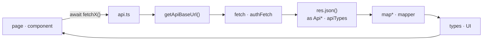
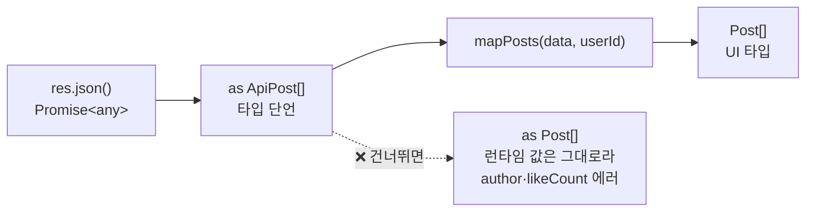

---
aliases:
  - api.ts
  - fetch 래퍼
  - fetchAPIVoid
  - fetchPosts
tags:
  - NextJS
related:
  - "[[00_JS_Ecosystem_HomePage]]"
  - "[[JS_Fetch_API]]"
  - "[[NestJS_Controller]]"
  - "[[NestJS_Response]]"
  - "[[NextJS_ApiTypes_Mapper]]"
  - "[[NextJS_TokenStorage]]"
  - "[[NextJS_UI_Types]]"
---
# NextJS_API_Client — api.ts: fetch 호출 한 곳에 모으기

> [!info] 
> api.ts는 "주소 결정 → fetch → apiTypes로 받기 → mapper로 변환"을 한 함수 안에 캡슐화한 파일
> 페이지(컴포넌트)는 이 파일의 함수만 직접 호출한다.

---
# 흐름도



```txt
페이지는 api.ts 함수만 직접 호출 — apiTypes · mapper · types는 api.ts 안에서만
공개 GET → fetch / Bearer 필요 → authFetch / login·register → fetch POST 후 토큰 저장
```

---

# 4개 파일 구조 — api.ts의 위치 ⭐️⭐️⭐️

|파일|역할|페이지가 직접 부름?|
|---|---|---|
|`api.ts` (이 노트)|진입점 — `fetchPosts()`|✅ `await fetchPosts()`|
|`apiTypes.ts`|`Api*` 타입 정의 (wire 그대로)|❌ api.ts 안에서만|
|`mapPost.ts`|Api → UI 변환|❌ api.ts가 호출|
|`types.ts`|UI shape|❌ mapper 반환 타입·컴포넌트 props로만|

```txt
페이지 입장에서 보이는 건 await fetchPosts() 한 줄뿐
apiTypes/mapper/types가 만드는 변환 과정은 api.ts 안에 숨어 있음
```

자세한 타입 설계 → [[NextJS_UI_Types]] · 변환 패턴 → [[NextJS_ApiTypes_Mapper]]

---

# 기본 템플릿 — 공개 요청 ⭐️⭐️⭐️⭐️

```typescript
// lib/api.ts
import type { ApiPost } from './apiTypes';
import { mapPosts }     from './mapPost';
import type { Post }    from './types';

function getApiBaseUrl(): string {
  const url = process.env.NEXT_PUBLIC_API_URL;
  if (!url) throw new Error('NEXT_PUBLIC_API_URL 환경변수가 설정되지 않았습니다.');
  return url.replace(/\/$/, '');   // 끝 슬래시 제거 → //posts 중복 방지
}

export async function fetchPosts(currentUserId?: string): Promise<Post[]> {
  const res = await fetch(`${getApiBaseUrl()}/posts`, {
    credentials: 'include',
    cache:       'no-store',
  });

  if (!res.ok) throw new Error(`/posts 요청 실패: ${res.status} ${res.statusText}`);

  const data = (await res.json()) as ApiPost[];
  return mapPosts(data, currentUserId);
}
```

## getApiBaseUrl

```txt
환경변수 없으면 즉시 throw — "조용히 undefined로 진행"보다 바로 원인을 알려주는 게 디버깅에 낫다
.replace(/\/$/, '') — URL 끝 슬래시 제거
  NEXT_PUBLIC_API_URL=http://localhost:3000/ 처럼 설정해도 안전하게 만들어줌
환경변수 자체에 대한 내용 → [[NextJS_Env_Config]]
```

## credentials vs cache

```txt
credentials: 'include' — 브라우저가 쿠키를 실어서 보낼지 결정
  기준은 "인증 방식(JWT냐 세션이냐)"이 아니라 "이 요청이 쿠키를 필요로 하는가"
  로그인 여부에 따라 다른 결과를 보여주는 공개 피드라면 Bearer 없이도 쿠키가 필요할 수 있음
  완전 공개 엔드포인트라면 이 옵션 생략 가능

cache 옵션 — 데이터 특성에 따라 바꿈:
```

|옵션|동작|적합한 데이터|
|---|---|---|
|`cache: 'no-store'`|매번 새로 요청|자주 바뀌는 피드, 실시간 목록|
|`next: { revalidate: 60 }`|60초 캐시 후 재검증|공지사항처럼 가끔 바뀌는 데이터|
|`cache: 'force-cache'` (기본값)|최대한 캐시 재사용|거의 안 바뀌는 정적 데이터|

## res.json() → apiTypes → mapper — 이 두 줄이 핵심 ⭐️⭐️⭐️⭐️

```typescript
const data = (await res.json()) as ApiPost[];
return mapPosts(data, currentUserId);
```



```txt
res.json()은 항상 Promise<any> — as ApiPost[]로 "이 모양일 거다"라고 알려줌
반드시 apiTypes로 먼저 받고 mapper를 거쳐야 UI 타입이 됨
as Post[]로 바로 단언하면 TS는 속지만 런타임 값은 변환 안 됨 → 필드 접근 시 에러

currentUserId를 넘기는 이유:
  "이 글에 내가 좋아요 눌렀는지(likedByMe)"처럼 로그인한 사용자 기준 필드를 채우기 위해
  ([[NextJS_ApiTypes_Mapper]] 참고)
```

## 함수명 — fetch 접두사

```txt
fetchPosts, fetchPost처럼 fetch 접두사를 붙이면
"네트워크 요청이 일어나고 실패할 수 있다"는 걸 이름에서 바로 드러냄

login / register / authFetch는 예외 — 관용적으로 자리잡은 이름이거나 범용 래퍼이기 때문
```

---

# 인증이 필요한 요청 — authFetch ⭐️⭐️⭐️

```typescript
import { getApiAccessToken } from './authToken';

/** Bearer 토큰을 자동으로 붙여주는 fetch — 인증 요청들의 공통 통로 */
export async function authFetch(path: string, init?: RequestInit): Promise<Response> {
  const token = getApiAccessToken();
  if (!token) throw new Error('로그인이 필요합니다.');

  const headers = new Headers(init?.headers);   // 기존 headers 복사
  headers.set('Authorization', `Bearer ${token}`);

  return fetch(`${getApiBaseUrl()}${path}`, { ...init, headers });
}
```

```txt
fetchPosts()와 authFetch()의 차이:
  fetchPosts()  → "/posts를 호출한다"는 구체적인 함수, apiTypes/mapper까지 다 처리
  authFetch()   → "어떤 경로든 Bearer를 붙여서 호출해준다"는 범용 래퍼, raw Response만 반환

authFetch가 raw Response를 그대로 돌려주는 이유:
  파일 다운로드(비JSON), 204(body 없음) 등 다양한 응답을 한 함수가 억지로 다 처리하면 복잡해짐
  → Bearer만 붙여주는 가장 낮은 단계로 두고, JSON 파싱까지 포함한 편의 버전은 별도로 만듦 (아래 참고)
```

---

# 로그인 / 회원가입 — authFetch를 안 쓰는 이유 ⭐️⭐️⭐️

```txt
토큰이 아직 없는 상태에서 호출하는 요청 → Bearer를 붙일 수 없음 → 평범한 fetch로 따로 처리
```

```typescript
async function postAuth(
  path: 'login' | 'register',
  body: Record<string, string>,
): Promise<ApiAuthResponse> {
  const res = await fetch(`${getApiBaseUrl()}/auth/${path}`, {
    method:  'POST',
    headers: { 'Content-Type': 'application/json' },
    body:    JSON.stringify(body),
  });

  if (!res.ok) {
    const error   = (await res.json().catch(() => null)) as { message?: string | string[] } | null;
    const message = Array.isArray(error?.message) ? error.message[0] : error?.message;
    throw new Error(message ?? `Auth ${path} 실패: ${res.status} ${res.statusText}`);
  }

  const data = (await res.json()) as ApiAuthResponse;
  setApiAccessToken(data.accessToken);   // 받은 토큰 즉시 저장
  return data;
}

export const login    = (email: string, password: string) => postAuth('login',    { email, password });
export const register = (email: string, password: string) => postAuth('register', { email, password });
```

```txt
postAuth로 묶는 이유:
  에러 처리 + setApiAccessToken 로직이 완전히 동일, 다른 건 경로와 body뿐

message가 string | string[]인 이유:
  NestJS ValidationPipe 검증 실패 → message가 배열 (여러 필드 동시 실패 가능)
  UnauthorizedException('문구') → message가 문자열
  → 클라이언트는 둘 다 처리해야 안전 ([[NestJS_Controller]] ValidationPipe 참고)

토큰 저장 함수 → [[NextJS_TokenStorage]]
```

---

# 반복 패턴 줄이기 — `fetchAPI<T>` + ApiError ⭐️⭐️⭐️⭐️

```txt
fetchPosts / postAuth / authFetch 를 나란히 보면 매번 반복:
  fetch 호출 → res.ok 확인 → 에러 메시지 추출 → res.json() 파싱
→ 공통 엔진 하나로 모으는 리팩터링 — 호출하는 쪽(page.tsx)은 그대로
```

```typescript
// lib/ApiError.ts
export class ApiError extends Error {
  constructor(message: string, public readonly status: number) {
    super(message);
    this.name = 'ApiError';
  }
}
```

```typescript
// lib/fetchAPI.ts
import { ApiError } from './ApiError';

async function throwIfNotOk(res: Response, path: string): Promise<void> {
  if (res.ok) return;
  const body    = (await res.json().catch(() => null)) as { message?: string | string[] } | null;
  const message = Array.isArray(body?.message) ? body.message[0] : body?.message;
  throw new ApiError(message ?? `${path} 요청 실패: ${res.status} ${res.statusText}`, res.status);
}

export async function fetchAPI<T>(path: string, init?: RequestInit): Promise<T> {
  const res = await fetch(`${getApiBaseUrl()}${path}`, init);
  await throwIfNotOk(res, path);
  return res.json() as Promise<T>;
}
```

## ApiError — 상태 코드로 분기 ⭐️⭐️

```txt
기존 throw new Error(message):
  호출하는 쪽이 받는 건 메시지 문자열뿐
  "이게 401이라 로그인 페이지로 보내야 하는지" → 메시지 내용을 추측해서 파싱해야 함 (취약)

ApiError에 status가 있으면:
```

```typescript
catch (e) {
  if (e instanceof ApiError && e.status === 401) {
    // 메시지 내용과 무관하게 상태 코드로 명확히 분기
    router.push('/login');
  }
}
```

```txt
throwIfNotOk를 fetchAPI 안에 숨기지 않고 따로 뺀 이유:
  "성공 확인"과 "body 파싱 방식"은 독립적인 결정
  → 아래 Void 변형도 throwIfNotOk를 그대로 재사용할 수 있음
```

---

# 204 — body 없는 응답 Void 변형 ⭐️⭐️⭐️⭐️

```txt
204(No Content)는 body 자체가 없는 응답 (서버 동작 → [[NestJS_Response]] 참고)
fetchAPI<T>처럼 res.json()을 항상 호출하면 빈 문자열을 파싱하려다 SyntaxError

"요청 성공(res.ok === true)"과 "body를 파싱할 수 있음"은 별개
→ throwIfNotOk까지만 하고 res.json() 호출 안 하는 Void 버전을 따로 둠
```

```typescript
export async function fetchAPIVoid(path: string, init?: RequestInit): Promise<void> {
  const res = await fetch(`${getApiBaseUrl()}${path}`, init);
  await throwIfNotOk(res, path);
  // res.json() 호출 안 함
}

// 인증 버전도 동일하게 분리
export async function authFetchApi<T>(path: string, init?: RequestInit): Promise<T> {
  const res = await authFetch(path, init);
  await throwIfNotOk(res, path);
  return (await res.json()) as Promise<T>;
}

export async function authFetchApiVoid(path: string, init?: RequestInit): Promise<void> {
  const res = await authFetch(path, init);
  await throwIfNotOk(res, path);
}
```

```typescript
// 사용 — 엔드포인트 응답에 맞춰 선택
const post = await authFetchApi<ApiPost>(`/posts/${id}`);          // body 있음
await authFetchApiVoid(`/posts/${id}`, { method: 'DELETE' });      // 204
```

|함수|인증|body 파싱|
|---|---|---|
|`fetchAPI<T>`|❌|✅|
|`fetchAPIVoid`|❌|❌|
|`authFetchApi<T>`|✅|✅|
|`authFetchApiVoid`|✅|❌|

```txt
4개 함수 = "인증 여부 × body 유무" 두 독립적인 기준의 조합
"이름이 4개로 늘었다"가 아니라 두 가지 질문에 각각 답한 결과

Void가 필요한 경우: 204 외에도 응답 body가 있어도 쓸 일이 없는 경우도 해당
"이 응답의 body를 코드에서 실제로 쓰는가"가 진짜 기준
```

---

# ` fetchAPI<T> `적용 후 — 기존 함수 정리 ⭐️⭐️⭐️

```typescript
// 공개 요청 — apiTypes → mapper 그대로
export async function fetchPosts(currentUserId?: string): Promise<Post[]> {
  const data = await fetchAPI<ApiPost[]>('/posts', {
    credentials: 'include',
    cache:       'no-store',
  });
  return mapPosts(data, currentUserId);
}

// 로그인/회원가입 — fetchAPI에 위임, 성공 시 토큰 저장 추가
async function postAuth(
  path: 'login' | 'register',
  body: Record<string, string>,
): Promise<ApiAuthResponse> {
  const data = await fetchAPI<ApiAuthResponse>(`/auth/${path}`, {
    method:  'POST',
    headers: { 'Content-Type': 'application/json' },
    body:    JSON.stringify(body),
  });
  setApiAccessToken(data.accessToken);
  return data;
}
```

```txt
바뀐 것: 함수 내부에서 res.ok 체크 + 에러 파싱 + res.json()이 사라짐 → fetchAPI에 위임
바뀌지 않은 것: 호출하는 쪽(page.tsx)은 await fetchPosts()로 동일

파일 다운로드·비JSON 응답 같은 특수 케이스는
fetchAPI/authFetchApi를 거치지 않고 raw authFetch나 fetch()를 직접 쓰는 것도 괜찮음
모든 요청을 억지로 통일할 필요는 없음
```

---

# 한눈에

```txt
api.ts 한 함수의 4단계:
  getApiBaseUrl() → fetch 호출 → as ApiTypes 단언 → mapper로 UI 타입 변환

res.json() 두 줄 규칙:
  (await res.json()) as ApiPost[]   ← 반드시 apiTypes 먼저
  mapPosts(data)                    ← mapper 거쳐야 UI 타입
  as Post[]로 바로 단언 금지 — 런타임 값은 변환 안 됨

공개 vs 인증 vs 로그인:
  공개 요청     fetchPosts() — 엔드포인트 1개당 구체적 함수, apiTypes/mapper까지 안에서 처리
  인증 요청     authFetch() — Bearer만 붙여주는 범용 래퍼, raw Response 반환
  로그인/회원가입  토큰 없어서 authFetch 불가 → 평범한 fetch + setApiAccessToken

credentials: 'include' 기준:
  "인증 방식(JWT냐 세션이냐)"이 아니라 "이 요청이 쿠키를 필요로 하는가"로 판단

NestJS 에러 message가 string | string[]인 이유:
  ValidationPipe → 배열 / 직접 throw → 문자열 → 클라이언트가 둘 다 처리해야 함

반복 보이면 → fetchAPI<T> + ApiError + throwIfNotOk:
  throwIfNotOk   res.ok + 에러 추출 + throw 공유 헬퍼
  fetchAPI<T>    throwIfNotOk + res.json()
  ApiError       status 포함 → e.status === 401 분기 가능

204(body 없음) → res.json() 호출하면 SyntaxError:
  fetchAPIVoid / authFetchApiVoid — throwIfNotOk까지만, 파싱 안 함
  4개 함수 = 인증 여부 × body 유무 조합

타입 설계 → [[NextJS_UI_Types]]
apiTypes + mapper → [[NextJS_ApiTypes_Mapper]]
토큰 저장 → [[NextJS_TokenStorage]]
204 서버 동작 → [[NestJS_Response]]
환경변수 검증 → [[NextJS_Env_Config]]
```