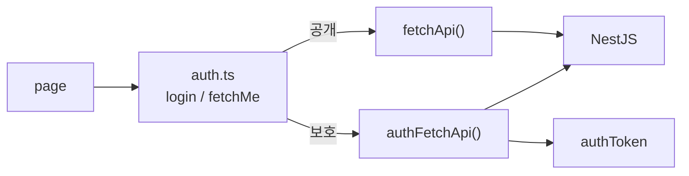

# NextJS_API_Client — API 클라이언트 레이어

>[!info]
>Next.js에서 NestJS API를 호출할 때 `fetch`를 직접 쓰지 않고 래퍼로 감싼다. **패턴 A** — `fetchApi`(공개)·`authFetchApi`(Bearer 자동) 두 함수로 역할 분리. **패턴 B** — `apiFetch(path, { token? })` 하나로 통합. 둘 다 도메인 파일(`auth.ts`, `users.ts`)에 엔드포인트 함수를 모으고 화면은 함수만 호출한다.

---
# 핵심 개념 먼저 ⭐️⭐️⭐️⭐️

```txt
NestJS (서버)           Next.js (클라이언트)
  요청을 받는 쪽  ←←←  브라우저가 fetch로 요청을 보내는 쪽

이 파일이 다루는 것:

  fetch         브라우저 내장 HTTP 요청 함수
                Promise를 반환 — 네트워크가 끝날 때까지 기다림

  인프라 함수   fetchApi / apiFetch
                URL 조합·헤더 설정·에러 처리를 한 곳에서 담당

  도메인 함수   엔드포인트별 함수 (lib/api/posts.ts, users.ts ...)
                "무엇을 어떤 path로 보내는가"를 정의
                화면은 이 함수만 호출

  <T> 제네릭    apiFetch<T>(...) 의 T
                "이 API가 반환하는 데이터의 타입"
                → 화면에서 타입 안전하게 사용 가능

  Input 타입    내가 서버에 보내는 것 (요청 body)
                NestJS DTO와 같은 필드

  Response 타입 서버가 나에게 주는 것 (응답 body)
                NestJS 응답 DTO / Prisma 모델 형태

  token         로그인한 유저임을 증명하는 문자열
                Authorization: Bearer {token} 헤더로 전달
                Guard가 있는 엔드포인트에 필요
```

## 타입이 흐르는 방향

```typescript
// GET — 데이터 조회 (token 필요, body 없음)
export function getPost(token: string, postId: string) {
  return apiFetch<PostItem>(`/posts/${postId}`, { token });
  //              ↑ 응답 타입 (받는 것)
}

// POST — 데이터 생성 (token + body)
export function createPost(token: string, input: CreatePostInput) {
  //                                              ↑ 요청 body 타입 (보내는 것)
  return apiFetch<PostItem>('/posts', {
    method: 'POST',
    token,
    body: JSON.stringify(input),
  });
}

// PATCH — 일부 수정
export function updatePost(token: string, postId: string, input: UpdatePostInput) {
  return apiFetch<PostItem>(`/posts/${postId}`, {
    method: 'PATCH',
    token,
    body: JSON.stringify(input),
  });
}

// DELETE — 삭제 (응답 없음이면 void)
export function deletePost(token: string, postId: string) {
  return apiFetch<void>(`/posts/${postId}`, {
    method: 'DELETE',
    token,
  });
}

// 공개 API — token 없이
export function getPublicPosts() {
  return apiFetch<PostItem[]>('/posts');
}
```

```txt
패턴 정리:
  apiFetch<응답타입>(path, { method, token?, body? })

  token 있음 → 로그인 필요한 API (Guard 있는 엔드포인트)
  token 없음 → 공개 API (로그인 없이 접근 가능)
  body 있음  → POST·PATCH·PUT (데이터 전송)
  body 없음  → GET·DELETE (path만으로 처리)

  Input 타입 (보내는 것):
    CreatePostInput → NestJS CreatePostDto와 같은 필드
    UpdatePostInput → NestJS UpdatePostDto (보통 Partial)

  Response 타입 (받는 것):
    PostItem        → NestJS 응답 DTO / Prisma 모델 형태
    PostItem[]      → 목록
    void            → 응답 body 없음 (DELETE 등)
```

---
# 왜 API 클라이언트 레이어가 필요한가 ⭐️⭐️⭐️⭐️

```txt
NestJS (API 서버):
  GET /posts, POST /auth/login, PATCH /users/:id ...
  요청을 받는 쪽

Next.js (클라이언트):
  브라우저가 fetch로 NestJS에 요청을 보내는 쪽
  → 이 fetch 호출을 어디에, 어떻게 쓸 것인가?

❌ 나쁜 방식 — page.tsx에 직접:
  const res = await fetch('http://localhost:3030/auth/login', {
    method: 'POST',
    headers: { 'Content-Type': 'application/json', Authorization: `Bearer ${token}` },
    body: JSON.stringify({ email, password }),
  });
  → 모든 페이지마다 URL·헤더·에러처리 반복
  → URL 바뀌면 전부 수정해야 함

✅ 좋은 방식 — 레이어 분리:
  화면 → 도메인 함수(auth.ts) → fetchApi/authFetch → NestJS
  화면은 login(email, password) 만 호출
  URL·헤더·에러처리는 fetchApi가 담당
```

---

# fetch — Web이 API를 부르는 방법 ⭐️⭐️⭐️⭐️

```typescript
// fetch 기본 구조
const res = await fetch(url, {
  method:  'POST',   // 없으면 GET
  headers: {
    'Content-Type': 'application/json',
    Authorization:  `Bearer ${token}`,  // 필요할 때만
  },
  body: JSON.stringify({ email, password }),  // GET에는 없음
});
```

```typescript
// RequestInit — fetch 두 번째 인자의 TypeScript 타입
fetch(url: string, options?: RequestInit)
//                           ↑ method·body·headers·signal 등을 담는 타입

// options?: RequestInit 을 파라미터로 받으면
// ...options 로 fetch에 그대로 투과 가능
```

|조각|의미|
|---|---|
|`fetch(...)`|Promise 반환 — 네트워크 끝날 때까지 기다림|
|`await`|Promise 결과를 받을 때까지 멈춤|
|`res.ok`|상태코드 200~299이면 true. 401·500은 false|
|`await res.json()`|응답 body를 객체로 파싱 — 이것도 Promise|
|`await res.text()`|JSON이 아닐 때 / 에러 메시지 문자열|

```txt
fetch가 throw하는 경우:
  네트워크 끊김, CORS 차단 → catch로 잡힘
  401·403·500 → throw 안 함 → if (!res.ok) 체크 필수

await를 두 번 쓰는 이유:
  1) await fetch  → Response 헤더·상태까지 도착
  2) await res.json() → body 읽기·파싱 (별도 비동기)

Bearer 형식:
  Authorization: `Bearer ${accessToken}`
  → JwtAuthGuard의 extractBearerToken과 짝
```

---

# 두 가지 구현 패턴 ⭐️⭐️⭐️⭐️

```txt
패턴 A — fetchApi + authFetchApi 분리:
  공개 API → fetchApi()      (Bearer 없음)
  인증 API → authFetchApi()  (Bearer 자동 첨부)
  명확한 역할 분리, Bearer 필요 여부를 함수 이름으로 구분

패턴 B — apiFetch + token? 통합:
  모든 API → apiFetch(path, { token? })
  token 있으면 Bearer 추가, 없으면 생략
  함수 하나로 통일, 호출 시 token을 직접 제어
```

---

# 패턴 A — fetchApi + authFetchApi 분리

## lib/api 폴더 구조

```txt
apps/web/lib/
  authToken.ts          토큰 get/set (메모리)
  api/
    fetchApi.ts         base URL · !ok throw · JSON (Bearer 없음)
    authFetch.ts        Authorization Bearer + 같은 에러 처리
    auth.ts             login · register · fetchMe
    users.ts            유저 관련 엔드포인트
    index.ts            export * from './auth' …
```

## authToken.ts — 토큰 메모리 관리

```typescript
// lib/authToken.ts
let _accessToken: string | null = null;

export function getApiAccessToken(): string | null {
  return _accessToken;
}

export function setApiAccessToken(token: string): void {
  _accessToken = token;
}

export function removeApiAccessToken(): void {
  _accessToken = null;
}
```

## fetchApi.ts — 공개 API용

```typescript
// lib/api/fetchApi.ts
const API_URL = process.env.NEXT_PUBLIC_API_URL ?? 'http://localhost:3030';

export async function fetchApi<T>(
  path: string,
  options?: RequestInit,   // fetch 옵션 그대로 투과
): Promise<T> {
  const res = await fetch(`${API_URL}${path}`, {
    ...options,
    headers: {
      'Content-Type': 'application/json',
      ...options?.headers,
    },
  });

  if (!res.ok) {
    const message = await res.text();
    throw new Error(message || `HTTP ${res.status}`);
  }

  return res.json() as Promise<T>;
}
```

## authFetch.ts — 인증 API용 (Bearer 자동 첨부)

```typescript
// lib/api/authFetch.ts
import { getApiAccessToken } from '../authToken';
import { fetchApi }          from './fetchApi';

export async function authFetchApi<T>(
  path: string,
  options?: RequestInit,
): Promise<T> {
  const token = getApiAccessToken();

  return fetchApi<T>(path, {
    ...options,
    headers: {
      ...options?.headers,
      ...(token ? { Authorization: `Bearer ${token}` } : {}),
    },
  });
}
```

## 도메인 파일 — auth.ts

```typescript
// lib/api/auth.ts
import { fetchApi }          from './fetchApi';
import { authFetchApi }      from './authFetch';
import { setApiAccessToken } from '../authToken';
import type { ApiAuthResponse, ApiAuthUser } from './apiTypes';

async function postAuth(
  path: 'login' | 'register',
  body: Record<string, string>,
): Promise<ApiAuthResponse> {
  const data = await fetchApi<ApiAuthResponse>(`/auth/${path}`, {
    method: 'POST',
    body:   JSON.stringify(body),
  });
  setApiAccessToken(data.accessToken);
  return data;
}

export function login(email: string, password: string) {
  return postAuth('login', { email: email.trim(), password });
}

export function register(email: string, password: string, nickname: string) {
  return postAuth('register', { email: email.trim(), password, nickname: nickname.trim() });
}

export async function fetchMe(): Promise<ApiAuthUser> {
  return authFetchApi<ApiAuthUser>('/auth/me');
}
```

## 도메인 함수 만드는 법 — 제네릭과 타입 ⭐️⭐️⭐️⭐️

```typescript
// 예시: 게시글 생성 API 함수
export function createWallPost(
  token: string,              // Bearer 토큰 (로그인한 사용자)
  input: CreateWallPostInput, // 요청 body 타입 (보내는 것)
) {
  return apiFetch<WallPostItem>('/wall-posts', {
  //             ↑ 제네릭 <T>
  //               "이 API가 반환하는 데이터의 타입"
    method: 'POST',
    token,                       // Bearer 헤더에 자동 추가
    body: JSON.stringify(input), // 요청 body
  });
  // 반환: Promise<WallPostItem>
}
```

```typescript
// 타입 정의 (lib/api/apiTypes.ts 또는 도메인 파일)
type CreateWallPostInput = {
  content:  string;    // 보내는 것 (요청 body)
  imageUrl?: string;
};

type WallPostItem = {
  id:        string;   // 받는 것 (응답 body)
  content:   string;
  createdAt: string;
  author:    { id: string; nickname: string };
};
```

```txt
apiFetch<WallPostItem>(...) 분해:

  apiFetch       = 인프라 함수 (URL·헤더·에러처리)
  <WallPostItem> = TypeScript 제네릭 — "이 fetch가 반환하는 타입"
                   Promise<WallPostItem> 이 반환됨
                   → 화면에서 data.id, data.content 타입 안전하게 접근

  token: string  = Bearer 토큰 — apiFetch 내부에서 Authorization 헤더로 변환
  input: CreateWallPostInput
                 = 요청 body의 타입
                 → JSON.stringify(input)으로 body에 넣음

정리:
  CreateWallPostInput = "내가 서버에 보내는 것"의 타입  (보내는 쪽)
  WallPostItem        = "서버가 나에게 주는 것"의 타입  (받는 쪽)
  token               = "내가 로그인한 유저임을 증명"   (인증)

NestJS DTO와의 대응:
  CreateWallPostInput ↔ NestJS CreateWallPostDto (같은 필드)
  WallPostItem        ↔ NestJS 응답 DTO / Prisma 모델
```

```typescript
// 호출 시
const post = await createWallPost(accessToken, {
  content:  '오늘 들은 음악',
  imageUrl: '/images/album.jpg',
});
// post는 WallPostItem 타입 → post.id, post.author.nickname 등 자동완성
```

## index.ts — 진입점

```typescript
// lib/api/index.ts
export * from './auth';
export * from './users';

// 사용
import { login, fetchMe } from '@/lib/api';
```

---

# 패턴 B — apiFetch + token? 통합

```typescript
// lib/api/apiFetch.ts
const API_URL = process.env.NEXT_PUBLIC_API_URL ?? 'http://localhost:3030';

export async function apiFetch<T>(
  path: string,
  options: RequestInit & { token?: string | null } = {},
  //       ↑ RequestInit의 모든 필드 + token 필드 교차 추가
  //                        ? = 없어도 됨
  //                               | null = null도 허용 (토큰 없음 명시)
  //       = {} → 아무 옵션 안 넘겨도 됨: apiFetch('/health')
): Promise<T> {
  const { token, headers, ...rest } = options;
  //      ↑ token은 fetch 표준이 아니라서 따로 꺼냄
  //                           ↑ 나머지(method, body, signal)는 rest로

  const res = await fetch(`${API_URL}${path}`, {
    ...rest,
    headers: {
      'Content-Type': 'application/json',
      ...(token ? { Authorization: `Bearer ${token}` } : {}),
      //  token 있으면 Bearer 헤더 추가, 없으면 생략
      ...headers,
    },
  });

  if (!res.ok) {
    const body = await res.json().catch(() => null);
    const message = Array.isArray(body?.message)
      ? body.message.join(', ')
      : body?.message;
    throw new Error(message ?? `HTTP ${res.status}`);
  }

  return res.json() as Promise<T>;
}
```

```typescript
// 사용 예
apiFetch('/health')                          // 토큰 없이
apiFetch('/posts', { token: accessToken })   // 토큰 포함 → Bearer 자동
apiFetch('/posts', {
  method: 'POST',
  body: JSON.stringify(data),
  token: accessToken,
})
```


---

# 패턴 B — 고도화(Robust) 버전 ⭐️⭐️⭐️⭐️⭐️

> [!info]
> 기본 패턴 B는 `res.json()`을 바로 호출함 → 서버가 204·HTML 에러·빈 body를 보내면 `SyntaxError`로 터짐.
> `res.text()` 로 먼저 읽어서 직접 분기처리하면 세 케이스 모두 방어 가능.

```typescript
export async function apiFetch<T>(
  path: string,
  options: RequestInit & { token?: string | null } = {},
): Promise<T> {
  const { token, headers, ...rest } = options;

  const res = await fetch(`${API_URL}/v1${path}`, {
    ...rest,
    headers: {
      'Content-Type': 'application/json',
      ...(token ? { Authorization: `Bearer ${token}` } : {}),
      ...headers,
    },
  });

  const raw = await res.text();       // ① 어떤 응답이든 문자열로 먼저 수신

  if (res.status === 204) {           // ② 204 — body 없는 성공
    return undefined as T;
  }

  let body: unknown = null;

  if (raw.trim()) {
    try {
      body = JSON.parse(raw);         // ③ JSON이면 파싱
    } catch {
      throw new Error(               // ④ HTML·text면 앞 200자 노출
        `JSON 파싱 실패 (HTTP ${res.status}): ${raw.slice(0, 200)}`,
      );
    }
  }

  if (!res.ok) {
    throw new Error(parseApiErrorMessage(body, res.status));
  }

  if (!raw.trim()) {                  // ⑤ 2xx인데 body가 빈 경우 방어
    throw new Error(`빈 응답 (HTTP ${res.status})`);
  }

  return body as T;                   // ⑥ 타입 단언
}
```

```txt
res.text() 를 쓰는 이유:
  text()는 어떤 응답이든 string으로 읽음 — 절대 throw 안 함
  json()은 body가 비거나 HTML이면 SyntaxError → 에러 정보 소실

  text() 로 읽은 뒤 JSON.parse(raw) 직접 시도하면:
  → 파싱 실패 시 raw 내용을 에러 메시지에 담아서 디버깅 가능
  → 204·빈 body 도 명시적으로 처리 가능

  Response body는 스트림 — text()·json()·blob() 중 하나만 호출 가능

body as T:
  JSON.parse()는 any 반환 → body: unknown 으로 받아서 타입 강제 없이 보관
  return body as T  →  "서버 응답이 T 타입임"을 TypeScript에 단언
  런타임 검증 없음 — 서버 스펙과 어긋나면 런타임 에러 가능
  → 안전하게 하려면 zod.parse() 또는 [[OpenAPI_Codegen]] 사용
```

---

# 전체 흐름 요약

```txt
page.tsx (화면)
  ↓ login(email, password) 호출
auth.ts (도메인)
  ↓ fetchApi('/auth/login', ...) 호출       [패턴 A]
  ↓ apiFetch('/auth/login', ...)  호출      [패턴 B]
fetchApi / apiFetch (인프라)
  ↓ fetch('http://localhost:3030/...') 실행
NestJS
  ↓ 응답
fetchApi / apiFetch
  ↓ res.ok 체크 → res.json() 파싱 → 반환
auth.ts
  ↓ setApiAccessToken(data.accessToken)
page.tsx
```

---

# 헷갈리기 쉬운 구분 ⭐️⭐️⭐️⭐️

## fetchApi.ts 파일 vs fetchApi() 함수

```txt
파일: 공통 HTTP 유틸이 모인 곳 (fetchApi 함수, getApiBaseUrl 등)
함수: Bearer 없는 완성 호출 — login 등 공개 API에서 사용

authFetch.ts:
  fetchApi()를 호출하지 않고
  getApiBaseUrl + !ok 처리만 재사용 (Bearer를 먼저 붙여야 해서)
```

## authFetch.ts vs auth.ts

| |`authFetch.ts`|`auth.ts`|
|---|---|---|
|층|인프라 (도구)|도메인 (메뉴)|
|질문|어떻게 보내나?|무엇을 보내나?|
|내용|path + Bearer + `!ok` + json|`login` · `fetchMe` · body · setToken|

## 누가 누굴 호출하는가

```txt
page    → auth.ts 만 호출 (path 문자열·헤더 직접 쓰지 않음)
auth.ts → fetchApi 또는 authFetchApi 선택
  login()   → fetchApi      (공개, Bearer 없음)
  fetchMe() → authFetchApi  (보호, Bearer 있음)
```
 

```mermaid-beautiful
flowchart LR
  P["page"] --> A["auth.ts\nlogin / fetchMe"]
  A -->|공개| F["fetchApi()"]
  A -->|보호| AF["authFetchApi()"]
  AF --> T["authToken"]
  F --> N["NestJS"]
  AF --> N
```