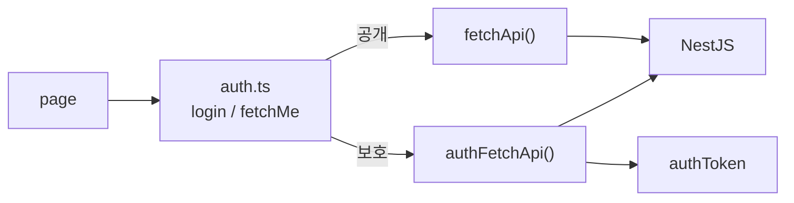

---
aliases:
  - api.ts
  - fetch 래퍼
  - fetchAPIVoid
  - fetchPosts
tags:
  - NextJS
related:
  - "[[00_JS_Ecosystem_HomePage]]"
  - "[[NextJS_API_Mapper]]"
  - "[[NextJS_Types]]"
  - "[[NextJS_Concept]]"
  - "[[JS_Fetch_API]]"
  - "[[NextJS_ServerClient]]"
---
# NextJS_API_Client — API 클라이언트 레이어

>[!info]
>Next.js에서 NestJS API를 호출하는 방법.
> 브라우저 내장 `fetch`를 직접 쓰지 않고 `fetchApi`(공개 API)·`authFetchApi`(인증 필요 API)로 래핑해서 URL·헤더·에러처리를 한 곳에서 관리한다. 
> 도메인별 파일(`auth.ts`, `users.ts`)에 엔드포인트 함수를 모으고 화면은 함수만 호출한다.

---

# 왜 API 클라이언트 레이어가 필요한가 ⭐️⭐️⭐️⭐️

```txt
NestJS (API 서버):
  GET /posts, POST /auth/login, PATCH /users/:id ...
  요청을 받는 쪽

Next.js (클라이언트):
  브라우저가 fetch로 NestJS에 요청을 보내는 쪽
  → 이 fetch 호출을 어디에, 어떻게 쓸 것인가?

❌ 나쁜 방식 — page.tsx에 직접:
  const res = await fetch('http://localhost:3030/auth/login', {
    method: 'POST',
    headers: { 'Content-Type': 'application/json', Authorization: `Bearer ${token}` },
    body: JSON.stringify({ email, password }),
  });
  if (!res.ok) throw new Error(await res.text());
  const data = await res.json();
  → 모든 페이지마다 URL·헤더·에러처리를 반복
  → URL 바뀌면 전부 수정해야 함

✅ 좋은 방식 — 레이어 분리:
  화면(page/component) → 도메인 함수(auth.ts) → fetchApi/authFetch → NestJS
  화면은 login(email, password) 만 호출
  URL·헤더·에러처리는 fetchApi가 담당
```

---

# fetch — Web이 API를 부르는 방법 ⭐️⭐️⭐️⭐️

```typescript
// fetch 기본 구조
const res = await fetch(url, {
  method:  'POST',   // 없으면 GET
  headers: {
    'Content-Type': 'application/json',
    Authorization:  `Bearer ${token}`,  // 필요할 때만
  },
  body: JSON.stringify({ email, password }),  // GET에는 없음
});
```

|조각|의미|
|---|---|
|`fetch(...)`|Promise 반환 — 네트워크 끝날 때까지 기다림|
|`await`|Promise 결과를 받을 때까지 멈춤 → async 함수 안에서만|
|`res.ok`|상태코드 200~299이면 true. 401·500은 false|
|`await res.json()`|응답 body를 객체로 파싱 — 이것도 Promise|
|`await res.text()`|JSON이 아닐 때 / 에러 메시지 문자열|

```txt
헷갈리기 쉬운 점:

fetch가 throw하는 경우:
  네트워크 끊김, CORS 차단 → catch로 잡힘
  401·403·500 → throw 안 함, res.ok === false
  → 항상 if (!res.ok) 체크 필수

await를 두 번 쓰는 이유:
  1) await fetch  → Response 헤더·상태까지 도착
  2) await res.json() → body 읽기·파싱 (별도 비동기)

Nest @Body() vs fetch body:
  Nest: ValidationPipe가 JSON을 DTO로 변환
  Web: JSON.stringify로 보내고 Content-Type: application/json

Bearer 형식:
  Authorization: `Bearer ${accessToken}`
  "Bearer " + 토큰 (공백 포함)
  JwtAuthGuard의 extractBearerToken과 짝
```

---

# lib/api 폴더 구조 ⭐️⭐️⭐️⭐️

```txt
처음엔 api.ts 하나로 시작
엔드포인트·도메인이 늘면 폴더로 쪼갬

apps/web/lib/
  authToken.ts          토큰 get/set (메모리)
  api/
    fetchApi.ts         공통: base URL · !ok throw · JSON 파싱 (Bearer 없음)
    authFetch.ts        공통: Authorization Bearer 붙인 뒤 같은 에러 처리
    auth.ts             login · register · fetchMe
    users.ts            유저 관련 엔드포인트
    posts.ts            게시글 관련 엔드포인트
    index.ts            export * from './auth' …  ← 진입점
```

```txt
왜 두 레이어인가:
  fetchApi   = 인프라 (모든 호출의 뼈대 — URL·헤더·에러처리)
  auth.ts 등 = 도메인 (어떤 path · body · 타입인지)
  page.tsx   = UI만 (path 문자열·헤더 직접 안 씀)

사용 규칙:
  ✅ 화면 → login() / fetchMe() 만 호출
  ❌ 화면에서 fetch(`${API_URL}/auth/login`) 직접 쓰기 금지
  ✅ 새 API 추가 = 도메인 파일에 함수 하나 추가
  ✅ 공개 POST / 로그인 전 → fetchApi
  ✅ Guard 있는 API (Bearer 필요) → authFetchApi
```

---

# authToken.ts — 토큰 메모리 관리 ⭐️⭐️⭐️

```typescript
// lib/authToken.ts
let _accessToken: string | null = null;

export function getApiAccessToken() {
  return _accessToken;
}
export function setApiAccessToken(token: string) {
  _accessToken = token;
}
export function removeApiAccessToken() {
  _accessToken = null;
}
```

```txt
메모리에 저장하는 이유:
  localStorage는 XSS에 취약
  httpOnly 쿠키는 JS에서 못 읽음
  메모리(변수)는 새로고침 시 사라지지만 가장 안전
  → 새로고침 후 복구는 /auth/me로 해결

새로고침 후 복구 흐름:
  앱 시작 → authToken이 null
  → fetchMe() 호출 (쿠키의 refreshToken으로)
  → 새 accessToken 받아서 setApiAccessToken()
  → 이후 authFetch가 정상 작동
```

---

# fetchApi.ts — 공개 API용 베이스 ⭐️⭐️⭐️⭐️

```typescript
// lib/api/fetchApi.ts
const API_URL = process.env.NEXT_PUBLIC_API_URL ?? 'http://localhost:3030';

export async function fetchApi<T>(
  path: string,
  options?: RequestInit,
): Promise<T> {
  const res = await fetch(`${API_URL}${path}`, {
    ...options,
    headers: {
      'Content-Type': 'application/json',
      ...options?.headers,
    },
  });

  if (!res.ok) {
    const message = await res.text();
    throw new Error(message || `HTTP ${res.status}`);
  }

  return res.json() as Promise<T>;
}
```

---

# authFetch.ts — 인증 API용 (Bearer 자동 첨부) ⭐️⭐️⭐️⭐️

```typescript
// lib/api/authFetch.ts
import { getApiAccessToken } from '../authToken';
import { fetchApi }          from './fetchApi';

export async function authFetchApi<T>(
  path: string,
  options?: RequestInit,
): Promise<T> {
  const token = getApiAccessToken();

  return fetchApi<T>(path, {
    ...options,
    headers: {
      ...options?.headers,
      ...(token ? { Authorization: `Bearer ${token}` } : {}),
    },
  });
}
```

```txt
fetchApi vs authFetchApi:
  fetchApi     → 토큰 없이 호출 (로그인·회원가입·공개 API)
  authFetchApi → 토큰 자동 첨부 (Guard 있는 API)

  authFetchApi는 fetchApi를 호출
  → 에러처리·URL 조합 로직은 fetchApi 한 곳에만
```

---

# 도메인 파일 — auth.ts ⭐️⭐️⭐️⭐️

```typescript
// lib/api/auth.ts
import { fetchApi }       from './fetchApi';
import { authFetchApi }   from './authFetch';
import { setApiAccessToken } from '../authToken';
import type { ApiAuthResponse, ApiAuthUser } from './apiTypes';

async function postAuth(
  path: 'login' | 'register',
  body: Record<string, string>,
): Promise<ApiAuthResponse> {
  const data = await fetchApi<ApiAuthResponse>(`/auth/${path}`, {
    method: 'POST',
    body:   JSON.stringify(body),
  });
  setApiAccessToken(data.accessToken);  // 로그인 성공 시 토큰 저장
  return data;
}

export function login(email: string, password: string) {
  return postAuth('login', { email: email.trim(), password });
}

export function register(email: string, password: string, nickname: string) {
  return postAuth('register', { email: email.trim(), password, nickname: nickname.trim() });
}

export async function fetchMe(): Promise<ApiAuthUser> {
  return authFetchApi<ApiAuthUser>('/auth/me');
  // Bearer 자동 첨부 — Guard 있는 엔드포인트
}
```

---

# index.ts — 진입점 ⭐️⭐️⭐️

```typescript
// lib/api/index.ts
export * from './auth';
export * from './users';
export * from './posts';
// 필요하면 추가
```

```typescript
// 사용처에서
import { login, fetchMe } from '@/lib/api';
// 또는 직접 파일 지정
import { login }          from '@/lib/api/auth';
```

---

# 전체 흐름 요약

```txt
page.tsx (화면)
  ↓ login(email, password) 호출
auth.ts (도메인)
  ↓ fetchApi('/auth/login', { method: 'POST', body: ... }) 호출
fetchApi.ts (인프라)
  ↓ fetch('http://localhost:3030/auth/login', ...) 실행
NestJS AuthController
  ↓ AuthService.login() → JWT 발급
fetchApi.ts
  ↓ res.ok 체크 → res.json() 파싱 → 반환
auth.ts
  ↓ setApiAccessToken(data.accessToken) → 반환
page.tsx
  ↓ 로그인 완료
```

---

# 헷갈리기 쉬운 구분 ⭐️⭐️⭐️⭐️

## 1. fetchApi.ts 파일 vs fetchApi() 함수

```txt
같은 이름이라 헷갈림:

  fetchApi.ts 파일:
    공통 HTTP 유틸이 모인 곳
    getApiBaseUrl() · throwIfNotOk() · fetchApi() 함수들이 여기 있음

  fetchApi() 함수:
    그 파일 안의 함수 중 하나 — "Bearer 없는 완성 호출"
    login() 같은 공개 API에서 이걸 호출

  authFetch.ts:
    fetchApi() 함수를 호출하지 않음
    getApiBaseUrl + throwIfNotOk 만 재사용
    (Bearer를 fetch 전에 직접 붙여야 하기 때문)
```

## 2. authFetch.ts vs auth.ts

| |`authFetch.ts`|`auth.ts`|
|---|---|---|
|층|인프라 (도구)|도메인 (메뉴)|
|질문|어떻게 보내나?|무엇을 보내나?|
|내용|path + Bearer 붙이기 + `!ok` + json|`login` · `fetchMe` · body · setToken|
|예|`authFetchApi('/users/me')`|`fetchMe()` → 안에서 `authFetchApi` 호출|

## 3. 누가 누굴 호출하는가

```txt
page    → auth.ts 만 호출 (path 문자열·헤더 직접 쓰지 않음)
auth.ts → fetchApi 또는 authFetchApi 선택
authFetchApi → authToken.get() + fetch()

  login()   → fetchApi      (공개, Bearer 없음)
  fetchMe() → authFetchApi  (보호, Bearer 있음)

page가 authFetchApi를 직접 호출하면 안 됨
→ 어떤 API가 Bearer 필요한지 모든 화면이 알아야 함 (관심사 분리 위반)
```


```mermaid-beautiful
flowchart LR
  P["page"] --> A["auth.ts\nlogin / fetchMe"]
  A -->|공개| F["fetchApi()"]
  A -->|보호| AF["authFetchApi()"]
  AF --> T["authToken"]
  F --> N["NestJS"]
  AF --> N
```