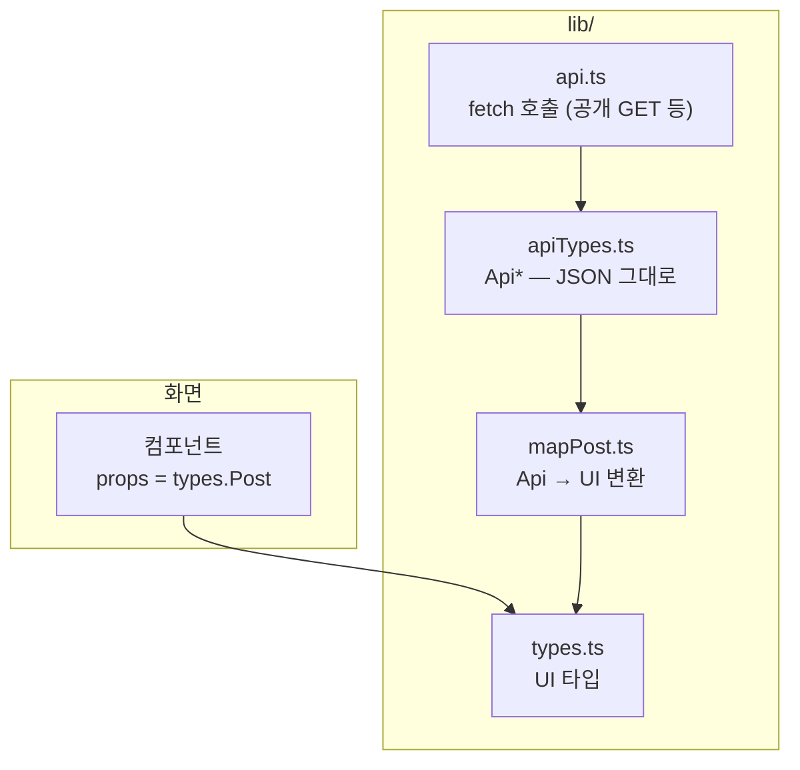

# NextJS_API_Mapper — API 타입 정의 + 매퍼 함수

> [!info] 
>  apiTypes.ts는 백엔드가 실제로 보내는 JSON 모양 그대로(가공 없음)이고, mapper 함수는 그 apiTypes를 UI 타입(types.ts)으로 변환하는 다리다. 의존 방향은 항상 apiTypes → mapper → types — apiTypes는 types를 import하지 않는다.

```markdown
관련: [[NextJS_UI_Types]] — 화면용 `types.ts`와 한 세트이며, 이 노트는 API 타입과 매퍼를 다룬다.
```

---

---

# 의존 방향이 중요한 이유 ⭐️⭐️⭐️



```txt
화살표를 따라가면 의존 방향이 한쪽으로만 흐름:
  api.ts(요청) → apiTypes.ts(응답 모양) → mapper(변환) → types.ts(UI 모양) → 컴포넌트(소비)
  → apiTypes.ts 에서 시작된 화살표가 절대 types.ts 를 거쳐 거꾸로 돌아오지 않음
  → 컴포넌트는 화면 쪽 끝(types.ts)만 보고, API 쪽(apiTypes.ts)은 mapper 뒤에 숨겨져서 안 보임
```

>[!note]
>한마디로: mapper 가 API 응답을 "우리가 원하는 모양(types.ts)" 으로 변형해주는 역할

|파일|알아야 하는 것|모르는 것|
|---|---|---|
|`apiTypes.ts`|백엔드 응답이 어떤 모양인지|UI 가 뭘 필요로 하는지 — 전혀 몰라도 됨|
|`types.ts`|화면이 어떤 모양을 필요로 하는지|API 가 어떻게 생겼는지 — 전혀 몰라도 됨|
|`mapper`|위 둘 다|—|

```markdown
apiTypes 가 types 를 import 하면 안 되는 이유:
  "API 응답 정의" 가 "화면에 뭐가 필요한지" 까지 알아야 하는 이상한 의존 관계가 생김
  → 두 타입이 서로 독립적이어야, 한쪽이 바뀌어도 다른 쪽 정의 자체는 영향 안 받음
  → 변경이 필요할 때 항상 mapper 한 곳만 고치면 됨
    (이게 ![[NextJS_UI_Types]] 에서 말한 "API 가 바뀌어도 매퍼만 고치면 된다" 의 정확한 메커니즘)
  
mapper 는 둘 다 import 하는 유일한 파일 — "번역가" 역할이 한 곳에만 있어야 깔끔함
```

> 참조 [[NextJS_UI_Types]]

---

---

# apiTypes.ts — 백엔드 JSON 그대로 ⭐️⭐️

```typescript
// lib/apiTypes.ts
/** GET /posts 등 — 백엔드가 실제로 보내는 JSON 그대로(직렬화된 형태) */

export type ApiReaction = {
  id: string;
  postId: string;
  type: string;
  createdAt: string;
  updatedAt: string;
};

export type ApiPost = {
  id: string;
  title: string;
  content: string;
  tags: string[];
  hidden: boolean;
  createdAt: string;
  updatedAt: string;
  reactions: ApiReaction[];
};
```

```txt
이름 규칙: UI 타입(Post)과 헷갈리지 않게 Api 접두사를 붙이는 게 흔한 관례 (ApiPost, ApiReaction)

hidden / updatedAt / reactions 처럼, UI 타입(types.ts)에서는 일부러 뺐던 필드도 여기엔 그대로 다 있음
→ apiTypes 는 "백엔드가 실제로 보내는 것" 의 거짓 없는 사본이어야 하기 때문 (가공은 mapper 의 일)
```

## apiTypes.ts에 실제로 뭘 적게 되나 — 응답만, 요청은 아님 ⭐️⭐️⭐️

```txt
DTO를 만들었다고 해서 그 짝이 되는 타입을 apiTypes.ts에도 항상 만들어야 하는 건 아님
→ 맨 위 의존 방향(api.ts → apiTypes.ts → mapper → types.ts)을 다시 보면 이유가 보임:

  apiTypes.ts는 "변환 파이프라인의 입구" — 그 파이프라인을 타는 건 변환이 필요한 것(응답)뿐임
  요청(서버로 보내는 값)은 mapper를 거쳐 화면에 표시될 일이 없으니, 그 파이프라인 자체를 안 탐
  → apiTypes.ts에 적을 이유가 없는 것
```

|구분|Nest 쪽 (DTO)|Web 쪽 (apiTypes.ts)|
|---|---|---|
|로그인 요청|`LoginDto` — `@IsEmail()` 같은 검증 포함|보통 없음 — `api.ts` 함수의 인자(`email`, `password`)로 충분|
|회원가입 요청|`RegisterDto`|보통 없음 — 마찬가지로 인자로 충분|
|로그아웃|서버 엔드포인트 자체가 없는 경우가 많음 (JWT는 stateless라 서버가 무효화할 상태를 안 들고 있음)|JSON 자체가 없으니 적을 게 없음 — 클라이언트가 들고 있던 토큰만 지우면 끝|
|로그인 응답|`AuthResponseDto` (accessToken + user)|`ApiAuthResponse` — 이건 응답이라서 여기 들어가는 게 맞음|

```txt
요청 쪽에 타입이 필요해지는 시점:
  api.ts 함수가 login(email: string, password: string) 처럼 스칼라 인자로 충분하면
  타입을 따로 안 만들어도 됨 — 함수 시그니처 자체가 이미 "뭐가 필요한지"를 다 보여주기 때문

  여러 함수/엔드포인트가 같은 모양의 body를 반복해서 받게 되면, 그때 가서
  ApiLoginBody 같은 이름을 붙여 재사용하는 게 의미가 생김
  → "필요해지면 만든다"는 원칙 — 처음부터 요청 타입까지 미리 다 만들 필요는 없음
```

## 백엔드가 실제로 보내는 JSON 확인하기 — Swagger 활용 ⭐️⭐️

```txt
apiTypes.ts는 "백엔드 코드(Entity/DTO)를 보고 추측"하는 게 아니라
"실제로 내려오는 JSON"을 그대로 옮기는 게 원칙임 — 코드만 보고 추측하면 실제와 달라지는 지점들:

  - class-transformer의 @Exclude() 같은 처리로 응답에서 조용히 빠지는 필드가 있을 수 있음
  - 관계(relation)를 안 채워서 보내면 그 필드 자체가 없거나 null로 내려올 수 있음
  - Date 값은 객체가 아니라 직렬화된 문자열로 내려옴 (자세한 건 [[JS_Date]] 참고)
```

```txt
→ 코드를 눈으로 읽고 추측하는 것보다, Swagger UI에서 그 엔드포인트를 "Try it out"으로
  직접 실행해서 실제 Response body를 보는 게 더 정확하고 빠름
  (DocumentBuilder/데코레이터 설정 자체는 [[NestJS_Swagger]] 참고)

이렇게 직접 확인한 JSON을 그대로 apiTypes.ts에 옮기면, 이 섹션 제목의 원칙
("백엔드가 실제로 보내는 JSON 그대로")을 가장 정확하게 지키는 방법이 됨
→ DTO 코드를 읽고 머릿속으로 변환하는 것보다, 실행 결과를 그대로 베끼는 쪽이 오류가 적음
```

---

---

# mapper 함수 — 변환 + 집계 + 임시값 ⭐️⭐️⭐️

```typescript
// lib/mapPost.ts
import type { ApiPost } from './apiTypes';
import type { Tag, Post } from './types';

const ANONYMOUS_AUTHOR = { id: '', nickname: '익명' } as const;

function countLikes(reactions: ApiPost['reactions']): number {
  return reactions.filter((r) => r.type === 'like').length;
}

/** Api JSON 1건 → UI 표시용 */
export function mapPost(api: ApiPost, currentUserId?: string): Post {
  const likeCount = countLikes(api.reactions);

  // 백엔드에 reaction.userId 가 아직 없어서, likedByMe 계산은 나중으로 미룸:
  // const likedByMe = currentUserId
  //   ? api.reactions.some((r) => r.type === 'like' && r.userId === currentUserId)
  //   : undefined;

  return {
    id: api.id,
    title: api.title,
    content: api.content,
    tags: api.tags as Tag[],
    likeCount,
    // likedByMe,
    author: ANONYMOUS_AUTHOR,   // author 관계가 아직 안 붙어서 임시값
    createdAt: api.createdAt,
  };
}

/** 목록 변환 — 단건 매퍼를 재사용 */
export function mapPosts(apis: ApiPost[], currentUserId?: string): Post[] {
  return apis.map((api) => mapPost(api, currentUserId));
}
```

## 패턴 4가지 — 일반화 ⭐️⭐️⭐️

|패턴|설명|예시|
|---|---|---|
|단순 복사|이름과 의미가 같은 필드는 그대로 옮김|`id`, `title`, `createdAt`|
|타입 단언으로 좁히기|API 는 넓은 타입(`string[]`)인데 UI 는 좁은 타입(`Tag[]`)일 때|`api.tags as Tag[]`|
|집계/가공 함수로 계산|배열을 세거나 걸러서 새 값을 만듦|`countLikes(api.reactions)`|
|아직 없는 관계는 임시값으로|백엔드 작업이 덜 끝났어도 UI 타입은 미리 완성해둘 수 있음|`author: ANONYMOUS_AUTHOR`|

```txt
임시값(ANONYMOUS_AUTHOR) 패턴이 유용한 이유:
  백엔드에 author 관계가 아직 연결되지 않았어도, UI 타입과 컴포넌트는 먼저 완성해둘 수 있음
  나중에 API 가 author 를 내려주기 시작하면, mapper 안의 이 한 줄만 실제 매핑으로 바꾸면 끝
  → 컴포넌트 코드는 전혀 안 바뀜 (Post.author 의 타입은 처음부터 그대로였기 때문)
```

---

---

# 미래 작업을 주석으로 미리 남겨두기 ⭐️

```typescript
// 백엔드에 reaction.userId 가 아직 없어서, likedByMe 계산은 나중으로 미룸:
// const likedByMe = currentUserId
//   ? api.reactions.some((r) => r.type === 'like' && r.userId === currentUserId)
//   : undefined;
```

```txt
아직 구현 못 하는 이유(백엔드 필드 부족 등)와 나중에 어떻게 구현할지를 주석으로 같이 남겨두면
→ 그 기능을 실제로 추가할 때 "정확히 어디를 고쳐야 하는지" 바로 찾을 수 있음
→ 타입(Post.likedByMe?)은 이미 optional 로 선언해뒀으므로, 주석을 풀면 타입 에러 없이 바로 동작
```

---

---

# 단건 매퍼 + 목록 매퍼 ⭐️

```txt
mapPost(단건) 을 먼저 만들고, mapPosts(목록) 은 그 함수를 배열에 재사용 — 새 로직을 따로 안 짬
```

```typescript
export const mapPosts = (apis: ApiPost[], currentUserId?: string) =>
  apis.map((api) => mapPost(api, currentUserId));
```

---

---

# 한눈에

```txt
파일 역할: apiTypes.ts(백엔드 JSON 그대로) → mapper(변환+집계+임시값) → types.ts(화면용)
의존 방향: apiTypes 는 types 를 모름, mapper 만 둘 다 알고 연결함 — 변경은 항상 mapper 한 곳만

apiTypes.ts에는 "응답"만 들어감 — 요청(login/register 등)은 함수 인자로 충분하면 타입 불필요
  재사용이 필요해질 때만 ApiXxxBody 같은 이름을 붙임 (필요해지면 만든다)
로그아웃처럼 서버 응답 자체가 없으면 apiTypes.ts에도 적을 게 없음

실제 JSON 모양은 코드로 추측하지 말고 Swagger UI에서 직접 실행해서 확인하는 게 더 정확함
  (class-transformer @Exclude, 관계 미포함, Date 직렬화 등 코드만 보고는 놓치기 쉬운 지점들)

패턴 4가지: 단순 복사 / 타입 단언으로 좁히기 / 집계 함수로 계산 / 아직 없는 관계는 임시값
임시값 + 주석 패턴 = "백엔드 미완성 상태에서도 프론트 먼저 개발" 가능하게 하는 핵심 장치

단건 매퍼(mapPost) 를 만들고 목록 매퍼(mapPosts) 는 그걸 재사용

UI 타입 설계 자체 → [[NextJS_UI_Types]]
이 매퍼를 실제 fetch 흐름(fetchAPI/getApiBaseUrl)에 연결하는 법 → [[NextJS_API_Integration]]
```