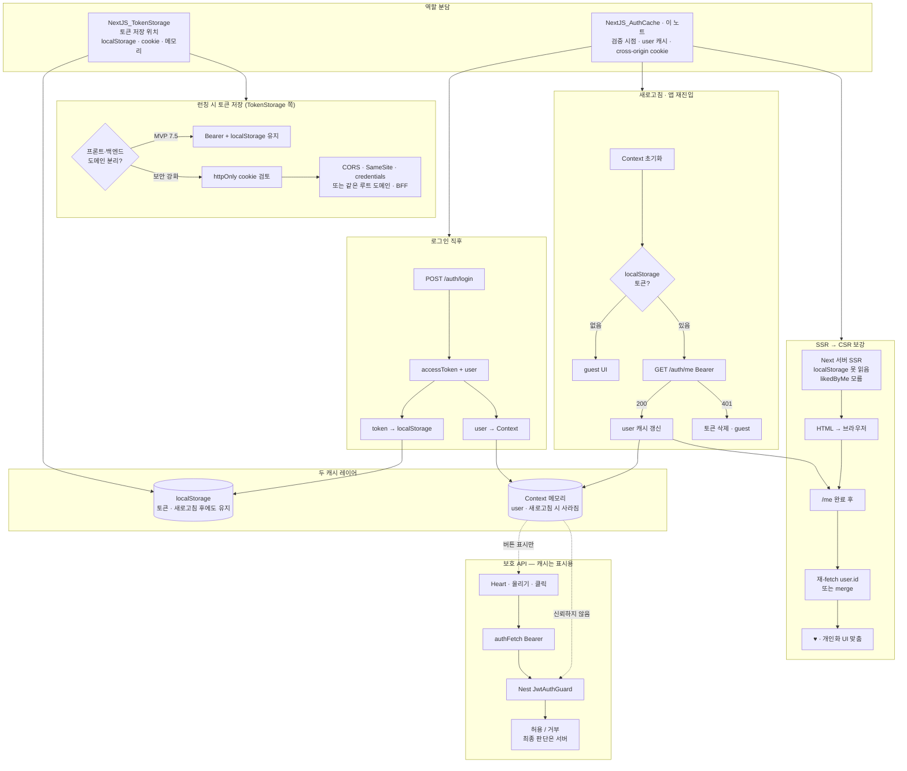

# NextJS_AuthCache — 인증 상태를 캐싱하고 검증하는 법

> [!info] 
> 토큰은 localStorage에 있지만, 그 토큰이 "아직 유효한지"와 "누구의 토큰인지"는 서버에 물어봐야 안다. 
> 또한 Next.js의 첫 렌더(SSR)는 브라우저가 아니라 서버에서 일어나서 localStorage 자체를 못 읽으므로, 로그인 여부에 따라 달라지는 화면은 항상 클라이언트에서 한 번 더 보강해야 한다. 
> 최종 권한 판단은 캐시된 정보가 아니라 항상 서버(Guard)가 한다.

```txt
이 노트와 [[NextJS_TokenStorage]]의 역할 분담:
  NextJS_TokenStorage   토큰 자체를 "어디에 저장할지" (localStorage/cookie/메모리, XSS/CSRF 트레이드오프)
  이 노트(NextJS_AuthCache)   그 토큰을 "언제 다시 검증하고, 유저 정보는 어디에 캐싱할지" +
                              도메인이 다른 배포에서 cookie를 쓰면 왜 더 복잡해지는지
```



---

# SSR과 CSR — 같은 페이지, 다른 실행 환경 ⭐️⭐️⭐️

| 구분           | SSR (서버)                        | CSR (클라이언트)                              |
| ------------ | ------------------------------- | ---------------------------------------- |
| 어디서 실행되나     | Next.js 서버 (Node.js 환경)         | 사용자 브라우저                                 |
| 예시           | 페이지가 처음 그려질 때(Server Component) | `'use client'` 컴포넌트, `useEffect`, 클릭 핸들러 |
| localStorage | 못 읽음 (브라우저 전용 API, 서버엔 없음)      | 읽을 수 있음 — 토큰 사용 가능                       |

```txt
이게 의미하는 것:
  로그인 여부에 따라 달라지는 화면(예: "내가 좋아요 눌렀는지")은
  서버에서 처음 그려지는 시점엔 "모르는 상태"로만 그려질 수 있음
  → 클라이언트로 넘어온 뒤, 토큰을 읽어서 한 번 더 보강(재요청 또는 merge)하는 단계가 필요함

이건 Next.js만의 특수한 문제가 아니라 "토큰을 클라이언트 저장소에 두는 구조" +
"서버에서 먼저 렌더링하는 프레임워크"를 같이 쓰면 항상 생기는 일반적인 충돌임
```

---

# 새로고침 시 인증 상태 다시 확인하기 — "나 자신 조회" 패턴 ⭐️⭐️⭐️

```txt
새로고침하면 메모리에 있던 상태(React state, Context)는 전부 초기화됨
localStorage의 토큰만 남아있는데, 이 토큰만으로는 두 가지를 알 수 없음:
  1. 이 토큰이 아직 유효한가 (만료/탈취로 인한 무효화 등)
  2. 이 토큰의 주인이 지금 누구인가 (이름, role 등 — 토큰 자체는 sub 같은 최소 정보만 가짐)

→ 앱이 다시 로드될 때, "나 자신을 조회"하는 엔드포인트(흔히 GET /me, GET /auth/me 등으로 불림)를
  한 번 호출해서 이 두 가지를 동시에 해결함
```

```typescript
// 앱 시작 시 (예: 최상위 Provider의 useEffect)
useEffect(() => {
  const token = getApiAccessToken();
  if (!token) return; // 토큰 자체가 없으면 비로그인 상태로 끝

  authFetch<User>('/me')
    .then((user) => setUser(user))         // 200 — 유효함, 유저 정보로 캐시 갱신
    .catch(() => {
      clearApiAccessToken();               // 401 등 — 토큰 무효, 로그아웃 처리
      setUser(null);
    });
}, []);
```

```txt
이 패턴이 필요한 이유:
  토큰의 payload(sub, role 등)를 클라이언트에서 직접 디코딩해서 믿는 것은 위험함
  (만료됐는지, 그 사이 role이 바뀌었는지 등을 토큰 자체만 보고는 알 수 없음)
  → 항상 서버에 다시 확인을 받는 이 호출 한 번이 "신뢰할 수 있는 현재 상태"의 출발점이 됨
```

---

# 두 종류의 캐시 — 토큰 vs 유저 정보 ⭐️⭐️

| 캐시 대상                        | 저장 위치                                          | 지속성           | 언제 갱신                   |
| ---------------------------- | ---------------------------------------------- | ------------- | ----------------------- |
| 토큰(자격증명 그 자체)                | localStorage (자세한 내용은 [[NextJS_TokenStorage]]) | 새로고침/탭 닫아도 유지 | 로그인/로그아웃 시점             |
| 유저 정보(이름, role 등 — "해석된 신원") | 메모리 (Context 등)                                | 새로고침하면 사라짐    | 앱 로드 시 `/me` 재호출로 다시 채움 |

```txt
Context로 어떻게 구현하는지(createContext/useContext, Provider 만들 때 useMemo/useCallback이
왜 같이 필요한지)는 [[React_Context]] 참고 — 이 노트는 "뭘 캐싱할지"에만 집중
```

```txt
유저 정보까지 localStorage에 같이 캐싱하고 싶을 수 있지만, 보통 안 그렇게 함:
  유저 정보는 서버 쪽에서 바뀔 수 있는 값(이름 변경, role 변경 등)이라
  오래된 캐시를 그대로 믿으면 화면이 실제 상태와 어긋날 위험이 있음
  → "다시 받아오는 비용"이 크지 않다면, 매번 새로고침 시 새로 받아오는 쪽이 더 안전함
```

```txt
⚠️ 토큰을 localStorage 대신 sessionStorage에 둬도 위 패턴들은 거의 그대로임:
  SSR 문제   sessionStorage도 브라우저 전용 API라 서버에서 못 읽는 건 동일
  /me 재확인  새로고침하면 메모리(Context)는 어차피 다 날아가므로, sessionStorage가
              새로고침에 살아남아도(탭을 닫기 전까진 유지됨) /me 재호출은 똑같이 필요함
  XSS 노출   localStorage와 노출 범위가 동일함 — sessionStorage가 "더 안전"한 게 아님

  진짜 달라지는 건 지속 범위뿐: 탭을 닫으면 로그아웃되는가(sessionStorage = O),
  여러 탭에서 로그인 상태를 공유하는가(sessionStorage = X, 탭마다 독립)
  → 보안이 강화되는 게 아니라, 로그인 유지 범위가 좁아지는 트레이드오프
  (저장 위치별 전체 비교는 [[NextJS_TokenStorage]] 참고)
```


---

# 서버가 먼저 그린 화면과 클라이언트 데이터의 불일치 보강 ⭐️⭐️⭐️

```txt
SSR 시점엔 로그인 여부를 모르니, "내가 좋아요를 눌렀는지(likedByMe)"처럼
사용자마다 다른 필드는 채울 수 없는 상태로 먼저 그려짐

클라이언트로 넘어와서 유저 정보(/me)를 확인한 뒤 — 두 가지 보강 방법:
  재요청   유저 id를 포함해서 같은 데이터를 다시 fetch (서버가 likedByMe까지 채워서 응답)
  merge    이미 받은 목록에 유저 id 기준으로 "이 항목들 중 내가 좋아요 누른 것" 정보만 따로 받아 합치기

어느 쪽이 나은지는 데이터 양과 API 설계에 따라 다름 — 둘 다 "서버가 모르는 채로 먼저 그린 화면을
유저 정보가 확보된 뒤에 보강한다"는 같은 목적의 다른 구현일 뿐
```

---

# 최종 권한 판단은 항상 서버 — 캐시는 표시용일 뿐 ⭐️⭐️⭐️

```txt
클라이언트에 캐싱된 user.role 같은 값으로 "버튼을 보여줄지 말지"를 정하는 건 괜찮음
하지만 그 버튼을 눌렀을 때 "진짜로 그 행동이 허용되는지"는 캐시가 아니라
항상 서버(Guard)가 요청이 들어온 시점에 다시 판단해야 함

→ 캐시된 user 정보를 신뢰해서 서버 쪽 권한 체크를 생략하면 안 됨
  (클라이언트 캐시는 누구나 개발자도구로 조작 가능한 값이기 때문)
권한 체크 자체의 서버 쪽 구현은 [[NestJS_JwtGuard]] 참고
```

---

# Cookie vs Bearer — 도메인이 달라지는 순간 복잡해지는 이유 ⭐️⭐️⭐️

```txt
프론트엔드와 백엔드를 서로 다른 호스트(도메인)에 따로 배포하는 구조가 요즘 흔함
(프론트는 정적 호스팅/엣지 플랫폼, 백엔드는 별도 서버 — 도메인이 서로 다름)

이 구조에서 httpOnly 쿠키를 쓰려면 단순히 쿠키를 심는 것만으로 안 끝남:
```

|필요한 설정|이유|
|---|---|
|CORS — `Access-Control-Allow-Origin`에 정확한 origin 명시 (와일드카드 `*` 불가)|쿠키를 포함한 요청은 origin을 모호하게 둘 수 없음|
|CORS — `Access-Control-Allow-Credentials: true`|이 설정이 없으면 브라우저가 쿠키 자체를 요청에 안 실음|
|쿠키 — `SameSite=None; Secure`|서로 다른 도메인이면 기본값(Lax/Strict)으로는 쿠키가 전송 안 됨|
|fetch — `credentials: 'include'`|클라이언트도 "이 요청에 쿠키를 실어 보내겠다"는 의사를 명시해야 함|

```txt
이 설정들을 다 갖춰도, 일부 브라우저의 서드파티 쿠키 차단 정책 때문에
여전히 막히는 경우가 있음 — cross-origin 쿠키는 "설정만 맞으면 100% 보장"이 아님
```

## 해결 방법 후보 ⭐️

|방법|핵심|
|---|---|
|같은 부모 도메인으로 통일|`api.example.com` + `app.example.com` 처럼 같은 루트 도메인 아래 두고, 쿠키 Domain을 `.example.com`으로 설정 — 완전한 동일 출처는 아니지만 쿠키 공유 가능|
|BFF(Backend for Frontend) 패턴|프론트 서버(Next.js 자체)가 쿠키를 자기 origin에서 발급/보관하고, 실제 백엔드와는 서버↔서버로만 통신 — 브라우저는 쿠키 문제를 cross-origin으로 겪지 않음|
|Bearer + localStorage 유지|cross-origin 쿠키의 복잡성 자체를 피하는 선택 — 보안 강화(httpOnly 전환)는 도메인 구조를 다시 잡을 때로 미룸|

---

# 언제 Bearer+localStorage로 충분하고, 언제 httpOnly를 검토하나 ⭐️⭐️

|상황|판단|
|---|---|
|포트폴리오/MVP/데모 단계, 프론트·백엔드가 서로 다른 도메인|Bearer + localStorage 유지 — 실용적인 선택, [[NextJS_TokenStorage]]의 XSS 트레이드오프 인지하고 진행|
|실제 서비스로 전환하며 보안을 강화하려는 시점|httpOnly 쿠키 검토 — 단, 위 도메인 구조 문제를 먼저 해결해야 함(같은 루트 도메인 또는 BFF)|
|이미 프론트·백엔드가 같은 도메인(또는 BFF로 단일화됨)|httpOnly 쿠키가 cross-origin 이슈 없이 바로 적용 가능 — 이 경우엔 굳이 미룰 이유가 적음|

---

# 한눈에

| 키워드                 | 한 줄 정리                                                         |
| ------------------- | -------------------------------------------------------------- |
| SSR vs CSR          | 서버 렌더링은 localStorage를 못 읽음 — 로그인 의존 화면은 클라이언트에서 보강 필요          |
| `/me` 패턴            | 토큰의 유효성 + 유저 정보를 한 번에 확인하는 "나 자신 조회" 호출, 401이면 로그아웃            |
| 두 캐시 레이어            | 토큰(localStorage, 지속) vs 유저 정보(메모리/Context, 매번 재확인)             |
| 불일치 보강              | 서버가 모르고 먼저 그린 화면을 클라이언트에서 재요청/merge로 채움                        |
| 최종 판단은 서버           | 캐시된 user 정보는 표시용일 뿐 — 실제 권한 체크는 항상 서버(Guard)                   |
| Cross-Origin Cookie | 도메인이 다르면 CORS+SameSite+credentials 설정이 추가로 필요, 그래도 100% 보장 안 됨 |
| 해결 후보               | 같은 루트 도메인 통일 / BFF 패턴 / Bearer+localStorage 유지                 |