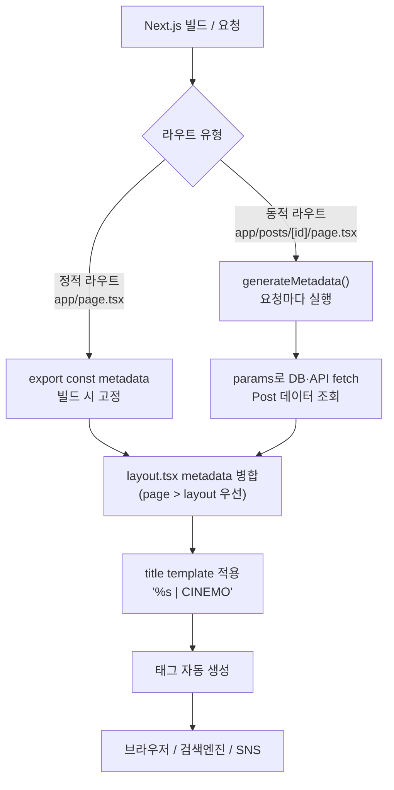
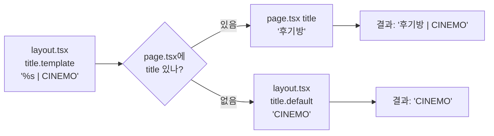
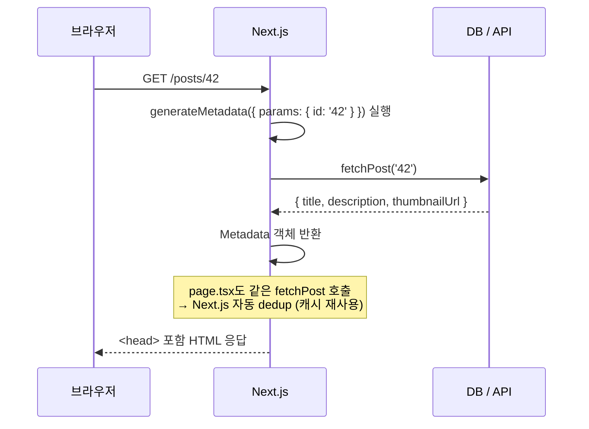

---
aliases:
  - generateMetadata
  - Metadata
  - title template
  - viewport
  - OG 태그
  - sitemap
tags:
  - NextJS
  - HTML
relations:
  - "[[00_JS_Ecosystem_HomePage]]"
  - "[[NextJS_Concept]]"
  - "[[HTML_Head_Meta]]"
  - "[[HTML_Semantics]]"
---
# NextJS_Metadata — 메타데이터

>[!info]
> 메타데이터 = HTML `<head>` 안에 들어가는 "페이지에 대한 정보".
> Next.js App Router에서는 `export const metadata` 또는 `generateMetadata()`로 선언하면
> Next.js가 자동으로 `<head>` 태그를 생성해 삽입.
> HTML `<head>` 기본 개념 → [[HTML_Head_Meta]]

---

# 메타데이터란 — 브라우저·검색엔진이 읽는 것 ⭐️⭐️⭐️⭐️

```txt
사용자는 보지 못하지만 브라우저·검색엔진·SNS가 읽는 정보:

  <title>         → 브라우저 탭 이름 / 구글 검색 결과 제목
  <meta description> → 구글 검색 결과 설명 텍스트
  <meta og:*>     → 카카오·슬랙·트위터 링크 공유 미리보기 카드
  <link canonical>→ 중복 URL 중 "진짜 URL" (SEO 중복 방지)
  <link icon>     → 파비콘 (브라우저 탭 아이콘)
  <meta robots>   → 검색엔진 크롤러에게 색인 허용 여부
```

## 메타데이터 흐름



```txt
핵심:
  정적 페이지  → export const metadata (객체)
  동적 페이지  → generateMetadata() (async 함수, params 접근 가능)
  layout.tsx  → 모든 하위 페이지에 기본값 제공
  page.tsx    → layout을 덮어씀 (더 구체적인 쪽 우선)
```

---

# 정적 메타데이터 — export const metadata ⭐️⭐️⭐️⭐️

```typescript
// app/layout.tsx — 루트: 모든 페이지 기본값
import type { Metadata } from 'next';

export const metadata: Metadata = {
  title: {
    default:  'CINEMO',          // 하위 page에 title 없으면 이것
    template: '%s | CINEMO',     // 하위 page의 title → "후기방 | CINEMO"
  },
  description: '영화관 로비 소셜 — 매표소 · 뽑기 · 후기방',

  openGraph: {
    title:       'CINEMO',
    description: '영화관 로비 소셜',
    url:         'https://cinemo.example.com',
    siteName:    'CINEMO',
    images: [{
      url:    'https://cinemo.example.com/og.png',
      width:  1200,
      height: 630,
      alt:    'CINEMO 로비',
    }],
    locale: 'ko_KR',
    type:   'website',
  },

  twitter: {
    card:        'summary_large_image',
    title:       'CINEMO',
    description: '영화관 로비 소셜',
    images:      ['https://cinemo.example.com/og.png'],
  },

  robots: {
    index:  true,
    follow: true,
  },

  icons: {
    icon:  '/favicon.ico',
    apple: '/apple-icon.png',
  },

  alternates: {
    canonical: 'https://cinemo.example.com',
  },
};
```

```typescript
// app/posts/page.tsx — 하위 페이지: title만 지정
export const metadata: Metadata = {
  title: '후기방',   // → 탭에 "후기방 | CINEMO"
  // description 없으면 layout.tsx description 상속
};
```

---

# title 템플릿 패턴 ⭐️⭐️⭐️⭐️



```typescript
// 루트 layout.tsx
export const metadata: Metadata = {
  title: {
    default:  'CINEMO',
    template: '%s | CINEMO',
  },
};

// app/page.tsx (홈) — title 생략 → default 사용
// → 탭: "CINEMO"

// app/posts/page.tsx
export const metadata: Metadata = { title: '후기방' };
// → 탭: "후기방 | CINEMO"

// app/search/page.tsx
export const metadata: Metadata = { title: '검색' };
// → 탭: "검색 | CINEMO"
```

```txt
% s 위치는 template 문자열 안에서 자유롭게 지정 가능
  'CINEMO — %s'   → "CINEMO — 후기방"
  '%s · CINEMO'   → "후기방 · CINEMO"

layout 중첩 시:
  app/layout.tsx        → template: '%s | CINEMO'
  app/posts/layout.tsx  → template: '%s | 후기방'
  app/posts/[id]/page   → title: '어바웃 타임'
  → 결과: "어바웃 타임 | 후기방" (가장 가까운 template 적용)
```

---

# 동적 메타데이터 — generateMetadata ⭐️⭐️⭐️⭐️



```typescript
// app/posts/[id]/page.tsx
import type { Metadata } from 'next';

type Props = {
  params: Promise<{ id: string }>;   // Next.js 15 — params는 Promise
};

// 서버에서 실행 (async 가능, params·searchParams 접근 가능)
export async function generateMetadata({ params }: Props): Promise<Metadata> {
  const { id } = await params;
  const post = await fetchPost(id);   // fetch는 자동 dedup

  return {
    title:       post.title,
    description: post.summary,
    openGraph: {
      title:    post.title,
      images:   [{ url: post.thumbnailUrl, width: 1200, height: 630 }],
      type:     'article',
      publishedTime: post.createdAt,
    },
    alternates: {
      canonical: `https://cinemo.example.com/posts/${id}`,
    },
  };
}

export default async function PostPage({ params }: Props) {
  const { id } = await params;
  const post = await fetchPost(id);   // generateMetadata와 같은 fetch → 캐시 재사용
  return <article>...</article>;
}
```

```txt
generateMetadata vs export const metadata:
  export const metadata  → 빌드 시 고정 (정적 라우트)
  generateMetadata()     → 요청마다 실행 (동적 라우트, params 필요할 때)

fetchPost dedup:
  generateMetadata()와 page.tsx에서 같은 URL로 fetch하면
  Next.js가 하나만 실제로 요청하고 결과를 공유
  → DB 요청 중복 없음
```

---

# 파일 기반 메타데이터 ⭐️⭐️⭐️

```txt
app/ 폴더에 특정 이름의 파일을 두면 코드 없이 자동 적용

파일명                    역할
─────────────────────────────────────────────────
favicon.ico              브라우저 탭 아이콘
icon.png / icon.svg      앱 아이콘
apple-icon.png           iOS 홈화면 아이콘
opengraph-image.png      OG 이미지 (코드 불필요)
opengraph-image.tsx      JSX로 동적 OG 이미지 생성 (ImageResponse)
twitter-image.png        트위터 카드 이미지
robots.txt               크롤러 규칙 (정적)
robots.ts                동적 robots 생성
sitemap.xml              사이트맵 (정적)
sitemap.ts               동적 사이트맵 생성
```

```typescript
// app/sitemap.ts
import type { MetadataRoute } from 'next';

export default async function sitemap(): Promise<MetadataRoute.Sitemap> {
  const posts = await fetchAllPosts();

  return [
    {
      url:          'https://cinemo.example.com',
      lastModified: new Date(),
      changeFrequency: 'daily',
      priority:     1,
    },
    ...posts.map((post) => ({
      url:          `https://cinemo.example.com/posts/${post.id}`,
      lastModified: new Date(post.updatedAt),
      changeFrequency: 'weekly' as const,
      priority:     0.8,
    })),
  ];
}
```

```typescript
// app/robots.ts
import type { MetadataRoute } from 'next';

export default function robots(): MetadataRoute.Robots {
  return {
    rules: [
      {
        userAgent: '*',
        allow:     '/',
        disallow:  ['/dashboard/', '/admin/'],
      },
    ],
    sitemap: 'https://cinemo.example.com/sitemap.xml',
  };
}
```

---

# 동적 OG 이미지 — ImageResponse ⭐️⭐️⭐️

```typescript
// app/posts/[id]/opengraph-image.tsx
import { ImageResponse } from 'next/og';

export const runtime = 'edge';
export const size    = { width: 1200, height: 630 };
export const contentType = 'image/png';

export default async function OGImage({ params }: { params: Promise<{ id: string }> }) {
  const { id } = await params;
  const post = await fetchPost(id);

  return new ImageResponse(
    (
      <div style={{ display: 'flex', flexDirection: 'column',
                    background: '#0f172a', color: 'white',
                    width: '100%', height: '100%', padding: 60 }}>
        <p style={{ fontSize: 24, color: '#94a3b8' }}>CINEMO</p>
        <h1 style={{ fontSize: 64, fontWeight: 700 }}>{post.title}</h1>
        <p style={{ fontSize: 32, color: '#94a3b8' }}>{post.summary}</p>
      </div>
    ),
    { width: 1200, height: 630 },
  );
}
```

```txt
opengraph-image.tsx → JSX를 PNG로 변환 (edge runtime, Satori 기반)
  카카오·슬랙 공유 시 게시글 제목이 들어간 OG 이미지 자동 생성
  파일을 두면 해당 라우트의 og:image로 자동 등록
  SVG 렌더링 엔진 기반이라 CSS 지원이 제한적 (flex 위주)
```

---

# Metadata 필드 전체 대응표

```txt
HTML 태그                              → Metadata 필드
────────────────────────────────────────────────────────
<title>                               → title (string | { default, template })
<meta name="description">            → description
<meta property="og:title">           → openGraph.title
<meta property="og:description">     → openGraph.description
<meta property="og:image">           → openGraph.images[0].url
<meta property="og:url">             → openGraph.url
<meta property="og:type">            → openGraph.type
<meta property="og:locale">          → openGraph.locale
<meta name="twitter:card">           → twitter.card
<meta name="twitter:title">          → twitter.title
<meta name="twitter:image">          → twitter.images
<meta name="robots">                 → robots.index / robots.follow
<link rel="canonical">               → alternates.canonical
<link rel="icon">                    → icons.icon
<link rel="apple-touch-icon">        → icons.apple
<meta name="theme-color">            → themeColor
<meta name="viewport">               → viewport (Next.js 기본 제공, 별도 설정 불필요)
```

---

# 안티 패턴 ⭐️⭐️⭐️

```typescript
// ❌ 모든 페이지 같은 title — SEO에서 중복 페이지로 인식
export const metadata = { title: 'CINEMO' };  // 모든 page.tsx에 동일

// ✅ layout.tsx에 template 설정 → 각 page.tsx에서 고유 title
// app/layout.tsx
export const metadata = { title: { default: 'CINEMO', template: '%s | CINEMO' } };
// app/posts/page.tsx
export const metadata = { title: '후기방' };  // → "후기방 | CINEMO"
```

```typescript
// ❌ generateMetadata에서 page.tsx와 별도 fetch — 중복 DB 요청
export async function generateMetadata({ params }) {
  const post = await db.post.findUnique({ where: { id: params.id } });
  return { title: post.title };
}
export default async function Page({ params }) {
  const post = await db.post.findUnique({ where: { id: params.id } });  // 중복!
  ...
}

// ✅ fetch() 사용 → Next.js 자동 dedup
async function fetchPost(id: string) {
  const res = await fetch(`/api/posts/${id}`);  // 같은 URL → dedup
  return res.json();
}
export async function generateMetadata({ params }) {
  const post = await fetchPost(params.id);
  return { title: post.title };
}
export default async function Page({ params }) {
  const post = await fetchPost(params.id);  // 캐시 재사용
  ...
}
```

```txt
og:image를 상대 경로로 설정하는 실수:
  ❌ images: [{ url: '/og.png' }]       → SNS 크롤러가 접근 불가
  ✅ images: [{ url: 'https://cinemo.example.com/og.png' }]  → 절대 URL 필수
```
