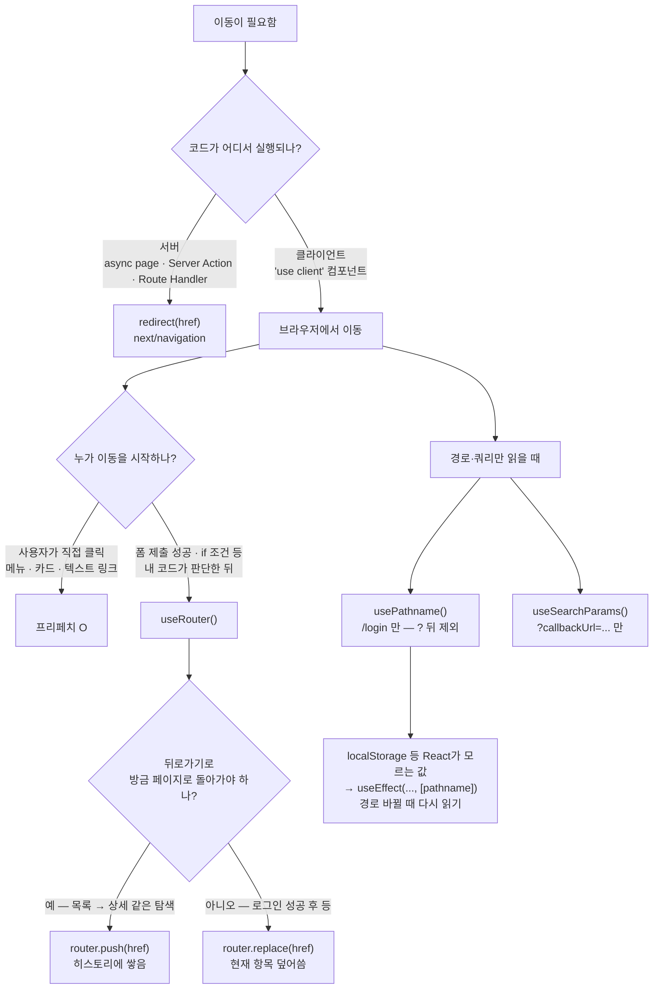

# NextJS_Routing — 페이지 이동과 경로 다루기

> [!info]
>  화면에서 클릭으로 이동하면 `<Link>`, 코드 로직 안에서 이동시켜야 하면 `useRouter()`. 
>  지금 경로 문자열이 필요하면 `usePathname()`, 쿼리스트링이 필요하면 `useSearchParams()`. 
>  `redirect()`는 서버 전용 함수이고, `redirectTo`/`callbackUrl`은 함수가 아니라 "어디로 돌아갈지"를 기억해두는 관습적인 파라미터 이름일 뿐이다.

---

## 한눈에 — 어떤 걸 쓸까 (mermaid)




> **한 줄:** 클릭 → `Link` · 로직 끝 이동 → `useRouter` · 서버 → `redirect` · 토큰은 `pathname` 바뀔 때 다시 읽기.

---

# Link vs useRouter() — 언제 뭘 쓰나 ⭐️⭐️⭐️

|   |   |   |
|---|---|---|
|구분|`<Link>`|`useRouter()`|
|형태|JSX 엘리먼트|훅(함수 호출) — `.push()` 등 메서드를 직접 호출|
|쓰는 곳|사용자가 클릭하는 자리 (메뉴, 카드, 버튼 등)|어떤 로직(폼 제출 성공, 조건 체크 등) 끝에 "이동시켜야 할 때"|
|프리페치|자동으로 됨 (뷰포트에 보이면 미리 받아둠)|없음 — push 호출 시점에 그제서야 이동|
|예시|`<Link href="/posts/1">제목</Link>`|`router.push('/posts/1')`|

```txt
헷갈리지 않는 기준 한 줄: "사용자가 직접 클릭하는 링크"면 Link, "내 코드가 판단해서 보내는 거"면 useRouter
```

---

# useRouter() — 메서드 표 ⭐️⭐️⭐️

```typescript
'use client';
import { useRouter } from 'next/navigation';

const router = useRouter();
```

|   |   |
|---|---|
|메서드|동작|
|`router.push(href)`|새 경로로 이동, 히스토리에 새 항목 추가 (뒤로가기 하면 이전 페이지로 돌아옴)|
|`router.replace(href)`|새 경로로 이동하지만 현재 히스토리 항목을 덮어씀 (뒤로가기 해도 이 페이지로 안 돌아옴)|
|`router.back()`|브라우저 뒤로가기와 동일 — 히스토리에서 한 단계 뒤로|
|`router.forward()`|히스토리에서 한 단계 앞으로|
|`router.refresh()`|클라이언트 상태는 유지한 채, 현재 경로의 서버 데이터만 다시 받아옴|

```txt
push vs replace 고르는 기준:
  로그인 성공 후 메인으로 보낼 때 → replace (로그인 페이지로 다시 뒤로가기 되면 이상함)
  글 목록 → 글 상세처럼 자연스러운 탐색 흐름 → push (뒤로가기로 목록에 돌아가는 게 자연스러움)
```

---

# usePathname() — 지금 경로를 문자열로 ⭐️⭐️⭐️

```typescript
'use client';
import { usePathname } from 'next/navigation';

const pathname = usePathname(); // 예: '/posts/1' — 쿼리스트링은 안 포함됨
```

```txt
usePathname()이 반환하는 값이 바뀌면(=경로가 바뀌면) 그 컴포넌트는 다시 렌더링됨
→ "경로가 바뀔 때마다 뭔가 다시 해야 한다"는 로직을 만들 때 핵심이 되는 훅
```

---

# useSearchParams() — 쿼리스트링 읽기 ⭐️⭐️

```typescript
'use client';
import { useSearchParams } from 'next/navigation';

const searchParams = useSearchParams();
const callbackUrl = searchParams.get('callbackUrl'); // 없으면 null
```

```txt
usePathname()은 경로(/login)만, useSearchParams()는 그 뒤의 ?key=value 부분만 다룸
  '/login?callbackUrl=/posts' 라면 pathname = '/login', searchParams.get('callbackUrl') = '/posts'
```

---

# useEffect + pathname — 경로 바뀔 때마다 다시 확인하기 ⭐️⭐️⭐️

```typescript
'use client';
import { usePathname } from 'next/navigation';
import { useEffect, useState } from 'react';
import { getApiAccessToken } from './authToken';

const pathname = usePathname();
const [loggedIn, setLoggedIn] = useState(false);

useEffect(() => {
  setLoggedIn(!!getApiAccessToken());
}, [pathname]);
```

```txt
이 패턴이 필요한 이유:
  로그인 토큰은 localStorage에 있음 — React state가 아니라서, 토큰이 바뀌어도
  컴포넌트가 자동으로 다시 렌더링되지 않음 (자세한 토큰 저장 방식은 [[NextJS_TokenStorage]] 참고)

  그런데 "로그인 페이지에서 로그인 성공 → 메인으로 이동" 처럼, 토큰이 바뀌는 시점과
  "경로가 바뀌는 시점"이 거의 항상 같이 일어남 → pathname을 의존성으로 넣으면
  "경로가 바뀔 때마다 다시 확인해라"는 신호로 활용할 수 있음

  → 정확한 방법은 아니지만(우연히 같이 일어나는 일을 이용하는 트릭), 간단해서 자주 쓰임
  더 정확하게 하려면: 로그인/로그아웃 시점에 직접 커스텀 이벤트를 쏘거나,
  토큰 상태를 Context로 끌어올려서 set 함수로 직접 갱신하는 방법도 있음
```

---

# redirect() — 서버에서 쓰는 이동 ⭐️⭐️⭐️

```typescript
// Server Component / Server Action / Route Handler 안에서만
import { redirect } from 'next/navigation';

export default async function Page() {
  const isLoggedIn = await checkAuthOnServer();
  if (!isLoggedIn) redirect('/login'); // 여기서 렌더링이 멈추고 바로 이동
  // ...
}
```

|   |   |   |
|---|---|---|
|구분|`redirect()` (next/navigation)|`router.push()` (useRouter)|
|실행 위치|서버 (Server Component, Server Action, Route Handler)|클라이언트 ('use client' 컴포넌트)|
|동작 방식|렌더링을 멈추고 즉시 이동시킴|이미 렌더링된 화면에서 이동을 "요청"함|
|"use client" 컴포넌트에서 직접 쓸 수 있나|아니요|예 (원래 그 자리)|

```txt
헷갈리지 않는 기준: 지금 이 코드가 서버에서 도는가(컴포넌트 자체가 async 서버 컴포넌트, 또는
"use server" 함수) → redirect() / 지금 이 코드가 브라우저에서 도는가('use client', 이벤트 핸들러) → router.push()
```

---

# ⚠️ useCallback은 라우팅과 무관 — 헷갈리기 쉬운 이름

```txt
useCallback은 React의 일반 훅임 — "함수를 매 렌더마다 새로 만들지 않고 재사용"하는
성능 최적화용 훅일 뿐, 경로 이동이나 페이지 전환과는 아무 관련이 없음

const handleClick = useCallback(() => { ... }, [의존성]);

→ "되돌아가는 경로"와 관련해서 떠올리신 건 아마 useCallback이 아니라
  아래에서 다룰 callbackUrl(또는 redirectTo) — 이름이 비슷해서 헷갈리기 쉬움
```

---

# callbackUrl / redirectTo / next — "돌아갈 경로"를 기억해두는 패턴 ⭐️⭐️⭐️

```txt
redirect()나 router.push() 같은 "지금 당장 이동시키는 함수"와는 다른 층위의 개념임
callbackUrl / redirectTo / next 는 Next.js가 제공하는 API가 아니라,
"로그인 같은 중간 단계가 끝나면 어디로 돌려보낼지"를 기억해두기 위한 관습적인 파라미터 이름일 뿐임
(라이브러리/프로젝트마다 이름이 다름 — Auth.js v5는 redirectTo, 흔히 보이는 이름은 callbackUrl, next 등
 → 셋 다 같은 개념, 그냥 이름만 다른 변형임)
```

```typescript
// 1. 로그인이 필요한 페이지 → 로그인 페이지로 보낼 때, 지금 있던 경로를 같이 실어 보냄
const pathname = usePathname();
router.push(`/login?callbackUrl=${encodeURIComponent(pathname)}`);

// 2. 로그인 페이지 → 그 경로를 다시 꺼내서, 로그인 성공 후 거기로 보냄
const searchParams = useSearchParams();
const callbackUrl = searchParams.get('callbackUrl') ?? '/';
// 로그인 성공 처리 안에서:
router.replace(callbackUrl);
```

```txt
encodeURIComponent(pathname)을 같이 쓰는 이유는 Next.js 라우팅 자체와는 무관한 순수 JS 주제라
[[JS_URL_Encoding]] 참고 — 이 노트는 "왜 경로를 쿼리스트링에 실어 보내는가"에만 집중
```

## router.back() 과 뭐가 다른가


| 방법                            | 동작                              | 한계                                                     |
| ----------------------------- | ------------------------------- | ------------------------------------------------------ |
| `router.back()`               | 브라우저 히스토리에서 그냥 한 단계 뒤로          | "어디로" 가는지 모름 — 새로고침했거나 직접 링크로 들어온 경우 의도와 다른 곳으로 갈 수 있음 |
| `callbackUrl`/`redirectTo` 패턴 | "정확히 이 경로로 돌아가라"를 문자열로 명시적으로 기억 | 쿼리스트링에 경로가 노출됨, 직접 코드로 구현해야 함                          |

```txt
"로그인 끝나고 원래 보려던 페이지로" 처럼 목적지가 명확해야 하는 경우엔
router.back()보다 callbackUrl 패턴이 훨씬 안정적임
```

---

# 한눈에

| 키워드                                   | 한 줄 정리                                                   |
| ------------------------------------- | -------------------------------------------------------- |
| `<Link>`                              | 사용자가 클릭하는 이동 — 자동 프리페치                                   |
| `useRouter()`                         | 코드 로직으로 이동 — `push`/`replace`/`back`/`forward`/`refresh` |
| `push` vs `replace`                   | 히스토리에 쌓을지(push) 덮어쓸지(replace)                            |
| `usePathname()`                       | 지금 경로 문자열 (쿼리스트링 미포함), 경로 바뀌면 리렌더                        |
| `useSearchParams()`                   | `?key=value` 쿼리스트링 읽기                                    |
| `useEffect(..., [pathname])`          | 경로 바뀔 때마다 다시 확인하는 트릭 (localStorage처럼 React가 모르는 상태 동기화용) |
| `redirect()`                          | 서버 전용 — 렌더링을 멈추고 즉시 이동시키는 실제 함수                          |
| `useCallback`                         | 라우팅과 무관한 일반 React 훅 (함수 메모이제이션) — `callbackUrl`과 이름만 비슷  |
| `callbackUrl` / `redirectTo` / `next` | 함수가 아니라 "돌아갈 경로"를 담아두는 관습적인 파라미터 이름 (셋 다 같은 개념)          |
| `router.back()` vs `callbackUrl`      | 히스토리 기반(부정확할 수 있음) vs 명시적 경로 기억(안정적)                     |