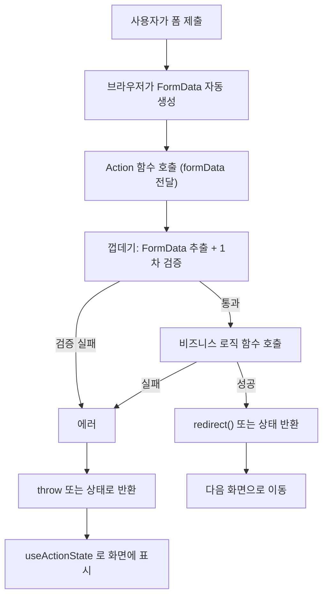

---
aliases:
  - Server Actions
  - use server
  - bind
tags:
  - NextJS
related:
  - "[[00_JS_Ecosystem_HomePage]]"
  - "[[React_useFormStatus]]"
  - "[[React_ControlledInput]]"
  - "[[JS_FormData]]"
  - "[[JS_Primitive_Methods]]"
  - "[[NextJS_TokenStorage]]"
  - "[[NextJS_API_Client]]"
---
# NextJS_Server_Actions — Server Actions & FormData

> [!info] 
>  Server Action은 클라이언트에서 호출하면 서버에서 실행되는 함수(`'use server'`)다. 
>  `<form action={서버함수}>`로 쓰면, 폼 제출 시 그 함수가 자동으로 FormData와 함께 호출된다.

---

# FormData란 — Web 표준 API ⭐️⭐️

```txt
FormData = <form>의 입력값들을 "이름(name)-값" 쌍으로 담아두는 표준 브라우저 객체
Next.js가 새로 만든 개념이 아니라, 원래부터 있던 Web API
(FormData 자체의 메서드/파일 업로드 등 자세한 내용은 [[JS_FormData]] 참고 — 이 노트는 Next.js 연결 부분만)

<form action={서버함수}>로 폼을 제출하면:
  브라우저가 폼 안의 모든 <input name="...">, <textarea name="...">,
  <select name="...">의 값을 자동으로 모아서 FormData 객체 하나를 만듦
  → 그 FormData 객체를 서버함수의 "첫 번째이자 유일한 인자"로 넘겨서 호출함
```

```tsx
<form action={createPostAction}>
  <input name="title" />
  <input name="body" />
</form>
```

```typescript
export async function createPostAction(formData: FormData) {
  const title = formData.get('title');   // <input name="title">의 값
  // ...
}
```

```txt
연결 고리는 오직 name 속성:
  <input name="title">  ↔  formData.get('title')
  → name이 다르면 못 찾음 (id나 다른 속성이 아니라 무조건 name 기준)
```

---

# 전체 흐름 ⭐️⭐️⭐️



```txt
이 흐름에서 기억할 것:
  ① FormData는 브라우저가 자동으로 만들어줌 (직접 만들 필요 없음)
  ② Action 함수는 보통 "껍데기(검증) + 진짜 로직" 두 단계로 나뉨 (아래에서 자세히)
  ③ 실패를 throw 할지 값으로 반환할지는 선택 — 후자를 쓰려면 useActionState 필요 ([[React_useFormStatus]] 참고)
```

---

# 진짜 로직 함수는 무엇을 호출하나 — DB 직접 vs 외부 API ⭐️⭐️⭐️

```txt
Server Action의 "진짜 로직" 부분이 무엇을 호출하는지는 그 앱의 백엔드 구조에 따라 둘 중 하나임
  ① DB를 직접 호출 — 같은 Next.js 프로젝트 안에 ORM(Prisma 등)으로 DB까지 같이 두는 구조
  ② 외부 API를 호출 — 별도 백엔드(NestJS 등)가 DB/인증을 전부 갖고 있고, Next.js는 그 API만 호출하는 구조

Server Action 문법 자체(FormData, bind, useActionState)는 둘 중 어느 구조든 동일하게 적용됨 —
달라지는 건 "진짜 로직" 함수의 내부 구현뿐
```

```typescript
// ① DB 직접 호출 (Next.js가 ORM까지 같이 갖고 있는 구조)
export async function createPost(title: string, body: string, categoryId: string) {
  await db.post.create({ data: { title, body, categoryId } });
}

// ② 외부 API 호출 (별도 백엔드가 DB/인증을 갖고 있는 구조)
export async function createPost(title: string, body: string, categoryId: string) {
  const res = await fetch(`${process.env.API_URL}/posts`, {
    method: 'POST',
    headers: { 'Content-Type': 'application/json' },
    body: JSON.stringify({ title, body, categoryId }),
  });
  if (!res.ok) throw new Error('게시글 작성에 실패했습니다.');
}
```

---

# `<form action={fn}>`의 세 가지 쓰는 방식 ⭐️⭐️⭐️

```txt
서버 함수를 form의 action으로 쓸 때, 함수를 "어떻게 정의했는지"에 따라 패턴이 나뉨
이걸 구분 못 하면 "왜 어떤 함수는 bind()가 필요하고 어떤 건 안 필요하지" 헷갈림
```

## 패턴 1 — FormData를 직접 받기

```typescript
export async function createPostAction(formData: FormData) {
  const title = String(formData.get('title') ?? '');
  // ...
}
```

```tsx
<form action={createPostAction}>   {/* bind() 없이 그대로 */}
```

```txt
함수의 시그니처가 (formData: FormData) 하나뿐이라서
React/Next.js가 자동으로 넘겨주는 FormData가 정확히 그 자리에 그대로 들어감
→ 추가로 끼워넣을 인자가 없으니 bind()가 필요 없음
```

## 패턴 2 — 다른 인자를 받고 bind()로 미리 채우기

```typescript
export async function deletePostAction(postId: string) {
  // ...
}
```

```tsx
<form action={deletePostAction.bind(null, post.id)}>
```

```txt
함수의 시그니처가 (postId: string)처럼 FormData가 아닌 다른 타입을 기대함
→ FormData를 그 자리에 그냥 넣으면 타입이 안 맞으므로
  bind(null, post.id)로 "진짜 인자"를 미리 채워두고
  뒤에 따라오는 FormData는 그냥 무시되게 만든 것
```

## .bind()가 왜 필요한가 ⭐️⭐️

```txt
<form action={fn}>으로 쓰인 함수는, 폼이 제출될 때
React/Next.js가 자동으로 "FormData 객체"를 인자로 넣어서 호출함
  → action={deletePostAction}라고만 쓰면 실제 호출은 deletePostAction(formData)가 됨
  → postId 자리에 formData가 들어가버려서 타입이 안 맞음

fn.bind(null, postId)가 만들어내는 것:
  "postId 인자가 이미 채워진 새 함수" 하나
  나중에 그 새 함수가 호출될 때 추가로 들어오는 인자(FormData)는 채워둔 인자 "뒤에" 덧붙여짐
  → deletePostAction은 postId 파라미터 하나만 선언돼 있어서, 뒤따라오는 FormData는 그냥 무시됨
  → 결과적으로 postId 자리에 정확히 의도한 값이 들어가게 됨

첫 번째 인자 null은 this 자리 — bind를 쓰는 함수가 this를 안 쓰면 의미 없는 값으로 채워둠
```

## 패턴 3 — useActionState와 같이 쓰기 (또 다른 시그니처) ⭐️⭐️⭐️

```txt
패턴 1(FormData만), 패턴 2(bind)와는 별개로
"폼 제출 결과(에러 등)를 화면에 보여주고 싶다"면 또 다른 시그니처 규칙을 따라야 함
```

```typescript
export type LoginEmailFormState = { error?: string };

export async function signInWithEmailAction(
  _preState: LoginEmailFormState,   // 이 자리가 없으면 동작 안 함
  formData: FormData,
) {
  // ...
  return { error: '이메일 또는 비밀번호가 올바르지 않습니다.' };  // 이 값이 비로소 화면에 보임
}
```

```tsx
const [state, formAction] = useActionState(signInWithEmailAction, initialState);
<form action={formAction}>   {/* useActionState가 만들어준 formAction — bind() 아님! */}
```

```txt
왜 이 시그니처가 꼭 필요한가:
  useActionState(action, 초기값)은 내부적으로 action을
  (지금까지의 state, formData) 두 인자로 직접 호출함 — 이건 정해진 규칙

  만약 액션을 (formData) 한 개 인자로만 선언해두면:
    React는 여전히 두 인자로 호출하므로
    첫 번째 인자(이전 state)가 그 formData 파라미터 자리에 들어가고
    진짜 FormData는 두 번째 자리로 가는데 받을 파라미터가 없어서 그냥 사라짐
    → 안에서 formData.get(...)을 시도하면 state 객체엔 그런 메서드가 없어서
      에러가 나거나 값을 전혀 못 읽음 → "에러 메시지가 화면에 안 뜨는" 것처럼 보이게 됨

  그래서 useActionState와 쓸 액션은 반드시:
    ① 첫 인자로 "이전 state" 자리를 받아야 함 (안 쓰면 _preState처럼 밑줄로 표시)
    ② <form action={...}>에는 useActionState가 반환한 formAction을 써야 함
       (원본 액션을 직접 넣거나 bind()로 감싸면 안 됨 — 호출 규칙 자체가 다르기 때문)
```

## 세 패턴 비교

|패턴|함수 시그니처|form에 쓸 때|언제 쓰나|
|---|---|---|---|
|① FormData 직접 받기|`(formData: FormData) => ...`|`action={fn}` 그대로|폼 필드가 여러 개, 결과를 화면에 안 보여줘도 될 때 ⭐️|
|② 일반 인자 + bind()|`(arg1, arg2?) => ...`|`action={fn.bind(null, arg1)}`|폼 입력과 무관한 "미리 정해진 값" 하나만 넘길 때|
|③ useActionState 용|`(prevState, formData) => ...`|`action={useActionState(...)[1]}`|에러/성공 메시지를 같은 페이지에 보여줘야 할 때 ⭐️|

```txt
선택 기준:
  title/body처럼 "폼 안의 입력값들"이 필요하고, 결과는 그냥 redirect/throw면     → 패턴 ①
  postId처럼 "폼 바깥에서 이미 알고 있는 값" 하나만 필요하면                      → 패턴 ②
  로그인 실패처럼 "실패 시 같은 화면에 메시지를 보여줘야" 하면                       → 패턴 ③

⚠️ 세 패턴을 섞으면 안 됨 — 액션 시그니처와 form에 넘기는 값의 종류가 한 세트로 맞아야 함
```

---

# ⚠️ action이 끝나면 form이 자동으로 리셋됨 ⭐️⭐️⭐️⭐️

```txt
패턴 ③(useActionState)으로 폼을 만들 때, action이 끝나면(throw만 안 하면) form이 자동으로 리셋됨 —
실패 응답(return { error: ... })이어도 동일하게 리셋됨

입력칸이 비제어(uncontrolled)라면 화면만 비워지고, 따로 들고 있던 state는 안 비워지는
불일치가 생길 수 있음 — 이 현상과 해결법(제어 컴포넌트 전환 + 성공 시에만 명시적 reset)은
[[React_ControlledInput]]과 [[React_useFormStatus]] 참고
```

---

# ⚠️ Server Action은 서버에서 돈다 — 브라우저 전용 값에 접근 못 함 ⭐️⭐️⭐️⭐️

```txt
Server Action 함수는 이름 그대로 서버(Node.js)에서 실행됨
→ localStorage, sessionStorage, document, window 같은 브라우저 전용 API는 그 안에서 못 씀
  (이 API들이 서버에서 안 보이는 이유 자체는 [[JS_BrowserAPI]]·[[NextJS_TokenStorage]] 참고)

이게 실제로 문제가 되는 흔한 경우: 인증 토큰을 localStorage에 저장하는 앱(Bearer 방식)에서
인증이 필요한 Server Action을 만들 때 — 토큰을 서버 쪽에서 직접 읽을 방법이 없음

해결 방법 후보:
  ① <input type="hidden" name="token" value={token} />처럼 폼 제출 시 같이 보내기
     (단, 토큰이 HTML에 그대로 노출된다는 트레이드오프가 있음)
  ② 그 작업은 Server Action 대신 클라이언트에서 직접 fetch로 호출하기
     (바로 아래 "Server Action을 쓰지 않는 선택" 참고)
  ③ httpOnly 쿠키 기반 인증으로 전환 — 쿠키는 서버에서도 자동으로 읽힘
```

---

# (3가지 패턴에 안 맞는다면) Server Action 자체를 쓰지 않는 선택 ⭐️⭐️⭐️⭐️

```txt
위 3가지(①②③)는 전부 <form action={fn}>(Server Action)을 쓴다는 전제 위에 있음
"이 3가지 중 어디에도 안 맞는다"고 느껴진다면, 패턴을 잘못 고른 게 아니라
애초에 이 작업엔 Server Action 자체가 안 맞는 경우일 수 있음

대표적으로 — 인증 토큰이 localStorage에 있어서 Server Action 안에서 다루기 번거로운 경우,
처음부터 Server Action을 거치지 않고 평범한 클라이언트 이벤트 핸들러로 처리하는 선택도 흔함
```

```tsx
// 일반 onSubmit + state — Server Action도 FormData도 안 씀
const [email, setEmail] = useState('');
const [password, setPassword] = useState('');

async function submitLogin(e: React.FormEvent<HTMLFormElement>) {
  e.preventDefault();
  await fetch('/api/login', {
    method: 'POST',
    headers: { 'Content-Type': 'application/json' },
    body: JSON.stringify({ email, password }),
  });
}

<form onSubmit={submitLogin}>
  <input value={email} onChange={(e) => setEmail(e.target.value)} />
  <input value={password} onChange={(e) => setPassword(e.target.value)} />
</form>
```

```txt
이게 위 3패턴과 근본적으로 다른 점:
  action={fn}이 아니라 onSubmit={fn} — 서버 함수를 폼이 직접 호출하는 게 아니라
  그냥 클라이언트 이벤트 핸들러를 실행하는 평범한 React 패턴임
  FormData 자체가 등장하지 않음 — 값은 처음부터 끝까지 state가 들고 있음
  (제어 컴포넌트로 값을 들고 있는 이유는 [[React_ControlledInput]] 참고,
   클라이언트 fetch 래퍼 패턴은 [[NextJS_API_Client]] 참고)
```

|상황|더 맞는 선택|
|---|---|
|인증된 요청인데 토큰이 localStorage에 있어 Server Action 안에서 다루기 번거로움|`onSubmit` + state (Server Action 안 씀)|
|입력 중 즉각적인 클라이언트 검증을 이미 state로 하고 있어서, 서버까지 갔다올 이유가 없음|`onSubmit` + state|
|인증이 필요 없는 공개 폼 (문의하기 등)|① FormData 직접 받기|
|JS 없이도 폼이 동작해야 하는 progressive enhancement가 중요함|①②③ (Server Action)|
|httpOnly 쿠키 기반 인증을 쓰는 경우|①②③도 자연스러움 (서버가 쿠키를 직접 읽을 수 있어서)|

---

# 실전 — 한 줄씩 분해 (createPost 예시) ⭐️⭐️⭐️

```typescript
// actions.ts
'use server';
import { db } from '@/lib/db';
import { redirect } from 'next/navigation';

export async function createPost(title: string, body: string, categoryId: string) {
  const normalizedTitle = title.trim();

  if (!normalizedTitle) {
    throw new Error('제목을 입력해 주세요.');
  }
  if (normalizedTitle.length > 100) {
    throw new Error('제목은 100자 이하로 작성해 주세요.');
  }

  await db.post.create({
    data: { title: normalizedTitle, body: body.trim(), categoryId },
  });

  redirect('/posts');
}

export async function createPostAction(formData: FormData) {
  const title = String(formData.get('title') ?? '');
  const body = String(formData.get('body') ?? '');
  const categoryId = String(formData.get('categoryId') ?? '');
  const agree = formData.get('agreeToGuidelines');

  if (!agree) {
    throw new Error('작성 가이드라인에 동의해 주세요.');
  }
  await createPost(title, body, categoryId);
}
```

## 왜 함수를 두 개로 나눴는가 — 2단계 분리 패턴 ⭐️⭐️

```txt
createPostAction(formData)            "FormData에서 값 꺼내기" 전용 — 폼과 맞닿는 얇은 껍데기
createPost(title, body, categoryId)   진짜 로직 — 깨끗한 타입의 일반 함수

이렇게 나누는 이유:
  createPost는 title/body가 "이미 string으로 확정된" 평범한 함수라
  폼이 아닌 다른 곳(테스트 코드, 다른 액션, 관리자 도구 등)에서도 바로 재사용 가능함
  → 만약 한 함수에 다 합쳐놨다면, FormData가 있어야만 호출 가능한 함수가 되어버림

→ 패턴화하면: "Action 함수는 입력을 꺼내고 검증만, 실제 로직은 별도 함수로"
  (실제 로직이 DB 직접 접근이든 외부 API 호출이든, 이 분리 자체는 동일하게 적용됨)
```

## formData.get()의 반환 타입 — 왜 String()으로 감싸나 ⭐️⭐️

```typescript
const title = String(formData.get('title') ?? '');
```

```txt
formData.get(name)의 타입: FormDataEntryValue | null
  FormDataEntryValue = string | File   (텍스트 입력이면 string, 파일 입력이면 File)
  필드 자체가 없으면 null

이 함수에서 두 단계로 안전하게 처리:
  ?? ''      값이 null(필드가 없음)이면 빈 문자열로 대체
  String()   "이론적으로 File일 수도 있다"는 TS의 의심을 걷어내고 확실히 string으로 변환
             (실제로 title/body 같은 text input은 항상 string이지만
              TS 입장에서는 formData.get()의 선언된 타입만 보고 File 가능성도 같이 따라옴)

→ 방어적 타입 변환의 일종 — String()/Number() 자체의 일반 동작은 [[JS_Primitive_Methods]] 참고
```

## 폼 입력이 아닌 값을 hidden input으로 넘기기 ⭐️

```tsx
<form action={createPostAction}>
  <input type="hidden" name="categoryId" value={selectedCategoryId} />
  <input name="title" />
  <textarea name="body" />
  <label><input type="checkbox" name="agreeToGuidelines" /> 작성 가이드라인에 동의합니다</label>
  <button type="submit">작성</button>
</form>
```

```txt
패턴 1(FormData 직접 받기)을 쓸 때, categoryId처럼 "폼의 텍스트 입력은 아니지만 같이 넘기고 싶은 값"은
bind()로 끼워넣는 대신 <input type="hidden">으로 폼 안에 같이 넣어두는 게 일반적
→ FormData가 폼 안의 모든 name 있는 input을 다 모으기 때문에, hidden input도 똑같이 잡힘
→ 이미 FormData로 다 꺼내는 함수라면, 굳이 bind()와 섞어 쓰지 않고 하나의 방식으로 통일하는 게 깔끔함
```

## 껍데기에서만 하는 검증 vs 진짜 로직의 검증

```typescript
if (!agree) {
  throw new Error('작성 가이드라인에 동의해 주세요.');
}
```

```txt
이 체크는 createPostAction(껍데기)에서 처리하고
createPost(진짜 로직)에는 agree 자체를 넘기지 않음
→ "동의했는지"는 순전히 폼 UX/정책 문제일 뿐, 실제 데이터 생성 로직과는 상관없는 관심사라서 분리해둔 것

반대로 제목 길이 제한처럼 "데이터 자체가 지켜야 할 규칙"은 createPost(진짜 로직) 안에서 검증함
→ 기준: 폼에서만 의미 있는 검증(UX)은 껍데기에, 데이터가 항상 지켜야 하는 규칙은 로직 함수 안에
   (별도 백엔드 API를 호출하는 구조라면, 그 규칙은 서버 쪽에서도 한 번 더 검증되는 게 원칙 —
    클라이언트/Server Action 쪽 검증은 UX용 보조 수단일 뿐 보안 경계는 아님)
```

---

# 폼에 결과/제출중 상태 보여주기 — useActionState & useFormStatus ⭐️⭐️⭐️

```txt
지금까지 본 Action(createPostAction 등)은 실패하면 throw함
→ "이 폼 위에 에러 메시지를 보여주고 싶다", "제출 중엔 버튼을 비활성화하고 싶다"면
  React의 전용 훅 두 개(useActionState, useFormStatus)를 씀

이 두 훅 자체의 자세한 사용법·코드·주의점(특히 useFormStatus는 자식 컴포넌트에서만 동작하는 규칙,
action 완료 후 자동 리셋 함정)은 [[React_useFormStatus]]에 별도로 정리해둠 — 여기서는 중복 설명 안 함
```

---

# 한눈에

```txt
FormData: <form>의 input name → 값을 자동으로 모아주는 표준 브라우저 객체 (자세한 메서드는 [[JS_FormData]])

전체 흐름: 폼 제출 → FormData 생성 → Action(껍데기 검증) → 진짜 로직 함수(DB 또는 외부 API) → 성공/실패 분기

<form action={fn}>에서 fn의 시그니처가 곧 패턴을 결정:
  (formData: FormData) => ...   → action={fn} 그대로 (폼 입력값이 여러 개일 때 ⭐️)
  (그 외 인자) => ...            → action={fn.bind(null, 값)} 필요
  (prevState, formData) => ...  → action={useActionState(...)[1]} (에러 메시지 표시할 때)

formData.get(name)은 FormDataEntryValue | null → String(... ?? '')로 안전하게 string화

패턴: Action 함수(FormData 추출 + UX 검증) → 일반 함수(진짜 로직, 재사용 가능)
폼 입력이 아닌 추가 값은 bind()보다 <input type="hidden">으로 통일하는 게 더 깔끔할 때가 많음

⚠️ action이 끝나면(throw만 안 하면) form이 자동 리셋됨 — 비제어 입력칸이면
   화면↔state 불일치 위험 → [[React_ControlledInput]] 참고

⚠️ Server Action은 서버에서 돎 — localStorage 등 브라우저 전용 API를 못 씀
   (인증 토큰이 localStorage에 있는 구조라면 특히 주의 — hidden input 전달 / 클라이언트 fetch / 쿠키 전환 중 선택)

이 3가지 패턴 어디에도 안 맞는다면: action={fn} 대신 onSubmit={fn} + state로 직접 처리하는 것도
완전히 유효한 선택 — 이때는 Server Action도 FormData도 등장하지 않음

폼 결과/제출중 상태 표시는 useActionState/useFormStatus — 자세한 건 [[React_useFormStatus]]
```