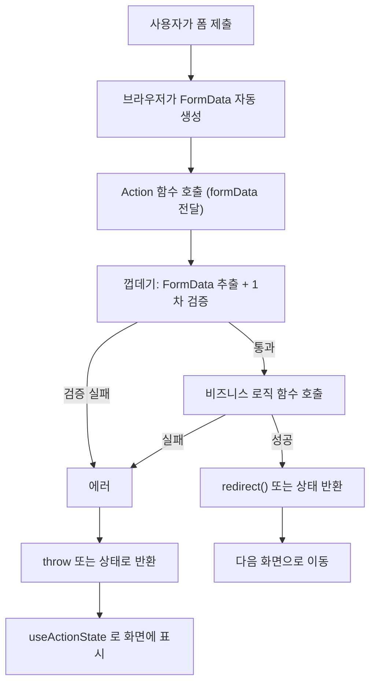

# Next_Server_Actions — Server Actions & FormData

# 한 줄 요약

```txt
Server Action = 클라이언트에서 호출하면 서버에서 실행되는 함수 ("use server")
<form action={서버함수}> 로 쓰면, 폼 제출 시 그 함수가 자동으로 FormData 와 함께 호출됨
```

---

---

# FormData 란 — Web 표준 API ⭐️⭐️

```txt
FormData = <form> 의 입력값들을 "이름(name)-값" 쌍으로 담아두는 표준 브라우저 객체
Next.js 가 새로 만든 개념이 아니라, 원래부터 있던 Web API
  (예전엔 주로 axios/fetch 로 파일 업로드할 때 직접 만들어 썼던 그 FormData 와 같은 것)

<form action={서버함수}> 로 폼을 제출하면:
  브라우저가 폼 안의 모든 <input name="...">, <textarea name="...">,
  <select name="..."> 의 값을 자동으로 모아서 FormData 객체 하나를 만듦
  → 그 FormData 객체를 서버함수의 "첫 번째이자 유일한 인자" 로 넘겨서 호출함
```

```tsx
<form action={createPostAction}>
  <input name="title" />
  <input name="body" />
</form>
```

```typescript
export async function createPostAction(formData: FormData) {
  const title = formData.get('title');   // <input name="title"> 의 값
  // ...
}
```

```txt
연결 고리는 오직 name 속성:
  <input name="title">  ↔  formData.get('title')
  → name 이 다르면 못 찾음 (id 나 다른 속성이 아니라 무조건 name 기준)
```

---

---

# 전체 흐름 ⭐️⭐️⭐️



```bash
이 흐름에서 기억할 것:
  ① FormData 는 브라우저가 자동으로 만들어줌 (직접 만들 필요 없음)
  ② Action 함수는 보통 "껍데기(검증) + 진짜 로직" 두 단계로 나뉨 (아래에서 자세히)
  ③ 실패를 throw 할지 값으로 반환할지는 선택 — 후자를 쓰려면 useActionState 필요
    # ([[React_useFormStatus]] 참고)
```

---

---

# `<form action={fn}>` 의 세 가지 쓰는 방식 ⭐️⭐️⭐️

```txt
서버 함수를 form 의 action 으로 쓸 때, 함수를 "어떻게 정의했는지" 에 따라 두 가지 패턴이 있음
이걸 구분 못 하면 "왜 어떤 함수는 bind() 가 필요하고 어떤 건 안 필요하지" 헷갈림
```

## 패턴 1 — FormData 를 직접 받기

```typescript
export async function createPostAction(formData: FormData) {
  const title = String(formData.get("title") ?? "");
  // ...
}
```

```tsx
<form action={createPostAction}>   {/* bind() 없이 그대로 */}
```

```txt
함수의 시그니처가 (formData: FormData) 하나뿐이라서
React/Next.js 가 자동으로 넘겨주는 FormData 가 정확히 그 자리에 그대로 들어감
→ 추가로 끼워넣을 인자가 없으니 bind() 가 필요 없음
```

## 패턴 2 — 다른 인자를 받고 bind() 로 미리 채우기


```typescript
export async function deletePost(postId: string) {
  await db.post.delete({ where: { id: postId } });
}
```

```tsx
<form action={deletePost.bind(null, post.id)}>
```

```txt
함수의 시그니처가 (postId: string) 처럼 FormData 가 아닌 다른 타입을 기대함
→ FormData 를 그 자리에 그냥 넣으면 타입이 안 맞으므로
  bind(null, post.id) 로 "진짜 인자" 를 미리 채워두고
  뒤에 따라오는 FormData 는 그냥 무시되게 만든 것
```

## .bind() 가 왜 필요한가 —  ⭐️⭐

```txt
<form action={fn}> 으로 쓰인 함수는, 폼이 제출될 때
React/Next.js 가 자동으로 "FormData 객체" 를 인자로 넣어서 호출함
  → action={deletePost} 라고만 쓰면 실제 호출은 deletePost(formData) 가 됨
  → postId 자리에 formData 가 들어가버려서 타입이 안 맞음 ⚠️

fn.bind(null, postId) 가 만들어내는 것:
  "postId 인자가 이미 채워진 새 함수" 하나
  나중에 그 새 함수가 호출될 때 추가로 들어오는 인자(FormData)는 채워둔 인자 "뒤에" 덧붙여짐
  → deletePost 는 postId 파라미터 하나만 선언돼 있어서, 뒤따라오는 FormData 는 그냥 무시됨
  → 결과적으로 postId 자리에 정확히 의도한 값이 들어가게 됨

첫 번째 인자 null 은 this 자리 — bind 를 쓰는 함수가 this 를 안 쓰면 의미 없는 값으로 채워둠
```

## 패턴 3 — useActionState 와 같이 쓰기 (또 다른 시그니처) ⭐️⭐️⭐️

```txt
패턴 1(FormData만), 패턴 2(bind) 와는 별개로
"폼 제출 결과(에러 등)를 화면에 보여주고 싶다" 면 또 다른 시그니처 규칙을 따라야 함
```

```typescript
export type LoginEmailFormState = { error?: string };

export async function signInWithEmailAction(
  _preState: LoginEmailFormState,   // ← 이 자리가 없으면 동작 안 함
  formData: FormData,
) {
  // ...
  return { error: "이메일 또는 비밀번호가 올바르지 않습니다." };  // 이 값이 비로소 화면에 보임
}
```

```tsx
const [state, formAction] = useActionState(signInWithEmailAction, initialState);
<form action={formAction}>   {/* useActionState 가 만들어준 formAction — bind() 아님! */}
```

```txt
왜 이 시그니처가 꼭 필요한가:
  useActionState(action, 초기값) 은 내부적으로 action 을
  (지금까지의 state, formData) 두 인자로 직접 호출함 — 이건 정해진 규칙

  만약 액션을 (formData) 한 개 인자로만 선언해두면:
    React 는 여전히 두 인자로 호출하므로
    첫 번째 인자(이전 state) 가 그 formData 파라미터 자리에 들어가고
    진짜 FormData 는 두 번째 자리로 가는데 받을 파라미터가 없어서 그냥 사라짐
    → 안에서 formData.get(...) 을 시도하면 state 객체엔 그런 메서드가 없어서
      에러가 나거나 값을 전혀 못 읽음 → "에러 메시지가 화면에 안 뜨는" 것처럼 보이게 됨

  그래서 useActionState 와 쓸 액션은 반드시:
    ① 첫 인자로 "이전 state" 자리를 받아야 함 (안 쓰면 _preState 처럼 밑줄로 표시)
    ② <form action={...}> 에는 useActionState 가 반환한 formAction 을 써야 함
       (원본 액션을 직접 넣거나 bind() 로 감싸면 안 됨 — 호출 규칙 자체가 다르기 때문)
```

## 세 패턴 비교

|패턴|함수 시그니처|form 에 쓸 때|언제 쓰나|
|---|---|---|---|
|① FormData 직접 받기|`(formData: FormData) => ...`|`action={fn}` 그대로|폼 필드가 여러 개, 결과를 화면에 안 보여줘도 될 때 ⭐️|
|② 일반 인자 + bind()|`(arg1, arg2?) => ...`|`action={fn.bind(null, arg1)}`|폼 입력과 무관한 "미리 정해진 값" 하나만 넘길 때|
|③ useActionState 용|`(prevState, formData) => ...`|`action={useActionState(...)[1]}`|에러/성공 메시지를 같은 페이지에 보여줘야 할 때 ⭐️|

```txt
선택 기준:
  title/body 처럼 "폼 안의 입력값들" 이 필요하고, 결과는 그냥 redirect/throw 면     → 패턴 ①
  postId 처럼 "폼 바깥에서 이미 알고 있는 값" 하나만 필요하면                      → 패턴 ②
  로그인 실패처럼 "실패 시 같은 화면에 메시지를 보여줘야" 하면                       → 패턴 ③

⚠️ 세 패턴을 섞으면 안 됨 — 액션 시그니처와 form 에 넘기는 값의 종류가 한 세트로 맞아야 함
```

---

---

# 실전 — 한 줄씩 분해 (createPost 예시) ⭐️⭐️⭐️

```typescript
// actions.ts
"use server";
import { db } from "@/lib/db";
import { redirect } from "next/navigation";

export async function createPost(title: string, body: string, categoryId: string) {
  const normalizedTitle = title.trim();

  if (!normalizedTitle) {
    throw new Error("제목을 입력해 주세요.");
  }
  if (normalizedTitle.length > 100) {
    throw new Error("제목은 100자 이하로 작성해 주세요.");
  }

  await db.post.create({
    data: { title: normalizedTitle, body: body.trim(), categoryId },
  });

  redirect("/posts");
}

export async function createPostAction(formData: FormData) {
  const title = String(formData.get("title") ?? "");
  const body = String(formData.get("body") ?? "");
  const categoryId = String(formData.get("categoryId") ?? "");
  const agree = formData.get("agreeToGuidelines");

  if (!agree) {
    throw new Error("작성 가이드라인에 동의해 주세요.");
  }
  await createPost(title, body, categoryId);
}
```

## 왜 함수를 두 개로 나눴는가 — 2단계 분리 패턴 ⭐️⭐️

```txt
createPostAction(formData)            "FormData 에서 값 꺼내기" 전용 — 폼과 맞닿는 얇은 껍데기
createPost(title, body, categoryId)   진짜 로직 — 깨끗한 타입의 일반 함수

이렇게 나누는 이유:
  createPost 는 title/body 가 "이미 string 으로 확정된" 평범한 함수라
  폼이 아닌 다른 곳(테스트 코드, 다른 액션, 관리자 도구 등)에서도 바로 재사용 가능함
  → 만약 한 함수에 다 합쳐놨다면, FormData 가 있어야만 호출 가능한 함수가 되어버림

→ 패턴화하면: "Action 함수는 입력을 꺼내고 검증만, 실제 로직은 별도 함수로"
```

## formData.get() 의 반환 타입 — 왜 String() 으로 감싸나 ⭐️⭐️

```typescript
const title = String(formData.get("title") ?? "");
```

```txt
formData.get(name) 의 타입: FormDataEntryValue | null
  FormDataEntryValue = string | File   (텍스트 입력이면 string, 파일 입력이면 File)
  필드 자체가 없으면 null

이 함수에서 두 단계로 안전하게 처리:
  ?? ""      값이 null(필드가 없음)이면 빈 문자열로 대체
  String()   "이론적으로 File 일 수도 있다" 는 TS 의 의심을 걷어내고 확실히 string 으로 변환
             (실제로 title/body 같은 text input 은 항상 string 이지만
              TS 입장에서는 formData.get() 의 선언된 타입만 보고 File 가능성도 같이 따라옴)

→ JS_Primitive_Methods 의 Number()/String() 변환과 같은 종류의 "방어적 타입 변환"
  (자세한 String() 의 일반 동작은 [[JS_Primitive_Methods]] 참고)
```

## 폼 입력이 아닌 값을 hidden input 으로 넘기기 ⭐️

```tsx
<form action={createPostAction}>
  <input type="hidden" name="categoryId" value={selectedCategoryId} />
  <input name="title" />
  <textarea name="body" />
  <label><input type="checkbox" name="agreeToGuidelines" /> 작성 가이드라인에 동의합니다</label>
  <button type="submit">작성</button>
</form>
```

```txt
패턴 1(FormData 직접 받기)을 쓸 때, categoryId 처럼 "폼의 텍스트 입력은 아니지만 같이 넘기고 싶은 값"은
bind() 로 끼워넣는 대신 <input type="hidden"> 으로 폼 안에 같이 넣어두는 게 일반적
→ FormData 가 폼 안의 모든 name 있는 input 을 다 모으기 때문에, hidden input 도 똑같이 잡힘
→ 이미 FormData 로 다 꺼내는 함수라면, 굳이 bind() 와 섞어 쓰지 않고 하나의 방식으로 통일하는 게 깔끔함
```

## 껍데기에서만 하는 검증 vs 진짜 로직의 검증

```typescript
if (!agree) {
  throw new Error("작성 가이드라인에 동의해 주세요.");
}
```

```txt
이 체크는 createPostAction(껍데기) 에서 처리하고
createPost(진짜 로직) 에는 agree 자체를 넘기지 않음
→ "동의했는지" 는 순전히 폼 UX/정책 문제일 뿐, 실제 데이터 생성 로직과는 상관없는 관심사라서 분리해둔 것

반대로 제목 길이 제한처럼 "데이터 자체가 지켜야 할 규칙" 은 createPost(진짜 로직) 안에서 검증함
→ 기준: 폼에서만 의미 있는 검증(UX) 은 껍데기에, 데이터가 항상 지켜야 하는 규칙은 로직 함수 안에
```

```txt
이 프로젝트의 실제 회원가입/로그인 액션(같은 2단계 분리 패턴을 그대로 적용한 사례)은
[[Project_Notes]] 참고
```

---

---

# 폼에 결과/제출중 상태 보여주기 — useActionState & useFormStatus ⭐️⭐️⭐️

```txt
지금까지 본 Action(createPostAction 등)은 실패하면 throw 함
→ "이 폼 위에 에러 메시지를 보여주고 싶다", "제출 중엔 버튼을 비활성화하고 싶다" 면
  React 의 전용 훅 두 개(useActionState, useFormStatus)를 씀

이 두 훅 자체의 자세한 사용법·코드·주의점(특히 useFormStatus 는 자식 컴포넌트에서만 동작하는 규칙)은
[[React_useFormStatus]] 에 별도로 정리해둠 — 여기서는 중복 설명 안 함
```

---

---

# 한눈에

```txt
FormData: <form> 의 input name → 값 을 자동으로 모아주는 표준 브라우저 객체

전체 흐름: 폼 제출 → FormData 생성 → Action(껍데기 검증) → 진짜 로직 함수 → 성공/실패 분기

<form action={fn}> 에서 fn 의 시그니처가 곧 패턴을 결정:
  (formData: FormData) => ...   → action={fn} 그대로 (폼 입력값이 여러 개일 때 ⭐️)
  (그 외 인자) => ...            → action={fn.bind(null, 값)} 필요

formData.get(name) 은 FormDataEntryValue | null → String(... ?? '') 로 안전하게 string 화

패턴: Action 함수(FormData 추출 + UX 검증) → 일반 함수(진짜 로직 + 데이터 규칙 검증, 재사용 가능)
폼 입력이 아닌 추가 값은 bind() 보다 <input type="hidden"> 으로 통일하는 게 더 깔끔할 때가 많음

폼 결과/제출중 상태 표시는 useActionState/useFormStatus — 자세한 건 [[React_useFormStatus]]
```