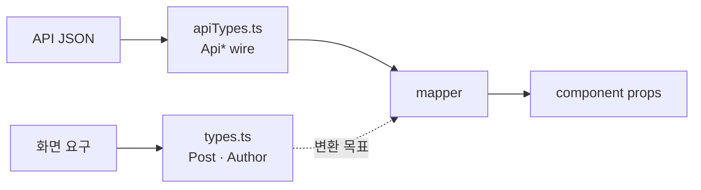

---
aliases:
  - lib/types
  - types.ts
  - UI 타입
tags:
  - NextJS
related:
  - "[[00_JS_Ecosystem_HomePage]]"
  - "[[NestJS_DTO]]"
  - "[[NextJS_ApiTypes_Mapper]]"
  - "[[NextJS_Concept]]"
  - "[[NextJS_Env_Config]]"
  - "[[React_Component]]"
---
# NextJS_UI_Types — UI 타입 먼저 설계하기

> [!info] 
> lib/types.ts는 "화면이 실제로 쓰는 모양"을 정의하는 파일
> API 응답 타입을 그대로 베끼는 게 아니라 화면 기준으로 새로 설계하고, Mapper가 그 차이를 메운다.

---
# 흐름도



```txt
types.ts = API 응답 베끼기 ❌ — 화면 기준으로 새로 설계, Mapper가 차이를 메움
읽기(Post) vs 쓰기(CreatePostBody) 분리 · optional(?) = 맥락에 따라 없을 수 있음
```

---

# 프로젝트 시작 순서에서 위치 ⭐️⭐️⭐️

|단계|내용|참고|
|---|---|---|
|설치|`create-next-app` 등|[[NextJS_Concept]]|
|env|`NEXT_PUBLIC_API_URL` 등|[[NextJS_Env_Config]]|
|**UI 타입 설계 (이 노트)**|`lib/types.ts` — 화면이 쓰는 모양부터 정의|—|
|API 연동|fetchAPI · Mapper|[[NextJS_ApiTypes_Mapper]] · [[NextJS_API_Client]]|

```txt
백엔드가 아직 없거나 엔드포인트가 안 끝났어도, 화면에 "뭘 보여줄지"는 먼저 정할 수 있음
→ UI 타입을 먼저 만들어두면 mock 데이터로 컴포넌트 개발을 먼저 진행할 수 있고
  나중에 API가 붙을 때도 "이 타입에 맞게 변환만 하면 된다"는 명확한 목표가 생김
```

---

# 왜 API 응답과 1:1이 아닌가 ⭐️⭐️⭐️

```txt
화면(UI)이 필요한 모양과 API/DB가 들고 있는 모양은 책임이 달라서 보통 서로 다름
```

|이유|설명|예시|
|---|---|---|
|API엔 없는데 화면엔 필요한 필드|다른 테이블/관계를 합치거나 집계해야 함 — Mapper가 채움|`author`(작성자 join), `likeCount`(집계)|
|있을 수도 없을 수도 있는 필드|로그인 여부 등 맥락에 따라 달라짐|`likedByMe?`(비로그인이면 없음)|
|API엔 있지만 화면엔 안 쓰는 필드|내부 관리용이거나 이 화면에서 안 씀|`hidden`, `updatedAt`, 내부 메타데이터|

---

# 일반화된 템플릿 ⭐️⭐️⭐️⭐️

```typescript
// lib/types.ts

// 관계 엔티티는 "화면이 필요한 만큼만" 축소된 형태로
export type Author = {
  id:       string;
  nickname: string;
  image?:   string;
};

/** 화면 표시용 — mapPost.ts가 API 응답을 이 타입으로 변환 */
export type Post = {
  id:        string;
  title:     string;
  content:   string;
  tags:      string[];     // 허용값 검증은 백엔드(단일 소스) — 지금은 string[]로 충분
  likeCount: number;       // API엔 없을 수 있음 — Mapper가 채움
  likedByMe?: boolean;     // 비로그인이면 없음 — optional
  author:    Author;       // API 응답엔 authorId만 있을 수도 — Mapper가 객체로 채움
  createdAt: string;       // ISO 8601 문자열
  // hidden / updatedAt / reactions 같은 내부·상세 필드는 의도적으로 제외
};

/** POST 요청 body — 백엔드 DTO와 필드를 맞춤 (쓰기 전용, 위 Post와는 별도 타입) */
export type CreatePostBody = {
  title:   string;
  content: string;
  tags:    string[];
};
```

```txt
① author / likeCount / likedByMe처럼 API에 없거나 다른 형태인 필드 → Mapper가 채움
② optional(?)로 표시된 필드 = "항상 있는 게 아니다"라는 신호 — 맥락에 따라 갈림
③ 화면에 안 쓰는 API/DB 필드는 UI 타입에 의도적으로 안 넣음
   → 백엔드 API 명세 기준으로 "이 화면에 필요한 필드만" 추려서 적음
```

---

# 읽기 타입 vs 쓰기 타입 분리 ⭐️⭐️

```txt
Post(읽기)와 CreatePostBody(쓰기)를 같은 타입으로 합치면:
  생성 시 불필요한 필드(id, likeCount, createdAt)까지 다 채워야 하는 것처럼 보임
→ 분리하면 "이 요청에 진짜 필요한 필드"만 명확하게 드러남
```

|타입|용도|특징|
|---|---|---|
|`Post`|화면 표시 (읽기)|서버가 만든 값(id, 집계값, 관계) 포함|
|`CreatePostBody`|생성 요청 (쓰기)|사용자가 입력하는 값만, 보통 백엔드 DTO와 필드 1:1|

---

# 고정된 선택지 필드 — 처음부터 union으로 좁혀야 하나? ⭐️⭐️⭐️

```txt
tags / moods / status처럼 "정해진 값 중 하나"인 필드를 처음부터
'A' | 'B' | 'C' 같은 union으로 적고 싶을 수 있는데, 보통 그 시점엔 아직 필요 없음
```

|시점|`tags` 타입|이유|
|---|---|---|
|처음 — 피드에 그냥 표시만|`string[]`|허용값의 진짜 출처는 백엔드(DTO + 상수 파일) — 프론트에 똑같이 적으면 두 곳을 항상 같이 고쳐야 함|
|나중 — 칩/선택 UI, 값 하나하나가 필요할 때|`Tag[]` (union)|버튼을 값마다 하나씩 그리려면 그 값들이 정확히 뭔지 프론트도 알아야 함|

## "나중"이 오면 — 프론트 전용 상수 파일

```typescript
// lib/tags.ts — 칩 UI를 만들 때가 되면 추가
/** 백엔드 TAGS와 동일하게 유지할 것 — 칩 UI 렌더링용 */
export const TAGS = ['A', 'B', 'C'] as const;
export type Tag = (typeof TAGS)[number];
```

```txt
types.ts의 Post.tags: string[]
  → "이 값이 무엇이든 화면에 표시는 가능하다"는 최소 가정
  → 백엔드 허용값이 바뀌어도 types.ts를 고칠 일이 없음

lib/tags.ts의 TAGS
  → "내가 정확히 이 값들을 알아야 버튼을 그릴 수 있다"는 화면의 진짜 필요
  → 명백히 복사본 — 백엔드 값이 바뀌면 같이 고쳐야 함 (자동 동기화 안 됨)

⚠️ 단일 소스(source of truth)는 항상 백엔드 — DTO의 @IsIn이 실제로 검증하는 쪽이 "진짜" 기준
   프론트의 복사본은 화면을 그리기 위한 파생물일 뿐
   ([[NestJS_DTO]] "허용 값을 별도 상수 파일로 분리하기" 참고)
```

---

# 언제 만드나 — API 연동 전에 먼저 ⭐️⭐️

```txt
1. Post 타입만 먼저 만들어둠 (백엔드 안 기다려도 됨)
2. mock 데이터([{ id: '1', title: '...', ... }])로 컴포넌트부터 개발
3. API가 준비되면 mapPost(apiResponse)가 이 타입에 맞게 변환만 해주면 끝
```

Mapper 작성법 → [[NextJS_ApiTypes_Mapper]]

---

# 한눈에

```txt
프로젝트 시작 순서:
  설치 → env → UI 타입(이 노트) → 컴포넌트(mock으로 먼저 가능) → API 연동(Mapper)

UI 타입은 API 응답의 부분집합이 아님:
  화면 기준으로 새로 설계 → Mapper가 차이를 메움
  optional(?) = 맥락에 따라 있을 수도 없을 수도 있는 필드라는 신호

읽기(Post) vs 쓰기(CreatePostBody) 분리:
  생성 시 불필요한 필드까지 강제로 채우는 걸 방지

고정된 선택지 필드(tags 등):
  처음엔 string[]로 충분
  칩 UI 등 값 하나하나가 필요해질 때만 union으로 좁히기
  그 시점에 만드는 프론트 상수 파일은 복사본 — 단일 소스는 항상 백엔드

apiTypes.ts 작성법 + Mapper 함수 → [[NextJS_ApiTypes_Mapper]]
fetch 호출 + 응답 처리 → [[NextJS_API_Client]]
이 타입이 컴포넌트 props가 되는 패턴 → [[React_Component]]
```