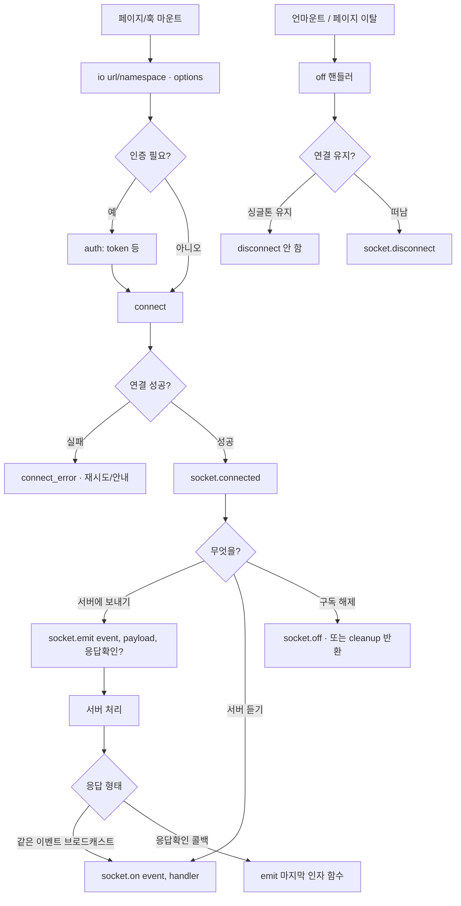

---
aliases:
  - WebSocket
  - socket.io
  - client
tags:
  - NextJS
related:
  - "[[00_JS_Ecosystem_HomePage]]"
  - "[[NestJS_WebSocket]]"
  - "[[React_useMemo_useCallback_useEffect]]"
  - "[[JS_Promise]]"
---
# NextJS_WebSocket — Socket.IO 클라이언트 패턴

> [!info] 
> 서버 Gateway 구현 → [[NestJS_WebSocket]]. 
> 이 노트는 Next.js/React에서 socket.io-client를 쓰는 클라이언트 패턴만 다룬다.

---
# 흐름도



```txt
한 줄:
  io로 연결 → on으로 듣고 emit으로 보냄 → 언마운트 때 off (필요하면 disconnect)
  React에서는 useEffect cleanup에 off/leave를 두는 게 기본
```

---

# 설치

```bash
pnpm add socket.io-client
```

---

# io() — 서버에 연결하기 ⭐️⭐️⭐️⭐️

```typescript
import { io } from 'socket.io-client';

const socket = io('http://localhost:3000');        // 기본 연결
const socket = io('http://localhost:3000/chat');   // 네임스페이스 연결
```

```txt
io(url, options):
  서버에 WebSocket 연결을 시작하고 Socket 인스턴스를 반환
  기본적으로 호출과 동시에 연결 시도 (autoConnect: true)

URL 구조:
  io('http://localhost:3000/chat')
       ↑ 서버 주소 (포트 포함)  ↑ 네임스페이스 (없으면 '/')
  
  네임스페이스는 서버 @WebSocketGateway({ namespace: '/chat' })와 일치해야 함
  같은 서버에 여러 네임스페이스 연결 가능 — 각각 독립적인 연결

반환값:
  Socket 인스턴스 — 이 연결을 대표하는 객체
  서버와 이 소켓으로 이벤트를 주고받음
```

---

# 클라이언트 Socket 객체 ⭐️⭐️⭐️⭐️

```typescript
import { type Socket } from 'socket.io-client';
// 서버의 Socket(socket.io)과 다른 타입 — 클라이언트 전용

const socket = io('http://localhost:3000/chat');

socket.id           // 이 연결의 고유 ID (서버가 부여, 재연결 시 바뀜)
socket.connected    // 현재 연결 상태 boolean
socket.auth         // 연결 시 전달한 auth 객체 (수정 가능)
```

```txt
서버 Socket vs 클라이언트 Socket:
  둘 다 이름이 Socket이지만 전혀 다른 타입
  서버: import { Socket } from 'socket.io'      — 서버에 연결된 클라이언트 하나
  클라이언트: import { Socket } from 'socket.io-client' — 서버와의 연결
```

---

# 이벤트 — on / emit / off ⭐️⭐️⭐️⭐️

## 이벤트 수신 — socket.on()

```typescript
// 서버가 보낸 이벤트 받기
socket.on('message', (data) => {
  console.log(data);
});

// 연결 관련 시스템 이벤트
socket.on('connect', () => {
  console.log('서버에 연결됨, id:', socket.id);
});
socket.on('disconnect', (reason) => {
  console.log('연결 끊김:', reason);
});
socket.on('connect_error', (err) => {
  console.error('연결 에러:', err.message);
  // 토큰 만료나 인증 실패가 여기서 잡힘
});
```

## 이벤트 발신 — socket.emit()

```typescript
// 서버에 이벤트 보내기
socket.emit('join', { roomId: '123' });

// acknowledgement — 서버 응답 받기 (세 번째 인자: 콜백)
socket.emit('join', { roomId: '123' }, (response) => {
  console.log(response);  // 서버가 return한 값
});
```

## 리스너 제거 — socket.off()

```typescript
const handler = (data) => setMessages(p => [...p, data]);

socket.on('message', handler);   // 등록
socket.off('message', handler);  // 제거 — 같은 핸들러 참조 필요

// handler를 변수에 저장하지 않으면 off로 제거 불가
// ❌ 이렇게 하면 제거 못 함
socket.on('message', (data) => setState(data));
socket.off('message', (data) => setState(data));  // 다른 함수 참조
```

```txt
off()에 핸들러를 안 넘기면:
  socket.off('message')  → 'message' 이벤트의 모든 리스너 제거
  socket.off()           → 모든 이벤트의 모든 리스너 제거
```

## 연결 관리

```typescript
socket.connect();      // 연결 (autoConnect: false일 때)
socket.disconnect();   // 연결 해제

// 연결 상태 확인
if (socket.connected) { ... }
if (!socket.connected) socket.connect();
```

---

# io() 옵션 ⭐️⭐️⭐️

```typescript
const socket = io('http://localhost:3000/chat', {
  // 연결 옵션
  autoConnect:     false,         // 기본 true — false면 connect()를 직접 호출
  reconnection:    true,          // 기본 true — 끊기면 자동 재연결
  reconnectionDelay: 1000,        // 재연결 시도 간격 (ms)

  // 인증
  auth:            { token: '...' },  // handshake.auth 로 서버에 전달

  // CORS
  withCredentials: true,          // 쿠키 포함 요청
});
```

---

# 싱글턴 소켓 유틸 ⭐️⭐️⭐️⭐️

```txt
컴포넌트 안에서 io()를 직접 호출하면:
  렌더링마다 새 소켓이 만들어져 연결이 중복됨
  서버 쪽에 대량의 연결/해제 발생

해결 — 모듈 스코프 싱글턴:
  파일 레벨 변수로 소켓 하나만 유지
  getRoomSocket()으로 있으면 재사용, 없으면 생성
  io()는 앱 전체에서 딱 한 번만 호출됨
```

```typescript
// lib/roomSocket.ts
import { io, type Socket } from 'socket.io-client';
import { getApiAccessToken } from './authToken';
import { getApiBaseUrl } from './fetchApi';
import type { ApiRoomMessage } from './rooms';

// 모듈 스코프 — 앱 전체에서 하나의 인스턴스 공유
let socket: Socket | null = null;

export function getRoomSocket(): Socket {
  if (socket?.connected) return socket;   // 이미 연결 중이면 바로 반환

  const token = getApiAccessToken();
  if (!token) throw new Error('로그인이 필요합니다.');

  if (!socket) {
    socket = io(`${getApiBaseUrl()}/chat`, {
      autoConnect:     false,   // 생성과 동시에 연결 안 함
      auth:            { token },
      withCredentials: true,
    });
  } else {
    socket.auth = { token };    // 기존 소켓 — 토큰만 갱신
  }

  if (!socket.connected) socket.connect();
  return socket;
}

export function disconnectRoomSocket() {
  socket?.disconnect();
  socket = null;                // 로그아웃 시 인스턴스도 초기화
}
```

## io() URL 구조

```typescript
io(`${getApiBaseUrl()}/chat`)
//   ↑ 서버 주소          ↑ 네임스페이스
// 예: io('http://localhost:3000/chat')
```

```txt
getApiBaseUrl():
  process.env.NEXT_PUBLIC_API_URL 같은 환경변수의 래퍼 함수
  NEXT_PUBLIC_ 접두사 없으면 브라우저에서 undefined

// lib/fetchApi.ts
export function getApiBaseUrl(): string {
  return process.env.NEXT_PUBLIC_API_URL ?? 'http://localhost:3000';
}

/chat:
  서버 @WebSocketGateway({ namespace: '/chat' }) 와 정확히 일치해야 함

autoConnect: false:
  io() 호출과 동시에 연결하지 않음
  토큰 확인 후 socket.connect()를 직접 호출

socket.auth = { token }:
  끊긴 소켓에 새 토큰을 세팅 후 재연결
  토큰 만료 → 갱신 → 재연결 흐름에서 사용

withCredentials: true:
  쿠키 포함 요청 — 서버 CORS credentials: true 와 세트
```

---

# emit — Promise 래핑 (acknowledgement) ⭐️⭐️⭐️⭐️

```typescript
export function socketJoinRoom(roomId: string): Promise<{ ok: boolean }> {
  const s = getRoomSocket();
  return new Promise((resolve) => {
    s.emit('join', { roomId }, (res: { ok: boolean }) => resolve(res));
  });
}

export function socketLeaveRoom(roomId: string): Promise<{ ok: boolean }> {
  const s = getRoomSocket();
  return new Promise((resolve) => {
    s.emit('leave', { roomId }, (res: { ok: boolean }) => resolve(res));
  });
}
```

```txt
s.emit('join', data, callback):
  세 번째 인자 = acknowledgement 콜백
  서버 @SubscribeMessage 핸들러가 return { ok: true } 하면 이 콜백이 호출됨

Promise로 감싸는 이유:
  콜백 방식 → async/await로 변환

  // 콜백
  s.emit('join', { roomId }, (res) => { if (res.ok) ... });

  // Promise
  const res = await socketJoinRoom(roomId);
  if (res.ok) ...
```

---

# on/off — 클린업 함수 반환 패턴 ⭐️⭐️⭐️⭐️

```typescript
export function onRoomMessage(
  handler: (message: ApiRoomMessage) => void,
): () => void {
  const s = getRoomSocket();
  s.on('message', handler);
  return () => s.off('message', handler);   // 구독 해제 함수 반환
}

export function onRoomMessageDeleted(
  handler: (payload: { messageId: string }) => void,
): () => void {
  const s = getRoomSocket();
  s.on('message:deleted', handler);
  return () => s.off('message:deleted', handler);
}
```

```txt
() => void 클린업 함수를 반환하는 이유:
  React useEffect의 cleanup 함수와 그대로 연결됨

  useEffect(() => {
    const cleanup = onRoomMessage((msg) => setMessages(p => [...p, msg]));
    return cleanup;   // 언마운트 시 s.off() 자동 호출
  }, []);

리스너를 off 안 하면:
  컴포넌트가 사라진 후에도 이벤트가 계속 들어옴
  → 이미 unmount된 state를 업데이트하려다 에러 또는 메모리 누수
```

---

# 컴포넌트에서 사용 ⭐️⭐️⭐️

```typescript
'use client';
import { useEffect, useState } from 'react';
import {
  socketJoinRoom,
  socketLeaveRoom,
  onRoomMessage,
  onRoomMessageDeleted,
} from '@/lib/roomSocket';

function ChatRoom({ roomId }: { roomId: string }) {
  const [messages, setMessages] = useState<ApiRoomMessage[]>([]);

  useEffect(() => {
    let joined = false;

    // 룸 입장
    void socketJoinRoom(roomId).then((res) => {
      if (res.ok) joined = true;
    });

    // 이벤트 구독 — 클린업 함수 받기
    const offMessage = onRoomMessage((msg) => {
      setMessages((prev) => [...prev, msg]);
    });
    const offDeleted = onRoomMessageDeleted(({ messageId }) => {
      setMessages((prev) => prev.filter((m) => m.id !== messageId));
    });

    return () => {
      offMessage();
      offDeleted();
      if (joined) void socketLeaveRoom(roomId);
    };
  }, [roomId]);
}
```

---

# 로그아웃 시 완전 해제 ⭐️⭐️

```typescript
// AuthProvider 또는 로그아웃 핸들러에서
import { disconnectRoomSocket } from '@/lib/roomSocket';

function handleLogout() {
  disconnectRoomSocket();   // 소켓 연결 해제 + 인스턴스 초기화
  // ... 나머지 로그아웃 처리 (토큰 삭제, 라우팅 등)
}
```

```txt
disconnectRoomSocket()이 socket = null 까지 하는 이유:
  disconnect()만 하면 인스턴스는 남아있음
  다음에 로그인 시 getRoomSocket()이 끊긴 인스턴스를 재사용하려 해서 문제 생길 수 있음
  null로 초기화하면 다음 getRoomSocket() 호출 시 새 인스턴스 생성
```

---

# 한눈에

```txt
싱글턴 패턴:
  모듈 스코프 let socket: Socket | null = null
  getRoomSocket() — 있으면 재사용, 없으면 io()로 생성 후 connect()
  disconnectRoomSocket() — 로그아웃 시 disconnect + null 초기화

io() 옵션:
  autoConnect: false    생성과 동시에 연결 안 함 (토큰 확인 후 직접 connect())
  auth: { token }       handshake.auth.token 으로 전달 → 서버 handleConnection에서 검증
  withCredentials: true 쿠키 포함

socket.auth = { token }:
  끊긴 소켓에 새 토큰 세팅 → 토큰 갱신 후 재연결 시

emit → Promise:
  new Promise(resolve => s.emit('event', data, resolve))
  acknowledgement 콜백을 async/await로 사용 가능

on → 클린업 함수:
  s.on('event', handler)
  return () => s.off('event', handler)
  useEffect return에 그대로 사용

서버 Gateway 구현 → [[NestJS_WebSocket]]
```