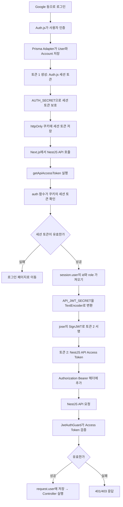
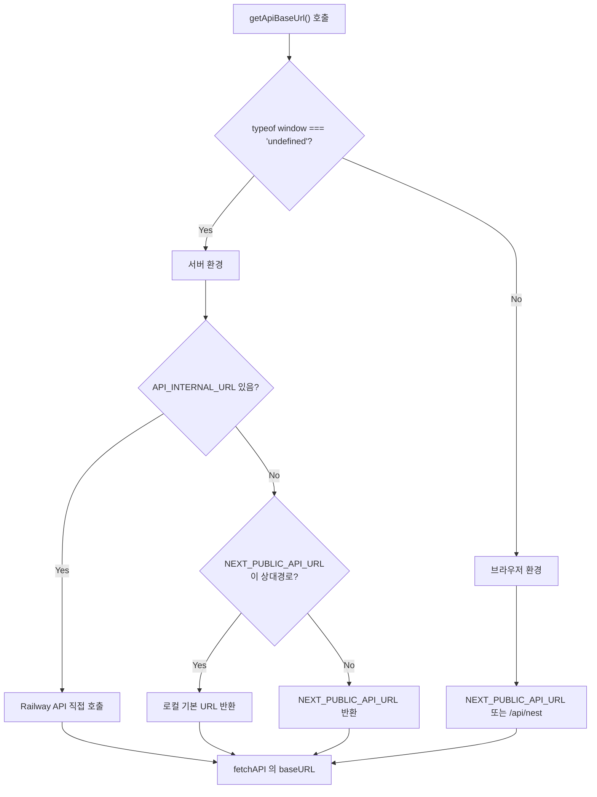
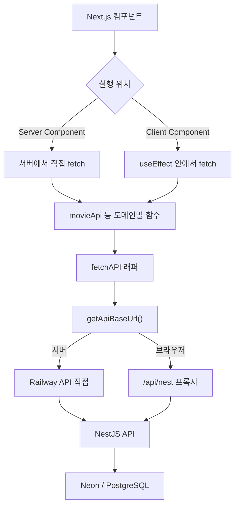

---
aliases:
  - 내 프로젝트
  - 프로젝트 구현
  - project-specific
tags:
  - Project
related:
  - "[[00_JS_Ecosystem_HomePage]]"
  - "[[NextJS_Auth_js]]"
  - "[[NextJS_Server_Actions]]"
  - "[[NextJS_API_Integration]]"
  - "[[Auth_Setup_Checklist]]"
---


# Project_Notes — 이 프로젝트의 실제 구현

# 이 노트의 역할 ⭐️⭐️⭐️

```
다른 노트들(Next_Auth, Next_Server_Actions 등)은 "범용 개념/패턴" 을 다룸
  → 어떤 프로젝트에 가져다 써도 그대로 맞는 내용만 둠 (프로젝트 이름·구체적 디자인 X)

이 노트는 정반대 — "지금 이 프로젝트에서 실제로 어떻게 만들었는지" 만 모아두는 곳
  → 실제 컴포넌트 이름, 실제 스타일(Tailwind 클래스), 실제 폴더 경로, 실제 라우트 등
  → 다른 프로젝트를 시작할 때는 이 노트는 안 보고, 위의 범용 노트들만 보면 됨
  → 지금 이 프로젝트로 돌아와서 "내가 여기서 뭘 어떻게 했었지" 찾아볼 때 이 노트를 봄

원칙: 새 코드를 정리할 때
  "이 패턴, 다른 프로젝트에도 그대로 쓸 수 있나?" → 그렇다면 해당 주제의 범용 노트에
  "이건 이 프로젝트만의 선택(디자인, 문구, 구체적 구조)" → 여기 Project_Notes 에
```

---

---

# 로그인 — 이메일/비밀번호 폼 ⭐️

```
일반 패턴(useActionState/useFormStatus/CredentialsSignin 처리)은
[[Next_Server_Actions]] 와 [[Next_Auth]] 에 범용으로 정리해둠
→ 여기는 "이 프로젝트에서 그 패턴을 실제로 어떻게 조립했는지" 만
```

## 액션 — app/login/actions.ts

```typescript
"use server";

import { signIn } from "@/auth";
import { AuthError } from "next-auth";
import { redirect } from "next/navigation";

function safeRedirectPath(path: string | undefined): string {
  if (path?.startsWith("/") && !path.startsWith("//")) {
    return path;
  }
  return "/";
}

export type LoginEmailFormState = { error?: string };

export async function signInWithGoogle(redirectTo?: string) {
  await signIn("google", { redirectTo: safeRedirectPath(redirectTo) });
}

export async function signInWithEmailAction(
  _preState: LoginEmailFormState,
  formData: FormData,
) {
  const email = String(formData.get("email") ?? "");
  const password = String(formData.get("password") ?? "");
  const redirectTo = String(formData.get("redirectTo") ?? "/");

  const normalizedEmail = email.trim().toLowerCase();
  const normalizedPassword = password.trim();

  if (!normalizedEmail || !normalizedPassword) {
    throw new Error("이메일과 비밀번호를 입력해 주세요.");
  }

  try {
    const result = await signIn("credentials", {
      email: normalizedEmail,
      password: normalizedPassword,
      redirect: false,
    });
    if (result?.error) {
      return { error: "이메일 또는 비밀번호가 올바르지 않습니다." };
    }
  } catch (error) {
    if (error instanceof AuthError) {
      return { error: "이메일 또는 비밀번호가 올바르지 않습니다." };
    }
    throw error;
  }
  redirect(safeRedirectPath(redirectTo));
}
```

## 폼 컴포넌트 — app/login/LoginEmailForm.tsx

```typescript
"use client";

import { useActionState } from "react";
import { useFormStatus } from "react-dom";
import {
  signInWithEmailAction,
  type LoginEmailFormState,
} from "./actions";

const initialState: LoginEmailFormState = {};

function SubmitButton() {
  const { pending } = useFormStatus();
  return (
    <button
      type="submit"
      disabled={pending}
      className="w-full rounded-lg border border-neutral-300 px-4 py-2.5 text-sm font-medium text-neutral-900 hover:bg-neutral-50 disabled:opacity-50"
    >
      {pending ? "로그인 중..." : "로그인"}
    </button>
  );
}

type Props = {
  redirectTo: string;
};

export default function LoginEmailForm({ redirectTo }: Props) {
  const [state, formAction] = useActionState(
    signInWithEmailAction,
    initialState,
  );

  return (
    <form className="space-y-4" action={formAction}>
      <input type="hidden" name="redirectTo" value={redirectTo} />

      {state.error && (
        <p className="rounded-lg bg-red-50 px-3 py-2 text-sm text-red-700">
          {state.error}
        </p>
      )}

      <div>
        <label htmlFor="email" className="block text-sm font-medium text-neutral-700">
          이메일
        </label>
        <input
          id="email"
          name="email"
          type="email"
          autoComplete="email"
          required
          className="mt-1 w-full rounded-lg border border-neutral-300 px-3 py-2 text-sm"
        />
      </div>

      <div>
        <label htmlFor="password" className="block text-sm font-medium text-neutral-700">
          비밀번호
        </label>
        <input
          id="password"
          name="password"
          type="password"
          autoComplete="current-password"
          required
          className="mt-1 w-full rounded-lg border border-neutral-300 px-3 py-2 text-sm"
        />
      </div>

      <SubmitButton />
    </form>
  );
}
```

## 사용 — app/login/page.tsx

```typescript
<LoginEmailForm redirectTo={redirectTo} />
```

```
이 컴포넌트가 왜 이렇게 쪼개져 있는지(SubmitButton 분리, useActionState 자리 등)는
일반 원리이므로 [[Next_Server_Actions]] 참고 — 여기는 "그 결과물" 만 기록
```

---

---

# 회원가입 — 이메일/비밀번호 폼 ⭐️

```
로그인(위)과 짝을 이루는 회원가입 흐름
회원가입은 가입 직후 그 자리에서 곧바로 signIn 까지 이어서 호출하는 점이 로그인과 다름
```

## 액션 — app/register/actions.ts

```typescript
"use server";

import { prisma } from "@/lib/prisma";
import { signIn } from "@/auth";
import bcrypt from "bcryptjs";

function safeRedirectPath(path: string | undefined): string {
  if (path?.startsWith("/") && !path.startsWith("//")) {
    return path;
  }
  return "/";
}

export async function registerWithEmail(
  email: string,
  password: string,
  redirectTo?: string,
) {
  const normalizedEmail = email.trim().toLowerCase();
  const normalizedPassword = password.trim();

  if (!normalizedEmail || !normalizedPassword) {
    throw new Error("이메일과 비밀번호를 입력해 주세요.");
  }
  if (normalizedPassword.length < 8) {
    throw new Error("비밀번호는 8자 이상이어야 합니다.");
  }
  const existing = await prisma.user.findUnique({
    where: { email: normalizedEmail },
  });
  if (existing) {
    throw new Error("이미 사용중인 이메일입니다.");
  }

  const salt = 10;
  const passwordHash = await bcrypt.hash(normalizedPassword, salt);

  await prisma.user.create({
    data: {
      email: normalizedEmail,
      passwordHash,
    },
  });

  await signIn("credentials", {
    email: normalizedEmail,
    password: normalizedPassword,
    redirectTo: safeRedirectPath(redirectTo),
  });
}

export async function registerAction(formData: FormData) {
  const email = String(formData.get("email"));
  const password = String(formData.get("password") ?? "");
  const passwordConfirm = String(formData.get("passwordConfirm") ?? "");
  const redirectTo = String(formData.get("redirectTo") ?? "/");
  if (password.trim() !== passwordConfirm.trim()) {
    throw new Error("비밀번호가 일치하지 않습니다.");
  }
  await registerWithEmail(email, password, redirectTo);
}
```

## 페이지 — app/register/page.tsx

```typescript
type RegisterPageProps = {
  searchParams: Promise<{ callbackUrl?: string }>;
};

export default async function RegisterPage({ searchParams }: RegisterPageProps) {
  const { callbackUrl } = await searchParams;
  const redirectTo =
    callbackUrl?.startsWith("/") && !callbackUrl.startsWith("//")
      ? callbackUrl
      : "/";
  // ... redirectTo 를 hidden input 으로 폼에 같이 넘김 (Next_Server_Actions 의 hidden input 패턴)
}
```

## 로그인과의 차이 — 왜 redirect:false 가 없는가

```
로그인(signInWithEmailAction)은 redirect:false + 직접 redirect() 를 씀
회원가입(registerWithEmail)은 그냥 redirectTo 만 넘기고 끝 — 패턴이 다름

이유:
  로그인은 "비밀번호가 틀릴 가능성" 이 항상 있어서 실패 케이스를 친절하게 보여줘야 함
  회원가입은 비밀번호를 그 자리에서 막 해싱해서 저장한 직후라
    이어지는 signIn("credentials") 호출의 비밀번호가 틀릴 일이 구조적으로 없음
    (이메일 중복 등 진짜 검증 실패는 이미 그 앞의 throw 들에서 다 걸러짐)
  → 그래서 로그인만큼 정교한 에러 분기가 필요 없어서 더 단순한 redirectTo 패턴을 그대로 씀

(redirect() / redirectTo / redirect:false 자체의 범용 비교는 [[Next_Auth]] 참고)
```

---

---

# Auth.js 설정 — 이 프로젝트 실제 구현 ⭐️

```
범용 개념·코드 패턴은 [[Next_Auth]] 참고 — 여기는 "이 프로젝트에서 실제로 어떤 값/경로를 썼는지" 만
```

## 실제 폴더 구조 & import 경로

```
모노레포: apps/api (NestJS) + apps/web (Next.js)
schema.prisma 는 apps/api 에만 존재, apps/web 은 그 generated client 를 상대경로로 직접 import:

  // apps/web/lib/prisma.ts
  import { PrismaClient } from "../../api/src/generated/prisma/client";

  // apps/web/auth.ts
  import type { User } from "../api/src/generated/prisma/client";
```

## 실제 포트 / Redirect URI

```
dev 포트: web 3031 / api 3000
OAuth redirect URI 실제 값: http://localhost:3031/api/auth/callback/{provider}
```

## secret 구성

```env
# apps/web/.env.local
AUTH_SECRET=...           # 토큰 1 (Auth.js 세션)
API_JWT_SECRET=...        # 토큰 2 (API 인증) — apps/api/.env 와 정확히 같은 값
DATABASE_URL=...

# apps/api/.env
API_JWT_SECRET=...        # web 과 동일
```

## getApiAccessToken — 실제 구현

```typescript
// apps/web/lib/getApiAccessToken.ts
import { auth } from "@/auth";
import { SignJWT } from "jose";
import "server-only";

export async function getApiAccessToken(): Promise<string | null> {
  const session = await auth();
  if (!session?.user?.id) return null;

  const secretValue = process.env.API_JWT_SECRET;
  if (!secretValue) {
    throw new Error("API_JWT_SECRET 환경변수가 설정되지 않았습니다.");
  }

  const secret = new TextEncoder().encode(secretValue);
  return new SignJWT({ role: session.user.role })
    .setProtectedHeader({ alg: "HS256" })
    .setSubject(session.user.id)
    .setExpirationTime("7d")
    .sign(secret);
}
```

## 전체 상세 흐름 (참고용)



## 트러블슈팅 — 로그인 페이지 Prisma 번들 오류 (실제 발생 사례)

```
apps/api 의 generator output: apps/api/src/generated/prisma/ (node_modules 밖, 커스텀 경로)
생성 코드가 "./internal/prismaNamespace.js" 처럼 .js 로 import 하는데 실제 파일은 .ts
→ Turbopack 이 모노레포 커스텀 경로에서 .js → .ts 매칭을 못 해서 resolve 실패
```

```typescript
// next.config.ts 에 추가한 설정
const nextConfig: NextConfig = {
  serverExternalPackages: ["@prisma/client", "@prisma/adapter-pg", "pg"],
  webpack: (config) => {
    config.resolve.extensionAlias = { ".js": [".ts", ".tsx", ".js", ".jsx"] };
    return config;
  },
};
```

```json
// package.json — Turbopack 은 위 webpack() 설정 자체를 안 읽어서 강제로 webpack 사용
{ "scripts": { "dev": "next dev --port 3031 --webpack" } }
```

```
교훈: extensionAlias 는 next.config.ts 의 webpack() 함수 안에서만 적용됨
     Next.js 15+ 기본 Turbopack 은 그 함수를 안 읽으므로 --webpack 플래그로 강제 전환 필요
     (Prisma 의 커스텀 generator output 과 Turbopack 호환성이 아직 완전하지 않아서 생기는 문제)
```

---

---

# API 연동 — 이 프로젝트 실제 구현 ⭐️

```
범용 패턴은 [[Next_API_Integration]] 참고 — 여기는 실제 주소·도메인·코드만
```

## 폴더 구조

```
web/lib/
  api.ts          fetchAPI 래퍼 + 도메인별 API 함수
  api-base.ts     getApiBaseUrl (서버/브라우저 주소 분기)
  format.ts       표시용 변환 함수 (날짜 / 상태 / 장소)
  types/          movie.ts / user.ts / common.ts
```

## getApiBaseUrl — 실제 분기 이유와 구현

```
배포 환경에서 모바일 Safari 가 cross-origin 쿠키를 막는 문제 때문에
브라우저는 반드시 같은 도메인(/api/nest 상대경로) 으로만 요청해야 함
서버(Server Component) 는 Railway 로 직접 가는 게 더 빠르고 단순함
→ [[NestJS_Deploy#5. 모바일 Safari — same-site 프록시 패턴]] 참고
```

```typescript
// web/lib/api-base.ts
const resolveServerBaseUrl = () => {
  const internal = process.env.API_INTERNAL_URL;
  if (internal) return internal;       // 서버에서는 Railway 로 직접

  const publicUrl = process.env.NEXT_PUBLIC_API_URL ?? 'http://localhost:3000';
  if (publicUrl.startsWith('/')) {
    return 'http://localhost:3000';
  }
  return publicUrl;
};

export const getApiBaseUrl = () => {
  if (typeof window === 'undefined') {
    return resolveServerBaseUrl();
  }
  return process.env.NEXT_PUBLIC_API_URL ?? '/api/nest';
};
```



## 전체 데이터 흐름



## 매퍼 실전 예 — Recommendation

```typescript
import { ApiRecommendation } from './apiTypes';
import { Recommendation } from './types';

const PLACEHOLDER_AUTHOR = { id: 'anonymous', nickname: '익명' } as const;

export function mapRecommendation(apiItem: ApiRecommendation): Recommendation {
  const { id, title, artist, embedUrl, reason, moods, createdAt, reactions } = apiItem;
  return {
    id, title, artist, embedUrl, reason, moods,
    likeCount: reactions.filter((r) => r.type === 'like').length,
    author: PLACEHOLDER_AUTHOR,
    createdAt,
  };
}

export function mapRecommendations(apiItems: ApiRecommendation[]): Recommendation[] {
  return apiItems.map(mapRecommendation);
}
```

```
좋아요: API 는 reactions[] 통째로 줌 → likeCount: number 로 축약 (매퍼 패턴 ②)
작성자: API 가 아직 안 줌(v0) → PLACEHOLDER_AUTHOR 로 임시 채움 (매퍼 패턴 ③)
```

## FeedCard 컴포넌트 props 예

```typescript
export type FeedCardProps = { title: string; moods: string[] };

export const mockRecommendations: FeedCardProps[] = [
  { title: '비 오는 날 듣기 좋은 곡', moods: ['차분함', '재즈'] },
  { title: '드라이브용 플레이리스트', moods: ['신남', '인디'] },
];
```

## format.ts — 장소 조합 (전시 데이터)

```typescript
// "예술의전당 / 서울 / 서초구" 형태로 조합
export function getPlace(data: { venueName: string | null; area: string | null; address: string | null }) {
  return [data.venueName, data.area, data.address].filter(Boolean).join(' / ');
}
```

## 실제 admin 라우트 사용 예

```typescript
const notices = await adminFetchJson<Notice[]>('/admin/notices');
const items = await adminFetchJson<ApiRecommendation[]>('/admin/recommendations', { cache: 'no-store' });
await adminFetchVoid(`/admin/recommendations/${id}`, { method: 'PATCH', body: JSON.stringify({ hidden }) });
await adminFetchVoid('/admin/notices/1', { method: 'DELETE' });
```

---

---

# Base URL 패턴 — music-community 적용 현황 ⭐️

```
단계 구분은 [[Next_API_Integration]] 의 "Base URL 패턴 — 단계별로 진화시키기" 참고
```

## 현재 (0단계, 미적용)

```
지금은 아래 파일들이 각각 process.env.NEXT_PUBLIC_API_URL 을 직접 씀:
  lib/api.ts          서버 (피드 GET)
  lib/adminFetch.ts   서버 (관리자 API)
  app/new/action.ts   server action (글 POST)
  app/HealthCheck.tsx  브라우저 (health check)

로컬 monorepo (web :3031 · api :3030) 에서는 이 구조로 충분함
```

## 초기 코드 — 공통 베이스 URL 함수 없이 직접 작성했던 버전

```typescript
import { ApiRecommendation } from "./apiTypes";
import { mapRecommendation, mapRecommendations } from "./mapRecommendation";
import type { CreateRecommendationBody, Recommendation } from "./types";

const API_URL = process.env.NEXT_PUBLIC_API_URL;

export async function fetchRecommendation(): Promise<Recommendation[]> {
  if (!API_URL) {
    throw new Error("NEXT_PUBLIC_API_URL이 설정되지 않았습니다. 확인해주세요!");
  }
  const res = await fetch(`${API_URL}/recommendations`, {
    next: { revalidate: 0 },
  });
  if (!res.ok) {
    throw new Error(`API 요청실패 GET /recommendations 응답코드: ${res.status}`);
  }
  const data = (await res.json()) as ApiRecommendation[];
  return mapRecommendations(data);
}

export async function createRecommendation(
  body: CreateRecommendationBody,
): Promise<Recommendation> {
  if (!API_URL) {
    throw new Error("NEXT_PUBLIC_API_URL이 설정되지 않았습니다. 확인해주세요!");
  }
  const res = await fetch(`${API_URL}/recommendations`, {
    method: "POST",
    headers: { "Content-Type": "application/json" },
    body: JSON.stringify(body),
  });
  if (!res.ok) {
    throw new Error(`API 요청실패 POST /recommendations 응답코드: ${res.status}`);
  }
  const data = (await res.json()) as ApiRecommendation;
  return mapRecommendation(data);
}
```

## app/new/action.ts — 실제 코드 (0단계 + 인증 토큰) ⭐️

```
위의 createRecommendation 은 lib/api.ts 쪽(비로그인 GET) 버전이고
app/new/action.ts 는 같은 0단계(직접 env)에 "인증 토큰" 까지 같이 쓰는 실제 버전
→ Next_API_Integration 의 "인증이 필요한 호출 — 토큰 내장 래퍼 패턴"(authFetch) 으로
  아직 추상화하지 않고, 이 파일 안에서 토큰 확인 + fetch 를 직접 다 쓰고 있음
```

```typescript
// app/new/action.ts
"use server";
import { ApiRecommendation } from "@/lib/apiTypes";
import { getApiAccessToken } from "@/lib/getApiAccessToken";
import { mapRecommendation } from "@/lib/mapRecommendation";
import type { CreateRecommendationBody, Recommendation } from "@/lib/types";

const API_URL = process.env.NEXT_PUBLIC_API_URL;

export async function createRecommendation(
  body: CreateRecommendationBody,
): Promise<Recommendation> {
  if (!API_URL) {
    throw new Error("NEXT_PUBLIC_API_URL이 설정되지 않았습니다. 확인해주세요!");
  }

  const token = await getApiAccessToken();
  if (!token) {
    throw new Error("로그인 후 이용해주세요.");
  }
  const res = await fetch(`${API_URL}/recommendations`, {
    method: "POST",
    headers: {
      "Content-Type": "application/json",
      Authorization: `Bearer ${token}`,
    },
    body: JSON.stringify(body),
  });

  if (!res.ok) {
    throw new Error(
      `API 요청실패 POST /recommendations 응답코드: ${res.status}`,
    );
  }

  const data = (await res.json()) as ApiRecommendation;
  return mapRecommendation(data);
}
```

```
나중에 authFetch 로 옮기면 줄어드는 부분:
  API_URL 체크, token 체크+Authorization 헤더, res.ok 체크 — 이 3줄이 authFetchJson 안으로 흡수됨
  → 지금은 한 파일에서 다 처리해도 동작에는 문제없음, 비슷한 액션이 여러 개 생기면 추상화 시점
```

---

---

## 2·3단계 — 아직 적용 안 했지만 설계해둔 버전 (참고용)

```typescript
// lib/apiBase.ts — 도입 시 사용할 패턴
const DEFAULT_API_URL = "http://localhost:3030";   // music-community api 포트

export function resolveServerApiBaseUrl(): string {
  const internal = process.env.API_INTERNAL_URL;
  if (internal) return internal.replace(/\/$/, "");
  const publicUrl = process.env.NEXT_PUBLIC_API_URL ?? DEFAULT_API_URL;
  if (publicUrl.startsWith("/")) return DEFAULT_API_URL;
  return publicUrl.replace(/\/$/, "");
}

export function getApiBaseUrl(): string {
  if (typeof window === "undefined") return resolveServerApiBaseUrl();
  const publicUrl = process.env.NEXT_PUBLIC_API_URL;
  if (publicUrl && !publicUrl.startsWith("/")) return publicUrl.replace(/\/$/, "");
  return "/api/proxy";   // 브라우저 → Next 프록시 → Nest
}

export function apiUrl(path: string): string {
  const base = getApiBaseUrl();
  const normalized = path.startsWith("/") ? path : `/${path}`;
  return `${base}${normalized}`;
}
```

## 언제 도입할지 — 이 프로젝트 기준 판단

|상황|권장|
|---|---|
|로컬만|지금처럼 NEXT_PUBLIC_API_URL 만|
|Docker Compose / K8s 로 배포 전환|API_INTERNAL_URL + getApiBaseUrl 도입|
|브라우저에서 API 직접 호출 + CORS 이슈 발생|`/api/proxy` Route Handler 추가, `NEXT_PUBLIC_API_URL=/api/proxy` 로 전환|

## 적용하게 되면 바꿀 파일 (참고)

```
□ lib/apiBase.ts 신규 추가 (getApiBaseUrl, apiUrl)
□ lib/api.ts, lib/adminFetch.ts, app/new/action.ts → apiUrl("/...") 로 교체
□ (선택) app/api/proxy/[...path]/route.ts 추가 — 브라우저 fallback
□ apps/web/.env.example 에 API_INTERNAL_URL 주석 예시 추가
```

```
인증(Bearer) 흐름은 api_auth_flow.md(별도 메모) 와 동일 — 여기서는 URL 만 공통화하는 패턴
```

---

---

# (앞으로 여기에 계속 추가)

```
다음에 또 "이 프로젝트만의 구체적인 구현" 이 나오면 이 노트에 섹션을 추가해서 쌓을 것
예: 실제 폴더 구조, 실제 컴포넌트 트리, 실제 색상/디자인 토큰, 실제 라우트 목록 등
```