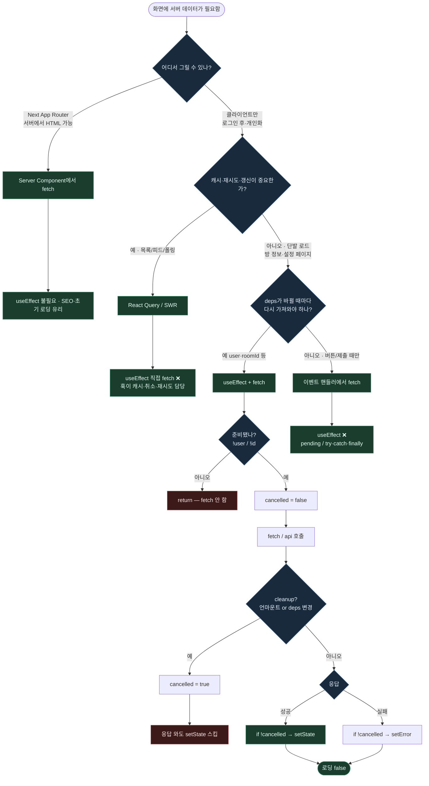

---
aliases:
  - React
  - Async
  - UI
  - 비동기
  - fetch하는 패턴 + cancelled 플래그
  - cancelled 플래그
tags:
  - React
related:
  - "[[00_JS_Ecosystem_HomePage]]"
  - "[[React_useMemo_useCallback_useEffect]]"
  - "[[JS_Promise]]"
  - "[[NestJS_Idempotency]]"
  - "[[TS_Type_Guards]]"
---
# React_AsyncUI — 비동기 UI 안정화 패턴

> [!info]
>  API 호출이 포함된 UI에서 반드시 다뤄야 하는 패턴 모음. 
>  핵심 형태 하나: `setPending(id) → try { await api; setState } catch { showHint } finally { clearPending(id) }`

---
# 흐름도



| 결론 | |
| --- | --- |
| **Server Component** | 공개·초기 데이터 · useEffect fetch 안 씀 |
| **React Query / SWR** | 캐시·재시도 · useEffect에 fetch 직접 안 씀 |
| **useEffect + fetch** | deps 따라 **한 번/다시** 로드 · `cancelled` 필수 |
| **이벤트 핸들러** | 클릭·제출 · effect에 넣지 말 것 |

---
# useEffect 안에서 fetch — 언제, 어떻게 ⭐️⭐️⭐️⭐️


```typescript
useEffect(() => {
  if (!user || !roomId) return;   // ① 조건 가드 — 준비 안 됐으면 실행 안 함

  let cancelled = false;           // ② 취소 플래그
  setLoading(true);
  setError('');

  fetchRoom(roomId)
    .then((data) => {
      if (!cancelled) setRoom(data);        // ③ 취소됐으면 setState 안 함
    })
    .catch((err: unknown) => {
      if (!cancelled) {
        setError(
          err instanceof Error ? err.message : '방을 불러오지 못했어요.',
        );
      }
    })
    .finally(() => {
      if (!cancelled) setLoading(false);
    });

  return () => {
    cancelled = true;              // ④ 언마운트 or deps 바뀌면 취소 표시
  };
}, [user, roomId]);
```

## cancelled 플래그가 필요한 이유 ⭐️⭐️⭐️⭐️

```txt
문제 상황:
  1. 컴포넌트 마운트 → fetchRoom() 시작
  2. 응답 오기 전에 컴포넌트 언마운트 (다른 페이지로 이동)
  3. 응답이 옴 → setRoom(data) 실행
  → "Can't perform a React state update on an unmounted component" 에러

  또는:
  4. roomId = 'A' → fetchRoom('A') 시작
  5. 빠르게 roomId = 'B' 로 바뀜 → fetchRoom('B') 시작
  6. 먼저 시작한 'A' 응답이 나중에 옴
  → 'B' 페이지인데 'A' 데이터가 표시되는 버그 (경쟁 조건)

cancelled = true 로 해결:
  useEffect cleanup 함수(return () => {...})가
  언마운트 시 또는 deps가 바뀌어 effect가 재실행되기 직전에 실행됨
  → cancelled = true 설정
  → 이미 진행 중인 fetch 응답이 와도 if (!cancelled) 에서 setState를 건너뜀
```

## 언제 useEffect fetch를 쓰는가

```txt
✅ useEffect fetch가 적합한 경우:
  deps(user, roomId)가 바뀔 때마다 데이터를 다시 가져와야 할 때
  클라이언트에서만 필요한 데이터 (로그인 후 개인화 데이터)
  Next.js Server Component나 SWR을 못 쓰는 환경

❌ 더 나은 대안이 있는 경우:
  Next.js App Router → Server Component에서 fetch (더 간단, SEO 유리)
  React Query / SWR → 캐싱, 재시도, 백그라운드 갱신이 필요할 때
  → useEffect fetch는 캐싱/재시도를 직접 구현해야 함
```

## Promise 체인 vs async/await

```typescript
// ❌ useEffect에 직접 async 안 됨 — async 함수는 Promise를 반환하는데
//    useEffect의 cleanup은 함수여야 함 (Promise 반환 안 됨)
useEffect(async () => {  // ← 에러는 안 나지만 cleanup이 동작 안 함
  const data = await fetchRoom(roomId);
  setRoom(data);
}, [roomId]);

// ✅ 방법 1 — Promise 체인 (.then.catch.finally)
useEffect(() => {
  let cancelled = false;
  fetchRoom(roomId)
    .then((data) => { if (!cancelled) setRoom(data); })
    .catch((err) => { if (!cancelled) setError(...); })
    .finally(() => { if (!cancelled) setLoading(false); });
  return () => { cancelled = true; };
}, [roomId]);

// ✅ 방법 2 — 내부에 async 함수 선언 후 즉시 호출
useEffect(() => {
  let cancelled = false;
  async function load() {
    try {
      const data = await fetchRoom(roomId);
      if (!cancelled) setRoom(data);
    } catch (err) {
      if (!cancelled) setError(err instanceof Error ? err.message : '오류');
    } finally {
      if (!cancelled) setLoading(false);
    }
  }
  void load();
  return () => { cancelled = true; };
}, [roomId]);
```


```txt
둘 다 결과는 같음 — 팀 스타일에 따라 선택
.then().catch()   → 체인이 간결, async/await보다 중첩이 적음
async 내부 함수   → try/catch 구조가 익숙하면 더 읽기 쉬움

void load():
  async 함수의 반환값(Promise)을 무시 → floating promise 경고 방지
  → [[JS_Promise]] 참고
```

## err instanceof Error 패턴

```typescript
.catch((err: unknown) => {
  setError(err instanceof Error ? err.message : '방을 불러오지 못했어요.');
})
```

```txt
catch의 err 타입:
  TypeScript의 catch 블록에서 err 타입은 unknown (TS 4.0+)
  any로 쓰면 err.message 접근이 타입 체크 없이 통과 → 위험
  unknown으로 받고 instanceof Error로 좁혀야 .message 접근 가능

  err instanceof Error → true  → 에러 메시지 표시
  그 외 (문자열 throw 등) → 기본 메시지 표시
  → [[TS_Type_Guards]] 참고
```
---

# 기본 골격 ⭐️⭐️⭐️⭐️

```typescript
// 단일 액션에 대한 기본 흐름
const handleAction = async () => {
  setPending(true);
  setError('');
  try {
    await api();
    setState(newValue);   // 성공 시만 갱신
  } catch (err) {
    setError(err instanceof Error ? err.message : '요청에 실패했어요.');
    // 실패 시 state는 그대로 유지 — 별도로 되돌릴 필요 없음
  } finally {
    setPending(false);    // 성공/실패 무관하게 항상 해제
  }
};
```

```txt
finally를 쓰는 이유:
  try 안에서 throw가 일어나도, catch 안에서 throw가 일어나도
  finally는 반드시 실행됨 — setPending(false)가 어떤 경우에도 빠지지 않음

  성공 경로: await api() → setState → finally(setPending false)
  실패 경로: await api() 실패 → catch(showError) → finally(setPending false)
```

---
# Pessimistic vs Optimistic ⭐️⭐️⭐️⭐️

## Pessimistic — API 성공 후 setState (권장 기본)

```typescript
const handleDelete = async (id: number) => {
  setDeletingId(id);
  try {
    await deleteComment(id);
    setComments(prev => prev.filter(c => c.id !== id)); // 성공 후 제거
  } catch (err) {
    setError('삭제에 실패했어요.');
    // 실패 시 comments는 그대로 — 목록 유지
  } finally {
    setDeletingId(null);
  }
};
```

```txt
Pessimistic(비관적) 갱신:
  API 결과를 확인한 뒤에만 UI를 바꿈
  실패 시 UI가 자동으로 원래대로 유지 — rollback 코드가 필요 없음
  사용자 입장: "확실히 됐을 때만 화면이 바뀐다"
```

## Optimistic — 먼저 setState 후 실패 시 rollback

```typescript
const handleDelete = async (id: number) => {
  // 먼저 UI에서 제거
  const prev = comments;
  setComments(c => c.filter(c => c.id !== id));

  try {
    await deleteComment(id);
  } catch (err) {
    setComments(prev);  // 실패 시 이전 상태로 되돌림 (rollback)
    setError('삭제에 실패했어요.');
  }
};
```

```txt
Optimistic(낙관적) 갱신:
  API 호출 전에 미리 UI를 바꿈 → 즉각적인 반응성
  실패 시 rollback 코드가 반드시 필요 → 복잡도 증가
  사용자 입장: "탭하는 순간 바뀐다" — SNS 좋아요처럼 즉각 반응이 중요할 때

선택 기준:
  기본적으로 Pessimistic 사용
  좋아요 버튼처럼 "즉각 반응이 UX에 크게 영향"하고 실패율이 낮을 때 Optimistic
  데이터 정합성이 중요한 결제·삭제·수정 → Pessimistic
```

---

# 대상별(id) pending — 전체 pending 대신 ⭐️⭐️⭐️⭐️

```typescript
// ❌ 전체 pending — 댓글 하나 삭제하면 모든 버튼이 비활성화됨
const [isDeleting, setIsDeleting] = useState(false);

// ✅ 대상별 pending — 해당 댓글의 버튼만 비활성화
const [deletingId, setDeletingId] = useState<number | null>(null);
const [editingId,  setEditingId]  = useState<number | null>(null);
```

```tsx
// 사용 — 각 댓글에서 자신의 id와 비교
{comments.map(comment => (
  <div key={comment.id}>
    <button
      disabled={deletingId === comment.id}
      onClick={() => void handleDelete(comment.id)}
    >
      {deletingId === comment.id ? '삭제 중...' : '삭제'}
    </button>
    <button
      disabled={editingId === comment.id}
      onClick={() => void handleEdit(comment.id)}
    >
      {editingId === comment.id ? '저장 중...' : '수정'}
    </button>
  </div>
))}
```

```txt
전체 pending의 문제:
  댓글 10개 목록에서 3번 댓글 삭제 중일 때
  1, 2, 4...10번 댓글의 버튼까지 전부 비활성화됨
  → 사용자가 다른 댓글을 조작할 수 없음

대상별 pending의 장점:
  삭제 중인 댓글의 버튼만 비활성화
  다른 댓글은 독립적으로 조작 가능
  복수 항목 동시 처리도 자연스럽게 지원
```

---

# 버튼 비활성화 + 라벨 변경 ⭐️⭐️⭐️

```tsx
// 패턴 — pending 중 버튼 상태 변경
<button
  disabled={isPending}
  onClick={() => void handleSubmit()}
>
  {isPending ? '저장 중...' : '저장'}
</button>

// id 기반 대상별 버전
<button
  disabled={deletingId === comment.id}
  onClick={() => void handleDelete(comment.id)}
>
  {deletingId === comment.id ? '삭제 중...' : '삭제'}
</button>
```

```txt
두 가지 역할:
  disabled   → 중복 클릭 방지 (같은 요청이 두 번 가는 것 방지)
  라벨 변경  → "지금 처리 중이다"는 피드백 — 네트워크 지연 시 죽은 UI처럼 느끼지 않게

비활성화만 하면:
  버튼이 왜 안 눌리는지 사용자가 모름 → "앱이 죽었나?"

라벨도 바꾸면:
  "아, 처리 중이구나" → 기다림이 자연스러워짐
```

---

# 실패 시 원상 유지 ⭐️⭐️⭐️⭐️

## 편집 실패 — 편집 상태 유지

```typescript
const handleEditSubmit = async (id: number, newText: string) => {
  setEditingId(id);
  try {
    await updateComment(id, newText);
    setComments(prev =>
      prev.map(c => c.id === id ? { ...c, text: newText } : c)
    );
    setEditMode(null); // 성공 시만 편집 모드 종료
  } catch (err) {
    setError('수정에 실패했어요.');
    // editMode는 그대로 — 사용자가 입력한 내용을 잃지 않음
    // 다시 시도하거나 직접 취소할 수 있게
  } finally {
    setEditingId(null);
  }
};
```

```txt
실패 시 흔한 실수:
  catch 블록에서 setEditMode(null)로 편집 창을 닫아버리기
  → 사용자가 열심히 입력한 내용이 사라짐

올바른 처리:
  실패 → 에러 메시지만 보여주고 편집 상태 유지
  사용자가 직접 취소(cancel)하거나 재시도할 수 있게 두기
```

## 삭제 실패 — 목록 유지

```typescript
const handleDelete = async (id: number) => {
  setDeletingId(id);
  try {
    await deleteComment(id);
    setComments(prev => prev.filter(c => c.id !== id)); // 성공 시만 제거
  } catch (err) {
    setError('삭제에 실패했어요.');
    // comments는 건드리지 않음 — 실패했으니 목록 유지
  } finally {
    setDeletingId(null);
  }
};
```

---

# 성공 시 2개 동기화 ⭐️⭐️⭐️

```typescript
// comments 배열과 파생값(카운트)을 함께 갱신해야 할 때
const handleAddComment = async (text: string) => {
  try {
    const newComment = await addComment(postId, text);

    // ① 댓글 배열에 추가
    setComments(prev => [...prev, newComment]);

    // ② 파생값(카운트) 동기화
    // 방법 A: comments.length 기준으로 재계산 (정확하지만 렌더 한 번 더)
    // setCommentCount(comments.length + 1);  // stale closure 위험

    // 방법 B: +1/-1 로 직접 조정 (즉각적)
    setDisplayedCommentCount(prev => prev + 1);

    // 방법 C: 서버에서 최신 카운트 다시 받아오기 (가장 정확)
    // const { count } = await fetchCommentCount(postId);
    // setDisplayedCommentCount(count);
  } catch (err) {
    setError('댓글 등록에 실패했어요.');
  }
};
```

```txt
방법별 트레이드오프:
  +1/-1 직접 조정   → 빠르고 단순하지만, 중간에 다른 사용자가 댓글을 달면 틀릴 수 있음
  서버에서 재조회   → 항상 정확하지만 요청 하나 더 발생
  comments.length  → stale closure 위의 이전 값을 참조할 수 있어서
                     setState(prev => prev + 1) 형태(함수형 업데이트)를 써야 안전

comments.length를 직접 쓸 때 stale closure 위험:
  setCommentCount(comments.length + 1)  // ← comments가 렌더 당시 값
  setCommentCount(prev => prev + 1)     // ← 항상 최신 값 보장
```

---

# 편집/삭제 충돌 처리 ⭐️⭐️⭐️

```typescript
// 삭제 성공 후 — 그 댓글이 편집 중이었다면 편집 모드 닫기
const handleDelete = async (id: number) => {
  setDeletingId(id);
  try {
    await deleteComment(id);
    setComments(prev => prev.filter(c => c.id !== id));

    // 삭제된 댓글이 편집 중이었으면 편집 창 닫기
    if (editingCommentId === id) {
      setEditingCommentId(null);
    }
  } catch (err) {
    setError('삭제에 실패했어요.');
  } finally {
    setDeletingId(null);
  }
};
```

```txt
충돌 시나리오:
  댓글 A를 편집하는 중(editingCommentId = A.id)에
  같은 댓글 A를 삭제 성공 →
  목록에서는 사라졌지만 편집 창은 여전히 열려있는 상태

  → 삭제 성공 후 "이 댓글이 편집 중이었나?" 확인하고 편집 모드 닫기
```

---

# runAction 래퍼로 공통화 ⭐️⭐️⭐️

```typescript
// 여러 버튼에서 같은 try/catch/finally 구조가 반복될 때
// → runAction으로 공통 부분 추출 (상세 → [[JS_Promise]])
const runAction = async (fn: () => Promise<unknown>) => {
  setActing(true);
  setError('');
  try {
    await fn();
    await reload(); // 성공 후 공통 후처리
  } catch (err) {
    setError(err instanceof Error ? err.message : '요청에 실패했어요.');
  } finally {
    setActing(false);
  }
};

// 사용
<button onClick={() => void runAction(() => deleteComment(id))}>삭제</button>
<button onClick={() => void runAction(() => likeComment(id))}>좋아요</button>
```

```txt
runAction이 적합한 경우:
  공통 후처리(reload)가 모든 액션에 동일할 때
  에러 처리가 전부 같을 때

runAction 대신 각각 별도 핸들러가 적합한 경우:
  삭제 성공 후 "편집 모드도 닫기" 같은 액션별 다른 처리가 필요할 때
  대상별 pending id를 각자 다르게 관리해야 할 때
```

---

# 패턴 선택 기준 정리 ⭐️⭐️⭐️

|상황|선택|
|---|---|
|기본 API 호출|Pessimistic (성공 후 setState)|
|좋아요처럼 즉각 반응이 중요, 실패율 낮음|Optimistic + rollback|
|목록 전체가 아닌 특정 항목 조작|대상별 pending id|
|편집 실패 후|입력 내용 유지 (편집 모드 닫지 않기)|
|삭제 실패 후|목록 유지 (filter 하지 않기)|
|여러 버튼에 같은 try/catch/finally|runAction 래퍼로 추출|
|액션마다 다른 후처리 필요|개별 핸들러|

---

# 한눈에

```txt
기본 골격:
  setPending(id) → try { await api(); setState } catch { showError } finally { clearPending(id) }

Pessimistic vs Optimistic:
  Pessimistic  성공 후 setState — 실패 시 자동 유지, 기본값
  Optimistic   먼저 setState — 즉각 반응, rollback 필요

대상별 pending:
  전체 boolean 대신 id(number | null)로 관리
  해당 항목만 비활성화, 나머지는 독립 조작 가능

실패 시 원칙:
  편집 실패 → 편집 상태 유지 (입력 내용 보존)
  삭제 실패 → 목록 유지 (filter 안 함)
  finally → clearPending 항상 실행

성공 시 동기화:
  배열 + 파생값 모두 갱신
  카운트는 setState(prev => prev + 1) 함수형 업데이트가 안전

충돌 처리:
  삭제 성공 → editingId === id 이면 편집 모드 닫기

runAction 래퍼 → [[JS_Promise]] "async 래퍼 패턴"
cancelled 플래그 → [[React_useMemo_useCallback_useEffect]]
중복 요청 방어 → [[NestJS_Idempotency]]
```