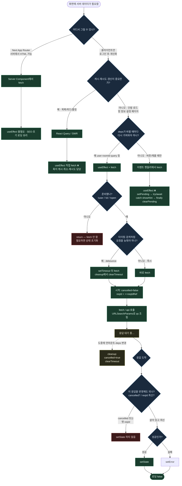

---
aliases:
  - React
  - Async
  - UI
  - 비동기
  - fetch하는 패턴 + cancelled 플래그
  - cancelled 플래그
  - reqIdRef
  - debounce
tags:
  - React
related:
  - "[[00_JS_Ecosystem_HomePage]]"
  - "[[React_useMemo_useCallback_useEffect]]"
  - "[[JS_Promise]]"
  - "[[NestJS_Idempotency]]"
  - "[[TS_Type_Guards]]"
  - "[[JS_URL_Encoding]]"
---
# React_AsyncUI — 비동기 UI 안정화 패턴

> [!info]
>  API 호출이 포함된 UI에서 반드시 다뤄야 하는 패턴 모음. 
>  핵심 형태 하나: `setPending(id) → try { await api; setState } catch { showHint } finally { clearPending(id) }`

---
# 흐름도


```mermaid
flowchart TD
  Start([화면에 서버 데이터가 필요함]) --> Q1{어디서 그릴 수 있나?}

  Q1 -->|Next App Router<br/>서버에서 HTML 가능| SC[Server Component에서 fetch]
  SC --> SCNote[useEffect 불필요 · SEO·초기 로딩 유리]

  Q1 -->|클라이언트만<br/>로그인 후·개인화| Q2{캐시·재시도·갱신이 중요한가?}

  Q2 -->|예 · 목록/피드/폴링| RQ[React Query / SWR]
  RQ --> RQNote[useEffect 직접 fetch ❌<br/>훅이 캐시·취소·재시도 담당]

  Q2 -->|아니오 · 단발 로드<br/>방 정보·설정 페이지| Q3{deps가 바뀔 때마다<br/>다시 가져와야 하나?}

  Q3 -->|예 user·roomId·query 등| Eff[useEffect + fetch]
  Eff --> Guard{준비됐나?<br/>!user / !id / !open}
  Guard -->|아니오| Skip[return — fetch 안 함<br/>필요하면 상태 초기화]
  Guard -->|예| Q4{타이핑·검색처럼<br/>요청을 늦춰야 하나?}

  Q4 -->|예 · debounce| Deb[setTimeout 뒤 fetch<br/>cleanup에서 clearTimeout]
  Q4 -->|아니오 · 즉시| Imm[바로 fetch]

  Deb --> Race
  Imm --> Race

  Race[시작: cancelled=false<br/>reqId = ++reqIdRef]
  Race --> Call[fetch / api 호출<br/>URLSearchParams로 qs 조립]

  Call --> Wait[응답 대기 중…]
  Wait -.->|도중에 언마운트·deps 변경| Side[cleanup:<br/>cancelled=true<br/>clearTimeout]
  Wait --> Res{응답 도착}

  Res --> Check{이 응답을 반영해도 되나?<br/>cancelled? / reqId 최신?}
  Check -->|cancelled 또는<br/>옛 reqId| Ignore[setState 하지 않음]
  Check -->|살아 있고 최신| Ok{성공인가?}
  Ok -->|성공| Set[setState]
  Ok -->|실패| Err[setError]
  Set --> Done([로딩 false])
  Err --> Done

  Q3 -->|아니오 · 버튼/제출 때만| Evt[이벤트 핸들러에서 fetch]
  Evt --> EvtNote[useEffect ❌<br/>setPending → try/await<br/>catch showHint → finally clearPending]

  classDef good fill:#1a3d2e,stroke:#3d8f6a,color:#e8fff3
  classDef bad fill:#3d1a1a,stroke:#8f3d3d,color:#ffe8e8
  classDef ask fill:#1a2a3d,stroke:#3d6a8f,color:#e8f3ff
  classDef side fill:#2a2a1a,stroke:#8f8f3d,color:#fffde8
  class SC,RQ,Eff,Evt,Set,Done,SCNote,RQNote,EvtNote,Deb,Imm,Race,Call good
  class Skip,Ignore bad
  class Q1,Q2,Q3,Q4,Guard,Res,Check,Ok ask
  class Wait,Side side
```

| 결론                    |                                                |
| --------------------- | ---------------------------------------------- |
| **Server Component**  | 공개·초기 데이터 · useEffect fetch 안 씀                |
| **React Query / SWR** | 캐시·재시도 · useEffect에 fetch 직접 안 씀               |
| **useEffect + fetch** | deps 따라 로드 · `cancelled` + `reqIdRef`          |
| **debounce**          | 타이핑·검색 · `setTimeout` + cleanup `clearTimeout` |
| **URLSearchParams**   | 선택적 쿼리 조립 · 빈 값이면 `?` 안 붙임                     |
| **이벤트 핸들러**           | 클릭·제출 · pending / try·catch·finally            |

---
# reqIdRef — 더 강력한 경쟁 조건 방지 ⭐️⭐️⭐️⭐️

```typescript
const reqIdRef = useRef(0);  // 요청 일련번호 — 컴포넌트 마운트 내내 유지

useEffect(() => {
  const reqId = ++reqIdRef.current;  // 이 effect 실행 시 번호 증가 + 캡처
  let cancelled = false;

  fetch(url)
    .then((data) => {
      if (cancelled || reqId !== reqIdRef.current) return;  // 두 가지 체크
      setData(data);
    })
    .finally(() => {
      if (!cancelled && reqId === reqIdRef.current) setLoading(false);
    });

  return () => { cancelled = true; };
}, [deps]);
```

```txt
cancelled vs reqId 체크가 각각 다른 문제를 막음:

  cancelled = true:
    이 effect의 cleanup이 실행됐을 때 (언마운트 or deps 변경으로 effect 재실행)
    "이 effect 자체가 무효화됐다"

  reqId !== reqIdRef.current:
    더 최신 요청이 이미 시작됐을 때
    "더 새로운 reqId가 있으니 이 응답은 버려라"

  왜 둘 다 필요한가:
    cancelled만 있으면:
      query='a' → effect1 실행 → reqId=1, cancelled=false
      query='ab' → effect1 cleanup(cancelled=true) → effect2 실행 → reqId=2
      effect1 응답 도착 → cancelled=true → 막힘 ✅ (이 경우는 OK)

    reqId만 있으면:
      언마운트 시 cancelled 체크 없어서 null setState 위험

    둘 다 있으면:
      cancelled  → 언마운트 / effect 재실행 시 안전하게 중단
      reqIdRef   → 빠른 연속 요청에서 오래된 응답이 나중에 도착해도 무시
      → 완벽한 경쟁 조건 방지
```

---

# useEffect 디바운스 — 타이핑 중 요청 지연 ⭐️⭐️⭐️⭐️


```typescript
const reqIdRef = useRef(0);

useEffect(() => {
  if (!open) {
    // 시트 닫히면 상태 초기화
    setQuery('');
    setMembers([]);
    setNextCursor(null);
    return;
  }

  const reqId = ++reqIdRef.current;
  let cancelled = false;

  // 250ms 디바운스 — 타이핑 멈춘 뒤에만 실제 요청
  const t = window.setTimeout(() => {
    setLoading(true);
    setMembers([]);

    fetchMembers(roomId, { q: query.trim() || undefined, limit: 30 })
      .then((page) => {
        if (cancelled || reqId !== reqIdRef.current) return;
        setMembers(page.items);
        setNextCursor(page.nextCursor);
      })
      .catch((err) => {
        if (cancelled || reqId !== reqIdRef.current) return;
        setError(err instanceof Error ? err.message : '목록을 불러오지 못했어요.');
      })
      .finally(() => {
        if (!cancelled && reqId === reqIdRef.current) setLoading(false);
      });
  }, 250);

  return () => {
    cancelled = true;
    window.clearTimeout(t);  // 타이머도 취소
  };
}, [open, roomId, query]);
```


```txt
디바운스 흐름:
  query = 'a'   → setTimeout(250ms) 시작
  query = 'ab'  → 이전 setTimeout 취소(clearTimeout) + 새 setTimeout 시작
  query = 'abc' → 이전 취소 + 새 setTimeout 시작
  250ms 동안 타이핑 멈춤 → 실제 요청 한 번만 발생

  clearTimeout(t):
    effect cleanup에서 타이머 취소
    deps가 바뀌면 (query 변경) 이전 타이머를 먼저 취소
    → 타이핑마다 요청이 날아가는 것 방지

window.setTimeout vs setTimeout:
  브라우저 환경에서는 동일
  Node/테스트 환경에서 헷갈림을 막으려고 window.를 명시하는 경우 있음

setMembers([]) 을 setTimeout 안에 두는 이유:
  250ms 내에 취소되면 초기화도 안 함 → 이전 결과가 잠깐 유지됨
  타이핑 중에 목록이 깜빡이지 않음

open 상태로 초기화:
  시트가 닫힐 때 (open = false) 상태를 초기화
  다음에 열면 빈 상태로 시작
```

---

# URLSearchParams로 쿼리스트링 조립 ⭐️⭐️⭐️

```typescript
export function fetchMembers(
  id: string,
  params: { q?: string; cursor?: string; limit?: number } = {},
): Promise<ApiMembersPage> {
  const sp = new URLSearchParams();

  if (params.q?.trim())    sp.set('q',      params.q.trim());
  if (params.cursor)       sp.set('cursor', params.cursor);
  if (params.limit != null) sp.set('limit', params.limit.toString());

  const qs = sp.toString();
  return authFetchApi<ApiMembersPage>(`/rooms/${id}/members${qs ? `?${qs}` : ''}`);
}
```

```txt
URLSearchParams 사용 이유:
  ?q=검색어&cursor=abc 같은 쿼리스트링을 직접 조합하면 인코딩 문제 발생
  URLSearchParams.set() 이 자동으로 encodeURIComponent 처리

falsy 조건으로 선택적 파라미터 처리:
  params.q?.trim()   → undefined 또는 빈 문자열이면 추가 안 함
  params.cursor      → undefined이면 추가 안 함
  params.limit != null → 0도 포함하려면 !== undefined 대신 != null 사용

qs ? `?${qs}` : '':
  파라미터가 하나도 없으면 ? 자체를 붙이지 않음
  → /rooms/123/members (파라미터 없음)
  → /rooms/123/members?q=검색어&limit=30 (파라미터 있음)
  → [[NextJS_API_Client]] / [[JS_URL_Encoding]] 참고
```

----
# useEffect 안에서 fetch — 언제, 어떻게 ⭐️⭐️⭐️⭐️


```typescript
useEffect(() => {
  if (!user || !roomId) return;   // ① 조건 가드 — 준비 안 됐으면 실행 안 함

  let cancelled = false;           // ② 취소 플래그
  setLoading(true);
  setError('');

  fetchRoom(roomId)
    .then((data) => {
      if (!cancelled) setRoom(data);        // ③ 취소됐으면 setState 안 함
    })
    .catch((err: unknown) => {
      if (!cancelled) {
        setError(
          err instanceof Error ? err.message : '방을 불러오지 못했어요.',
        );
      }
    })
    .finally(() => {
      if (!cancelled) setLoading(false);
    });

  return () => {
    cancelled = true;              // ④ 언마운트 or deps 바뀌면 취소 표시
  };
}, [user, roomId]);
```

## cancelled 플래그가 필요한 이유 ⭐️⭐️⭐️⭐️

```txt
문제 상황:
  1. 컴포넌트 마운트 → fetchRoom() 시작
  2. 응답 오기 전에 컴포넌트 언마운트 (다른 페이지로 이동)
  3. 응답이 옴 → setRoom(data) 실행
  → "Can't perform a React state update on an unmounted component" 에러

  또는:
  4. roomId = 'A' → fetchRoom('A') 시작
  5. 빠르게 roomId = 'B' 로 바뀜 → fetchRoom('B') 시작
  6. 먼저 시작한 'A' 응답이 나중에 옴
  → 'B' 페이지인데 'A' 데이터가 표시되는 버그 (경쟁 조건)

cancelled = true 로 해결:
  useEffect cleanup 함수(return () => {...})가
  언마운트 시 또는 deps가 바뀌어 effect가 재실행되기 직전에 실행됨
  → cancelled = true 설정
  → 이미 진행 중인 fetch 응답이 와도 if (!cancelled) 에서 setState를 건너뜀
```

## 언제 useEffect fetch를 쓰는가

```txt
✅ useEffect fetch가 적합한 경우:
  deps(user, roomId)가 바뀔 때마다 데이터를 다시 가져와야 할 때
  클라이언트에서만 필요한 데이터 (로그인 후 개인화 데이터)
  Next.js Server Component나 SWR을 못 쓰는 환경

❌ 더 나은 대안이 있는 경우:
  Next.js App Router → Server Component에서 fetch (더 간단, SEO 유리)
  React Query / SWR → 캐싱, 재시도, 백그라운드 갱신이 필요할 때
  → useEffect fetch는 캐싱/재시도를 직접 구현해야 함
```

## Promise 체인 vs async/await

```typescript
// ❌ useEffect에 직접 async 안 됨 — async 함수는 Promise를 반환하는데
//    useEffect의 cleanup은 함수여야 함 (Promise 반환 안 됨)
useEffect(async () => {  // ← 에러는 안 나지만 cleanup이 동작 안 함
  const data = await fetchRoom(roomId);
  setRoom(data);
}, [roomId]);

// ✅ 방법 1 — Promise 체인 (.then.catch.finally)
useEffect(() => {
  let cancelled = false;
  fetchRoom(roomId)
    .then((data) => { if (!cancelled) setRoom(data); })
    .catch((err) => { if (!cancelled) setError(...); })
    .finally(() => { if (!cancelled) setLoading(false); });
  return () => { cancelled = true; };
}, [roomId]);

// ✅ 방법 2 — 내부에 async 함수 선언 후 즉시 호출
useEffect(() => {
  let cancelled = false;
  async function load() {
    try {
      const data = await fetchRoom(roomId);
      if (!cancelled) setRoom(data);
    } catch (err) {
      if (!cancelled) setError(err instanceof Error ? err.message : '오류');
    } finally {
      if (!cancelled) setLoading(false);
    }
  }
  void load();
  return () => { cancelled = true; };
}, [roomId]);
```


```txt
둘 다 결과는 같음 — 팀 스타일에 따라 선택
.then().catch()   → 체인이 간결, async/await보다 중첩이 적음
async 내부 함수   → try/catch 구조가 익숙하면 더 읽기 쉬움

void load():
  async 함수의 반환값(Promise)을 무시 → floating promise 경고 방지
  → [[JS_Promise]] 참고
```

## err instanceof Error 패턴

```typescript
.catch((err: unknown) => {
  setError(err instanceof Error ? err.message : '방을 불러오지 못했어요.');
})
```

```txt
catch의 err 타입:
  TypeScript의 catch 블록에서 err 타입은 unknown (TS 4.0+)
  any로 쓰면 err.message 접근이 타입 체크 없이 통과 → 위험
  unknown으로 받고 instanceof Error로 좁혀야 .message 접근 가능

  err instanceof Error → true  → 에러 메시지 표시
  그 외 (문자열 throw 등) → 기본 메시지 표시
  → [[TS_Type_Guards]] 참고
```

---
# 서버 응답으로 로컬 상태 동기화 — 리패치 없이 ⭐️⭐️⭐️⭐️

```txt
일반적인 방법:
  API 호출 → 성공 → 전체 데이터 다시 fetch → setState
  단점: 네트워크 왕복이 두 번 발생, 화면이 깜빡힘

더 나은 방법:
  API 호출 → 성공 → 반환값으로 현재 state를 직접 수정
  장점: 추가 fetch 없음, 빠름, 깜빡임 없음
```

## applyLocal 패턴 — 반환값으로 state 직접 패치

```typescript
// API 반환값으로 메시지 목록의 reactions만 수정
function applyReactionLocal(payload: ToggleReactionResult) {
  setMessages((prev) =>
    prev.map((m) => {
      if (m.id !== payload.messageId) return m;  // 관계없는 메시지는 그대로

      // 이 유저의 기존 반응 제거 (이모지 교체 대비)
      const without = (m.reactions ?? []).filter(
        (r) => r.userId !== payload.userId,
      );

      // removed: true → 삭제된 것, 반응 없이 반환
      if (payload.removed) return { ...m, reactions: without };

      // removed: false → 새 반응 추가
      return {
        ...m,
        reactions: [
          ...without,
          {
            emoji:     payload.emoji,
            userId:    payload.userId,
            createdAt: new Date().toISOString(),
          },
        ],
      };
    }),
  );
}

async function onTapback(emoji: string) {
  if (!messageId || !roomId) return;

  try {
    const result = await toggleReaction(roomId, messageId, emoji);
    applyReactionLocal(result);   // 리패치 없이 로컬 반영
  } catch (err) {
    setError(err instanceof Error ? err.message : '반응에 실패했습니다.');
  }
}
```

```txt
흐름:
  1. toggleReaction() 호출 (서버에서 추가 or 삭제)
  2. 서버 응답(payload)에 messageId, userId, emoji, removed 포함
  3. applyReactionLocal(payload)로 로컬 state 직접 수정
  4. 추가 fetch 없음

prev.map 안에서 중첩 배열 수정:
  관계없는 메시지 → return m (참조 유지, 리렌더 없음)
  대상 메시지    → { ...m, reactions: 새배열 } 반환

filter로 기존 반응 먼저 제거하는 이유:
  이모지 교체 케이스 (기존 👍 → 새로 ❤️) 에서
  filter 없이 추가만 하면 같은 유저의 반응이 두 개가 됨
  → 항상 이 유저의 기존 반응을 먼저 지우고 새 반응을 추가

payload.removed 구분자:
  true  → 삭제 케이스 → filter한 배열 그대로
  false → 추가 케이스 → filter + 새 반응 push
  → [[NestJS_Prisma]] 토글 패턴 참고
  → [[TS_Type_Guards]] removed as const 참고
```

## 언제 로컬 동기화 vs 리패치

```txt
로컬 동기화 (applyLocal):
  반환값이 충분히 구체적일 때 (어떤 항목이 어떻게 바뀌었는지)
  단건 추가/삭제/수정
  리얼타임 피드, 채팅처럼 빠른 반응이 중요할 때

리패치:
  반환값만으로 state를 정확히 계산하기 어려울 때
  서버 집계/정렬이 복잡해서 클라이언트 재계산이 부정확할 때
  데이터 정합성이 매우 중요할 때
```

---

# 기본 골격 ⭐️⭐️⭐️⭐️

```typescript
// 단일 액션에 대한 기본 흐름
const handleAction = async () => {
  setPending(true);
  setError('');
  try {
    await api();
    setState(newValue);   // 성공 시만 갱신
  } catch (err) {
    setError(err instanceof Error ? err.message : '요청에 실패했어요.');
    // 실패 시 state는 그대로 유지 — 별도로 되돌릴 필요 없음
  } finally {
    setPending(false);    // 성공/실패 무관하게 항상 해제
  }
};
```

```txt
finally를 쓰는 이유:
  try 안에서 throw가 일어나도, catch 안에서 throw가 일어나도
  finally는 반드시 실행됨 — setPending(false)가 어떤 경우에도 빠지지 않음

  성공 경로: await api() → setState → finally(setPending false)
  실패 경로: await api() 실패 → catch(showError) → finally(setPending false)
```

---
# Pessimistic vs Optimistic ⭐️⭐️⭐️⭐️

## Pessimistic — API 성공 후 setState (권장 기본)

```typescript
const handleDelete = async (id: number) => {
  setDeletingId(id);
  try {
    await deleteComment(id);
    setComments(prev => prev.filter(c => c.id !== id)); // 성공 후 제거
  } catch (err) {
    setError('삭제에 실패했어요.');
    // 실패 시 comments는 그대로 — 목록 유지
  } finally {
    setDeletingId(null);
  }
};
```

```txt
Pessimistic(비관적) 갱신:
  API 결과를 확인한 뒤에만 UI를 바꿈
  실패 시 UI가 자동으로 원래대로 유지 — rollback 코드가 필요 없음
  사용자 입장: "확실히 됐을 때만 화면이 바뀐다"
```

## Optimistic — 먼저 setState 후 실패 시 rollback

```typescript
const handleDelete = async (id: number) => {
  // 먼저 UI에서 제거
  const prev = comments;
  setComments(c => c.filter(c => c.id !== id));

  try {
    await deleteComment(id);
  } catch (err) {
    setComments(prev);  // 실패 시 이전 상태로 되돌림 (rollback)
    setError('삭제에 실패했어요.');
  }
};
```

```txt
Optimistic(낙관적) 갱신:
  API 호출 전에 미리 UI를 바꿈 → 즉각적인 반응성
  실패 시 rollback 코드가 반드시 필요 → 복잡도 증가
  사용자 입장: "탭하는 순간 바뀐다" — SNS 좋아요처럼 즉각 반응이 중요할 때

선택 기준:
  기본적으로 Pessimistic 사용
  좋아요 버튼처럼 "즉각 반응이 UX에 크게 영향"하고 실패율이 낮을 때 Optimistic
  데이터 정합성이 중요한 결제·삭제·수정 → Pessimistic
```

---

# 대상별(id) pending — 전체 pending 대신 ⭐️⭐️⭐️⭐️

```typescript
// ❌ 전체 pending — 댓글 하나 삭제하면 모든 버튼이 비활성화됨
const [isDeleting, setIsDeleting] = useState(false);

// ✅ 대상별 pending — 해당 댓글의 버튼만 비활성화
const [deletingId, setDeletingId] = useState<number | null>(null);
const [editingId,  setEditingId]  = useState<number | null>(null);
```

```tsx
// 사용 — 각 댓글에서 자신의 id와 비교
{comments.map(comment => (
  <div key={comment.id}>
    <button
      disabled={deletingId === comment.id}
      onClick={() => void handleDelete(comment.id)}
    >
      {deletingId === comment.id ? '삭제 중...' : '삭제'}
    </button>
    <button
      disabled={editingId === comment.id}
      onClick={() => void handleEdit(comment.id)}
    >
      {editingId === comment.id ? '저장 중...' : '수정'}
    </button>
  </div>
))}
```

```txt
전체 pending의 문제:
  댓글 10개 목록에서 3번 댓글 삭제 중일 때
  1, 2, 4...10번 댓글의 버튼까지 전부 비활성화됨
  → 사용자가 다른 댓글을 조작할 수 없음

대상별 pending의 장점:
  삭제 중인 댓글의 버튼만 비활성화
  다른 댓글은 독립적으로 조작 가능
  복수 항목 동시 처리도 자연스럽게 지원
```

---

# 버튼 비활성화 + 라벨 변경 ⭐️⭐️⭐️

```tsx
// 패턴 — pending 중 버튼 상태 변경
<button
  disabled={isPending}
  onClick={() => void handleSubmit()}
>
  {isPending ? '저장 중...' : '저장'}
</button>

// id 기반 대상별 버전
<button
  disabled={deletingId === comment.id}
  onClick={() => void handleDelete(comment.id)}
>
  {deletingId === comment.id ? '삭제 중...' : '삭제'}
</button>
```

```txt
두 가지 역할:
  disabled   → 중복 클릭 방지 (같은 요청이 두 번 가는 것 방지)
  라벨 변경  → "지금 처리 중이다"는 피드백 — 네트워크 지연 시 죽은 UI처럼 느끼지 않게

비활성화만 하면:
  버튼이 왜 안 눌리는지 사용자가 모름 → "앱이 죽었나?"

라벨도 바꾸면:
  "아, 처리 중이구나" → 기다림이 자연스러워짐
```

---

# 실패 시 원상 유지 ⭐️⭐️⭐️⭐️

## 편집 실패 — 편집 상태 유지

```typescript
const handleEditSubmit = async (id: number, newText: string) => {
  setEditingId(id);
  try {
    await updateComment(id, newText);
    setComments(prev =>
      prev.map(c => c.id === id ? { ...c, text: newText } : c)
    );
    setEditMode(null); // 성공 시만 편집 모드 종료
  } catch (err) {
    setError('수정에 실패했어요.');
    // editMode는 그대로 — 사용자가 입력한 내용을 잃지 않음
    // 다시 시도하거나 직접 취소할 수 있게
  } finally {
    setEditingId(null);
  }
};
```

```txt
실패 시 흔한 실수:
  catch 블록에서 setEditMode(null)로 편집 창을 닫아버리기
  → 사용자가 열심히 입력한 내용이 사라짐

올바른 처리:
  실패 → 에러 메시지만 보여주고 편집 상태 유지
  사용자가 직접 취소(cancel)하거나 재시도할 수 있게 두기
```

## 삭제 실패 — 목록 유지

```typescript
const handleDelete = async (id: number) => {
  setDeletingId(id);
  try {
    await deleteComment(id);
    setComments(prev => prev.filter(c => c.id !== id)); // 성공 시만 제거
  } catch (err) {
    setError('삭제에 실패했어요.');
    // comments는 건드리지 않음 — 실패했으니 목록 유지
  } finally {
    setDeletingId(null);
  }
};
```

---

# 성공 시 2개 동기화 ⭐️⭐️⭐️

```typescript
// comments 배열과 파생값(카운트)을 함께 갱신해야 할 때
const handleAddComment = async (text: string) => {
  try {
    const newComment = await addComment(postId, text);

    // ① 댓글 배열에 추가
    setComments(prev => [...prev, newComment]);

    // ② 파생값(카운트) 동기화
    // 방법 A: comments.length 기준으로 재계산 (정확하지만 렌더 한 번 더)
    // setCommentCount(comments.length + 1);  // stale closure 위험

    // 방법 B: +1/-1 로 직접 조정 (즉각적)
    setDisplayedCommentCount(prev => prev + 1);

    // 방법 C: 서버에서 최신 카운트 다시 받아오기 (가장 정확)
    // const { count } = await fetchCommentCount(postId);
    // setDisplayedCommentCount(count);
  } catch (err) {
    setError('댓글 등록에 실패했어요.');
  }
};
```

```txt
방법별 트레이드오프:
  +1/-1 직접 조정   → 빠르고 단순하지만, 중간에 다른 사용자가 댓글을 달면 틀릴 수 있음
  서버에서 재조회   → 항상 정확하지만 요청 하나 더 발생
  comments.length  → stale closure 위의 이전 값을 참조할 수 있어서
                     setState(prev => prev + 1) 형태(함수형 업데이트)를 써야 안전

comments.length를 직접 쓸 때 stale closure 위험:
  setCommentCount(comments.length + 1)  // ← comments가 렌더 당시 값
  setCommentCount(prev => prev + 1)     // ← 항상 최신 값 보장
```

---

# 편집/삭제 충돌 처리 ⭐️⭐️⭐️

```typescript
// 삭제 성공 후 — 그 댓글이 편집 중이었다면 편집 모드 닫기
const handleDelete = async (id: number) => {
  setDeletingId(id);
  try {
    await deleteComment(id);
    setComments(prev => prev.filter(c => c.id !== id));

    // 삭제된 댓글이 편집 중이었으면 편집 창 닫기
    if (editingCommentId === id) {
      setEditingCommentId(null);
    }
  } catch (err) {
    setError('삭제에 실패했어요.');
  } finally {
    setDeletingId(null);
  }
};
```

```txt
충돌 시나리오:
  댓글 A를 편집하는 중(editingCommentId = A.id)에
  같은 댓글 A를 삭제 성공 →
  목록에서는 사라졌지만 편집 창은 여전히 열려있는 상태

  → 삭제 성공 후 "이 댓글이 편집 중이었나?" 확인하고 편집 모드 닫기
```

---

# runAction 래퍼로 공통화 ⭐️⭐️⭐️

```typescript
// 여러 버튼에서 같은 try/catch/finally 구조가 반복될 때
// → runAction으로 공통 부분 추출 (상세 → [[JS_Promise]])
const runAction = async (fn: () => Promise<unknown>) => {
  setActing(true);
  setError('');
  try {
    await fn();
    await reload(); // 성공 후 공통 후처리
  } catch (err) {
    setError(err instanceof Error ? err.message : '요청에 실패했어요.');
  } finally {
    setActing(false);
  }
};

// 사용
<button onClick={() => void runAction(() => deleteComment(id))}>삭제</button>
<button onClick={() => void runAction(() => likeComment(id))}>좋아요</button>
```

```txt
runAction이 적합한 경우:
  공통 후처리(reload)가 모든 액션에 동일할 때
  에러 처리가 전부 같을 때

runAction 대신 각각 별도 핸들러가 적합한 경우:
  삭제 성공 후 "편집 모드도 닫기" 같은 액션별 다른 처리가 필요할 때
  대상별 pending id를 각자 다르게 관리해야 할 때
```

---

# 패턴 선택 기준 정리 ⭐️⭐️⭐️

|상황|선택|
|---|---|
|기본 API 호출|Pessimistic (성공 후 setState)|
|좋아요처럼 즉각 반응이 중요, 실패율 낮음|Optimistic + rollback|
|목록 전체가 아닌 특정 항목 조작|대상별 pending id|
|편집 실패 후|입력 내용 유지 (편집 모드 닫지 않기)|
|삭제 실패 후|목록 유지 (filter 하지 않기)|
|여러 버튼에 같은 try/catch/finally|runAction 래퍼로 추출|
|액션마다 다른 후처리 필요|개별 핸들러|

---

# 한눈에

```txt
기본 골격:
  setPending(id) → try { await api(); setState } catch { showError } finally { clearPending(id) }

Pessimistic vs Optimistic:
  Pessimistic  성공 후 setState — 실패 시 자동 유지, 기본값
  Optimistic   먼저 setState — 즉각 반응, rollback 필요

대상별 pending:
  전체 boolean 대신 id(number | null)로 관리
  해당 항목만 비활성화, 나머지는 독립 조작 가능

실패 시 원칙:
  편집 실패 → 편집 상태 유지 (입력 내용 보존)
  삭제 실패 → 목록 유지 (filter 안 함)
  finally → clearPending 항상 실행

성공 시 동기화:
  배열 + 파생값 모두 갱신
  카운트는 setState(prev => prev + 1) 함수형 업데이트가 안전

충돌 처리:
  삭제 성공 → editingId === id 이면 편집 모드 닫기

runAction 래퍼 → [[JS_Promise]] "async 래퍼 패턴"
cancelled 플래그 → [[React_useMemo_useCallback_useEffect]]
중복 요청 방어 → [[NestJS_Idempotency]]
```