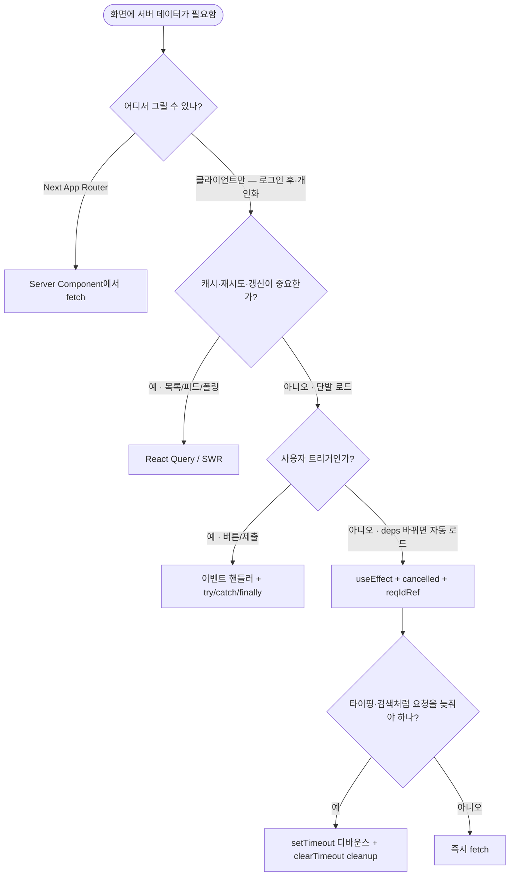

---
aliases:
  - React
  - Async
  - UI
  - 비동기
  - fetch하는 패턴 + cancelled 플래그
  - cancelled 플래그
  - reqIdRef
  - debounce
tags:
  - React
related:
  - "[[00_JS_Ecosystem_HomePage]]"
  - "[[JS_Operators]]"
  - "[[JS_Promise]]"
  - "[[TS_Generics]]"
  - "[[React_useEffect]]"
---
# React_AsyncUI — 비동기 UI 패턴

> [!info] 
> 비동기가 생기는 두 시점: **이벤트 핸들러**(사용자가 직접 트리거 — try/catch/finally 골격)와 
> **useEffect**(deps 따라 자동 로드 — cancelled·reqIdRef·cleanup 골격). 
> 둘은 문제도 해법도 다르다.

---

# 이벤트 핸들러 비동기 — 버튼 · 제출 ⭐️⭐️⭐️⭐️

```txt
사용자가 버튼을 누르거나 폼을 제출할 때 실행
useEffect가 아니라 onClick, onSubmit 등 이벤트 핸들러 안에서 처리

특징:
  언마운트 걱정이 비교적 적음 (사용자가 직접 트리거한 짧은 요청)
  pending 상태로 버튼을 잠가서 중복 요청 방지
  성공/실패에 따라 state를 명확히 분기
```

## 기본 골격

```typescript
const handleAction = async () => {
  setPending(true);
  setError('');
  try {
    await api();
    setState(newValue);   // 성공 시만 갱신
  } catch (err) {
    setError(err instanceof Error ? err.message : '요청에 실패했어요.');
    // 실패 시 state는 그대로 유지 — 별도로 되돌릴 필요 없음
  } finally {
    setPending(false);    // 성공/실패 무관하게 항상 해제
  }
};
```

```txt
finally를 쓰는 이유:
  try 안에서 throw가 일어나도, catch 안에서 throw가 일어나도
  finally는 반드시 실행됨 → setPending(false)가 어떤 경우에도 빠지지 않음

  성공 경로: await api() → setState → finally(setPending false)
  실패 경로: await api() 실패 → catch(showError) → finally(setPending false)
```

## 대상별 pending — 전체 pending 대신 ⭐️⭐️⭐️⭐️

```typescript
// ❌ 전체 pending — 댓글 하나 삭제하면 모든 버튼이 비활성화됨
const [isDeleting, setIsDeleting] = useState(false);

// ✅ 대상별 pending — 해당 항목의 버튼만 비활성화
const [deletingId, setDeletingId] = useState<number | null>(null);
const [editingId,  setEditingId]  = useState<number | null>(null);
```

```tsx
{comments.map(comment => (
  <div key={comment.id}>
    <button
      disabled={deletingId === comment.id}
      onClick={() => void handleDelete(comment.id)}
    >
      {deletingId === comment.id ? '삭제 중...' : '삭제'}
    </button>
  </div>
))}
```

```txt
전체 pending의 문제:
  댓글 10개 중 3번 댓글 삭제 중일 때 나머지 9개 버튼도 전부 비활성화됨

대상별 pending의 장점:
  삭제 중인 항목만 비활성화, 다른 항목은 독립적으로 조작 가능
  복수 항목 동시 처리도 자연스럽게 지원
```

## 버튼 비활성화 + 라벨 변경 ⭐️⭐️⭐️

```tsx
<button
  disabled={isPending}
  onClick={() => void handleSubmit()}
>
  {isPending ? '저장 중...' : '저장'}
</button>
```

```txt
disabled만 하면: 왜 안 눌리는지 사용자가 모름 → "앱이 죽었나?"
라벨도 바꾸면: "아, 처리 중이구나" → 기다림이 자연스러워짐
```

## Pessimistic vs Optimistic ⭐️⭐️⭐️⭐️

```typescript
// Pessimistic(기본) — API 성공 후 setState
const handleDelete = async (id: number) => {
  setDeletingId(id);
  try {
    await deleteComment(id);
    setComments(prev => prev.filter(c => c.id !== id)); // 성공 후 제거
  } catch (err) {
    setError('삭제에 실패했어요.');
    // 실패 시 comments는 그대로 — rollback 코드 불필요
  } finally {
    setDeletingId(null);
  }
};

// Optimistic — 먼저 setState, 실패 시 rollback
const handleDelete = async (id: number) => {
  const prev = comments;
  setComments(c => c.filter(c => c.id !== id)); // 먼저 UI에서 제거
  try {
    await deleteComment(id);
  } catch (err) {
    setComments(prev);  // 실패 시 이전 상태로 복원
    setError('삭제에 실패했어요.');
  }
};
```

```txt
Pessimistic: API 결과 확인 후 UI 변경 — 실패 시 자동 유지, 기본값
Optimistic:  먼저 UI 변경 → 즉각적인 반응성, rollback 코드 필요

선택 기준:
  기본적으로 Pessimistic
  좋아요처럼 "즉각 반응이 UX에 크게 영향"하고 실패율이 낮을 때 Optimistic
  결제·삭제·수정처럼 정합성이 중요한 경우 → Pessimistic
```

## 실패 시 원상 유지 ⭐️⭐️⭐️⭐️

```typescript
// 편집 실패 — 편집 상태 유지 (입력 내용 보존)
const handleEditSubmit = async (id: number, newText: string) => {
  setEditingId(id);
  try {
    await updateComment(id, newText);
    setComments(prev => prev.map(c => c.id === id ? { ...c, text: newText } : c));
    setEditMode(null);  // 성공 시만 편집 모드 종료
  } catch (err) {
    setError('수정에 실패했어요.');
    // editMode는 그대로 — 사용자가 입력한 내용을 잃지 않음
  } finally {
    setEditingId(null);
  }
};
```

```txt
실패 시 흔한 실수: catch 블록에서 편집 창을 닫아버림 → 사용자 입력 내용 사라짐
올바른 처리: 에러 메시지만 보여주고 편집 상태 유지 → 사용자가 재시도하거나 직접 취소
```

## 성공 시 여러 state 동기화 ⭐️⭐️⭐️

```typescript
const handleAddComment = async (text: string) => {
  try {
    const newComment = await addComment(postId, text);

    setComments(prev => [...prev, newComment]);
    setCommentCount(prev => prev + 1);  // 함수형 업데이트 — stale closure 방지
  } catch (err) {
    setError('댓글 등록에 실패했어요.');
  }
};
```

```txt
setCommentCount(comments.length + 1) 대신 setCommentCount(prev => prev + 1):
  comments.length는 렌더 당시 캡처된 값 → stale closure 위험
  prev => prev + 1은 항상 최신 값 기준으로 갱신 → 안전
```

## 편집·삭제 충돌 처리 ⭐️⭐️⭐️

```typescript
const handleDelete = async (id: number) => {
  setDeletingId(id);
  try {
    await deleteComment(id);
    setComments(prev => prev.filter(c => c.id !== id));

    if (editingCommentId === id) setEditingCommentId(null); // 편집 중이던 댓글이면 닫기
  } catch (err) {
    setError('삭제에 실패했어요.');
  } finally {
    setDeletingId(null);
  }
};
```

```txt
충돌 시나리오:
  댓글 A를 편집 중에 같은 댓글 A를 삭제 성공
  → 목록에서는 사라졌지만 편집 창은 여전히 열려있는 상태
  → 삭제 성공 후 editingId === id 확인하고 편집 모드 닫기
```

## runAction 래퍼 ⭐️⭐️⭐️

```typescript
// 여러 버튼에서 같은 try/catch/finally 구조가 반복될 때
const runAction = async (fn: () => Promise<unknown>) => {
  setActing(true);
  setError('');
  try {
    await fn();
    await reload();
  } catch (err) {
    setError(err instanceof Error ? err.message : '요청에 실패했어요.');
  } finally {
    setActing(false);
  }
};

<button onClick={() => void runAction(() => deleteComment(id))}>삭제</button>
<button onClick={() => void runAction(() => likeComment(id))}>좋아요</button>
```

```txt
runAction이 적합한 경우: 공통 후처리(reload)가 모든 액션에 동일, 에러 처리가 전부 같을 때
개별 핸들러가 적합한 경우: 액션마다 다른 후처리, 대상별 pending id 관리가 필요할 때
```

---

# useEffect 비동기 — deps 따라 자동 로드 ⭐️⭐️⭐️⭐️

```txt
deps(user, roomId 등)가 바뀔 때마다 자동으로 실행
사용자가 트리거하지 않아도 실행되므로 언마운트·deps 재변경으로 인한 경쟁 조건 방지 필수

특징:
  cleanup 함수(return () => {...})가 필수
  cancelled 플래그와 reqIdRef로 오래된 응답 무시
  async 함수를 useEffect에 직접 쓸 수 없음 (내부에 선언 후 호출)
```

## cancelled 플래그 ⭐️⭐️⭐️⭐️

```typescript
useEffect(() => {
  if (!user || !roomId) return;   // 조건 가드 — 준비 안 됐으면 실행 안 함

  let cancelled = false;

  fetchRoom(roomId)
    .then((data) => {
      if (!cancelled) setRoom(data);
    })
    .catch((err: unknown) => {
      if (!cancelled) setError(err instanceof Error ? err.message : '불러오지 못했어요.');
    })
    .finally(() => {
      if (!cancelled) setLoading(false);
    });

  return () => { cancelled = true; };  // 언마운트 or deps 변경 시 취소 표시
}, [user, roomId]);
```

```txt
cancelled가 필요한 이유:

  시나리오 1 — 언마운트:
    컴포넌트 마운트 → fetch 시작 → 응답 오기 전에 다른 페이지로 이동(언마운트)
    응답이 도착 → setRoom(data) 실행
    → 언마운트된 컴포넌트에 setState → 메모리 누수 / 콘솔 경고

  시나리오 2 — 경쟁 조건:
    roomId = 'A' → fetch 시작
    바로 roomId = 'B' → 새 fetch 시작
    'A' 응답이 'B'보다 늦게 도착 → 'B' 화면에 'A' 데이터 표시

  return () => { cancelled = true }:
    언마운트 시 또는 deps가 바뀌어 effect가 재실행되기 직전에 실행됨
    → 진행 중인 fetch 응답이 와도 setState를 건너뜀
```

## reqIdRef — 더 강력한 경쟁 조건 방지 ⭐️⭐️⭐️⭐️

```typescript
const reqIdRef = useRef(0);

useEffect(() => {
  const reqId = ++reqIdRef.current;  // 이 effect 실행 시 번호 증가 + 캡처
  let cancelled = false;

  fetch(url)
    .then((data) => {
      if (cancelled || reqId !== reqIdRef.current) return;  // 두 가지 체크
      setData(data);
    })
    .finally(() => {
      if (!cancelled && reqId === reqIdRef.current) setLoading(false);
    });

  return () => { cancelled = true; };
}, [deps]);
```

```txt
cancelled vs reqId 각각 다른 문제를 막음:

  cancelled = true:
    이 effect의 cleanup이 실행됐을 때 (언마운트 or deps 변경)
    "이 effect 자체가 무효화됐다"

  reqId !== reqIdRef.current:
    더 최신 요청이 이미 시작됐을 때
    "더 새로운 reqId가 있으니 이 응답은 버려라"
    → 빠른 연속 입력(타이핑)에서 오래된 응답이 나중에 도착해도 무시

  둘 다 있어야 완벽:
    cancelled  → 언마운트 / effect 재실행 시 안전하게 중단
    reqIdRef   → 빠른 연속 요청에서 오래된 응답 무시
```

## 디바운스 — 타이핑 중 요청 지연 ⭐️⭐️⭐️⭐️

```typescript
const reqIdRef = useRef(0);

useEffect(() => {
  if (!open) {
    setQuery('');
    setItems([]);
    return;
  }

  const reqId = ++reqIdRef.current;
  let cancelled = false;

  const t = window.setTimeout(() => {
    setLoading(true);
    setItems([]);

    fetchItems({ q: query.trim() || undefined, limit: 30 })
      .then((page) => {
        if (cancelled || reqId !== reqIdRef.current) return;
        setItems(page.items);
      })
      .catch((err) => {
        if (cancelled || reqId !== reqIdRef.current) return;
        setError(err instanceof Error ? err.message : '불러오지 못했어요.');
      })
      .finally(() => {
        if (!cancelled && reqId === reqIdRef.current) setLoading(false);
      });
  }, 250);

  return () => {
    cancelled = true;
    window.clearTimeout(t);  // 타이머도 취소
  };
}, [open, query]);
```

```txt
디바운스 흐름:
  query = 'a'   → setTimeout 250ms 시작
  query = 'ab'  → 이전 setTimeout 취소(clearTimeout) + 새 setTimeout 시작
  query = 'abc' → 이전 취소 + 새 setTimeout 시작
  250ms 동안 타이핑 멈춤 → 실제 요청 한 번만 발생

setItems([])를 setTimeout 안에 두는 이유:
  250ms 내에 취소되면 초기화도 안 함 → 타이핑 중에 목록이 깜빡이지 않음
```

## async/await vs Promise chain ⭐️⭐️⭐️

```typescript
// ❌ useEffect에 직접 async 안 됨
// async 함수는 Promise를 반환하는데, useEffect의 cleanup은 함수여야 함
useEffect(async () => {  // cleanup이 동작 안 함
  const data = await fetchRoom(roomId);
  setRoom(data);
}, [roomId]);

// ✅ 방법 1 — Promise chain
useEffect(() => {
  let cancelled = false;
  fetchRoom(roomId)
    .then((data) => { if (!cancelled) setRoom(data); })
    .catch((err) => { if (!cancelled) setError(...); })
    .finally(() => { if (!cancelled) setLoading(false); });
  return () => { cancelled = true; };
}, [roomId]);

// ✅ 방법 2 — 내부에 async 함수 선언 후 즉시 호출
useEffect(() => {
  let cancelled = false;
  async function load() {
    try {
      const data = await fetchRoom(roomId);
      if (!cancelled) setRoom(data);
    } catch (err) {
      if (!cancelled) setError(err instanceof Error ? err.message : '오류');
    } finally {
      if (!cancelled) setLoading(false);
    }
  }
  void load();
  return () => { cancelled = true; };
}, [roomId]);
```

```txt
둘 다 결과는 같음
.then().catch()  → 체인이 간결, 중첩이 적음
async 내부 함수  → try/catch 구조가 익숙하면 더 읽기 쉬움
void load():     → async 함수의 반환 Promise를 무시 → floating promise 경고 방지
```

## URLSearchParams로 쿼리스트링 조립 ⭐️⭐️⭐️

```typescript
export function fetchItems(
  params: { q?: string; cursor?: string; limit?: number } = {},
): Promise<ApiPage> {
  const sp = new URLSearchParams();

  if (params.q?.trim())     sp.set('q',      params.q.trim());
  if (params.cursor)        sp.set('cursor', params.cursor);
  if (params.limit != null) sp.set('limit',  params.limit.toString());

  const qs = sp.toString();
  return apiFetch(`/items${qs ? `?${qs}` : ''}`);
}
```

```txt
URLSearchParams 사용 이유:
  직접 문자열 조합하면 인코딩 문제 발생 → set()이 자동으로 encodeURIComponent 처리

params.limit != null — 0도 포함하려면:
  !== undefined 대신 != null → null과 undefined 둘 다 걸러냄
  0은 유효한 limit이므로 포함

qs ? `?${qs}` : '':
  파라미터가 없으면 ? 자체를 붙이지 않음
```

## 언제 useEffect fetch를 쓰는가

```txt
✅ useEffect fetch가 적합한 경우:
  deps(user, roomId)가 바뀔 때마다 데이터를 다시 가져와야 할 때
  클라이언트에서만 필요한 개인화 데이터

❌ 더 나은 대안이 있는 경우:
  Next.js App Router → Server Component에서 fetch (더 간단, SEO 유리)
  React Query / SWR → 캐싱, 재시도, 백그라운드 갱신이 필요할 때
```

---

# fire-and-forget — void ⭐️⭐️⭐️

```typescript
if (user?.id) {
  void markRoomRead(roomId);  // 결과를 기다리지 않고 그냥 쏨
}
```

```txt
void = "이 Promise의 결과를 의도적으로 무시하겠다"는 명시적 표시
→ [[JS_Operators]] void 섹션 참고
```

## void vs await 판단 기준

```txt
void (fire-and-forget):
  이 작업의 성공/실패가 현재 흐름에 영향을 주지 않을 때
  실패해도 사용자 경험의 핵심 흐름이 막히면 안 될 때
  실패 시 다음에 다시 시도해도 되는 보조 작업일 때
  예: 읽음 처리, 로그 전송, 분석 이벤트

await:
  결과가 다음 로직에 필요할 때 (응답으로 state를 갱신해야 할 때)
  실패 시 사용자에게 알려야 할 때
  예: 댓글 등록 후 목록 갱신, 결제 처리

markRoomRead를 void로 쓰는 이유:
  읽음 처리는 UX 필수 경로가 아님 — 실패해도 채팅은 열려야 함
  await하면 네트워크 느릴 때 채팅 입장/소켓 join이 밀림
  실패해도 다음에 다시 들어오면 또 mark하면 됨
```

---

# 서버 응답으로 로컬 state 동기화 ⭐️⭐️⭐️⭐️

```txt
일반적인 방법: API 호출 → 성공 → 전체 데이터 다시 fetch → setState
  단점: 네트워크 왕복 두 번, 화면 깜빡임

더 나은 방법: API 호출 → 성공 → 반환값으로 현재 state를 직접 수정
  장점: 추가 fetch 없음, 빠름, 깜빡임 없음
```

## applyLocal 패턴

```typescript
function applyReactionLocal(payload: ToggleReactionResult) {
  setMessages((prev) =>
    prev.map((m) => {
      if (m.id !== payload.messageId) return m;  // 관계없는 메시지는 그대로

      const without = (m.reactions ?? []).filter(r => r.userId !== payload.userId);

      if (payload.removed) return { ...m, reactions: without };

      return {
        ...m,
        reactions: [
          ...without,
          { emoji: payload.emoji, userId: payload.userId, createdAt: new Date().toISOString() },
        ],
      };
    }),
  );
}

async function onReact(emoji: string) {
  if (!messageId) return;
  try {
    const result = await toggleReaction(roomId, messageId, emoji);
    applyReactionLocal(result);   // 리패치 없이 로컬 반영
  } catch (err) {
    setError(err instanceof Error ? err.message : '반응에 실패했습니다.');
  }
}
```

```txt
filter로 기존 반응 먼저 제거하는 이유:
  이모지 교체 케이스 (기존 👍 → 새로 ❤️)에서
  filter 없이 추가만 하면 같은 유저의 반응이 두 개가 됨
  → 항상 이 유저의 기존 반응을 먼저 지우고 새 반응을 추가

payload.removed:
  true  → 삭제 케이스 → filter한 배열 그대로
  false → 추가 케이스 → filter + 새 반응 push
  → [[NestJS_Prisma_Patterns]] 토글 패턴 참고
```

## 언제 로컬 동기화 vs 리패치

```txt
로컬 동기화:
  반환값이 "어떤 항목이 어떻게 바뀌었는지" 충분히 구체적일 때
  단건 추가/삭제/수정, 빠른 반응이 중요할 때

리패치:
  반환값만으로 state를 정확히 계산하기 어려울 때
  서버 집계/정렬이 복잡해서 클라이언트 재계산이 부정확할 때
```

---

# 패턴 선택 기준

|상황|선택|
|---|---|
|기본 API 호출|Pessimistic (성공 후 setState)|
|좋아요처럼 즉각 반응이 중요, 실패율 낮음|Optimistic + rollback|
|목록 전체가 아닌 특정 항목 조작|대상별 pending id|
|편집 실패 후|입력 내용 유지 (편집 모드 닫지 않기)|
|삭제 실패 후|목록 유지 (filter 하지 않기)|
|여러 버튼에 같은 try/catch/finally|runAction 래퍼|
|결과가 다음 흐름에 필요 없음 (읽음처리·로그)|fire-and-forget (void)|

---

# 흐름도 — 어떤 패턴을 써야 하는가


```mermaid
flowchart TD
  Start([화면에 서버 데이터가 필요함]) --> Q1{어디서 그릴 수 있나?}

  Q1 -->|Next App Router| SC[Server Component에서 fetch]
  Q1 -->|클라이언트만 — 로그인 후·개인화| Q2{캐시·재시도·갱신이 중요한가?}

  Q2 -->|예 · 목록/피드/폴링| RQ[React Query / SWR]
  Q2 -->|아니오 · 단발 로드| Q3{사용자 트리거인가?}

  Q3 -->|예 · 버튼/제출| EH[이벤트 핸들러 + try/catch/finally]
  Q3 -->|아니오 · deps 바뀌면 자동 로드| UE[useEffect + cancelled + reqIdRef]

  UE --> Q4{타이핑·검색처럼 요청을 늦춰야 하나?}
  Q4 -->|예| Deb[setTimeout 디바운스 + clearTimeout cleanup]
  Q4 -->|아니오| Imm[즉시 fetch]
```