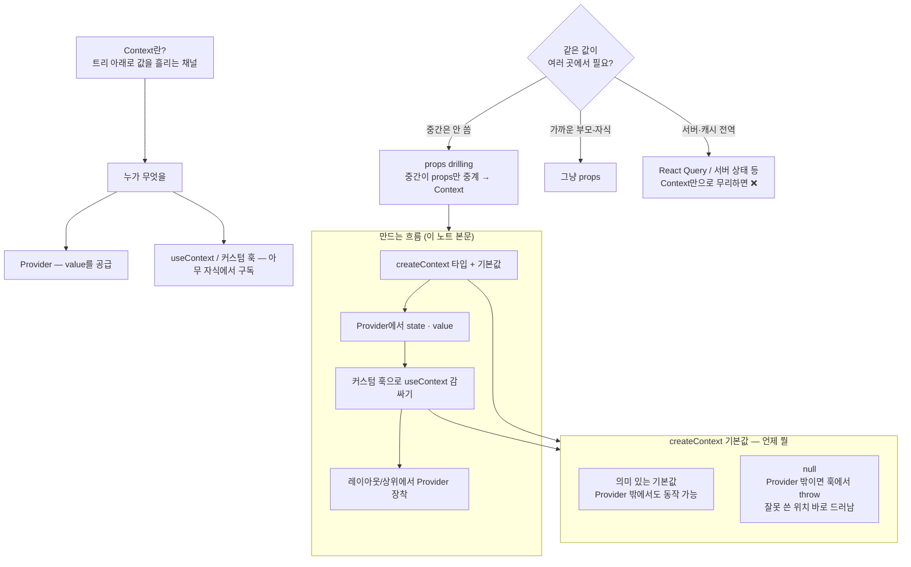

---
aliases:
  - Context
  - createContext
  - Provider
  - useContext
tags:
  - React
  - NextJS
related:
  - "[[00_JS_Ecosystem_HomePage]]"
  - "[[TS_Generics]]"
  - "[[JS_Promise]]"
  - "[[React_useMemo_useCallback_useEffect]]"
  - "[[React_Component]]"
---
# React_Context — Context & Provider 패턴

> [!info] 
> Context = props 없이 컴포넌트 트리 어디서든 값을 꺼낼 수 있는 전역 채널. 
> Provider가 값을 제공하고, useContext로 아무 자식에서나 꺼낸다.

---
# 흐름도



```txt
Context = 무엇
  props 사다리 없이 Provider 아래 어디서든 같은 value를 읽는 통로

언제 Context
  많은 컴포넌트가 같은 데이터 (유저 · 테마 · 언어 …)
  중간 레이어가 값만 통과시키는 drilling이 거슬릴 때

언제 다른 것
  한두 단계면 props
  원격 목록·캐시·동기화가 본체면 서버/상태 라이브러리 쪽

만드는 순서 (아래 섹션과 동일)
  타입 → createContext → Provider → 커스텀 훅 → 트리 감싸기

기본값 vs null
  기본값: 바깥에서도 fallback으로 쓸 수 있음
  null + throw: “반드시 Provider 안”을 강제 (이 노트 커스텀 훅 섹션)
```

---

# 왜 필요한가 ⭐️⭐️⭐️

```txt
Props drilling 문제:
  부모 → 자식 → 손자 → 증손자에게 값을 내려보내려면
  중간 컴포넌트들이 쓰지도 않는 props를 계속 받아서 전달해야 함

Context 해결:
  Provider 아래 트리 전체에서 바로 꺼내서 사용
  중간 컴포넌트들이 props를 중계할 필요 없음

언제 쓰는가:
  로그인한 사용자 정보 (전체 앱에서 필요)
  친구 ID 목록 (여러 피드 카드에서 동시에 필요)
  테마, 언어 설정
  → "많은 컴포넌트가 같은 데이터를 필요로 할 때"
```

---

# 기본 구조 ⭐️⭐️⭐️⭐️

```tsx
import { createContext, useContext, useState } from 'react';

// ① 타입 정의
type ThemeContextValue = {
  theme:       'light' | 'dark';
  toggleTheme: () => void;
};

// ② createContext — 기본값은 Provider 없을 때의 fallback
const ThemeContext = createContext<ThemeContextValue>({
  theme:       'light',
  toggleTheme: () => {},  // 아무것도 안 하는 함수 (no-op)
});

// ③ Provider — 실제 값을 제공하는 컴포넌트
export function ThemeProvider({ children }: { children: React.ReactNode }) {
  const [theme, setTheme] = useState<'light' | 'dark'>('light');

  const toggleTheme = () =>
    setTheme((prev) => (prev === 'light' ? 'dark' : 'light'));

  return (
    <ThemeContext.Provider value={{ theme, toggleTheme }}>
      {children}
    </ThemeContext.Provider>
  );
}

// ④ 커스텀 훅 — useContext를 직접 노출하지 않고 래핑
export function useTheme() {
  return useContext(ThemeContext);
}
```

```tsx
// 사용
function Header() {
  const { theme, toggleTheme } = useTheme();
  return (
    <button onClick={toggleTheme}>
      {theme === 'light' ? '🌙 다크' : '☀️ 라이트'}
    </button>
  );
}
```

```txt
커스텀 훅(useTheme)으로 감싸는 이유:
  useContext(ThemeContext)를 매번 써야 하는 번거로움 제거
  "ThemeContext"라는 내부 구현이 노출되지 않음
  나중에 구현을 바꿔도 사용하는 쪽 코드를 안 바꿔도 됨
```

---

# 커스텀 Context 훅 — null 체크 + throw ⭐️⭐️⭐️⭐️

```typescript
// 이 한 덩어리가 하는 일
export function useAvatarAction(): AvatarActionContextValue {
  const ctx = useContext(AvatarActionContext);
  if (!ctx) throw new Error('useAvatarAction은 AvatarActionProvider 안에서만 사용');
  return ctx;
}
```

```txt
한 줄씩 분해:

  const ctx = useContext(AvatarActionContext);
    AvatarActionContext는 createContext<AvatarActionContextValue | null>(null)
    → ctx의 타입: AvatarActionContextValue | null
    Provider 안이면 실제 value, 바깥이면 null(기본값)

  if (!ctx) throw new Error(...)
    ctx가 null이면 즉시 에러
    → 이 훅을 Provider 없이 쓰면 그 자리에서 바로 "잘못 쓴 것"이 드러남

  return ctx;
    여기까지 왔으면 ctx는 null이 아님
    TS가 if(!ctx) throw 이후 ctx를 AvatarActionContextValue로 자동 좁힘(narrowing)
    → 반환 타입이 null 없이 AvatarActionContextValue로 확정됨
```

## useContext를 직접 쓰지 않고 훅으로 감싸는 이유 ⭐️⭐️⭐️

```tsx
// ❌ 사용하는 쪽에서 직접
const ctx = useContext(AvatarActionContext);
if (!ctx) throw ...  // → 쓰는 곳마다 이 코드가 반복됨

// ✅ 커스텀 훅으로 한 번에
const { openSheet } = useAvatarAction();  // 이것만 쓰면 끝
```

```txt
이유 세 가지:

① 반복 제거
  null 체크 + throw 코드를 쓰는 곳마다 복붙하지 않아도 됨

② 내부 구현 은닉
  AvatarActionContext라는 이름이 사용하는 쪽에 안 노출됨
  Context를 Zustand나 다른 방식으로 바꿔도 사용 쪽 코드를 안 바꿔도 됨

③ 반환 타입 보장
  useAvatarAction(): AvatarActionContextValue
  → 반환 타입을 명시해서 "이 훅은 항상 실제 값을 반환한다"를 선언
  → 사용하는 쪽에서 null 체크 없이 바로 구조분해 가능
```

## 반환 타입을 명시하는 이유 ⭐️⭐️

```typescript
// 반환 타입 없을 때
export function useAvatarAction() {
  const ctx = useContext(AvatarActionContext);
  if (!ctx) throw new Error('...');
  return ctx;
  // TS 추론: AvatarActionContextValue (throw 이후 null 제거됨)
  // → 사실 이 경우엔 TS가 자동 추론하므로 명시 안 해도 됨
}

// 반환 타입 있을 때
export function useAvatarAction(): AvatarActionContextValue {
  // ...
  // 명시적 선언 = "이 함수는 반드시 AvatarActionContextValue를 반환해야 한다"
  // 구현이 바뀌어서 실수로 null이 반환될 수 있는 상황이 되면
  // 함수 안에서 바로 TS 에러 → 사용하는 쪽이 아니라 만드는 쪽에서 잡힘
}
```

```txt
명시적 반환 타입의 선택:
  TS가 추론 가능한 경우라도 "이 함수의 계약"을 코드에 드러내고 싶을 때 명시
  팀 규칙이나 린터가 public 함수의 반환 타입 명시를 요구하는 경우
  → 어느 쪽이든 동작은 같음 — 스타일 차이
```

---

# createContext 기본값 설계 ⭐️⭐️⭐️⭐️

```tsx
// noop — "no-operation"의 줄임말, 아무것도 안 하는 함수
// Provider 없을 때 기본값으로 흔히 쓰는 관용적 패턴
const noop = () => {};

const FriendIdsContext = createContext<FriendIdsContextValue>({
  ids:    new Set(),  // 빈 Set
  reload: noop,       // 호출해도 조용히 무시
});
```

## Provider 없을 때 전략 2가지 ⭐️⭐️⭐️⭐️

```tsx
// 전략 1 — throw (필수 기능)
const AuthContext = createContext<AuthContextValue | null>(null);

export function useAuth() {
  const ctx = useContext(AuthContext);
  if (!ctx) throw new Error('useAuth는 AuthProvider 안에서만 사용 가능합니다');
  return ctx;
}

// 전략 2 — 안전한 기본값 반환 (선택적 기능)
const noop = () => {};

export function useSavedItems() {
  const ctx = useContext(SavedItemsContext);
  if (!ctx) {
    return {
      isSaved:   () => false,  // "아무것도 저장 안 됨"으로 안전하게 취급
      markSaved: noop,          // 저장 시도해도 조용히 무시
    };
  }
  return ctx;
}
```

|전략|언제 쓰는가|예시|
|---|---|---|
|Provider 없으면 **throw**|이 Context 없이는 정상 동작이 불가능 — 누락 자체가 버그|`useAuth()` — 인증 없이 사용자 정보를 쓰는 건 의미 없음|
|Provider 없으면 **안전한 기본값**|이 기능이 없어도 나머지 화면은 정상 동작 — 선택적 기능|`useSavedItems()` — 저장 기능 없어도 피드는 보여지면 됨|

```txt
판단 기준:
  "이 Context 없이 쓰이면, 그게 진짜 버그인가,
   아니면 그 기능만 빠진 정상적인 상황인가"

  버그라면       → throw로 그 자리에서 바로 드러나게
  정상 상황이면  → 안전한 기본값으로 조용히 우회

throw가 항상 "더 안전한" 선택은 아님:
  정말 선택적인 기능까지 throw로 막아두면
  그 Provider 없이 컴포넌트를 재사용하고 싶을 때마다
  매번 가짜 Provider로 감싸야 하는 불편함이 생김
```

---

# async 데이터 + reload 패턴 ⭐️⭐️⭐️⭐️

```txt
로그인 상태에 따라 서버에서 데이터를 가져오고
특정 이벤트(친구 맺기/끊기) 후 갱신이 필요한 Context 패턴
```

```tsx
type FriendIdsContextValue = {
  ids:    ReadonlySet<string>;  // 조회 전용 Set (수정 불가)
  reload: () => void;           // 외부에서 갱신을 트리거하는 함수
};

const FriendIdsContext = createContext<FriendIdsContextValue>({
  ids:    new Set(),
  reload: () => {},
});

export function FriendIdsProvider({ children }: { children: ReactNode }) {
  const { user, isLoading } = useAuth();
  const [ids, setIds] = useState<ReadonlySet<string>>(new Set());

  // ① reload 함수 — useCallback으로 안정화 (useEffect deps에 들어가므로)
  const reload = useCallback(() => {
    if (!user) {
      setIds(new Set());
      return;
    }
    // ② void IIFE async 패턴 — useCallback 안에서 async 로직
    void (async () => {
      try {
        const friends = await fetchFriends();
        setIds(new Set(friends.map((f) => otherUser(f, user.id).id)));
      } catch {
        setIds(new Set());  // 실패 시 빈 Set으로 안전하게
      }
    })();
  }, [user]);  // user가 바뀌면 reload 함수도 새로 생성

  // ③ 초기 로딩 + user 변경 시 자동 갱신
  useEffect(() => {
    if (isLoading) return;  // 인증 로딩 중엔 아직 기다림
    if (!user) {
      setIds(new Set());
      return;
    }
    reload();
  }, [isLoading, user, reload]);

  return (
    <FriendIdsContext.Provider value={{ ids, reload }}>
      {children}
    </FriendIdsContext.Provider>
  );
}

export function useFriendIds() {
  return useContext(FriendIdsContext);
}
```

## 각 부분 설명

```txt
ReadonlySet<string>:
  TypeScript의 읽기 전용 Set 타입
  .add() .delete() .clear() 같은 수정 메서드를 외부에서 못 씀
  "이 Set은 Provider 안에서만 바꾸고, 읽는 쪽은 읽기만 해라"는 의도
  → [[TS_Generics]] 참고

reload: () => void:
  외부 컴포넌트가 "지금 다시 불러와"라고 신호를 보내는 함수
  친구 시트에서 친구 추가/삭제 후 → useFriendIds().reload() 호출
  → Provider 안의 상태가 갱신됨

useCallback([user]):
  reload가 deps 배열에 들어가는 함수라서 참조가 안정적이어야 함
  user가 바뀔 때만 새 함수 생성
  → [[React_useMemo_useCallback_useEffect]] 참고

isLoading 가드:
  useAuth()가 인증 상태를 로딩 중일 때 아직 user가 undefined일 수 있음
  isLoading이 true인 동안엔 early return — 준비되면 자동 실행됨
```

## void IIFE async 패턴 ⭐️⭐️⭐️⭐️

```tsx
// useCallback 안에서 async 로직을 쓰는 방법
const reload = useCallback(() => {  // ← 이 함수 자체는 async가 아님
  void (async () => {               // ← async IIFE를 즉시 실행하고 Promise를 버림
    const data = await fetchData();
    setState(data);
  })();
}, [deps]);
```

```txt
왜 useCallback 자체를 async로 안 하는가:
  useCallback은 함수를 반환 → async 함수는 Promise를 반환
  reload가 Promise를 반환하면 onClick 등에서 floating promise가 됨
  → reload()가 () => void 타입이어야 onClick에서 void 처리 없이 쓸 수 있음

  useCallback(async () => {...})는 가능하지만
  호출하는 쪽마다 void reload() 또는 void runAction(reload)를 써야 함
  → 타입이 () => void인 함수로 유지하면 사용 쪽이 편함

(async () => { ... })():
  async 함수를 즉시 실행하는 IIFE (Immediately Invoked Function Expression)
  실행 결과인 Promise를 void로 버림 → floating promise 처리

더 간단히:
  void fetchAndSet();  // 외부에 fetchAndSet async 함수가 정의된 경우

→ [[JS_Promise]] "async 래퍼 패턴" 참고
```

---

# Provider가 UI를 직접 렌더링하는 패턴 ⭐️⭐️⭐️⭐️

```txt
일반적인 Provider: children만 감싸고 값을 공급

이 패턴: children 외에 Provider 자신이 관리하는 UI(Sheet, Dialog, Toast 등)도
          children 옆에 함께 렌더링

용도:
  "이 기능을 사용하는 곳 어디서든 openSheet()만 호출하면
   Sheet가 알아서 열리는" 구조
  Sheet/Dialog를 직접 렌더링하는 책임을 Provider 하나가 전담
  사용하는 쪽은 상태(open, target)를 몰라도 됨
```

```tsx
export function AvatarActionProvider({ children }: { children: ReactNode }) {
  // ① 다른 Context 훅 사용 (Context 합성)
  const reloadFriendIds = useReloadFriendIds();

  // ② 내부 상태 — 외부에 노출하지 않음
  const [open, setOpen]     = useState(false);
  const [target, setTarget] = useState<AvatarActionTarget | null>(null);

  // ③ 공개 API — 외부는 이것만 알면 됨
  const openSheet = useCallback((next: AvatarActionTarget) => {
    setTarget(next);
    setOpen(true);
  }, []);

  return (
    <AvatarActionContext.Provider value={{ openSheet }}>
      {children}
      {/* ④ Provider가 직접 Sheet를 렌더링 — children 밖에 있지 않고 Provider 안에 있음 */}
      <AvatarActionSheetHost
        open={open}
        target={target}
        onClose={() => setOpen(false)}
        onChanged={() => reloadFriendIds()}  // ⑤ 다른 Context의 reload 트리거
      />
    </AvatarActionContext.Provider>
  );
}

export function useAvatarAction(): AvatarActionContextValue {
  const ctx = useContext(AvatarActionContext);
  if (!ctx) throw new Error('useAvatarAction은 AvatarActionProvider 안에서만 사용');
  return ctx;
}
```

```txt
각 포인트 설명:

① Context 합성 (useReloadFriendIds):
  AvatarActionProvider 안에서 다른 Context 훅을 사용
  → AvatarActionProvider는 FriendIdsProvider 안쪽에 있어야 함
  → Provider 트리 순서가 중요 (바깥에서 안쪽으로 의존 방향)

② 내부 상태 캡슐화:
  open, target은 Provider 내부에서만 관리
  Context value에는 openSheet 함수만 노출
  → "열려있나"를 사용하는 쪽이 알 필요 없음

③ useCallback([]):
  openSheet는 setTarget/setOpen만 쓰고 외부 의존성이 없음
  → deps 배열이 빈 배열 → 한 번만 만들어짐

④ children 옆에 Sheet 렌더링:
  Sheet를 최상단 layout에 두는 대신 Provider 안에 같이 두면
  "이 Provider가 존재하는 트리 안에서만" Sheet가 존재
  여러 개의 Provider를 다른 경로에서 독립적으로 쓸 수 있음

⑤ onChanged → reloadFriendIds():
  Sheet에서 친구 맺기/끊기가 일어나면
  FriendIdsContext의 ids를 즉시 갱신
  → 피드 카드의 친구 칩이 바로 업데이트됨
```

## Provider 트리 순서 ⭐️⭐️⭐️

```tsx
// layout.tsx 또는 providers.tsx
// AvatarActionProvider가 FriendIdsProvider 사용 → 반드시 안쪽에
<AuthProvider>
  <FriendIdsProvider>           {/* 바깥 — useReloadFriendIds를 공급 */}
    <AvatarActionProvider>      {/* 안쪽 — useReloadFriendIds를 소비 */}
      {children}
    </AvatarActionProvider>
  </FriendIdsProvider>
</AuthProvider>
```

```txt
트리 순서 원칙:
  다른 Context를 "소비"하는 Provider는 반드시 그 Context Provider 안쪽에 있어야 함
  잘못된 순서 → useReloadFriendIds()가 null/기본값을 반환
  → /** FriendIdsProvider 안에 두기 */ 주석이 이 의존성을 코드에 명시한 것
```

## 이 패턴이 유용한 경우

```txt
같은 구조로 확장 가능한 사례:
  ToastProvider        — toast.show("메시지") 호출 → Toast UI가 Provider 안에서 렌더링
  ConfirmDialogProvider — confirm("삭제?") 호출 → Dialog가 Provider 안에서 열림
  DrawerProvider       — openDrawer(content) 호출 → Drawer UI가 Provider 안에서 열림

공통 구조:
  외부: openXxx(params) 함수 하나만 공개
  내부: open/target 상태 관리 + UI 직접 렌더링
  → "어디서 열었든 항상 같은 UI" + "상태를 매번 직접 관리 안 해도 됨"
```

---

# Context + Provider 분리 원칙 ⭐️⭐️⭐️

```txt
Context 파일이 하는 일을 명확히 분리:

  createContext     Context 객체 생성 (타입 + 기본값)
  XxxProvider       상태 관리 + 값 제공
  useXxx            useContext 래핑 (사용 편의)

파일 구조 예시:
  contexts/
    friend-ids.tsx   FriendIdsContext + FriendIdsProvider + useFriendIds
    auth.tsx         AuthContext + AuthProvider + useAuth
```

```tsx
// 전체 앱에 Provider 감싸기 (layout.tsx 또는 providers.tsx)
export default function RootLayout({ children }: { children: ReactNode }) {
  return (
    <html>
      <body>
        <AuthProvider>
          <FriendIdsProvider>
            {children}
          </FriendIdsProvider>
        </AuthProvider>
      </body>
    </html>
  );
}
```

```txt
Provider 순서:
  AuthProvider가 바깥 → FriendIdsProvider가 안쪽
  FriendIdsProvider 안에서 useAuth()를 쓰기 때문
  → 의존 관계가 있는 Provider는 안쪽에 넣어야 함
```

---

# 성능 — 불필요한 리렌더 방지 ⭐️⭐️⭐️

```tsx
// Context value가 매 렌더마다 새 객체면 → 모든 Consumer가 리렌더
// ❌ 매 렌더마다 새 객체 생성
<Context.Provider value={{ ids, reload }}>

// ✅ useMemo로 value 안정화
const value = useMemo(() => ({ ids, reload }), [ids, reload]);
<Context.Provider value={value}>
```

```txt
ids가 Set → 참조가 바뀌면(setIds 호출 시) value도 새 객체
reload는 useCallback으로 이미 안정화

이 예시에서는:
  ids가 바뀌면 어차피 Consumer 리렌더가 맞음 (새 친구 목록)
  → useMemo가 없어도 결과적으로 괜찮음

useMemo가 중요해지는 경우:
  value 안의 값은 안 바뀌는데 부모 컴포넌트가 다른 이유로 리렌더될 때
  → Context Consumer들이 불필요하게 리렌더되는 것을 막음
```

---

# 한눈에

| 키워드                                     | 역할                                                                         |
| --------------------------------------- | -------------------------------------------------------------------------- |
| `createContext`                         | 값을 흘려보낼 "채널" 정의                                                            |
| `<Context.Provider value={...}>`        | 그 채널에 실제 값을 공급                                                             |
| `useContext(Context)`                   | 가장 가까운 Provider의 값을 구독                                                     |
| `{ children }: { children: ReactNode }` | 모든 Provider 컴포넌트가 공유하는 매개변수 틀                                              |
| `useMemo`                               | Provider의 value 객체를 매 렌더마다 새로 안 만들고 재사용 — 자손 불필요 리렌더 방지                    |
| `useCallback`                           | value에 들어갈 함수들을 안정된 참조로 유지 — useMemo가 제대로 동작하기 위한 전제조건                     |
| `useEffect`                             | Provider 마운트 시 한 번 실행해야 하는 초기화 로직                                          |
| Context 합성                              | Provider 안에서 다른 Context의 훅을 가져다 쓰는 것 — 트리 순서(바깥/안쪽)가 중요                    |
| Provider 안에 UI 렌더링                      | `{children}` 옆에 Sheet/Dialog/Toast를 같이 렌더링 — 상태 캡슐화 + openXxx만 공개          |
| Provider 밖에서 useContext 호출              | 기본값(보통 `null`)이 나옴 — throw(필수 기능) 또는 안전한 기본값(선택적 기능)으로 방어                  |
| `noop`                                  | 아무 일도 안 하는 함수 (`const noop = () => {}`) — Provider 없을 때의 안전한 기본 동작으로 흔히 씀  |
| `ReadonlySet<string>`                   | 읽기 전용 Set 타입 — 수정 메서드 외부 차단 → [[TS_Generics]]                              |
| void IIFE async                         | useCallback 안에서 async 쓰기 — `void (async () => { ... })()` → [[JS_Promise]] |
| isLoading 가드                            | 인증 로딩 중 early return — 준비되면 자동 실행                                          |