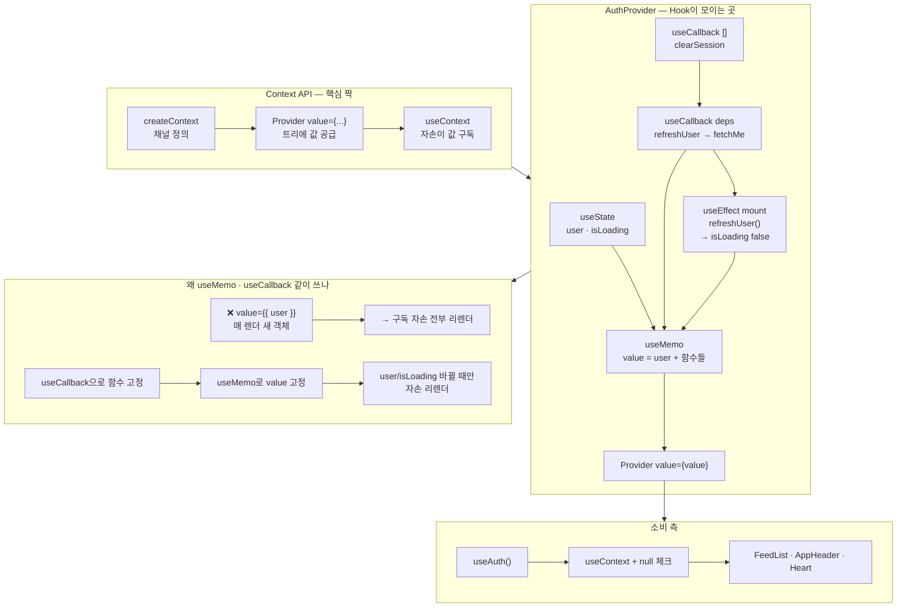

---
aliases:
  - Context
  - createContext
  - Provider
  - useContext
tags:
  - React
  - NextJS
related:
  - "[[00_JS_Ecosystem_HomePage]]"
  - "[[React_useMemo_useCallback_useEffect]]"
  - "[[JS_Operators]]"
  - "[[NextJS_AuthCache]]"
---

# React_Context — 전역 상태를 트리 전체에 공급하기

> [!info] 
> `createContext`로 "채널"을 만들고 `useContext`로 그 채널을 구독하는 게 Context API의 전부다. 
> `useCallback`/`useMemo`/`useEffect`는 Context 전용 훅이 아니라 일반 React 훅인데, Context Provider를 만들 때 생기는 특정 문제(불필요한 리렌더, 마운트 시 초기화)를 풀기 위해 거의 항상 같이 등장한다.

---

# Hook이란 무엇인가 — 간단히 ⭐️

```txt
"use"로 시작하는 함수들 — 함수형 컴포넌트 안에서 React의 내부 기능
(상태 저장, 생명주기, 컨텍스트 구독 등)에 접근하게 해주는 통로

  useState     컴포넌트 하나의 지역 상태
  useEffect    렌더링 이후에 실행되는 부수효과(side effect)
  useContext   Context 채널을 구독
  useCallback  함수를 재사용(메모이제이션)
  useMemo      계산 결과를 재사용(메모이제이션)

⚠️ 규칙: 컴포넌트(또는 다른 Hook) 함수의 최상위에서만 호출 — if/for 안에서 호출 금지
   (호출 순서로 내부 상태를 추적하는 구조라서, 조건에 따라 호출 여부가 바뀌면 추적이 깨짐)
```

# ContextAPI 흐름도 



---

# createContext + useContext — Context API의 진짜 짝 ⭐️⭐️⭐️

```txt
props로 값을 일일이 내려보내지 않고("prop drilling"), 트리 어디서든 바로 꺼내 쓰게 하는 방법
```

```tsx
// 1. 채널 만들기
import { createContext, useContext } from 'react';

const ThemeContext = createContext<'light' | 'dark' | null>(null);

// 2. 트리 상위에서 값을 공급(Provider)
function App() {
  return (
    <ThemeContext.Provider value="dark">
      <Page /> {/* Page 안의 어떤 깊이의 자손도 이 값을 바로 꺼낼 수 있음 */}
    </ThemeContext.Provider>
  );
}

// 3. 트리 하위에서 값을 구독(useContext)
function Page() {
  const theme = useContext(ThemeContext); // 'dark' — props로 안 받아도 바로 접근
  return <div>{theme}</div>;
}
```

|함수|역할|
|---|---|
|`createContext(기본값)`|"채널"을 만듦 — 이 채널에 누가 값을 흘려보낼지(Provider)와는 별개|
|`<XxxContext.Provider value={...}>`|이 컴포넌트 아래 트리 전체에 value를 공급|
|`useContext(XxxContext)`|가장 가까운 상위 Provider가 공급한 value를 구독|

```txt
createContext와 useContext만 있으면 Context API의 핵심은 끝임
이 둘이 진짜 "짝"인 이유: 하나는 채널을 만들고(정의), 하나는 그 채널을 구독함(소비) — 1:1 대응
```

---

# 왜 useMemo / useCallback / useEffect가 Provider에서 같이 보이는가 ⭐️⭐️⭐️

```txt
이 셋은 Context 전용 훅이 아님 — Context와 무관한 코드에서도 항상 등장하는 범용 훅임
다만 "값을 흘려보내는 Provider"를 직접 만들 때 생기는 문제들을 풀기 위해 자연스럽게 같이 쓰이게 됨

각 훅 자체가 무엇을 하는지/언제 쓰는지(Context와 무관한 일반론)는 [[React_useMemo_useCallback_useEffect]] 참고
여기서는 "Context Provider를 만들 때 왜 하필 이 셋이 같이 필요해지는가"에만 집중
```

## useMemo — value 객체가 매 렌더마다 "새 것"이 되는 문제 ⭐️⭐️⭐️

```tsx
// ❌ value를 그냥 객체 리터럴로 넘기면
return <AuthContext.Provider value={{ user, isLoading }}>{children}</AuthContext.Provider>;
```

```txt
Provider가 리렌더될 때마다 { user, isLoading } 는 매번 "새로 만들어진 객체"임
(user/isLoading 값 자체가 안 바뀌어도, { } 리터럴은 항상 새로운 참조)
→ useContext로 이 값을 구독하는 모든 자손 컴포넌트가, 의미 있는 변화가 없어도 전부 리렌더됨

useMemo(() => ({ user, isLoading }), [user, isLoading]) 로 감싸면:
  user/isLoading 이 실제로 바뀔 때만 새 객체를 만들고, 그 외엔 이전 객체를 그대로 재사용
  → Context를 구독하는 자손들의 불필요한 리렌더를 막음
```

## useCallback — 함수도 매 렌더마다 "새 것"이 되는 문제 ⭐️⭐️

```txt
value 안에 함수(예: clearSession, refreshUser)를 넣어야 한다면, 그 함수도 똑같은 문제를 가짐
일반 함수 선언은 렌더마다 새로 만들어지므로, useMemo의 의존성 배열에 넣어도 매번 "바뀐 것"으로 보임

useCallback(() => { ... }, [의존성])으로 그 함수 자체를 감싸두면
의존성이 안 바뀌는 한 같은 함수 참조를 재사용 → useMemo가 제대로 "안 바뀜"을 인식할 수 있게 됨

→ useMemo와 useCallback은 이 패턴에서 거의 항상 같이 다니는 이유가 이것:
  useMemo가 value 객체를 안정시키려면, 그 안에 들어가는 함수들도 먼저 안정되어 있어야 함
```

## useEffect — Provider가 "마운트될 때 한 번" 해야 하는 일 ⭐️⭐️

```txt
Context 자체와는 무관 — "컴포넌트가 화면에 나타난 뒤 한 번 실행해야 하는 부수효과"를 위한 일반 훅
Provider 안에서는 보통 "이 앱이 시작될 때 한 번 인증 상태를 확인" 같은 초기화 로직에 씀
```

---

# AuthProvider 구현 예시 — 한 줄씩 ⭐️⭐️⭐️

```tsx
const [user, setUser] = useState<ApiAuthUser | null>(null);
const [isLoading, setIsLoading] = useState(true);
```

```txt
user/isLoading — 이 Provider가 들고 있는 "진짜" 상태. 나머지(value, clearSession 등)는
다 이 둘을 다루기 위한 도구일 뿐
```

```tsx
const clearSession = useCallback(() => {
  clearAuthStorage();
  setUser(null);
}, []);
```

```txt
의존성 배열이 빈 배열([])인 이유: 이 함수 안에서 바깥의 "바뀌는 값"을 참조하는 게 없음
(clearAuthStorage는 외부 함수고, setUser는 React가 항상 같은 참조를 보장해주는 특수한 함수라서
 의존성에 안 넣어도 안전함) → 한 번 만들어진 뒤로는 계속 같은 함수 참조를 재사용함
```

```tsx
const refreshUser = useCallback(async () => {
  if (!getApiAccessToken()) {
    setUser(null);
    return;
  }
  try {
    const me = await fetchMe();
    setUser(me);
  } catch {
    clearSession();
  }
}, [clearSession]);
```

```txt
의존성 배열에 clearSession이 들어간 이유: 이 함수 안에서 clearSession을 호출하고 있어서
(clearSession이 바뀌면 refreshUser도 새로 만들어져야 항상 최신 clearSession을 참조함)
→ 다행히 clearSession은 위에서 빈 배열로 고정돼있어서, 사실상 refreshUser도 한 번만 만들어짐
```

```tsx
  useEffect(() => {
    let cancelled = false;
    async function init() {
      await refreshUser();
      if (!cancelled) setIsLoading(false);
    }
    init();
    return () => {
      cancelled = true;
    };
  }, [refreshUser]);
```

```txt
Provider가 처음 마운트될 때 init()을 한 번 실행 → refreshUser가 끝나면 isLoading을 false로

return () => { cancelled = true; } 가 정확히 이 useEffect의 클린업 함수임
(컴포넌트가 사라지거나, 의존성[refreshUser]이 바뀌어서 이 effect가 다시 실행되기 직전에 호출됨)

cancelled 플래그가 있는 이유: init()의 await refreshUser()가 끝나기 전에 컴포넌트가
사라지면(예: 페이지 이동), 이미 사라진 컴포넌트의 setIsLoading을 호출하지 않도록 막는 안전장치
→ 이 "cancelled 플래그" 패턴 자체는 Context와 무관한 범용 useEffect 패턴이라
  [[React_useMemo_useCallback_useEffect]]의 useEffect 섹션에 일반화해서 정리해둠
```

```tsx
const value = useMemo(
  () => ({ user, isLoading, setUser, clearSession, refreshUser }),
  [user, isLoading, clearSession, refreshUser],
);
```

```txt
지금까지 만든 모든 조각(상태값 + 안정된 함수들)을 하나의 value 객체로 묶고,
그 객체 자체도 useMemo로 안정시킴 — 이 한 줄이 위에서 설명한 모든 useCallback의 "목적지"
```

```tsx
export function useAuth(): AuthContextValue {
  const ctx = useContext(AuthContext);
  if (!ctx) {
    throw new Error('useAuth는 AuthProvider 안에서만 사용할 수 있습니다.');
  }
  return ctx;
}
```

```txt
useContext(AuthContext)만 하면 Provider 밖에서 쓰일 경우 ctx가 null일 수 있음(createContext의 기본값)
→ null이면 바로 에러를 던져서, "Provider로 안 감쌌다"는 실수를 그 자리에서 바로 알게 해줌
   (조용히 undefined로 진행돼서 한참 뒤에 엉뚱한 곳에서 에러가 나는 것보다 훨씬 디버깅하기 쉬움)
```

---
# 실전 — useAuth로 보호된 페이지 만들기 ⭐️⭐️⭐️⭐️

```tsx
const { user, isLoading } = useAuth();
const router = useRouter();

useEffect(() => {
  if (!isLoading && !user) {
    router.replace('/login?next=/users/me');
  }
}, [isLoading, user, router]);
```

```
이 effect가 하는 일: "확인이 끝났는데 로그인된 사용자가 없다면" 로그인 페이지로 보냄
(!isLoading/!user 같은 부정 표현을 정확히 읽는 법은 [[JS_Operators]]의 "! (논리 NOT)" 참고)

⚠️ isLoading을 먼저 확인해야 하는 이유:
  isLoading이 true인 동안(아직 /me 응답을 기다리는 중)에는 user가 당연히 아직 null임
  이 시점에 곧바로 "user가 없으니 비로그인"이라고 판단하면, 실제로는 로그인된 사용자인데도
  응답이 도착하기 전이라는 이유만으로 잘못 로그인 페이지로 튕겨버리는 버그가 생김
  (왜 새로고침 시 이 "확인 시간"이 필요한지는 [[NextJS_AuthCache]]의 "/me 패턴" 참고)

  → isLoading이 끝나길(false) 먼저 기다린 뒤에야 user 유무로 진짜 판단을 내림

의존성 배열에 router가 들어가는 이유:
  effect 안에서 router.replace를 호출하므로 — useRouter()가 보통 안정적인 참조를 주긴 하지만,
  effect 안에서 쓰는 외부 값은 의존성 배열에 명시하는 게 정석(린트 규칙이 강제하기도 함)
```

---

# 이 코드, 범용적으로 쓸 수 있나 ⭐️

```txt
패턴 자체(Provider + useAuth + 마운트 시 refreshUser + 401 시 clearSession)는 완전히 범용적임
다른 프로젝트에 그대로 가져가도 되는 구조

⚠️ 다만 clearAuthStorage라는 이름이 [[NextJS_TokenStorage]]에서 만든
   clearApiAccessToken과 이름이 다름 — 의도적으로 리네임한 거라면 그 노트도 맞춰서 바꿀 것,
   아니라면 실제 코드에 clearAuthStorage가 진짜 존재하는지 확인 필요
```

---

# 한눈에

| 키워드                              | 역할                                                      |
| -------------------------------- | ------------------------------------------------------- |
| `createContext`                  | 값을 흘려보낼 "채널" 정의                                         |
| `<Context.Provider value={...}>` | 그 채널에 실제 값을 공급                                          |
| `useContext(Context)`            | 가장 가까운 Provider의 값을 구독                                  |
| `useMemo`                        | Provider의 value 객체를 매 렌더마다 새로 안 만들고 재사용 — 자손 불필요 리렌더 방지 |
| `useCallback`                    | value에 들어갈 함수들을 안정된 참조로 유지 — useMemo가 제대로 동작하기 위한 전제조건  |
| `useEffect`                      | Provider 마운트 시 한 번 실행해야 하는 초기화 로직(여기선 refreshUser)      |
| Provider 밖에서 `useContext` 호출     | 기본값(보통 `null`)이 나옴 — 직접 에러를 던지는 커스텀 훅(`useAuth`)으로 방어   |